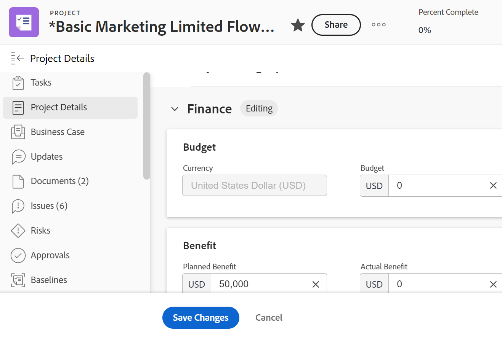

# Administrar información en el área Finanzas del proyecto

<!--

(NOTE: some information in here is duplicated in Edit projects. If you need to update one of the fields in this area, do it in both places.)

-->

Puede ver o editar la información financiera de un proyecto accediendo al área Finanzas de la sección Detalles del proyecto. Hay un número limitado de campos que puede ver o editar en esta área. Para obtener información sobre cómo editar toda la información de un proyecto, consulte [Editar proyectos](../../../manage-work/projects/manage-projects/edit-projects.md).

## Requisitos de acceso

+++ Expanda para ver los requisitos de acceso para la funcionalidad en este artículo.

Debe tener el siguiente acceso para realizar los pasos de este artículo:

<table style="table-layout:auto"> 
 <col> 
 <col> 
 <tbody> 
  <tr> 
   <td role="rowheader">Plan de Adobe Workfront</td> 
   <td>Cualquiera</td> 
  </tr> 
  <tr> 
   <td role="rowheader">Licencia de Adobe Workfront</td>
   <td>
   
Nuevo: Light o superior

   
o

   
Actual: revisión o superior
</td> 
  </tr> 
  <tr> 
   <td role="rowheader">Configuraciones de nivel de acceso</td> 
   <td> 
Acceso de visualización o superior a Proyectos y Datos financieros
 
Edite el acceso a Proyectos y Datos financieros para editar la información financiera del proyecto
</td> 
  </tr> 
  <tr> 
   <td role="rowheader">Permisos de objeto</td> 
   <td> 
Visualice permisos de un proyecto o superior que incluyen permisos de Ver finanzas
 
Administre permisos para el proyecto que incluyan Administrar finanzas para editar la información financiera del proyecto
 </td> 
  </tr> 
 </tbody> 
</table>

Para obtener más información sobre el contenido de esta tabla, consulte [Requisitos de acceso en la documentación de Workfront](/help/quicksilver/administration-and-setup/add-users/access-levels-and-object-permissions/access-level-requirements-in-documentation.md).

+++

## Información general del área de finanzas

Tenga en cuenta lo siguiente cuando visualice o edite información en el área Finanzas:

* La información financiera que se encuentra en el área Finanzas de Detalles del proyecto representa valores que pasan al nivel de proyecto a partir de las tareas, así como información introducida directamente en el proyecto. Parte de la información financiera se puede administrar tanto en el nivel de proyecto como en el de tarea.
* Debe tener permisos de visualización en el proyecto y acceso a datos financieros desde su nivel de acceso para poder ver el área de finanzas en un proyecto.
* Debe tener permisos de administración en el proyecto y acceso a datos financieros desde su nivel de acceso para poder editar la información en el área de finanzas. Sin embargo, recomendamos que solo el propietario del proyecto edite la información de esta área.

## Ver información financiera de un proyecto

1. Vaya a un proyecto. 
1. Haga clic en **Detalles del proyecto** en el panel izquierdo.
1. Haga clic en el icono **Editar**  en la esquina superior derecha de la sección Detalles y, a continuación, haga clic en **Finanzas**.

   

   >[!NOTE]
   >
   >Según la configuración utilizada por el administrador de Workfront en la plantilla de diseño, es posible que la sección Información general no aparezca primero en la lista, en cuyo caso se contraerá. Para obtener más información, consulte [Personalizar la vista de detalles con una plantilla de diseño](../../../administration-and-setup/customize-workfront/use-layout-templates/customize-details-view-layout-template.md).

1. Consulte los siguientes campos en el área Finanzas del proyecto:

   <table style="table-layout:auto"> 
    <col> 
    <col> 
    <tbody> 
     <tr> 
      <td role="rowheader">Método de índice de rendimiento</td> 
      <td> Controla el método que utiliza Workfront para calcular las métricas de valor acumulado. Puede basarse en el horario o en los costes.  Para obtener más información acerca del PIM, consulte el artículo <a href="../../../manage-work/projects/project-finances/set-pim.md" class="MCXref xref">Establecer el método de índice de rendimiento (PIM)</a></td> 
     </tr> 
     <tr> 
      <td role="rowheader">CPI/SPI/CSI</td> 
      <td> 
Son métricas de rendimiento del proyecto que muestran el rendimiento del proyecto en un momento determinado. Sus valores se calculan según el método de índice de rendimiento. Para obtener más información, consulte los artículos siguientes: 
 
       <ul> 
        <li> 
<a href="../../../manage-work/projects/project-finances/calculate-cpi.md" class="MCXref xref">Calcular el índice de rendimiento de costes (CPI)</a> 
 </li> 
        <li> 
<a href="../../../manage-work/projects/project-finances/calculate-spi.md" class="MCXref xref">Calcular índice de rendimiento de programación (SPI) </a> 
 </li> 
        <li> 
<a href="../../../manage-work/projects/project-finances/calculate-csi.md" class="MCXref xref">Calcular índice de rendimiento de programación de costes (CSI)</a> 
 </li> 
       </ul> </td> 
     </tr> 
     <tr> 
      <td role="rowheader">Estimar al finalizar</td> 
      <td> Coste total proyectado del proyecto, representado en horas si el método de índice de rendimiento (PIM) se basa en horas y se representa en un valor de moneda, si el método de índice de rendimiento (PIM) se basa en costes. Para obtener más información acerca del cálculo de la estimación al finalizar, consulte el artículo <a href="../../../manage-work/projects/project-finances/calculate-eac.md" class="MCXref xref">Calcular estimación al finalizar (EAC)</a></td> 
     </tr> 
     <tr> 
      <td role="rowheader">Presupuesto</td> 
      <td>Este es el presupuesto establecido para el proyecto. El propietario del proyecto lo especifica manualmente.</td> 
     </tr> 
     <tr> 
      <td role="rowheader">Coste fijo</td> 
      <td>Son los costes fijos del proyecto, independientemente del resto de actividades del mismo. El propietario del proyecto los introduce manualmente.</td> 
     </tr> 
     <tr> 
      <td role="rowheader">Costo planificado</td> 
      <td>Coste estimado del proyecto, basado en las horas planificadas y las tarifas asociadas a los usuarios asignados a la tarea (funciones o usuarios).</td> 
     </tr> 
     <tr> 
      <td role="rowheader">Costo real</td> 
      <td>Todos los costes acumulados del proyecto. El coste real es la suma de todos los costes reales: coste laboral (basado en horas reales y tarifas asociadas a las funciones o usuarios que las registran), gastos y costes fijos, que pueden asociarse con un proyecto o tarea.</td> 
     </tr> 
     <tr> 
      <td role="rowheader">Ingresos fijos</td> 
      <td>Establezca los ingresos esperados según la programación del proyecto. El propietario del proyecto especifica manualmente los ingresos fijos.</td> 
     </tr> 
     <tr> 
      <td role="rowheader">Ingresos planificados</td> 
      <td>Ingresos previstos basados en las horas planificadas y las tarifas asociadas con los usuarios asignados a la tarea (funciones o usuarios).</td> 
     </tr> 
     <tr> 
      <td role="rowheader">Ingresos reales</td> 
      <td>Ingresos reales del proyecto basados en las horas reales y las tarifas asociadas a los usuarios asignados a la tarea (funciones o usuarios).</td> 
     </tr> 
     <tr> 
      <td role="rowheader">Ingresos facturados</td> 
      <td> 
Ingresos facturados a clientes u otras partes recogidas en los registros de facturación. Para obtener más información acerca de los registros de facturación, consulte el artículo <a href="../../../manage-work/projects/project-finances/create-billing-records.md" class="MCXref xref">Creación de registros de facturación</a>. 
 </td> 
     </tr> 
     <tr> 
      <td role="rowheader"> </td> 
      <td> </td> 
     </tr> 
     <tr> 
      <td role="rowheader"> </td> 
      <td> </td> 
     </tr> 
    </tbody> 
   </table>

## Edición de la información financiera de un proyecto

Como propietario de un proyecto, edite la información en la subpestaña Finanzas de un proyecto.

Para editar la información de la subpestaña Finanzas del proyecto:

1. Vaya a un proyecto del que sea propietario.

   >[!NOTE]
   >
   >Necesita permisos de administración en el proyecto para realizar los siguientes pasos. También se recomienda que solo el propietario del proyecto realice cambios en la subpestaña Finanzas del proyecto.

1. Haga clic en **Detalles del proyecto**, en el panel izquierdo.
1. Haga clic en el icono **Editar**  en la esquina superior derecha de la sección Detalles y, a continuación, haga clic en **Finanzas** . Se abrirá el área Finanzas para editarla.
1. Edite cualquier campo que esté disponible para la edición haciendo clic en el mismo o en **+Añadir** para añadir información a un campo vacío.

   >[!TIP]
   >
   >Los campos no estarán disponibles para la edición si Workfront los calculase automáticamente o si no tuviera permisos de edición sobre ellos.

   

1. Actualice cualquiera de los campos siguientes.

   >[!NOTE]
   >
   >Según la forma en que el administrador de Workfront configure la plantilla de diseño, los campos de la sección Detalles del proyecto podrían ser diferentes en su entorno. Para obtener más información, consulte [Personalización de la vista de detalles con una plantilla de diseño](../../../administration-and-setup/customize-workfront/use-layout-templates/customize-details-view-layout-template.md).

   <table style="table-layout:auto"> 
    <col> 
    <col> 
    <tbody> 
     <tr> 
      <td role="rowheader">Método de índice de rendimiento</td> 
      <td> 
Controla el método que utiliza Workfront para calcular las métricas de rendimiento del proyecto. El administrador lo configura en el nivel de sistema, pero también se puede editar en el nivel de proyecto. Considere la posibilidad de seleccionar una de las siguientes opciones:
 
       <ul> 
        <li><strong>Basado en horas:</strong>Workfront usa las horas planificadas para calcular el IRC y el EAC del proyecto, donde el EAC del proyecto se mostrará como un número en horas. </li> 
        <li><strong>Basado en costes:</strong>Workfront usa el coste de mano de obra planificado para calcular el CPI y el EAC del proyecto. El EAC se muestra como un valor de moneda. Al seleccionar esta opción, asegúrese de que los destinatarios de la tarea (funciones o usuarios) estén asociados con las tasas de coste.</li> 
       </ul> </td> 
     </tr> 
     <tr> 
      <td role="rowheader">Estimar al finalizar</td> 
      <td> 
Representa el coste total proyectado de la tarea o proyecto cuando se completa. El administrador lo configura en el nivel de sistema, pero también se puede editar en el nivel de proyecto. Considere la posibilidad de seleccionar una de las siguientes opciones:
 
       <ul> 
        <li><strong>Calcular en el nivel de proyecto</strong>: el EAC para la tarea principal y el proyecto se determinan utilizando las horas/costes laborales reales en las fórmulas del EAC. El cálculo incluye las horas/costes reales y los gastos añadidos directamente a la tarea o proyecto principal.</li> 
        <li><strong>Resumen de tareas/subtareas</strong>: el EAC para la tarea principal y el proyecto se determinan añadiendo el EAC para cada tarea secundaria. El cálculo excluye las horas/costes reales y los gastos añadidos directamente a la tarea o proyecto principal.</li> 
       </ul> </td> 
     </tr> 
     <tr> 
      <td role="rowheader">Presupuesto</td> 
      <td>Especifique el presupuesto para este proyecto.</td> 
     </tr> 
     <tr> 
      <td role="rowheader">Coste fijo</td> 
      <td>Especifique el coste fijo de este proyecto. Esto no debe incluir costes laborales o de gastos.</td> 
     </tr> 
     <tr> 
      <td role="rowheader">Ingresos fijos</td> 
      <td> 
Especifique los ingresos fijos de este proyecto. Esto no debe incluir los ingresos procedentes de ningún registro de facturación facturado a socios o terceros.
 </td> 
     </tr> 
     <tr> 
      <td role="rowheader">Divisa del proyecto</td> 
      <td> 
Especifique una moneda para este proyecto, si esta es diferente de la moneda predeterminada en el sistema. El administrador de Workfront define la moneda predeterminada del sistema. Para obtener más información acerca de la configuración de tasas de cambio en Workfront, consulte el artículo <a href="../../../administration-and-setup/manage-workfront/exchange-rates/set-up-exchange-rates.md" class="MCXref xref">Configurar tasas de cambio</a>.
 </td> 
     </tr>
    </tbody> 
   </table>

1. Haga clic en **Guardar cambios**.
