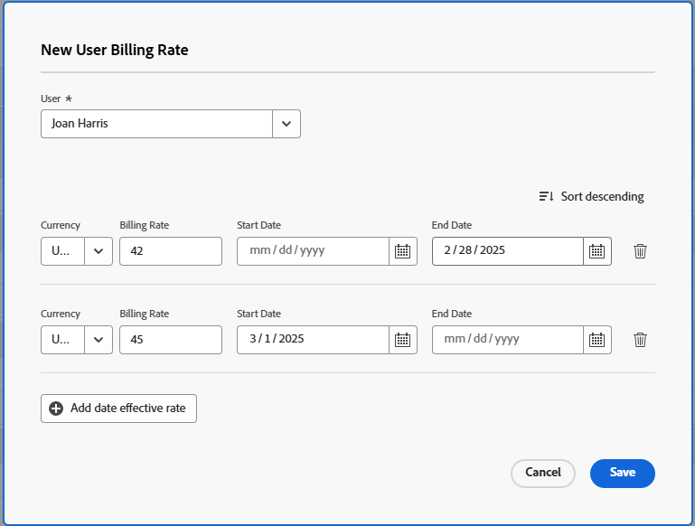

# Anular las tarifas de facturación del usuario en el nivel de proyecto

{{highlighted-preview-article-level}}

Como jefe de proyecto, puede especificar cuál es la tasa de facturación de un usuario en un proyecto específico. Esta tarifa de facturación a nivel de proyecto anula la tarifa de facturación a nivel de sistema para este usuario. Workfront utiliza la tasa de facturación en el nivel de proyecto del usuario para calcular los ingresos, en lugar de utilizar la tasa de facturación en el nivel de sistema.

Este artículo describe cómo puede anular las tarifas de facturación del usuario del sistema para un proyecto.

Para obtener información general sobre cómo anular las tarifas de facturación de los proyectos y calcular los ingresos del proyecto, vea [Información general sobre cómo anular las tarifas de facturación y calcular los ingresos de un proyecto](/help/quicksilver/manage-work/projects/project-finances/override-role-billing-rates-and-calculate-project-revenue.md).

Para obtener más información acerca del cálculo de ingresos en el proyecto, vea [Información general sobre la jerarquía de ingresos y costos](/help/quicksilver/manage-work/projects/project-finances/overview-revenue-cost-hierarchy.md) y la sección [Cálculos de ingresos para tareas basados en asignaciones de usuarios y roles](/help/quicksilver/manage-work/projects/project-finances/billing-and-revenue-overview.md#revenue-calculations-for-tasks-based-on-user-and-role-assignments) del artículo [Información general sobre facturación e ingresos](/help/quicksilver/manage-work/projects/project-finances/billing-and-revenue-overview.md).

>[!NOTE]
>
>En el caso de los ingresos reales, las tarifas de facturación aplicadas a las horas que se añaden a un Registro de facturación que está marcado como Facturado, no deben verse afectadas por las anulaciones de tarifas de facturación que ocurren después de que se haya facturado el Registro de facturación.

## Requisitos de acceso

+++ Expanda para ver los requisitos de acceso para la funcionalidad en este artículo.

<table style="table-layout:auto"> 
 <col> 
 <col> 
 <tbody> 
  <tr> 
   <td>Paquete de Adobe Workfront</td> 
   <td>Workflow Ultimate</td> 
  </tr> 
  <tr> 
   <td>Licencia de Adobe Workfront</td> 
   <td>Estándar</td> 
  </tr> 
  <tr> 
   <td>Configuraciones de nivel de acceso</td> 
   <td> 
Acceso de edición a proyectos y datos financieros

       

También debe tener uno de los siguientes:
 
        <ul> 
          <li> 
El nivel de acceso del administrador del sistema. </li> 
          <li> 
Configuración de <b>usuarios</b> en su nivel de acceso configurado para el acceso de <b>Edición</b>, con <b>Crear</b> y al menos una de las dos opciones de <b>Administrador de usuarios</b> habilitadas en <b>Ajustar la configuración</b> . 
 
De estas dos opciones, si <b>Administrador de usuarios (usuarios de grupo)</b> está habilitado, debe ser administrador de grupo de un grupo al que pertenezca el usuario.
 </li> 
    </ul></td> 
  </tr> 
  <tr> 
   <td>Permisos de objeto</td> 
   <td>Administrar permisos para el proyecto que incluye Editar datos financieros </td> 
  </tr> 
 </tbody> 
</table>

Para obtener más información, consulte [Requisitos de acceso en la documentación de Workfront](/help/quicksilver/administration-and-setup/add-users/access-levels-and-object-permissions/access-level-requirements-in-documentation.md).

+++

## Anular tarifas de facturación del usuario en el nivel de proyecto

Al anular la tasa de facturación de un usuario en un proyecto, puede asignar fechas en vigor y cada intervalo de fechas tiene una tasa diferente. Si no asigna fechas en vigor, la anulación de la tarifa de facturación que introduzca se utilizará durante toda la duración del proyecto para calcular los ingresos.

Para anular una tarifa de facturación de usuario para un proyecto:

1. Vaya al proyecto para el que desea anular las tarifas de facturación.
1. Haga clic en **Tasas** en el panel izquierdo. Es posible que primero tenga que hacer clic en **Mostrar más**.
1. Haga clic en la ficha **Facturación** si aún no está seleccionada.
1. Haga clic en **Agregar tarifa de facturación** > **Nueva tarifa de facturación de usuario**.

   Se abrirá el cuadro Nueva tarifa de facturación de usuario.

1. En el campo **Usuario**, seleccione el usuario para el que desea cambiar la tarifa de facturación.
1. Seleccione la **Moneda** para la anulación de tarifa de facturación.
1. En el campo **Tarifa de facturación**, ingrese la primera anulación de tarifa de facturación.
1. (Opcional) Haga clic en **Agregar tarifa vigente por fecha** para agregar más anulaciones de tarifas de facturación.
1. (Condicional) Si va a agregar varias anulaciones de tarifas de facturación, especifique la siguiente información para cada fila:

   * **Tarifa de facturación**: el valor de la tarifa de facturación durante el período de tiempo especificado.
   * **Fecha de inicio**: la fecha en la que comienza la anulación de la tarifa de facturación.
   * **Fecha de finalización**: la fecha en la que finaliza la anulación de la tarifa de facturación.

   

   Workfront aplica la tasa de usuario de anulación a las horas que se producen durante estos lapsos de tiempo al calcular los ingresos del proyecto.

   Workfront le permite dejar espacios entre marcos de tiempo de anulación, pero recibirá una advertencia para confirmar que esto es intencional.

   No es necesario especificar una fecha de inicio para la primera tasa de sustitución, ni una fecha de finalización para la última tasa de sustitución.

   Si introduce solo una anulación de tarifa de facturación, esa tarifa se aplica a toda la duración del proyecto. Si agrega varias anulaciones con fecha en vigor, Workfront supone que la primera anulación se aplica a todas las horas antes de su fecha de finalización y la última anulación se aplica a todas las horas después de su fecha de inicio.

   Workfront supone que la primera tasa de anulación se aplica a todas las horas con una fecha anterior a la fecha de finalización de la primera anulación y que la última tasa de anulación se aplica a todas las horas con una fecha posterior a la fecha de inicio de la última anulación.

   Si se registra una hora antes de la fecha planificada de inicio del proyecto, se usa la primera tarifa de facturación.

   Si se registra una hora después de la fecha planificada de finalización del proyecto, se utiliza la última tarifa de facturación.

1. Haga clic en **Guardar**.
