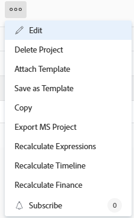
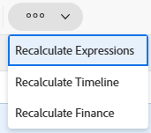

# Recalcular las finanzas de un proyecto

Las finanzas se calculan en un proyecto a medida que se producen cambios en las horas registradas para el proyecto o en las tarias usadas para calcular costes e ingresos.

## Requisitos de acceso

+++ Expanda para ver los requisitos de acceso para la funcionalidad en este artículo.

<table style="table-layout:auto"> 
 <col> 
 <col> 
 <tbody> 
  <tr> 
   <td>Paquete de Adobe Workfront</td> 
   <td>Cualquiera </td> 
  </tr> 
  <tr> 
   <td>Licencia de Adobe Workfront</td> 
   <td>
   
Estándar

   
Plan
</td> 
  </tr> 
  <tr> 
   <td>Configuraciones de nivel de acceso</td> 
   <td>Acceso de edición a proyectos y datos financieros</td> 
  </tr> 
  <tr> 
   <td>Permisos de objeto</td> 
   <td>Administre permisos para el proyecto con permisos para Editar tarifas de costo, Editar tarifas de facturación y Editar finanzas generales</td> 
  </tr> 
 </tbody> 
</table>

Para obtener más información, consulte [Requisitos de acceso en la documentación de Workfront](/help/quicksilver/administration-and-setup/add-users/access-levels-and-object-permissions/access-level-requirements-in-documentation.md).

+++

## Consideraciones sobre el cálculo de finanzas en Adobe Workfront

Las finanzas se calculan para los proyectos de las siguientes maneras:

* Puede recalcular manualmente los costes e ingresos de un proyecto mediante la opción Recalcular finanzas en un proyecto.
* Además, algunas acciones activan un nuevo cálculo automático.

Cuando la tarifa de un usuario o un rol cambia mientras dura un proyecto, puede ocurrir lo siguiente:

* Cuando se realiza el cambio, la tarifa actualizada se utiliza a partir de ese momento, a medida que se registran las horas y se calcula la información financiera. Cambiar la tarifa no afecta a cómo se calcularon las cosas antes de realizar el cambio. Para todas las horas existentes registradas, se utiliza la tarifa antigua para calcular la información financiera.
* Puede obligar a Adobe Workfront a utilizar la nueva tarifa de forma retroactiva para todas las horas registradas hasta el momento, utilizando la opción Recalcular finanzas. Esto obliga a Workfront a volver a calcular de forma retroactiva todas las horas introducidas anteriormente, los costes planificados y los ingresos de acuerdo con la información de la nueva tarifa.

El tipo de informe Proyecto (datos financieros) no vuelve a calcular automáticamente los datos financieros. Para actualizar los datos de este tipo de informe, debe volver a calcular manualmente las finanzas en proyectos individuales.

>[!CAUTION]
>
>Antes de recalcular manualmente las finanzas de un proyecto determinado, es posible que desee conservar los datos financieros que ya se hayan calculado con una tarifa anterior. Se recomienda utilizar la opción Recalcular finanzas solo cuando tenga la seguridad de que no está realizando cambios en la información existente o solo cuando dichos cambios sean deseados.

## Conservar datos financieros de tareas con horas existentes {#preserve-financial-data-for-tasks-with-existing-hours}

Cuando se vuelven a calcular los datos financieros de un proyecto, Workfront vuelve a calcular de forma retroactiva todas las horas registradas anteriormente, los costes planificados, los costes reales y los ingresos planificados y reales, de acuerdo con cualquier información financiera nueva o actualizada.

* [Conservar ingresos del proyecto](#preserve-project-revenue)
* [Conservar coste del proyecto](#preserve-project-cost)

### Conservar ingresos del proyecto  {#preserve-project-revenue}

Las tarifas de ingresos pueden cambiar durante el transcurso de un proyecto.

Para obtener más información sobre las tarifas de facturación y los ingresos, consulte [Información general sobre facturación e ingresos](../../../manage-work/projects/project-finances/billing-and-revenue-overview.md).

Las tarifas de ingresos pueden cambiar en los siguientes niveles:

* El nivel del sistema (para funciones)\
  Para obtener más información sobre cómo crear roles con tarifas de facturación en el nivel de sistema, consulte [Crear y administrar roles](../../../administration-and-setup/set-up-workfront/organizational-setup/create-manage-job-roles.md).

* El nivel del usuario\
  Para obtener más información acerca de cómo cambiar la información sobre la tarifa de facturación de los usuarios, consulte [Editar el perfil de un usuario](../../../administration-and-setup/add-users/create-and-manage-users/edit-a-users-profile.md).

* El nivel de compañía (para roles)\
  Para obtener más información, consulte [Anular tarifas de facturación de función laboral a nivel de compañía](../../../administration-and-setup/set-up-workfront/organizational-setup/override-job-role-billing-rates-company-level.md).

* El nivel de tarjeta de tarifa
Para obtener más información sobre las tarjetas de tarifas, consulte [Administrar tarjetas de tarifas](/help/quicksilver/administration-and-setup/manage-enterprise-operations/manage-rate-cards.md).

* El nivel de proyecto (para roles de trabajo, usuarios y tarjetas de tarifas)\
  Para obtener más información sobre cómo anular las tarifas en el nivel de proyecto, consulte [Información general sobre cómo anular las tarifas de facturación y calcular los ingresos en un proyecto](/help/quicksilver/manage-work/projects/project-finances/override-role-billing-rates-and-calculate-project-revenue.md).

Por ejemplo, la tarifa de facturación de un usuario cambia durante el transcurso de un proyecto de 50 a 75 dólares la hora y desea que todos los datos existentes permanezcan calculados con la tarifa antigua (50 dólares la hora). Sin embargo, cuando se recalculen las finanzas del proyecto, los ingresos de las tareas que ya tengan datos financieros se actualizarán para reflejar la nueva tarifa de facturación (de 75 dólares la hora).

* [Conservar ingresos del proyecto creando un registro de facturación](#preserve-project-revenue-by-creating-a-billing-record)
* [Conservar ingresos del proyecto mediante el uso de varias anulaciones de la tarifa de facturación](#preserve-project-revenue-by-using-multiple-billing-rate-overrides)

#### Conservar ingresos del proyecto creando un registro de facturación {#preserve-project-revenue-by-creating-a-billing-record}

Cuando las tarifas de facturación cambian en cualquier nivel mencionado anteriormente, puede conservar los ingresos existentes que ya se han calculado en el proyecto evitando usar la opción Recalcular finanzas manualmente o bloqueando el tiempo registrado en el proyecto y calculado usando la tarifa antigua en un registro de facturación con un estado de Facturado.

Cuando no recalcule las finanzas del proyecto o cuando bloquea las horas registradas en un registro de facturación facturada, las horas registradas después de los cambios de tarifa se calcularán con la nueva tarifa y las horas registradas antes de que cambie la tarifa de coste permanecerán calculadas con la tarifa antigua.

Para obtener más información sobre cómo crear registros de facturación, consulte [Crear registros de facturación](../../../manage-work/projects/project-finances/create-billing-records.md).

#### Conservar ingresos del proyecto mediante el uso de varias anulaciones de la tarifa de facturación {#preserve-project-revenue-by-using-multiple-billing-rate-overrides}

Cuando cambian las tarifas de facturación de funciones en el nivel de proyecto, puede conservar los ingresos existentes que ya se han calculado en el proyecto mediante el uso de varias anulaciones de tarifas de facturación que están bloqueadas dentro de un lapso de tiempo especificado.

Para obtener más información sobre cómo usar varias anulaciones de tarifas de facturación, consulte [Información general sobre cómo anular tarifas de facturación y calcular ingresos en un proyecto](/help/quicksilver/manage-work/projects/project-finances/override-role-billing-rates-and-calculate-project-revenue.md).

>[!NOTE]
>
>Esto solo se aplica a las tarifas de facturación de funciones que se cambian en el nivel de proyecto.

### Conservar coste del proyecto {#preserve-project-cost}

Las tarifas de coste pueden cambiar en los siguientes niveles:

* Nivel del sistema (para funciones)\
  Para obtener más información acerca de cómo crear roles con tasas de costo en el nivel de sistema, vea [Crear y administrar roles](../../../administration-and-setup/set-up-workfront/organizational-setup/create-manage-job-roles.md).

* Nivel de usuario\
  Para obtener más información acerca de cómo cambiar la información sobre la tasa de costo de los usuarios, vea [Editar el perfil de un usuario](../../../administration-and-setup/add-users/create-and-manage-users/edit-a-users-profile.md).

* Nivel de proyecto (para usuarios)
Para obtener más información sobre cómo anular las tasas de costo de usuario, vea [Anular las tasas de costo de usuario en el nivel de proyecto](/help/quicksilver/manage-work/projects/project-finances/override-user-cost-rates.md).

Cuando las tarifas de facturación cambian en cualquier nivel mencionado anteriormente, puede conservar los costes existentes que ya se han calculado en el proyecto bloqueando el tiempo registrado en el proyecto y calculado usando la tarifa antigua en un registro de facturación con un estado de Facturado. Para obtener más información sobre cómo crear registros de facturación, consulte [Crear registros de facturación](../../../manage-work/projects/project-finances/create-billing-records.md).

También puede evitar utilizar la opción Recalcular finanzas manualmente si no desea crear un registro de facturación, tal como se describe en la sección [Recalcular manualmente las finanzas de un proyecto](#manually-recalculate-finances-for-a-project) en este artículo.

Cuando no recalcule las finanzas del proyecto o cuando bloquea las horas registradas en un registro de facturación facturada, las horas registradas después de los cambios de tarifa se calcularán con la nueva tarifa y las horas registradas antes de que cambie la tarifa de coste permanecerán calculadas con la tarifa antigua.

## Recalcular manualmente las finanzas de un proyecto {#manually-recalculate-finances-for-a-project}

Si las tarifas cambian durante la duración de un proyecto y desea que los cálculos de costes e ingresos reflejen las nuevas tarifas, debe recalcular manualmente las finanzas del proyecto.

>[!NOTE]
>
>Puede evitar que los valores de ingresos se actualicen para reflejar las nuevas tarifas cuando recalcule manualmente las finanzas siguiendo los pasos de la sección [Conservar datos financieros de tareas con horas existentes](#preserve-financial-data-for-tasks-with-existing-hours) de este artículo. Los valores de coste siempre se actualizan para reflejar las nuevas tarifas cuando se recalculan manualmente las finanzas de un proyecto.

Puede recalcular las finanzas de proyectos en Workfront desde la página del proyecto o desde una lista de proyectos o un informe.

Puede recalcular las finanzas al mismo tiempo que las edita de forma masiva. Para obtener más información, consulte la sección [Recalcular manualmente las finanzas de forma masiva](#manually-recalculate-finances-in-bulk) en este artículo.

1. Vaya al proyecto donde desee recalcular las finanzas y haga clic en el icono **Más**  a la derecha del nombre del proyecto.

   

   O

   Vaya a una lista de proyectos o a un informe, seleccione uno o varios proyectos y, a continuación, haga clic en el icono **Más**  que se encuentra en la parte superior de la lista.

   

   >[!TIP]
   >
   >Según la complejidad de sus proyectos, recomendamos no seleccionar un gran número de proyectos al recalcular sus finanzas de forma masiva para garantizar un rendimiento óptimo. Algunas cosas que podrían hacer que un proyecto sea demasiado complejo podrían ser varias dependencias o asignaciones o un gran número de campos personalizados.

1. Haga clic en **Recalcular finanzas**.

   Todos los costes e ingresos planificados del proyecto se recalculan con la información nueva.

   Debería recibir una confirmación en la parte superior del explorador de que las finanzas del proyecto se han recalculado correctamente.
Los valores de coste existentes y algunos valores de ingresos que no se han bloqueado se actualizan para reflejar las nuevas tasas.

## Recalcular finanzas manualmente de forma masiva{#manually-recalculate-finances-in-bulk}

Puede recalcular manualmente las finanzas de varios proyectos editándolos de forma masiva. Esto hace que los ingresos de los proyectos se recalculen de forma retroactiva.

>[!IMPORTANT]
>
>Puede evitar que los valores de ingresos se actualicen para reflejar las nuevas tarifas cuando recalcule manualmente las finanzas siguiendo los pasos de la sección [Conservar datos financieros de tareas con horas existentes](#preserve-financial-data-for-tasks-with-existing-hours) de este artículo. Los valores de coste siempre se actualizan para reflejar las nuevas tarifas cuando se recalculan manualmente las finanzas en los proyectos.

Para volver a calcular manualmente las finanzas de varios proyectos:

1. Ir a una lista de proyectos.
1. Seleccione varios proyectos en la lista y, a continuación, haga clic en el icono **Más**  en la parte superior de la lista.

   

   >[!TIP]
   >
   >Según la complejidad de sus proyectos, recomendamos no seleccionar un gran número de proyectos al editarlos de forma masiva para garantizar un rendimiento óptimo. Algunas cosas que podrían hacer que un proyecto sea demasiado complejo podrían ser varias dependencias o asignaciones o un gran número de campos personalizados.

1. Haga clic en **Recalcular finanzas**.

   Todos los costes e ingresos planificados de los proyectos seleccionados se recalculan con la información nueva.

   Debería recibir una confirmación en la parte superior del navegador de que las finanzas de los proyectos se han recalculado correctamente.

## Acciones que activan un nuevo cálculo automático de las finanzas

Las siguientes acciones activan el recálculo financiero de los proyectos en Workfront:

* Cambiar el estado de tarea
* Mover una tarea con horas a otro proyecto
* Cambio del estado del proyecto de Completo a Activo

>[!NOTE]
>
>Al cambiar el estado del proyecto, solo se vuelven a calcular los valores planificados.

También puede recalcular las finanzas manualmente en el menú **Más**  en el nivel de proyecto, haciendo clic en **Recalcular finanzas**.
