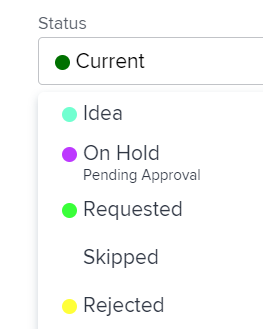

# Aplicar estados al trabajo asociado a un grupo

<!--
Alina, I moved this out of an admin article about statuses (Create and customize statuses)
-->

Si un proyecto está asociado a un grupo, puede aplicar tanto los estados de nivel de sistema como un estado personalizado asociado a ese grupo al proyecto o a las tareas y problemas de ese proyecto. Para obtener información acerca de los estados de grupo en Adobe Workfront, consulte [Crear o editar un estado](../../../administration-and-setup/customize-workfront/creating-custom-status-and-priority-labels/create-or-edit-a-status.md).

>[!TIP]
>
>Solo puede asociar proyectos con grupos. Los problemas y las tareas heredan el grupo del proyecto al que pertenecen.

## Requisitos de acceso

+++ Expanda para ver los requisitos de acceso para la funcionalidad en este artículo. 

<table style="table-layout:auto"> 
 <col> 
 <col> 
 <tbody> 
  <tr> 
   <td role="rowheader">Paquete de Adobe Workfront</td> 
   <td> 
Cualquiera
 </td> 
  </tr> 
  <tr> 
   <td role="rowheader">Licencia de Adobe Workfront</td> 
   <td> 
Estándar

   
Plan
 </td> 
  </tr> 
  <tr> 
   <td role="rowheader">Configuraciones de nivel de acceso</td> 
   <td> 
Acceso de edición a proyectos
 </td> 
  </tr> 
  <tr> 
   <td role="rowheader">Permisos de objeto</td> 
   <td> 
Administrar permisos del proyecto
 </td> 
  </tr> 
 </tbody> 
</table>

Para obtener más información, consulte [Requisitos de acceso en la documentación de Workfront](/help/quicksilver/administration-and-setup/add-users/access-levels-and-object-permissions/access-level-requirements-in-documentation.md).

+++

<!--
Old:
<table style="table-layout:auto"> 
 <col> 
 <col> 
 <tbody> 
  <tr> 
   <td role="rowheader">Adobe Workfront plan*</td> 
   <td> 
Any
 </td> 
  </tr> 
  <tr> 
   <td role="rowheader">Adobe Workfront license*</td> 
   <td> 
Plan 
 </td> 
  </tr> 
  <tr> 
   <td role="rowheader">Access level configurations*</td> 
   <td> 
Edit access to Projects
 
<b>NOTE</b>
   
   If you still don't have access, ask your Workfront administrator if they set additional restrictions in your access level. For information on how a Workfront administrator can modify your access level, see <a href="../../../administration-and-setup/add-users/configure-and-grant-access/create-modify-access-levels.md" class="MCXref xref">Create or modify custom access levels</a>.
 </td> 
  </tr> 
  <tr> 
   <td role="rowheader">Object permissions</td> 
   <td> 
Manage permissions to the project
 
For information on requesting additional access, see <a href="../../../workfront-basics/grant-and-request-access-to-objects/request-access.md" class="MCXref xref">Request access to objects </a>.
 </td> 
  </tr> 
 </tbody> 
</table>
-->

## Actualizar grupo y estado del proyecto

Al actualizar el grupo de un proyecto, las opciones disponibles para el estado de las tareas, problemas o el proyecto cambian para coincidir con el grupo.

1. Vaya a un proyecto o cree uno nuevo, tal como se describe en [Crear un proyecto](../../../manage-work/projects/create-projects/create-project.md).
1. Haga clic en el icono **Más**  y, a continuación, haga clic en **Editar**.

1. En el cuadro **Editar proyecto** que aparece, cerca de la parte inferior de la sección **Información general**, seleccione el grupo en el menú desplegable **Grupo**.

1. En el menú desplegable **Estado**, seleccione el estado personalizado.

   >[!NOTE]
   >
   >Si selecciona un grupo diferente en el menú desplegable **Grupo**, los estados personalizados en el menú **Estado** cambian automáticamente para correlacionarse con el nuevo grupo.
   >
   >
   >
   >

1. Seleccione el estado del proyecto. Los estados personalizados que ha creado y aplicado a ese grupo se muestran en la lista.
