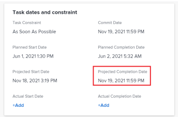

# Actualizar fechas de confirmación en tareas y problemas

Puede actualizar manualmente la fecha de confirmación de una tarea o un problema al que esté asignado. Para obtener más información sobre las fechas de compromiso en Adobe Workfront, consulte [Resumen de fecha de confirmación](../../../manage-work/projects/updating-work-in-a-project/overview-of-commit-dates.md).

## Requisitos de acceso

<!--Audited: 01/2024-->

Debe tener el siguiente acceso para realizar los pasos de este artículo:

<table style="table-layout:auto"> 
 <col> 
 <col> 
 <tbody> 
  <tr> 
   <td role="rowheader">plan Adobe Workfront*</td> 
   <td> 
Cualquiera
 </td> 
  </tr> 
  <tr> 
   <td role="rowheader">Licencia de Adobe Workfront*</td> 
   <td> 
   Para las nuevas licencias:
   <ul>
   <li>
Estándar para tareas
 </li>
   <li>
Colaborador o superior para problemas
</li>
   </ul>
   Para licencias actuales:
<ul>
   <li>
Trabajo o superior para tareas
</li> 
   <li>
Solicitud de problemas o superior
</li>
</ul>

</td> 
  </tr> 
  <tr> 
   <td role="rowheader">Configuraciones de nivel de acceso</td> 
   <td> 
Editar acceso a Tareas y Problemas
 </td> 
  </tr> 
  <tr> 
   <td role="rowheader">Permisos de objeto</td> 
   <td> 
Administrar permisos sobre la tarea o el problema
 </td> 
  </tr> 
 </tbody> 
</table>

*Para saber qué plan, tipo de licencia o acceso tiene, póngase en contacto con su administrador de Workfront. Para obtener más información, consulte [Requisitos de acceso en la documentación de Workfront](/help/quicksilver/administration-and-setup/add-users/access-levels-and-object-permissions/access-level-requirements-in-documentation.md).

## Requisitos previos

Antes de comenzar, se le debe asignar la tarea o el problema para el que necesita actualizar la fecha de confirmación.

## Actualizar fechas de confirmación en tareas y problemas

La actualización de la fecha de confirmación es idéntica para las tareas y los problemas.

1. Vaya a una tarea o un problema que esté asignado como **Propietario**.

   Para obtener más información sobre cómo averiguar quién es el propietario de la tarea de un problema o tarea, consulte la sección [Editar tareas](../../../manage-work/tasks/manage-tasks/edit-tasks.md#assignments) en el artículo [Editar tareas](../../../manage-work/tasks/manage-tasks/edit-tasks.md).

1. Clic **Detalles de tarea** o **Detalles del problema** en el panel izquierdo.
1. Clic **Información general** para expandirlo.
1. Actualice el **Fecha de confirmación** field.

   

1. Haga clic en **Guardar cambios**.

   Lo siguiente ocurre después de realizar este cambio: 

   * La fecha de compromiso y la fecha planificada de finalización de la tarea o problema ya no son la misma.

     En su lugar, la fecha de compromiso y la fecha de finalización prevista de la tarea o problema serán las mismas.

     

   * Si está utilizando el área de Actualizaciones heredadas, se notifica al Propietario del proyecto que ha sugerido una nueva fecha de compromiso para la tarea o el problema y que, en este momento, puede actualizar la fecha planificada de finalización de la tarea o el problema para que coincida con la fecha de compromiso sugerida. Esta funcionalidad no se admite en la nueva experiencia de comentarios. Para obtener más información, consulte [La nueva experiencia de comentar](/help/quicksilver/product-announcements/betas/new-commenting-experience-beta/unified-commenting-experience.md).

     

     Para obtener información sobre las notificaciones y actualizaciones activadas por este cambio, consulte la sección [Notificaciones y actualizaciones activadas al cambiar la fecha de confirmación](../../../manage-work/projects/updating-work-in-a-project/overview-of-commit-dates.md#notifica) en el artículo [Resumen de fecha de confirmación](../../../manage-work/projects/updating-work-in-a-project/overview-of-commit-dates.md).
