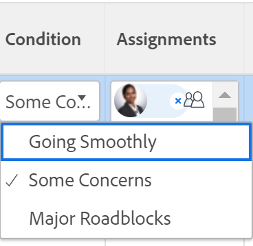

# Actualizar condición para tareas y problemas

<!--{{highlighted-preview}}-->

La condición de una tarea o problema es un indicador colocado en él para indicar cómo va. Esto es diferente al Estado del elemento de trabajo, que indica la fase actual de desarrollo del elemento.

Puede establecer la condición de una tarea o un problema de forma automática o manual.

Los valores de Condición a los que nos referimos en este artículo están disponibles en Workfront de forma predeterminada. El administrador de Adobe Workfront puede crear condiciones personalizadas para su entorno, tal como se describe en [Crear o editar una condición personalizada](../../../administration-and-setup/customize-workfront/create-manage-custom-conditions/create-edit-custom-conditions.md).

<!--You can manually update the Condition of a task or issue if you are assigned to it or if you have permissions to it, as described in the [Access requirements](#access-requirements) section of this article.-->

## Requisitos de acceso {#access-requirements}

Debe tener el siguiente acceso para realizar los pasos de este artículo:

<table style="table-layout:auto"> 
 <col> 
 <col> 
 <tbody> 
  <tr> 
   <td role="rowheader">plan de Adobe Workfront</td> 
   <td> 
Cualquiera
 </td> 
  </tr> 
  <tr> 
   <td role="rowheader">Licencia de Adobe Workfront*</td> 
   <td>

Para las nuevas licencias:
<ul><li>
Estándar para tareas
</li>
   <li>
Colaborador o superior para problemas
</li></ul>

Para licencias actuales:
<ul><li>
Trabajo o superior para tareas
</li>
   <li>
Solicitud de problemas o superior
</li></ul>
    </td> 
  </tr> 
  <tr> 
   <td role="rowheader">Configuraciones de nivel de acceso</td> 
   <td> 
Acceso de visualización o superior a los proyectos
 
Editar acceso a tareas y problemas 
</td> 
  </tr> 
  <tr> 
   <td role="rowheader">Permisos de objeto</td> 
   <td> 
Ver permisos superiores en tareas y problemas para ver su condición

   
Administrar permisos en tareas y problemas para actualizar la condición

  </td> 
  </tr> 
 </tbody> 
</table>

*Para saber qué plan, tipo de licencia o acceso tiene, póngase en contacto con su administrador de Workfront. Para obtener más información, consulte [Requisitos de acceso en la documentación de Workfront](/help/quicksilver/administration-and-setup/add-users/access-levels-and-object-permissions/access-level-requirements-in-documentation.md).

## Requisitos previos

Se le debe asignar una tarea o un problema para poder actualizar manualmente su condición.

## Busque la Condición de tareas y problemas

Las condiciones se muestran como un indicador asociado a tareas o problemas. También pueden asociarse con un número que se puede mostrar en los informes en lugar de en la etiqueta. Para obtener más información sobre cómo asociar condiciones con números, consulte [Crear o editar una condición personalizada](../../../administration-and-setup/customize-workfront/create-manage-custom-conditions/create-edit-custom-conditions.md).

Puede localizar la Condición de las tareas y los problemas en las siguientes áreas de Workfront:

<!--* The Details page, after a Workfront or group administrator adds it to your layout template. For information, see [Customize the Details view using a layout template](/help/quicksilver/administration-and-setup/customize-workfront/use-layout-templates/customize-details-view-layout-template.md). -->

<!--
* The header of a task or issue, after a Workfront or group administrator adds it to your layout template. For information, see [Customize object headers using a layout template](/help/quicksilver/administration-and-setup/customize-workfront/use-layout-templates/customize-object-headers.md).  -->

* El panel Resumen, después de que un administrador de Workfront o de grupo lo añada a la plantilla de diseño. Para obtener más información, consulte [Personalizar Inicio y resumen mediante una plantilla de diseño](/help/quicksilver/administration-and-setup/customize-workfront/use-layout-templates/customize-home-summary-layout-template.md).

* Informes y listas cuando se muestra el campo Condición en una vista o agrupación.

  >[!NOTE]
  >
  >Cuando la palabra &quot;condición&quot; aparece en el campo Nombre de campo de un informe de Entrada de cuaderno, esto indica que se ha actualizado la condición de un artículo. Cuando se realiza el seguimiento del campo Condición en los informes de entradas de diario, los valores de número nuevo y antiguo muestran el número asociado a la condición en lugar de su nombre. Si originalmente una condición no está definida para una tarea o un problema y posteriormente la actualiza, la entrada de diario que captura la actualización mostrará el valor del número anterior del campo Condición como -2.147.483.648.

## Actualizar automáticamente la condición al actualizar el estado

Cuando se le asigne una tarea o un problema y haga clic en **Trabajar en ello** , Iniciar tarea o Iniciar problema, o actualizar su estado, la Condición de la tarea o el problema cambia automáticamente a la Condición predeterminada asociada con **Sin problemas**.

Para obtener información sobre el uso de una condición personalizada como condición predeterminada, consulte los artículos  [Establecer una condición personalizada como predeterminada para tareas y problemas](../../../administration-and-setup/customize-workfront/create-manage-custom-conditions/set-custom-condition-default-tasks-issues.md) y [Establecer una condición personalizada como predeterminada para los proyectos](../../../administration-and-setup/customize-workfront/create-manage-custom-conditions/set-custom-condition-default-projects.md).

Para obtener información sobre cómo cambiar el estado de la tarea, consulte [Actualizar estado de la tarea](../../../manage-work/projects/updating-work-in-a-project/update-task-status.md).

Para obtener información sobre cómo cambiar el estado del problema, consulte [Actualizar estado del problema](../../../manage-work/projects/updating-work-in-a-project/update-issue-status.md).

Para obtener información sobre cómo establecer el botón Trabajar en ello en un botón Iniciar tarea o Iniciar problema, consulte [Reemplazar el botón Trabajar en ello por un botón Iniciar](../../../people-teams-and-groups/create-and-manage-teams/work-on-it-button-to-start-button.md).

## Actualizar manualmente la condición

Debe tener asignada una tarea o el problema o tener permisos de administración para poder establecer la condición en él.

Puede actualizar manualmente la condición de una tarea o problema en un informe o lista de tareas o problemas al mostrar el campo Condición en la vista.

>[!NOTE]
>
>Puede pedir al administrador del sistema o del grupo que añada el campo Condición al Panel de resumen para que sea más fácil actualizarlo en varias áreas de Workfront.
>
>Para obtener más información, consulte los siguientes artículos:
>
>* [Resumen, descripción general](/help/quicksilver/workfront-basics/the-new-workfront-experience/summary-overview.md)
>* [Personalizar Inicio y resumen mediante una plantilla de diseño](/help/quicksilver/administration-and-setup/customize-workfront/use-layout-templates/customize-home-summary-layout-template.md).

<!--old Condition update - in the commenting stream: 
Updating the Condition of a task or issue differs depending on whether you are assigned to it or not:

* If you are using the legacy commenting experience, you can update the Condition in the Updates tab or in a list of tasks or issues if you are assigned to them. This is not supported in the new commenting experience. For information, see [New commenting experience](/help/quicksilver/product-announcements/betas/new-commenting-experience-beta/unified-commenting-experience.md). 
* You can update the Condition in a list of tasks or issues if you are not assigned to them, only if you have Manage permissions to them. In this case, you cannot update the Condition in the Update tab of the task or issue. -->

Para actualizar de forma manual la condición de una tarea o un problema:

1. Vaya a una lista de tareas o problemas para los que tenga permisos de administración. Asegúrese de que **Condición** Este campo es visible en la vista de la lista.

1. Actualice el **Condición** del problema o la tarea en línea, haciendo doble clic en la condición existente y seleccionando un nuevo valor del menú desplegable.

   

   >[!NOTE]
   >
   >Las condiciones se pueden personalizar para su entorno, por lo que puede encontrar más de tres opciones para Condición en su entorno. Los nombres de las condiciones pueden ser diferentes a los enumerados anteriormente. Para obtener información sobre la personalización de condiciones en Workfront, consulte [Crear o editar una condición personalizada](../../../administration-and-setup/customize-workfront/create-manage-custom-conditions/create-edit-custom-conditions.md).

1. Prensa **Entrar** en el teclado o haga clic fuera del campo Condición para guardar la nueva condición de tarea o problema.

<!--
Replace the above with the following when we release Condition to headers and Details page:

To manually update the Condition of a task or an issue do one of the following:

1. To update the Condition of a task or issue in the task or issue header:

     1. (Conditional) If your Workfront or group administrator added the Condition field to the task or issue header of your layout template, click the **Condition** field in the header and select from the following options: 
          * Going Smoothly
          * Some Concerns
          * Major Roadblocks

          
     1. Click Enter to save the Condition. 

1. To update the Condition of a task or issue in the task or issue Details section:

     1. (Conditional) If your Workfront or group administrator added the Condition field to the Details section of a task or issue in your layout template, click **Details** in the left panel, then click the **Condition** field and select from the following options: 
          * Going Smoothly
          * Some Concerns
          * Major Roadblocks
1. Click **Save Changes**. The Condition of the task or issue is updated. 

To update the Condition of a task or issue in a report or list: 

1. Go to a list of tasks or issues that you have Manage permissions to. Ensure the **Condition** field is visible in the list's view. 

1. Update the **Condition** of the issue or task inline, by double-clicking the existing condition and selecting a new value from the drop-down menu. 

    

     >[!NOTE]
     >
     >Conditions can be customized for your environment, so you may find more than three options for Condition in your environment. The names of the Conditions might be different than the ones listed above. For information about customizing Conditions in Workfront, see [Create or edit a custom condition](../../../administration-and-setup/customize-workfront/create-manage-custom-conditions/create-edit-custom-conditions.md).

1. Press **Enter** on your keyboard, or click outside the Condition field to save the new task or issue Condition. 

-->
<!--   
<li data-mc-conditions="QuicksilverOrClassic.Draft mode">
(NOTE: drafted because I can't do this anymore)

If you have Manage permissions to the task or issue but are not assigned to it, perhaps as a project manager, add the <strong>Condition</strong> column to any view you use in a task or issue list, then set the <strong>Condition</strong> in inline edit and press Enter.

For information about adding a column to a view, see <a href="../../../reports-and-dashboards/reports/reporting-elements/views-overview.md" class="MCXref xref">Views overview in Adobe Workfront</a>.
</li>   
     -->
