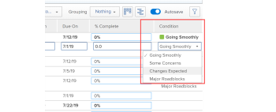

# Actualizar una condición para tareas y problemas

<!--Audited: 07/2024-->

<!--The highlighted information on this page refers to functionality not yet generally available. It is available only in the Preview environment for all customers, or in the Production environment for customers who enabled fast releases.

For information about fast releases, see [Enable or disable fast releases for your organization](/help/quicksilver/administration-and-setup/set-up-workfront/configure-system-defaults/enable-fast-release-process.md).

For information about the current release, see [Third Quarter 2024 release overview](/help/quicksilver/product-announcements/product-releases/24-q3-release-activity/24-q3-release-overview.md).-->

La condición de una tarea o problema es un indicador colocado en estos para indicar su evolución. Es diferente al Estado del elemento de trabajo, que indica la fase actual de desarrollo del elemento.

Puede establecer la condición de una tarea o un problema de forma automática o manual.

Los valores de Condición a los que nos referimos en este artículo están disponibles en Workfront de forma predeterminada. El administrador de Adobe Workfront puede crear condiciones personalizadas para su entorno, tal como se describe en [Crear o editar una condición personalizada](../../../administration-and-setup/customize-workfront/create-manage-custom-conditions/create-edit-custom-conditions.md).

## Requisitos de acceso {#access-requirements}

+++ Expanda para ver los requisitos de acceso para la funcionalidad en este artículo. 

<table style="table-layout:auto"> 
 <col> 
 <col> 
 <tbody> 
  <tr> 
   <td role="rowheader">paquete de Adobe Workfront</td> 
   <td> 
Cualquiera
 </td> 
  </tr> 
  <tr> 
   <td role="rowheader">Licencia de Adobe Workfront</td> 
   <td> 
   <ul><li>
Estándar para tareas
</li>
   <li>
Colaborador o superior para problemas
</li></ul>
  
O

   <ul><li>
Trabajo o superior para tareas
</li>
   <li>
Permiso de solicitud o superior para los problemas
</li></ul>
    </td> 
  </tr> 
  <tr> 
   <td role="rowheader">Configuraciones de nivel de acceso</td> 
   <td> 
Acceso de visualización o superior a los proyectos
 
Editar el acceso a tareas y problemas 
</td> 
  </tr> 
  <tr> 
   <td role="rowheader">Permisos de objeto</td> 
   <td> 
Permisos de visualización o superiores en tareas y problemas para ver su condición

   
Permisos de contribución en tareas y problemas para actualizar la condición

  </td> 
  </tr> 
 </tbody> 
</table>

Para obtener más información, consulte [Requisitos de acceso en la documentación de Workfront](/help/quicksilver/administration-and-setup/add-users/access-levels-and-object-permissions/access-level-requirements-in-documentation.md).

+++

<!--Old:

<table style="table-layout:auto"> 
 <col> 
 <col> 
 <tbody> 
  <tr> 
   <td role="rowheader">Adobe Workfront plan</td> 
   <td> 
Any
 </td> 
  </tr> 
  <tr> 
   <td role="rowheader">Adobe Workfront license*</td> 
   <td> 
   New:
   <ul><li>
Standard for tasks
</li>
   <li>
Contributor or higher for issues
</li></ul>
   Current:
   <ul><li>
Work or higher for tasks
</li>
   <li>
Request or higher for issues
</li></ul>
    </td> 
  </tr> 
  <tr> 
   <td role="rowheader">Access level configurations</td> 
   <td> 
View or higher access to projects
 
Edit access to tasks and issues 
</td> 
  </tr> 
  <tr> 
   <td role="rowheader">Object permissions</td> 
   <td> 
View or higher permissions on tasks and issues to view their Condition

   
Contribute permissions on tasks and issues to update the Condition

  </td> 
  </tr> 
 </tbody> 
</table>-->

## Requisitos previos

Debe tener asignados una tarea o un problema para poder actualizar manualmente su condición.

## Localizar la Condición de tareas y problemas

Las condiciones se muestran como un indicador asociado a las tareas o problemas. También pueden asociarse con un número que se puede mostrar en los informes en lugar de en la etiqueta. Para obtener más información acerca de cómo asociar condiciones con números, consulte [Crear o editar una condición personalizada](../../../administration-and-setup/customize-workfront/create-manage-custom-conditions/create-edit-custom-conditions.md).

Puede localizar la condición de las tareas y problemas en las siguientes áreas de Workfront:

* En la página Detalles, después de que un administrador de grupos o de Workfront la añada a la plantilla de diseño. Para obtener más información, consulte [Personalizar la vista de detalles con una plantilla de diseño](/help/quicksilver/administration-and-setup/customize-workfront/use-layout-templates/customize-details-view-layout-template.md).

* El encabezado de una tarea o problema, después de que un administrador de Workfront o de grupo lo añada a la plantilla de diseño. Para obtener más información, consulte [Personalizar encabezados de objeto mediante una plantilla de diseño](/help/quicksilver/administration-and-setup/customize-workfront/use-layout-templates/customize-object-headers.md).

* El panel Resumen, después de que un administrador de grupos o de Workfront lo añada a la plantilla de diseño. Para obtener más información, consulte [Personalizar el panel de resumen con una plantilla de diseño](/help/quicksilver/administration-and-setup/customize-workfront/use-layout-templates/customize-home-summary-layout-template.md).

* Informes y listas cuando se muestra el campo Condición en una vista o agrupación.

  >[!NOTE]
  >
  >Cuando la palabra “condición” aparece en el campo Nombre de campo de un informe de Entrada de cuaderno, esto indica que se ha actualizado la condición de un elemento. Cuando se realiza el seguimiento del campo Condición en los informes de entradas de diario, los valores de número nuevo y antiguo muestran el número asociado a la condición en lugar de su nombre. Si originalmente una condición no está definida para una tarea o un problema y posteriormente la actualiza, la entrada de cuaderno que captura la actualización mostrará el valor del número anterior del campo Condición como -2.147.483.648.

## Actualizar automáticamente la condición al actualizar el estado

Cuando se le asigna una tarea o un problema y hace clic en **Trabajar en ello**, Iniciar tarea o Iniciar problema o actualizar su estado, la condición de la tarea o el problema cambia automáticamente a la condición predeterminada asociada con **Avanzar sin problemas**.

Para obtener información acerca de cómo usar una condición personalizada como condición predeterminada, consulte los artículos [Establecer una condición personalizada como predeterminada para tareas y problemas](../../../administration-and-setup/customize-workfront/create-manage-custom-conditions/set-custom-condition-default-tasks-issues.md) y [Establecer una condición personalizada como predeterminada para proyectos](../../../administration-and-setup/customize-workfront/create-manage-custom-conditions/set-custom-condition-default-projects.md).

Para obtener información acerca de cómo cambiar el estado de la tarea, consulte [Actualizar el estado de una tarea](../../../manage-work/projects/updating-work-in-a-project/update-task-status.md).

Para obtener información sobre cómo cambiar el estado de un problema, consulte [Actualizar el estado de un problema](../../../manage-work/projects/updating-work-in-a-project/update-issue-status.md).

Para obtener información acerca de cómo configurar el botón Trabajar en ello en un botón Iniciar tarea o Iniciar problema, consulte [Reemplazar el botón Trabajar en ello por el botón Inicio](../../../people-teams-and-groups/create-and-manage-teams/work-on-it-button-to-start-button.md).

## Actualizar manualmente la condición

Debe tener asignada una tarea o problema o tener permisos de administración para poder establecer la condición en ellos.

Puede actualizar manualmente la condición de una tarea o problema en un informe o lista de tareas o problemas al mostrar el campo Condición en la vista.

>[!NOTE]
>
>Puede pedir al administrador de grupos o del sistema que añada el campo Condición al Panel de resumen, al encabezado de tarea o problema o a las páginas Detalles.
>
>Para obtener más información, consulte los siguientes artículos:
>
>* [Resumen general](/help/quicksilver/workfront-basics/the-new-workfront-experience/summary-overview.md)
>* [Personalizar el panel de resumen mediante una plantilla de diseño](/help/quicksilver/administration-and-setup/customize-workfront/use-layout-templates/customize-home-summary-layout-template.md).

<!--old Condition update - in the commenting stream: 
Updating the Condition of a task or issue differs depending on whether you are assigned to it or not:

* If you are using the legacy commenting experience, you can update the Condition in the Updates tab or in a list of tasks or issues if you are assigned to them. This is not supported in the new commenting experience. For information, see [New commenting experience](/help/quicksilver/product-announcements/betas/new-commenting-experience-beta/unified-commenting-experience.md). 
* You can update the Condition in a list of tasks or issues if you are not assigned to them, only if you have Manage permissions to them. In this case, you cannot update the Condition in the Update tab of the task or issue. -->

Puede actualizar de forma manual la Condición de las tareas y los problemas en varias áreas de Workfront. En las siguientes secciones se describe cómo actualizar de forma manual la Condición de las tareas y los problemas.

### Actualiza el estado de una tarea o problema en el encabezado de la tarea o del problema

1. (Condicional) Si tu administrador de Workfront o de grupo añadió el campo Estado al encabezado de la tarea o problema en tu plantilla de diseño, haz clic en el campo **Estado** en el encabezado y selecciona una de las siguientes opciones:
   * Sin problemas
   * Algunas preocupaciones
   * Impedimentos mayores

   

<!--1. Click Enter to save the Condition.-->

### Actualizar la condición de una tarea o un problema en la sección Detalles de la tarea o el problema

1. (Condicional) Si su administrador de Workfront o de grupo añadió el campo Estado a la sección Detalles de una tarea o problema en su plantilla de diseño, haga clic en **Detalles** en el panel izquierdo, luego, en **Estado de la tarea** o **Estado del problema** y seleccione entre las siguientes opciones:
   * Sin problemas
   * Algunas preocupaciones
   * Impedimentos mayores
1. Haga clic en **Guardar cambios**. Se actualiza la condición de la tarea o el problema.

### Actualizar la condición de una tarea o un problema en un informe o una lista

1. Vaya a una lista de tareas o problemas para los que tenga permisos de administración. Asegúrese de que el campo **Condición** sea visible en la vista de la lista.

1. Actualice la **condición** del problema o tarea en línea, haciendo doble clic en la condición existente y seleccionando un nuevo valor en el menú desplegable.

   

   >[!NOTE]
   >
   >Las condiciones se pueden personalizar para su entorno, por lo que puede encontrar más de tres opciones para Condición en su entorno. Los nombres de las condiciones pueden ser diferentes a los enumerados anteriormente. Para obtener información sobre cómo personalizar los estados en Workfront, consulte [Crear o editar un estado personalizado](../../../administration-and-setup/customize-workfront/create-manage-custom-conditions/create-edit-custom-conditions.md).

1. Presione **Enter** en el teclado o haga clic fuera del campo Condición para guardar la nueva condición de tarea o problema.

   >[!NOTE]
   >
   >En la vista de condición predeterminada, el campo **Condición** es un tipo de campo que no se puede editar en línea. Cuando agrega el campo **Condición** por separado a una vista, se puede editar. Para obtener información acerca de la edición en línea, vea [Editar elementos en línea en una lista de Adobe Workfront](/help/quicksilver/workfront-basics/navigate-workfront/use-lists/inline-edit-objects.md).

<!--   
<li>
(NOTE: drafted because I can't do this anymore)

If you have Manage permissions to the task or issue but are not assigned to it, perhaps as a project manager, add the <strong>Condition</strong> column to any view you use in a task or issue list, then set the <strong>Condition</strong> in inline edit and press Enter.

For information about adding a column to a view, see <a href="../../../reports-and-dashboards/reports/reporting-elements/views-overview.md">Views overview in Adobe Workfront</a>.
</li>   
     -->

