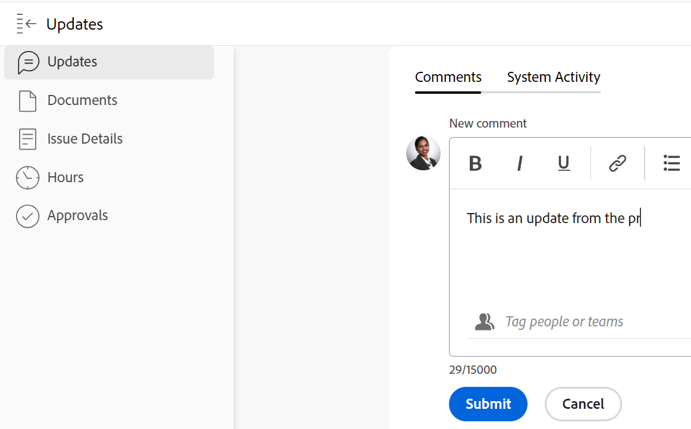

# Actualizar el estado de un problema

<!--Audited: 01/2024-->

Puede actualizar el estado de un problema para informar a otros sobre dónde se encuentra y cómo progresa.

## Requisitos de acceso

+++ Expanda para ver los requisitos de acceso para la funcionalidad en este artículo. 

<table style="table-layout:auto"> 
 <col> 
 <col> 
 <tbody> 
  <tr> 
   <td role="rowheader">paquete de Adobe Workfront</td> 
   <td> 
Cualquiera
 </td> 
  </tr> 
  <tr> 
   <td role="rowheader">Licencia de Adobe Workfront</td> 
   <td> 
Colaborador o superior

   
Solicitud o superior

   </td> 
  </tr> 
  <tr> 
   <td role="rowheader">Configuraciones de nivel de acceso</td> 
   <td> 
Editar acceso a Problemas
 </td> 
  </tr> 
  <tr> 
   <td role="rowheader">Permisos de objeto</td> 
   <td> 
Permisos de administración para el problema
 </td> 
  </tr> 
 </tbody> 
</table>

*Para obtener más información, consulte [Requisitos de acceso en la documentación de Workfront](/help/quicksilver/administration-and-setup/add-users/access-levels-and-object-permissions/access-level-requirements-in-documentation.md).

+++

<!--Old:

<table style="table-layout:auto"> 
 <col> 
 <col> 
 <tbody> 
  <tr> 
   <td role="rowheader">Adobe Workfront plan</td> 
   <td> 
Any
 </td> 
  </tr> 
  <tr> 
   <td role="rowheader">Adobe Workfront license*</td> 
   <td> 
New: Contributor or higher

   Or
   
Current: Request or higher

   </td> 
  </tr> 
  <tr> 
   <td role="rowheader">Access level configurations</td> 
   <td> 
Edit access to Issues
 </td> 
  </tr> 
  <tr> 
   <td role="rowheader">Object permissions</td> 
   <td> 
Manage permissions to the issue
 </td> 
  </tr> 
 </tbody> 
</table>-->

## Estados de los problemas

Los siguientes son los estados predeterminados para los problemas en Workfront:

* Nuevo
* En curso
* Esperando comentarios
* En espera
* No se puede resolver
* Vuelto a abrir
* Cerrado
* Resuelto

El administrador de Adobe Workfront puede añadir estados personalizados para los problemas de su organización. También pueden hacer que los estados estén disponibles según el tipo de problema.

Para obtener más información sobre los estados personalizados y los tipos de problemas, consulte los siguientes artículos:

* [Crear o editar un estado](../../../administration-and-setup/customize-workfront/creating-custom-status-and-priority-labels/create-or-edit-a-status.md)
* [Crear problemas](../../../manage-work/issues/manage-issues/create-issues.md)

Puede actualizar manualmente los estados de los problemas o dejar que Workfront los actualice automáticamente cuando se realicen determinadas acciones.

## Actualizar el estado del problema manualmente

Puede actualizar el estado del problema en las siguientes áreas de Workfront:

* El encabezado del problema en la página de tareas.
* El cuadro Editar problema, al editar un problema.
* La sección Detalles en la página del problema.
* En una lista de problemas o un informe, cuando el campo Estado esté visible en la vista.
* En el panel Resumen del problema.

Para actualizar de forma manual el estado del problema en el encabezado del mismo:

1. Vaya a un problema en el que desee actualizar el estado.
1. Haga clic en el campo **Estado** en el encabezado del problema y seleccione un nuevo estado.
1. Para proporcionar una indicación visual de la finalización del problema, arrastre o haga doble clic en la burbuja bajo **Porcentaje completado** en el encabezado del problema

   O

   Haga clic dentro de la burbuja en el encabezado del problema para introducir un porcentaje.

   

1. (Opcional) Realice una de las siguientes acciones para proporcionar información adicional sobre la actualización:

   * Para añadir una nota sobre la actualización, vaya a la sección **Actualizaciones**, haga clic en **Nuevo comentario** y luego escriba una nota.

     

   * Para notificar la actualización a determinados usuarios, escriba sus nombres en el campo **Etiquetar personas o equipos** que aparece al escribir un comentario. Para obtener más información, consulte [Etiquetar a otros en las actualizaciones](../../../workfront-basics/updating-work-items-and-viewing-updates/tag-others-on-updates.md).
   * Para actualizar el estado de la fecha de confirmación del problema, haga clic en **Detalles del problema** y, a continuación, edite el campo **Fecha de confirmación**. Para obtener más información, consulte [Editar problemas](/help/quicksilver/manage-work/issues/manage-issues/edit-issues.md).

   >[!IMPORTANT]
   >
   >  Solo las personas asignadas al problema pueden actualizar la fecha de confirmación.

<!--Old instructions, in old commenting: 

When you are updating an issue status, you can also add an explanation about the new status and change other issue information such as the commit date.

1. Go to an issue that you are assigned to for which you want to update the status.
1. Click the **Status** field in the issue header and select a new status.

   

1. To provide a visual indication of issue completion, drag or double-click the bubble under **Percent Complete** in the header of the issue.

   Or

   Click inside the bubble in the header of the issue to enter a percentage.

   

-->

## Actualizar el estado del problema automáticamente

Workfront actualiza automáticamente el estado existente de un problema a un estado diferente cuando se producen las acciones enumeradas en la siguiente tabla.

>[!NOTE]
>
>Los estados de la tabla siguiente son estados de sistema predeterminados. El administrador de grupos o de Workfront puede cambiar el nombre de los estados de su instancia de Workfront. Para obtener información sobre cómo crear y administrar estados en Workfront, consulte [Crear o editar un estado](../../../administration-and-setup/customize-workfront/creating-custom-status-and-priority-labels/create-or-edit-a-status.md).

<table style="table-layout:auto"> 
 <col> 
 <col> 
 <col> 
 <tbody> 
  <tr> 
   <td><b>Acción</b></td> 
   <td><b>Estado original</b></td> 
   <td><b>Nuevo estado</b></td> 
  </tr> 
  <tr> 
   <td>Actualizar el porcentaje completado del problema al 100 %</td> 
   <td>Nuevo o En curso</td> 
   <td>Cerrado</td> 
  </tr> 
  <tr> 
   <td>Actualizar el porcentaje completado del problema del 100 % a un número inferior</td> 
   <td>Cerrado </td> 
   <td>En curso</td> 
  </tr> 
  <tr> 
   <td>Actualizar el estado de un objeto de resolución adjunto al problema</td> 
   <td>Varios estados</td> 
   <td> 
Varios estados
 
Para obtener información sobre la resolución de objetos y cómo afectan al estado de los problemas, consulte la sección “Sincronizar el estado del objeto solucionable con el del objeto solucionable” en el artículo <a href="../../../manage-work/issues/convert-issues/resolving-and-resolvable-objects.md" class="MCXref xref">Información general sobre la resolución y los objetos solucionables </a>.
 </td> 
  </tr> 
  <tr data-mc-conditions=""> 
   <td>Haga clic en el botón Iniciar problema para aceptar trabajar en un problema que se le haya asignado </td> 
   <td>Nuevo </td> 
   <td> 
Cualquier estado asociado con el botón Iniciar problema en la configuración del equipo de inicio. 
 
Para obtener información acerca de cómo reemplazar el botón Trabajar en ello por un botón Iniciar problema, consulte <a href="../../../people-teams-and-groups/create-and-manage-teams/work-on-it-button-to-start-button.md" class="MCXref xref">Reemplazar el botón Trabajar en ello por un botón Inicio</a>. 
 
Sugerencia: al hacer clic en el botón Deshacer después de hacer clic en Iniciar problema, se revierte el estado a Nuevo. 
 </td> 
  </tr> 
 </tbody> 
</table>
