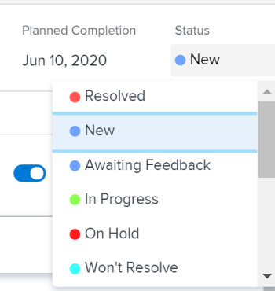

# Actualizar estado del problema

Puede actualizar el estado de un problema para informar a otros sobre dónde está el problema y cómo está progresando.

## Requisitos de acceso

<!--drafted for P&P;

<table style="table-layout:auto"> 
 <col> 
 <col> 
 <tbody> 
  <tr> 
   <td role="rowheader">Adobe Workfront plan*</td> 
   <td> 
Any
 </td> 
  </tr> 
  <tr> 
   <td role="rowheader">Adobe Workfront license*</td> 
   <td> 
Current license: Contributor or higher

   Or
   
Legacy license: Request or higher

   </td> 
  </tr> 
  <tr> 
   <td role="rowheader">Access level configurations*</td> 
   <td> 
Edit access to Issues
 
<b>NOTE</b>
   
   If you still don't have access, ask your Workfront administrator if they set additional restrictions in your access level. For information on how a Workfront administrator can modify your access level, see <a href="../../../administration-and-setup/add-users/configure-and-grant-access/create-modify-access-levels.md" class="MCXref xref">Create or modify custom access levels</a>.
 </td> 
  </tr> 
  <tr> 
   <td role="rowheader">Object permissions</td> 
   <td> 
Manage permissions to the issue
 
For information on requesting additional access, see <a href="../../../workfront-basics/grant-and-request-access-to-objects/request-access.md" class="MCXref xref">Request access to objects </a>.
 </td> 
  </tr> 
 </tbody> 
</table>
-->

Debe tener el siguiente acceso para realizar los pasos de este artículo:

<table style="table-layout:auto"> 
 <col> 
 <col> 
 <tbody> 
  <tr> 
   <td role="rowheader">plan de Adobe Workfront*</td> 
   <td> 
Cualquiera
 </td> 
  </tr> 
  <tr> 
   <td role="rowheader">Licencia de Adobe Workfront*</td> 
   <td> 
Solicitud o superior
 </td> 
  </tr> 
  <tr> 
   <td role="rowheader">Configuraciones de nivel de acceso*</td> 
   <td> 
Editar acceso a Problemas
 
<b>NOTA</b>

Si todavía no tiene acceso, pregunte a su administrador de Workfront si establece restricciones adicionales en su nivel de acceso. Para obtener información sobre cómo un administrador de Workfront puede modificar su nivel de acceso, consulte <a href="../../../administration-and-setup/add-users/configure-and-grant-access/create-modify-access-levels.md" class="MCXref xref">Crear o modificar niveles de acceso personalizados</a>.
 </td>
</tr> 
  <tr> 
   <td role="rowheader">Permisos de objeto</td> 
   <td> 
Administrar permisos para el problema
 
Para obtener información sobre la solicitud de acceso adicional, consulte <a href="../../../workfront-basics/grant-and-request-access-to-objects/request-access.md" class="MCXref xref">Solicitar acceso a objetos </a>.
 </td> 
  </tr> 
 </tbody> 
</table>

&#42;Para saber qué plan, tipo de licencia o acceso tiene, póngase en contacto con el administrador de Workfront.

## Estados de problemas

Los siguientes son los estados predeterminados para los problemas de Workfront:

* Nuevo
* En curso
* Esperando comentarios
* En espera
* No se puede resolver
* Vuelto a abrir
* Cerrado
* Resuelto

El administrador de Adobe Workfront puede agregar estados personalizados para problemas de su organización. También pueden hacer que los estados estén disponibles en función del tipo de problema.

Para obtener más información sobre los estados personalizados y los tipos de problemas, consulte los siguientes artículos:

* [Crear o editar un estado](../../../administration-and-setup/customize-workfront/creating-custom-status-and-priority-labels/create-or-edit-a-status.md)
* [Crear problemas](../../../manage-work/issues/manage-issues/create-issues.md)

Puede actualizar manualmente los estados de problemas o dejar que Workfront los actualice automáticamente cuando se realicen determinadas acciones.

## Actualizar manualmente el estado del problema

Cuando actualiza un estado de problema, también puede agregar una explicación sobre el nuevo estado y cambiar otra información del problema, como la fecha de confirmación.

1. Vaya a un problema al que esté asignado y al que desee actualizar el estado.
1. Haga clic en el **Estado** en el encabezado del problema y seleccione un nuevo estado.

   

1. Para proporcionar una indicación visual de la finalización del problema, arrastre o haga doble clic en la burbuja debajo de **Porcentaje completado** en el encabezado del problema.

   O

   Haga clic dentro de la burbuja en el encabezado del problema para introducir un porcentaje.

   

1. (Opcional) Realice una de las siguientes acciones para proporcionar información adicional sobre la actualización y haga clic en **Actualizar** o, si el problema tiene un estado igual a Complete, haga clic en **Listo:**

   * Para añadir una nota sobre la actualización, vaya a la **Actualizaciones** y haga clic en **Iniciar una nueva actualización** y después escriba la nota.

      

   * Para notificar a ciertos usuarios acerca de la actualización, escriba sus nombres en el **Notificar** que aparece cuando escribe una nota sobre la actualización. Para obtener más información, consulte [Etiquetar otros en actualizaciones](../../../workfront-basics/updating-work-items-and-viewing-updates/tag-others-on-updates.md).
   * Para actualizar la condición del problema, haga clic en **Condición** y, a continuación, seleccione la condición que mejor refleje la condición actual del problema. Seleccione entre las siguientes opciones:

      * Sin problemas
      * Algunas preocupaciones
      * Impedimentos mayores
   * Para actualizar la Fecha de confirmación del problema, expanda el **Fecha de confirmación** calendario desplegable y seleccione una nueva fecha.

## Actualizar el estado del problema automáticamente

Workfront actualiza automáticamente el estado existente de un problema a un estado diferente cuando se producen las acciones enumeradas en la tabla siguiente.

>[!NOTE]
>
>Los estados de la siguiente tabla son los estados predeterminados del sistema. El administrador de Workfront o un administrador de grupos pueden cambiar el nombre de los estados en la instancia de Workfront. Para obtener información sobre la creación y administración de estados en Workfront, consulte [Crear o editar un estado](../../../administration-and-setup/customize-workfront/creating-custom-status-and-priority-labels/create-or-edit-a-status.md).

<table style="table-layout:auto"> 
 <col> 
 <col> 
 <col> 
 <tbody> 
  <tr> 
   <td>Acción</td> 
   <td>Estado original</td> 
   <td>Nuevo estado</td> 
  </tr> 
  <tr> 
   <td>Actualizar el porcentaje completado del problema al 100%</td> 
   <td>Nuevo o en curso</td> 
   <td>Cerrado</td> 
  </tr> 
  <tr> 
   <td>Actualizar el porcentaje de problema completado de 100% a un número inferior</td> 
   <td>Cerrado </td> 
   <td>En curso</td> 
  </tr> 
  <tr> 
   <td>Actualizar el estado de un objeto resuelto adjunto al problema</td> 
   <td>Varios estados</td> 
   <td> 
Varios estados
 
Para obtener información sobre la resolución de objetos y cómo afectan al estado de los problemas, consulte la sección "Sincronizar el estado del objeto resuelto con el del objeto resuelto" en el artículo <a href="../../../manage-work/issues/convert-issues/resolving-and-resolvable-objects.md" class="MCXref xref">Información general sobre la resolución y resolución de objetos </a>.
 </td> 
  </tr> 
  <tr data-mc-conditions=""> 
   <td>Haga clic en el botón Comenzar problema para aceptar trabajar en un problema asignado </td> 
   <td>Nuevo </td> 
   <td> 
Cualquier estado asociado con el botón Iniciar problema en la configuración de su equipo de inicio. 
 
Para obtener información sobre cómo reemplazar el botón Trabajar en él con un botón Iniciar Problema, consulte <a href="../../../people-teams-and-groups/create-and-manage-teams/work-on-it-button-to-start-button.md" class="MCXref xref">Reemplazar el botón Trabajar en él con un botón Inicio</a>. 
 
Sugerencia: Hacer clic el botón Deshacer después de hacer clic en Iniciar problema, revierte el estado a Nuevo. 
 </td> 
  </tr> 
 </tbody> 
</table>
