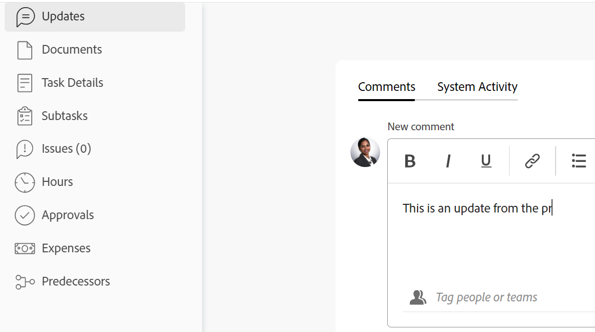

# Actualizar el estado de una tarea

<!--Audited: 10/2024-->

Puede actualizar el estado de una tarea para informar a otros sobre dónde se encuentra la tarea (y el proyecto general) y cómo progresa.

Los estados predeterminados son Nuevo, En curso y Completado. El administrador de Adobe Workfront puede añadir estados personalizados para su organización. Para obtener más información, consulte [Crear o editar un estado](../../../administration-and-setup/customize-workfront/creating-custom-status-and-priority-labels/create-or-edit-a-status.md).

Puede actualizar manualmente los estados de las tareas o permitir que Workfront los actualice automáticamente cuando se realicen determinadas acciones.

## Requisitos de acceso

+++ Expanda para ver los requisitos de acceso para la funcionalidad en este artículo. 

<table style="table-layout:auto"> 
 <col> 
 <col> 
 <tbody> 
  <tr> 
   <td role="rowheader">Paquete de Adobe Workfront</td> 
   <td> 
Cualquiera
 </td> 
  </tr> 
  <tr> 
   <td role="rowheader">Licencia de Adobe Workfront</td> 
   <td> 
Estándar
 
   
Trabajo o superior

   </td> 
  </tr> 
  <tr> 
   <td role="rowheader">Configuraciones de nivel de acceso</td> 
   <td> 
Editar acceso a Tareas
  </td> 
  </tr> 
  <tr> 
   <td role="rowheader">Permisos de objeto</td> 
   <td> 
Administrar permisos para la tarea
 </td> 
  </tr> 
 </tbody> 
</table>

Para obtener más información, consulte [Requisitos de acceso en la documentación de Workfront](/help/quicksilver/administration-and-setup/add-users/access-levels-and-object-permissions/access-level-requirements-in-documentation.md).

+++

<!--Old:

<table style="table-layout:auto"> 
 <col> 
 <col> 
 <tbody> 
  <tr> 
   <td role="rowheader">Adobe Workfront plan</td> 
   <td> 
Any
 </td> 
  </tr> 
  <tr> 
   <td role="rowheader">Adobe Workfront license</td> 
   <td> 
New: Standard
 
   Or
   
Current: Work or higher

   </td> 
  </tr> 
  <tr> 
   <td role="rowheader">Access level configurations</td> 
   <td> 
Edit access to Tasks
  </td> 
  </tr> 
  <tr> 
   <td role="rowheader">Object permissions</td> 
   <td> 
Manage permissions to the task
 </td> 
  </tr> 
 </tbody> 
</table>-->

## Consideraciones acerca de la actualización del estado de las tareas

* Cuando marca una tarea como Completada, el porcentaje completado de la tarea se actualiza al 100 %.
* Existen los siguientes escenarios para las tareas principales:
   * No se puede actualizar el estado de una tarea principal a Completo cuando el modo de finalización de resumen del proyecto está establecido en Automático y las subtareas no se han completado.
   * Puede actualizar el estado de una tarea principal a Completado cuando el modo de finalización de resumen del proyecto esté establecido en Manual y las subtareas estén completadas o incompletas.

  Para obtener más información, consulte [Editar proyectos](../manage-projects/edit-projects.md).

## Actualizar manualmente el estado de una tarea

Puede actualizar el estado de la tarea en las siguientes áreas:

* El encabezado de la tarea en la página de tareas.
* Cuadro de diálogo Editar tarea al editar una tarea.
* La sección Detalles de la tarea de la página de tareas.
* En una lista de tareas o un informe cuando el campo Estado está visible en la vista.
* En el panel Resumen de la tarea.

Para actualizar manualmente el estado de la tarea en el encabezado de tarea:

1. Vaya a la tarea cuyo estado desee actualizar.
1. En el encabezado de la tarea, haga clic en el campo **Estado** y seleccione un nuevo estado.
1. Para proporcionar una indicación visual de la finalización de la tarea, arrastre la burbuja bajo **Porcentaje completado** en el encabezado de la tarea.

   O

   Haga doble clic dentro de la burbuja **Porcentaje completado** para introducir manualmente un nuevo porcentaje.

   

1. (Opcional) Realice una de las siguientes acciones para proporcionar información adicional sobre la actualización:

   * Para añadir una nota sobre la actualización, vaya a la sección **Actualizaciones**, haga clic en **Nuevo comentario** y luego escriba una nota.

     

   * Para notificar la actualización a determinados usuarios, escriba sus nombres en el campo **Etiquetar personas o equipos** que aparece al escribir un comentario. Para obtener más información, consulte [Etiquetar a otros en las actualizaciones](/help/quicksilver/workfront-basics/updating-work-items-and-viewing-updates/tag-others-on-updates.md).
   * Para actualizar la fecha de confirmación de la tarea, haga clic en **Detalles de la tarea** y, a continuación, edite el campo **Fecha de confirmación**. Para obtener más información, consulte [Editar tareas](/help/quicksilver/manage-work/tasks/manage-tasks/edit-tasks.md).

   >[!IMPORTANT]
   >
   >  Solo las personas asignadas a tareas pueden actualizar la fecha de confirmación.

<!--old functionality in old commenting: 

1. Go to a task that you are assigned to for which you want to update the status.
1. Click the **Status** field in the task header and select a new status. 
1. (Optional) Do any of the following to provide additional information about the update, then click **Update** or, if the task has the **Complete** status, click **Done:**

   * To add a note about the update, go to the **Updates** area and click **Start a new update**, then type your note.  

   * To notify certain users about the update, type their names in the **Notify** box that appears when you type a note about the update. For more information, see [Tag others on updates](../../../workfront-basics/updating-work-items-and-viewing-updates/tag-others-on-updates.md). 
   * To update the condition of the task, click **Select Condition** to the right of the **Notify** box (these appear when you type a note about the update), then select the condition that best reflects the current condition of the task.
   
   * To update the Commit Date of the task, expand the **Commit Date** drop-down calendar, and select a new Commit Date. 
   * To provide a visual indication of task completion, drag the bubble under Percent Complete or double-click it to enter a percent value.   
     ![Drag the progress bar]](assets/drag-the-progress-bar-350x155.png)-->

## Actualizar automáticamente el estado de la tarea

Workfront actualiza automáticamente el estado existente de una tarea a un estado diferente cuando se producen las acciones enumeradas en la siguiente tabla.

>[!NOTE]
>
>Los estados de la tabla siguiente son estados de sistema predeterminados. El administrador de grupos o de Workfront puede cambiar el nombre de los estados de su instancia de Workfront. Para obtener información sobre cómo crear y administrar estados en Workfront, consulte [Crear o editar un estado](../../../administration-and-setup/customize-workfront/creating-custom-status-and-priority-labels/create-or-edit-a-status.md).

<table style="table-layout:auto"> 
 <col> 
 <col> 
 <col> 
 <tbody> 
  <tr> 
   <td><b>Acción</b></td> 
   <td><b>Estado original</b></td> 
   <td><b>Nuevo estado</b></td> 
  </tr> 
  <tr> 
   <td>Actualizar el porcentaje completado de la tarea al 100 %</td> 
   <td>Nuevo o En curso</td> 
   <td>Completar</td> 
  </tr> 
  <tr> 
   <td>Actualizar el porcentaje completado de la tarea del 100 % a un número inferior</td> 
   <td>Completar</td> 
   <td>En curso</td> 
  </tr> 
  <tr data-mc-conditions=""> 
   <td>Haga clic en el botón Iniciar tarea para aceptar que se trabaje en una tarea que se le ha asignado </td> 
   <td>Nuevo </td> 
   <td> 
Cualquier estado asociado con el botón Iniciar tarea en la configuración del equipo de inicio.
 
Para obtener información acerca de cómo reemplazar el botón Trabajar en ello por un botón Iniciar tarea, consulte <a href="../../../people-teams-and-groups/create-and-manage-teams/work-on-it-button-to-start-button.md" class="MCXref xref">Reemplazar el botón Trabajar en ello por el botón Inicio</a>.
 
Sugerencia: Al hacer clic en el botón Deshacer después de hacer clic en Iniciar tarea, se revierte el estado a Nuevo. 
 </td> 
  </tr> 
 </tbody> 
</table>
