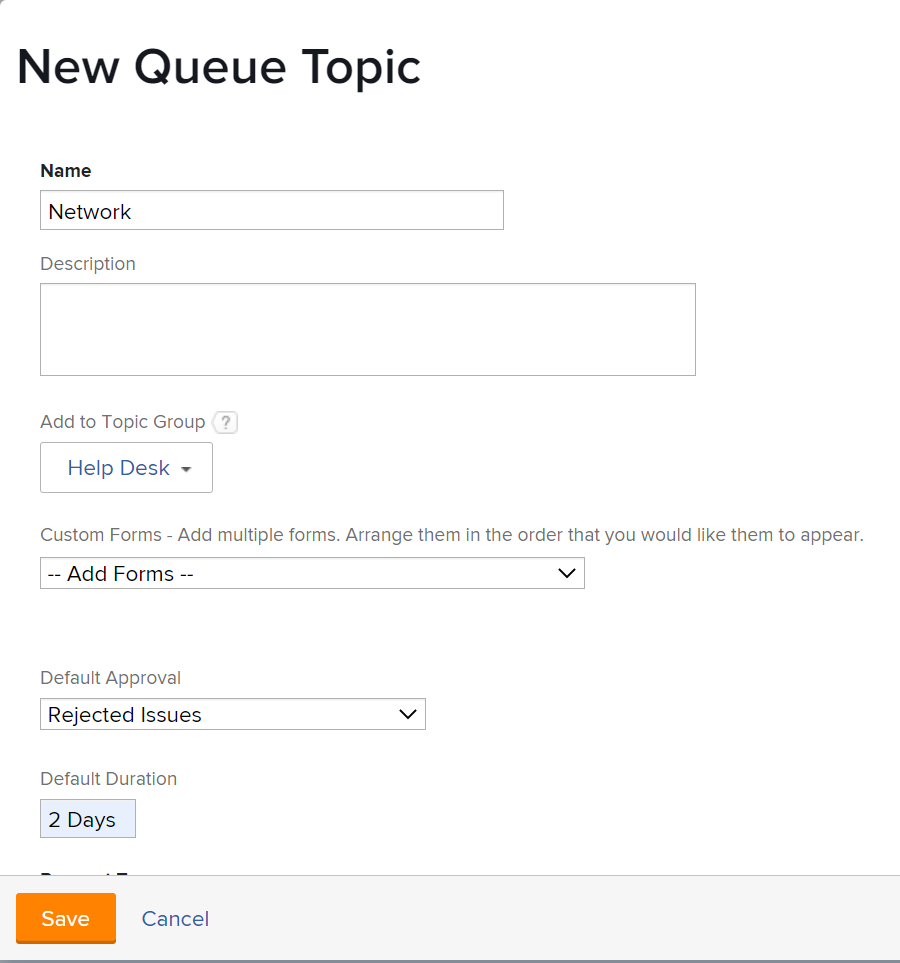

# Crear temas de la cola

<!-- Audited: 12/2023 -->

Los temas de la cola funcionan junto con las reglas de enrutamiento para asignar automáticamente el trabajo entrante a un usuario, función o equipo, o para colocarlo en un proyecto. Los temas de la cola definen las condiciones que deben darse para que se implemente la regla de enrutamiento.

No hay límite en cuanto al número de temas de la cola que se pueden asignar a un grupo de temas o a un proyecto. Los temas de la cola son un tipo de objeto que se puede incluir en un informe.

Una vez creados, no se pueden mover los temas de la cola de un proyecto a otro.

## Requisitos de acceso

+++ Expanda para ver los requisitos de acceso para la funcionalidad en este artículo.

<!--drafted - replace table with P&P:

<table style="table-layout:auto"> 
 <col> 
 <col> 
 <tbody> 
  <tr> 
   <td role="rowheader">Adobe Workfront plan*</td> 
   <td> 
Any 
 </td> 
  </tr> 
  <tr> 
   <td role="rowheader">Adobe Workfront license*</td> 
   <td> 
Current license: Standard 
 
   Or
   
Legacy license: Plan 
 </td> 
  </tr> 
  <tr> 
   <td role="rowheader">Access level configurations*</td> 
   <td> 
Edit access to Projects
 
Note: If you still don't have access, ask your Workfront administrator if they set additional restrictions in your access level. For information on how a Workfront administrator can modify your access level, see <a href="../../../administration-and-setup/add-users/configure-and-grant-access/create-modify-access-levels.md" class="MCXref xref">Create or modify custom access levels</a>.
 </td> 
  </tr> 
  <tr> 
   <td role="rowheader">Object permissions</td> 
   <td> 
 Manage permissions to the project
 
For information on requesting additional access, see <a href="../../../workfront-basics/grant-and-request-access-to-objects/request-access.md" class="MCXref xref">Request access to objects </a>.
 </td> 
  </tr> 
 </tbody> 
</table>
-->

Debe tener el siguiente acceso para realizar los pasos de este artículo:

<table style="table-layout:auto"> 
 <col> 
 <col> 
 <tbody> 
  <tr> 
   <td role="rowheader">Plan de Adobe Workfront</td> 
   <td> 
Cualquiera 
 </td> 
  </tr> 
  <tr> 
   <td role="rowheader">Licencia de Adobe Workfront</td> 
   <td>
    
Nuevo: estándar

    
o

    
Actual: plan
</td>  
  </tr> 
  <tr> 
   <td role="rowheader">Configuraciones de nivel de acceso</td> 
   <td> 
Acceso de edición a proyectos
 </td> 
  </tr> 
  <tr> 
   <td role="rowheader">Permisos de objeto</td> 
   <td> 
 Administrar permisos del proyecto
 </td> 
  </tr> 
 </tbody> 
</table>

Para obtener más información sobre el contenido de esta tabla, consulte [Requisitos de acceso en la documentación de Workfront](/help/quicksilver/administration-and-setup/add-users/access-levels-and-object-permissions/access-level-requirements-in-documentation.md).

+++

## Crear un tema de la cola

1. Cree una regla de enrutamiento, un grupo de temas y un formulario personalizado si tiene pensado asociarlos con el tema de la cola.\
   Para obtener más información sobre la creación de reglas de enrutamiento, grupos de temas o formularios personalizados, consulte los siguientes artículos:

   * [Crear reglas de enrutamiento](../../../manage-work/requests/create-and-manage-request-queues/create-routing-rules.md)
   * [Eliminar grupos de temas](../../../manage-work/requests/create-and-manage-request-queues/create-topic-groups.md)
   * [Crear un formulario personalizado](/help/quicksilver/administration-and-setup/customize-workfront/create-manage-custom-forms/form-designer/design-a-form/design-a-form.md)

1. Vaya al proyecto que eligió habilitar como cola de solicitudes de ayuda y donde desea crear un nuevo tema de la cola.\
   Para obtener más información sobre cómo designar un proyecto como cola de solicitudes de ayuda, consulte [Crear una cola de solicitudes](../../../manage-work/requests/create-and-manage-request-queues/create-request-queue.md).

   Puede organizar temas de la cola relacionados en un grupo de temas. Esto proporcionará al solicitante una serie de menús desplegables al realizar una solicitud.

   O

   Puede anidar los temas de la cola directamente en el proyecto designado como cola de solicitudes de ayuda, sin un grupo de temas.

   Para obtener información sobre la creación de grupos de temas, consulte [Crear grupos de temas](../../../manage-work/requests/create-and-manage-request-queues/create-topic-groups.md).

1. Haga clic en **Temas de cola** en el panel izquierdo.
1. Haga clic en **Nuevo tema de la cola**.
1. En el formulario **Nuevo tema de la cola**, escriba lo siguiente:

   <table style="table-layout:auto"> 
    <col> 
    <col> 
    <tbody> 
     <tr> 
      <td role="rowheader"><strong>Nombre</strong> </td> 
      <td> Nombre del tema de la cola.</td> 
     </tr> 
     <tr> 
      <td role="rowheader"><strong>Descripción</strong> </td> 
      <td>Describa la cola de solicitudes. La descripción se muestra cuando los usuarios seleccionan el tema de la cola en el proceso de envío de una nueva solicitud. </td> 
     </tr> 
     <tr> 
      <td role="rowheader"><strong>Añadir a grupo de temas</strong> </td> 
      <td> Si no hay grupos de temas en el proyecto, el nombre del proyecto se ajusta por defecto como un grupo de temas. Si desea crear grupos de temas adicionales desde aquí, seleccione <strong>Crear nuevo grupo de temas</strong> en el menú desplegable. </td> 
     </tr> 
     <tr> 
      <td role="rowheader"><strong>Formularios personalizados</strong> </td> 
      <td>Seleccione los formularios personalizados que desee asociar con el tema de la cola. Debe crear formularios personalizados para los problemas antes de poder asociarlos a los temas de la cola. Para obtener información sobre cómo crear formularios personalizados, consulte <a href="/help/quicksilver/administration-and-setup/customize-workfront/create-manage-custom-forms/form-designer/design-a-form/design-a-form.md">Crear un formulario personalizado</a>.</td> 
     </tr> 
     <tr> 
      <td role="rowheader"><strong>Aprobación predeterminada</strong></td> 
      <td> 
Asocie un proceso de aprobación a este tema de la cola. En este menú desplegable solo están visibles los procesos de aprobación de problemas. Todos los problemas enviados a esta cola se asociarán con este proceso de aprobación. El administrador de Adobe Workfront debe definir los procesos de aprobación a nivel del sistema para poder asociarlos a los temas de la cola. Un usuario con acceso administrativo a los procesos de aprobación también puede crear procesos de aprobación específicos del grupo. Para obtener más información sobre la creación de procesos de aprobación, consulte <a href="../../../administration-and-setup/customize-workfront/configure-approval-milestone-processes/create-approval-processes.md" class="MCXref xref">Crear un proceso de aprobación para elementos de trabajo</a>. 
 
       
 
        
Importante: Si el grupo del proyecto cambia, el proceso de aprobación específico del grupo adjunto a los problemas existentes se convierte en un proceso de aprobación de un solo uso. Para obtener más información sobre cómo afectan los cambios en el grupo del proyecto o los cambios en el proceso de aprobación a la configuración de aprobación, consulte <a href="../../../administration-and-setup/customize-workfront/configure-approval-milestone-processes/how-changes-affect-group-approvals.md" class="MCXref xref">Cómo afectan los cambios en el grupo y el proceso de aprobación a los procesos de aprobación asignados</a>.
 
        
Tenga en cuenta lo siguiente al añadir procesos de aprobación a los temas de la cola: 
 
        <ul style="list-style-type: circle;"> 
         <li>En la lista solo se muestran los procesos de aprobación activos. </li> 
         <li> 
Los procesos de aprobación de todo el sistema y específicos del grupo se muestran en la lista. Un proceso de aprobación asociado a un grupo que no sea el del proyecto no se muestra en la lista.
 </li> 
        </ul> 
       
 </td> 
     </tr> 
     <tr> 
      <td role="rowheader"><strong>Duración predeterminada</strong> </td> 
      <td>Es la duración predeterminada de la solicitud y la fecha planificada de finalización de la solicitud se calcula según este valor.</td> 
     </tr> 
     <tr> 
      <td role="rowheader"><strong>Ruta predeterminada</strong> </td> 
      <td>Especifique la regla de enrutamiento que desea asociar con el tema de la cola. Debe crear la regla de enrutamiento para poder adjuntarla a un tema de la cola. Para obtener más información, consulte <a href="../../../manage-work/requests/create-and-manage-request-queues/create-routing-rules.md">Crear reglas de enrutamiento</a>. </td> 
     </tr> 
     <tr> 
      <td role="rowheader"><strong>Tipos de solicitud</strong> </td> 
      <td> 
Elija el tipo de solicitudes que almacena este tema de la cola. Las opciones visibles se establecen en la pestaña <strong>Detalles de la cola</strong> del proyecto. Este campo es obligatorio. 
 
       
<b>NOTA</b>:

      
Los tipos se muestran como una selección en el área de solicitudes solo si el tipo de solicitud está seleccionado en ambas páginas: Detalles de la cola y Tema de la cola. Para obtener información sobre la configuración del área Detalles de la cola de un proyecto, consulte <a href="../../../manage-work/requests/create-and-manage-request-queues/create-request-queue.md" class="MCXref xref">Crear una cola de solicitudes</a>. 
 
Seleccione entre los siguientes tipos:
 
       <ul> 
        <li>Informe de errores</li> 
        <li>Solicitud de cambio</li> 
        <li>Problema</li> 
        <li>Solicitud</li> 
       </ul> 
Es posible que el administrador de Workfront haya cambiado el nombre de algunas de estas opciones. 
 </td> 
     </tr> 
    </tbody> 
   </table>

   

1. Haga clic en **Guardar**.\
   El tema de la cola ya está disponible para usar y se puede ver en el área de solicitudes de Workfront, después de seleccionar una cola de solicitudes y un grupo de temas.
