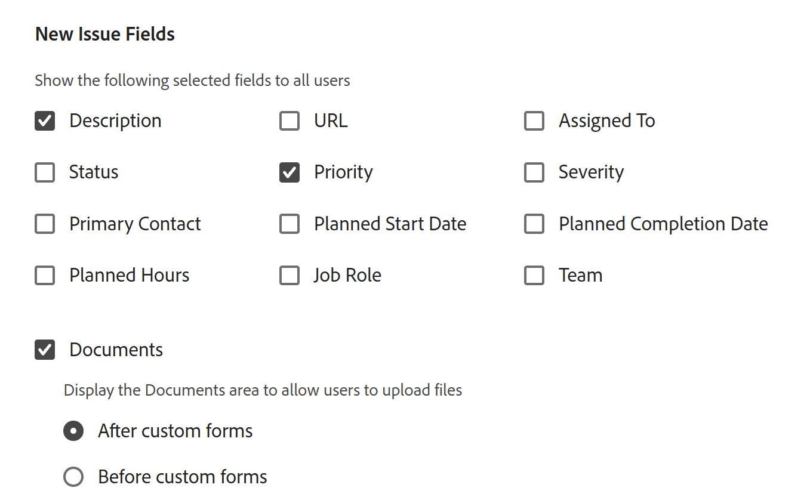

# Creación de colas de solicitudes

<!--Audited: 12/2023-->

<!--
<THIS IS CONNECTED TO THE PRODUCT IN BLUEPRINTS. DO NOT MOVE/ CHANGE URL>
-->

<!--hide/ comment out the entire "create requests in Production" section and just edit and leave  only the preview section when it releases to Production; also remove the template blurb when the queue details is unshimmed for templates-->

La información resaltada en esta página hace referencia a una funcionalidad que aún no está disponible de forma general. Solo está disponible en el entorno de vista previa para todos los clientes. Después de las versiones mensuales en Production, las mismas funciones también están disponibles en el entorno Production para los clientes que habilitaron versiones rápidas. 

Para obtener información sobre las versiones rápidas, consulte [Habilitar o deshabilitar las versiones rápidas para su organización](/help/quicksilver/administration-and-setup/set-up-workfront/configure-system-defaults/enable-fast-release-process.md). 

Es posible configurar colas de solicitudes en las que los usuarios introduzcan solicitudes ocasionales que no estén planificadas como trabajo de un proyecto. Por ejemplo, se podría configurar una cola de solicitudes del servicio de asistencia para capturar todas las solicitudes de usuarios que lleguen a un departamento de TI.

Las solicitudes se convierten en problemas en Adobe Workfront y se añaden a los proyectos.

Configurar una cola de solicitudes ayuda a formalizar la información sobre los problemas que se agregarán a un proyecto. Todos los problemas enviados al proyecto se enviarán de la misma manera y seguirán la misma ruta hasta la finalización.

Puede configurar los siguientes objetos como colas de solicitud en Workfront:

* Proyectos
* Plantillas. Los proyectos creados a partir de plantillas configuradas como colas de solicitudes se convertirán en colas de solicitudes.

Para configurar un proyecto o una plantilla como cola de solicitudes, debe editar el área Detalles de cola del proyecto o la plantilla.

Este artículo describe cómo se puede configurar un proyecto como una cola de solicitudes en la que los usuarios pueden enviar solicitudes. Configurar los detalles de cola para una plantilla es similar a configurarlos en el proyecto.

Para obtener información sobre cómo enviar una nueva solicitud a una cola de solicitudes, consulte [Copiar y enviar solicitudes](../create-requests/copy-and-submit-requests.md).

## Requisitos de acceso

+++ Expanda para ver los requisitos de acceso para la funcionalidad en este artículo.

Debe tener el siguiente acceso para realizar los pasos de este artículo:

<table style="table-layout:auto"> 
 <col> 
 <col> 
 <tbody> 
  <tr> 
   <td role="rowheader">Plan de Adobe Workfront</td> 
   <td> 
Cualquiera 
 </td> 
  </tr> 
  <tr> 
   <td role="rowheader">Licencia de Adobe Workfront</td> 
   <td> 
   
Nueva licencia: estándar 

   O
   
Licencia actual: plan 
 </td> 
  </tr> 
  <tr> 
   <td role="rowheader">Configuraciones de nivel de acceso</td> 
   <td> 
Acceso de edición a proyectos
 </td> 
  </tr> 
  <tr> 
   <td role="rowheader">Permisos de objeto</td> 
   <td> 
 Administrar permisos del proyecto
 </td> 
  </tr> 
 </tbody> 
</table>

Para obtener más información sobre el contenido de esta tabla, consulte [Requisitos de acceso en la documentación de Workfront](/help/quicksilver/administration-and-setup/add-users/access-levels-and-object-permissions/access-level-requirements-in-documentation.md).

+++

## Información general sobre colas de solicitudes

Las colas de solicitudes se configuran como los proyectos. Cuando se designa el proyecto como una cola de solicitudes, se puede acceder a la cola desde el área de solicitudes de Adobe Workfront. Al personalizar la cola de solicitudes, también se personaliza el formulario que los usuarios rellenarán al enviar solicitudes.

En este artículo se describe cómo crear una cola de solicitudes a partir de un proyecto existente. Sin embargo, para generar coherencia en el proceso de admisión de solicitudes o para añadirle varias capas con fines de creación de informes y mejorar la administración, también se pueden configurar componentes básicos adicionales de una cola de solicitudes, que se describen en la siguiente tabla.

<table style="table-layout:auto"> 
 <col> 
 <col> 
 <tbody> 
  <tr> 
   <td role="rowheader">Detalles de la cola</td> 
   <td> 
Es necesario configurar un proyecto como cola de solicitudes en el área Detalles de la cola. Este paso es obligatorio. 
 
Para obtener más información, consulte la sección <a href="#create-a-request-queue" class="MCXref xref">Creación de colas de solicitudes</a> de este artículo.
 </td> 
  </tr> 
  <tr> 
   <td role="rowheader">Grupos de temas</td> 
   <td> 
Son menús adicionales que clasifican las solicitudes en función de funciones comunes. Por ejemplo, para una cola de solicitudes de TI, es posible que quiera tener los grupos de temas “In situ” y “Remoto”. 
 
Para obtener más información, consulte <a href="../../../manage-work/requests/create-and-manage-request-queues/create-topic-groups.md" class="MCXref xref">Creación de grupos de temas</a>. 
 
Esto es opcional.
 </td> 
  </tr> 
  <tr> 
   <td role="rowheader">Temas de la cola</td> 
   <td> 
Son menús adicionales que clasifican solicitudes que pertenecen al mismo grupo de temas en función de características comunes. Un grupo de temas puede contener varios temas de colas. 
 
Por ejemplo, el grupo de temas “In situ” para la cola de solicitudes de TI podría contener los temas de colas “Hardware”, “Software” y “Red”. 
 
Para obtener más información, consulte <a href="../../../manage-work/requests/create-and-manage-request-queues/create-queue-topics.md" class="MCXref xref">Creación de temas de colas</a>. 
 
Esto es opcional.
 </td> 
  </tr> 
  <tr> 
   <td role="rowheader">Reglas de enrutamiento</td> 
   <td> 
Permiten dirigir cada solicitud a un usuario, función, equipo o proyecto. 
 
Para obtener más información, consulte <a href="../../../manage-work/requests/create-and-manage-request-queues/create-routing-rules.md" class="MCXref xref">Creación de reglas de enrutamiento</a>. 
 
Esto es opcional.
 </td> 
  </tr> 
 </tbody> 
</table>

## Creación de colas de solicitudes

<!--at production release on April 10, do the following: take the first sentence here out; hide/ comment out the first section (Create a Request Queue in the Production environment); remove the title of the "Create a Request Queue in the Preview environment and leave that section as the only way to create request queues; search for any visible references of production/ preview and remove them from the entire article-->

La creación de una cola de solicitudes varía en función del entorno que utilice.

### Crear una cola de solicitudes en el entorno de producción

En esta sección se describe cómo definir Detalles de Cola para los objetos siguientes:

* Un proyecto en el entorno de producción
* Una plantilla en el entorno de producción o vista previa

Al configurar un proyecto como cola de solicitudes, el estado del proyecto deberá ser Actual para que se muestre en el área de solicitudes de Workfront.

>[!TIP]
>
>Es posible que el administrador de Workfront o del grupo le asigne una plantilla de diseño personalizada que no incluya algunas de las secciones descritas en los pasos siguientes.

Para crear una cola de solicitudes, haga lo siguiente:

1. Vaya al proyecto que quiera configurar como cola de solicitudes.
1. (Opcional) Haga clic en **Detalles del proyecto**, en el panel izquierdo, y añada una **Descripción** al proyecto en el área **Información general**. Esta información se mostrará en todas las solicitudes nuevas.
1. Haga clic en **Detalles de la cola**, en el panel de navegación izquierdo. Es posible que sea necesario hacer clic en **Mostrar más** y, a continuación, en **Detalles de la cola**.

   Se abrirá la sección de detalles de la cola.

   

1. Especifique la siguiente información:

   * **Publicar como cola de solicitudes de ayuda:** seleccione esta opción para identificar este proyecto como una cola de solicitudes. Todos los problemas entrantes se consideran solicitudes.\
     Cuando esta opción no está seleccionada, el proyecto se comporta como un proyecto estándar en Workfront y todos los problemas entrantes son problemas.

   * **Quién puede añadir solicitudes a esta cola:** seleccione qué usuarios tienen acceso para añadir solicitudes a esta cola. Puede permitir que los siguientes grupos de personas vean la cola de solicitudes en su área de solicitudes de la barra de navegación global cuando añaden una nueva solicitud:

     | Quién puede introducir solicitudes | Descripción |
     |---|---|
     | Cualquiera | Cualquier usuario de Workfront con una cuenta activa puede ver esta cola de solicitudes y añadirle solicitudes |
     | Personas con acceso de visualización en este proyecto | Los usuarios que tienen permisos de visualización en el proyecto pueden ver y añadir solicitudes a esta cola. |
     | Personas en la compañía de este proyecto | Los usuarios que pertenecen a la compañía asociada con este proyecto pueden ver y añadir solicitudes a esta cola. Si hay una compañía asociada al proyecto, el nombre de la compañía se muestra entre paréntesis después de esta configuración. |
     | Personas en el grupo de este proyecto | Los usuarios que pertenecen al grupo asociado a este proyecto pueden ver y añadir solicitudes a esta cola. Si hay un grupo asociado con el proyecto, el nombre del grupo se muestra entre paréntesis después de esta configuración, en fuente gris. |

     {style="table-layout:auto"}

   * **Compartir con estos vínculos:** las siguientes opciones permiten proporcionar acceso directo a la cola de solicitudes y a los formularios asociados a ella a usuarios que no sean de Workfront o a usuarios de Workfront que usen una página externa. Para obtener información acerca de cómo incrustar una cola de solicitudes en un panel como página externa, consulte [Incrustar una cola de solicitudes en un panel](../../../reports-and-dashboards/dashboards/creating-and-managing-dashboards/embed-request-queue-dashboard.md).

     Los usuarios ya deben tener derechos de acceso a la cola de solicitudes para obtener acceso directo. El uso de cualquiera de las opciones descritas aquí no concede acceso automáticamente a los usuarios.

     >[!TIP]
     >
     >Los usuarios deben iniciar sesión en Workfront antes de obtener acceso a la cola de solicitudes cuando acceden a la página Cola de solicitudes desde otra aplicación.

      * **URL de acceso directo:** cuando un usuario accede a esta URL desde un explorador, se le redirige directamente a la sección Nueva solicitud del área Solicitudes y se selecciona esta solicitud de forma predeterminada para él.

        

        >[!NOTE]
        >
        >Puede mostrar una cola de solicitudes en un panel como una página externa. En este caso, la cola de solicitudes está preseleccionada, pero puede seleccionar cualquier otra cola de solicitudes del campo Tipo de solicitud. Los usuarios pueden cambiar el Tipo de solicitud. También se muestran los componentes de navegación de las solicitudes.

      * **Código incrustado:** utilice este código de HTML para incrustar el formulario de cola de solicitudes como un iframe en cualquier página de HTML.\
        Si los usuarios no están autenticados en Workfront cuando ven la página donde está incrustado el código, se muestra el cuadro de diálogo de inicio de sesión de Workfront. Cuando los usuarios inician sesión, se muestra el formulario Cola de solicitudes.

        >[!NOTE]
        >
        >Al mostrar una Cola de solicitudes en un iframe, solo se muestra el formulario de solicitud, el nombre de la solicitud aparece preseleccionado y atenuado. El usuario no puede cambiar el tipo de solicitud. Los componentes de navegación del área de Solicitudes no se muestran.

        Para que el formulario de cola de solicitudes se muestre al utilizar este código incrustado, debe habilitar la configuración “Permitir incrustación de Workfront en un iframe” en la configuración del sistema. Para obtener más información sobre cómo habilitar la incrustación de Workfront en un iframe, consulte [Configurar las preferencias de seguridad del sistema](../../../administration-and-setup/manage-workfront/security/configure-security-preferences.md). Si esta configuración no está habilitada, el iframe se muestra en blanco.

        Puede ajustar varios aspectos de cómo se muestra el formulario incrustado de la siguiente manera:

        <table border="1" cellspacing="15"> 
         <col> 
         <col> 
         <thead> 
          <tr> 
           <th> 
<strong>Funcionalidad</strong> 
 </th> 
           <th> 
<strong>Solución</strong> 
 </th> 
          </tr> 
         </thead> 
         <tbody> 
          <tr> 
           <td> 
Ajustar el tamaño del marco
 </td> 
           <td> 
Modifique los atributos “anchura” y “altura”.
 
De forma predeterminada, la anchura es “500” y la altura es “600”
 </td> 
          </tr> 
          <tr> 
           <td> 
Dirigir a los usuarios a un tema de la cola o un grupo de temas específico
 </td> 
           <td> 
Añada el parámetro “path” a la dirección URL src. Para encontrar el parámetro de ruta, navegue hasta el tema de la cola o el grupo de temas deseado en el formulario no incrustado e inspeccione la dirección URL.
 </td> 
          </tr> 
          <tr> 
           <td> 
Mostrar y permitir a los usuarios cambiar la lista desplegable de grupo de temas preconfigurada
 </td> 
           <td> 
Use el parámetro “path” añadiendo el parámetro <code>showPreSelectedOptions=true</code> a la <code>src URL</code>.
 </td> 
          </tr> 
          <tr> 
           <td> 
Detectar cuándo se ha enviado el formulario
 </td> 
           <td> 
Añada un detector de eventos “mensaje” a la ventana de su página web y verifique si <code>event.data.type</code> es <code>requestSubmitted</code>. <code>event.data.newIssueID</code> se establecerá en el ID del problema creado.
 </td> 
          </tr> 
         </tbody> 
        </table>

   * **Tipos de solicitud:** seleccione entre las opciones predeterminadas siguientes.

     La persona con la función de administrador de Workfront puede cambiar el nombre de los tipos de solicitud predeterminados. Para obtener más información sobre cómo cambiar el nombre de los tipos de solicitud, consulte [Personalizar los tipos de problemas predeterminados](../../../administration-and-setup/set-up-workfront/configure-system-defaults/customize-default-issue-types.md).

      * Informe de errores
      * Solicitud de cambio
      * Problema
      * Solicitud

        Este campo es obligatorio y se debe seleccionar al menos una opción.

     >[!NOTE]
     >
     >Los tipos de solicitud se muestran como selección en el área Solicitudes solo si están seleccionados en las páginas Detalles de la cola y Tema de la cola. Para obtener información acerca de cómo configurar el área Detalles de la cola de un proyecto, consulte [Crear temas de cola](../../../manage-work/requests/create-and-manage-request-queues/create-queue-topics.md).

     Cada tipo seleccionado aquí estará disponible en el formulario (puede seleccionar más de uno). Seleccionar más de un tipo puede ayudar a organizar las múltiples solicitudes que se reciben.\
     Por ejemplo, si utiliza el formulario en una cola de solicitudes para un proyecto de TI, pueden aparecer en la cola los siguientes tipos de solicitudes: hardware, software, correcciones de errores y problemas.

   * **Duración predeterminada:** el tiempo que normalmente se tarda en completar un problema. Pasa a ser el valor predeterminado para todos los problemas entrantes y se puede modificar manualmente. La duración suele establecerse en horas, días o semanas. La duración predeterminada de un problema es la misma que las horas planificadas para dicho problema. La fecha planificada de finalización del problema se calcula según este campo.\
     El valor predeterminado de la duración del problema es de 1 día u 8 horas. Si la persona con la función de administrador de Workfront establece las horas habituales por día laborable en menos de 8 horas, la duración predeterminada de los problemas seguirá siendo de 8 horas. Por ejemplo, si las horas habituales por día laborable son 7, la duración predeterminada de los problemas es de 1,14 días u 8 horas. Para obtener más información acerca de cómo configurar el sistema Horas habituales por día laborable, consulte la sección “Cálculos de línea de tiempo” del artículo [Configurar las preferencias de proyecto de todo el sistema](../../../administration-and-setup/set-up-workfront/configure-system-defaults/set-project-preferences.md).

   * **Las personas de la misma compañía heredarán los mismos permisos para todas las solicitudes.:** cuando se selecciona, todas las solicitudes enviadas a la cola son visibles para los usuarios de la misma compañía. Los usuarios pueden ver estas solicitudes en la sección Todas las solicitudes, ubicada dentro del área Solicitudes. En el momento en que esta opción se habilita o deshabilita, afecta a todas las solicitudes futuras; no afecta de forma retroactiva a la información.
   * **Cuando alguien realiza una solicitud, conceder automáticamente:** cuando un usuario realiza una solicitud a la cola de solicitudes, se le concederá automáticamente el nivel de permiso que usted elija para esa solicitud. Seleccione entre los siguientes niveles de permisos:

      * **Acceso de visualización**
      * **Acceso de aportación**. Esta es la selección predeterminada.
      * **Acceso de administración**

     Para obtener información acerca del modelo de permisos de Workfront, consulte [Información general sobre los permisos de uso compartido de objetos](../../../workfront-basics/grant-and-request-access-to-objects/sharing-permissions-on-objects-overview.md).\
     Al establecer permisos aquí, se ahorra tiempo, ya que no se tiene que conceder permisos para cada solicitud entrante individual. Elegir esta opción afecta a todas las solicitudes futuras, pero no tiene un impacto retroactivo en las solicitudes existentes.

   * **Aprobación predeterminada**: asocie un proceso de aprobación a esta cola de solicitudes. En este menú desplegable solo están visibles los procesos de aprobación de problemas. Todos los problemas enviados a esta cola se asociarán con este proceso de aprobación. La persona con la función de administrador de Workfront debe definir los procesos de aprobación en el nivel de sistema antes de se puedan asociar a colas de solicitudes. Los usuarios con acceso administrativo a los procesos de aprobación también pueden crear procesos de aprobación específicos del grupo.

     >[!IMPORTANT]
     >
     >Si el grupo del proyecto cambia, el proceso de aprobación específico del grupo adjunto a los problemas existentes se convierte en un proceso de aprobación de un solo uso. Para obtener más información sobre cómo los cambios en el grupo del proyecto o los cambios en el proceso de aprobación afectan a la configuración de aprobación, consulte [Cómo afectan los cambios en el grupo y el proceso de aprobación a los procesos de aprobación asignados](../../../administration-and-setup/customize-workfront/configure-approval-milestone-processes/how-changes-affect-group-approvals.md).

     Si tiene varios temas de cola asociados a una cola de solicitudes, le recomendamos que asocie los procesos de aprobación a los temas de la cola. Para obtener más información la creación de temas de la cola, consulte [Crear temas de la cola](../../../manage-work/requests/create-and-manage-request-queues/create-queue-topics.md).

     Tenga en cuenta lo siguiente al añadir los procesos de aprobación a las colas de solicitud:

      * En la lista solo se muestran los procesos de aprobación activos.
      * Los procesos de aprobación de todo el sistema y específicos del grupo se muestran en la lista. Un proceso de aprobación asociado a un grupo que no sea el del proyecto no se muestra en la lista.

   * **Ruta predeterminada**: asocie una regla de enrutamiento a esta cola de solicitudes. Utilice Reglas de enrutamiento para asignar automáticamente los nuevos problemas enviados a una cola de solicitudes al recurso correcto (usuario, función o equipo) y al proyecto correcto. Todos los problemas enviados a esta cola se asociarán a esta regla de enrutamiento. Debe configurar las reglas de enrutamiento para que se muestren en la sección Detalles de la cola y para poderlas asociar a la cola de solicitudes.\
     Si tiene varios temas de la cola asociados a una cola de solicitudes, le recomendamos que asocie las reglas de enrutamiento a los temas de la cola. Para obtener más información sobre la creación de reglas de enrutamiento, consulte [Crear reglas de enrutamiento](../../../manage-work/requests/create-and-manage-request-queues/create-routing-rules.md).

   * **Nuevos campos de problema:** En la sección **Mostrar los siguientes campos seleccionados a todos los usuarios**, seleccione los campos que desee que sean visibles para todos los usuarios que envíen una solicitud al proyecto o que añadan un problema al proyecto o a las tareas.

     >[!TIP]
     >
     >Los nuevos campos de problema seleccionados en la sección Detalles de la cola también están asociados a cualquier problema nuevo añadido al proyecto <!--this is confusing: or to the tasks in the Issues section-->.

     Al habilitar cualquiera de los campos Asignado a, Función o Equipo, siempre se les cambia el nombre a Asignaciones en el formulario de solicitud, pero solo puede especificar el tipo de asignación seleccionada aquí.

     >[!NOTE]
     >
     >Si ha seleccionado Asignado a en el área Detalles de la cola, solo puede introducir usuarios en el campo Asignaciones del formulario de solicitud. En este caso, no puede introducir funciones ni un equipo.

   * **Documentos**: si selecciona mostrar la sección Documentos en el nuevo formulario de solicitud, seleccione dónde se debe colocar la sección de carga de documentos. Seleccione entre las siguientes opciones:

     <table style="table-layout:auto"> 
      <col> 
      <col> 
      <tbody> 
       <tr> 
        <td role="rowheader">Después de formularios personalizados</td> 
        <td>La sección Documentos se muestra en la parte inferior del formulario de solicitud. </td> 
       </tr> 
       <tr> 
        <td role="rowheader">Antes de formularios personalizados</td> 
        <td> 
Se muestra la sección Documentos entre los campos de Workfront y los campos personalizados del formulario de solicitud. 
 </td> 
       </tr> 
      </tbody> 
     </table>

     

   * **Mostrar todos los campos seleccionados y no seleccionados a:** seleccione a qué usuarios desea mostrar todos los campos del nuevo formulario de solicitud. Las siguientes opciones controlan el acceso a los campos del formulario.

     | Qué usuarios pueden ver todos los campos del formulario de solicitud | Descripción |
     |---|---| 
     | Todos los usuarios (Licencias Plan) | Todos los usuarios que tengan una licencia Plan pueden ver los campos seleccionados y los no seleccionados. |
     | Personas con acceso de visualización en este proyecto (licencia de planificación) | Los usuarios con una licencia Plan que también tengan derechos de visualización sobre este proyecto pueden ver los campos seleccionados y los no seleccionados. El resto de los usuarios que pueden enviar solicitudes a este proyecto solo pueden ver los campos seleccionados. |
     | Ningún usuario | Ningún usuario puede ver los campos no seleccionados. Todos los usuarios que pueden enviar solicitudes a este proyecto solo pueden ver los campos seleccionados. |

   * **Formularios personalizados**: seleccione un formulario personalizado para asociarlo a la cola de solicitudes. En este menú desplegable solo está disponible la opción Formularios personalizados de los problemas. Todos los problemas enviados a la cola de solicitudes tendrán los formularios seleccionados asociados a ellos. Debe crear formularios personalizados de problemas para poderlos ver en la sección Detalles de la cola.
Si tiene varios temas de la cola asociados a una cola de solicitudes, le recomendamos que asocie formularios personalizados a los temas de la cola en su lugar. Para obtener más información sobre la creación de subsecciones para la cola de solicitudes, consulte [Crear temas de la cola](../../../manage-work/requests/create-and-manage-request-queues/create-queue-topics.md).

     

     Si tiene varios formularios personalizados asociados a la cola de solicitudes, arrastre y suelte los formularios para ordenarlos en el orden deseado, en la sección **Reordenar formularios**.

     >[!TIP]
     >
     >Los formularios personalizados añadidos a la sección Detalles de la cola también se asocian a cualquier problema nuevo añadido al proyecto <!--this is confusiong: or the tasks in the Issues  section-->.

1. Siga seleccionando información para la configuración en el área **Configuración de la cola de correo electrónico**, para permitir que los usuarios envíen solicitudes por correo electrónico al proyecto de cola de solicitudes.

   Para obtener más información, consulte [Permitir que los usuarios envíen un problema por correo electrónico a un proyecto de cola de solicitudes](../../../manage-work/requests/create-requests/enable-email-issues-into-projects.md).

1. Haga clic en **Guardar**.\
   El proyecto se ha configurado para que sea una cola de solicitudes y los usuarios ahora pueden añadirle solicitudes.

1. (Opcional) Para mejorar la funcionalidad de la cola de solicitudes, genere subsecciones adicionales para la cola y reglas para redirigir las solicitudes entrantes al equipo, persona asignada o proyecto correcto.

   * Para obtener más información sobre cómo crear subsecciones para la cola de solicitudes, consulte los artículos [Crear temas de colas](../../../manage-work/requests/create-and-manage-request-queues/create-queue-topics.md) y [Crear grupos de temas](../../../manage-work/requests/create-and-manage-request-queues/create-topic-groups.md).
   * Para obtener más información sobre cómo enrutar las solicitudes a la persona asignada, al equipo y al proyecto adecuados, consulte [Crear reglas de enrutamiento](../../../manage-work/requests/create-and-manage-request-queues/create-routing-rules.md).

### Crear una cola de solicitudes en el entorno de vista previa

Al configurar un proyecto como cola de solicitudes, el estado del proyecto deberá ser Actual para que se muestre en el área de solicitudes de Workfront.

>[!TIP]
>
>Es posible que el administrador de Workfront o del grupo le asigne una plantilla de diseño personalizada que no incluya algunas de las secciones descritas en los pasos siguientes.

Para crear una cola de solicitudes, haga lo siguiente:

1. Vaya al proyecto que quiera configurar como cola de solicitudes.
1. (Opcional) Haga clic en **Detalles del proyecto**, en el panel izquierdo, y añada una **Descripción** al proyecto en el área **Información general**. Esta información se mostrará en todas las solicitudes nuevas.
1. Haga clic en **Detalles de la cola**, en el panel de navegación izquierdo. Es posible que sea necesario hacer clic en **Mostrar más** y, a continuación, en **Detalles de la cola**.

   Se abrirá la sección de detalles de la cola.

   

1. Especifique la siguiente información:

   * **Publicar como cola de solicitud de ayuda**: seleccione esta opción para identificar este proyecto como cola de solicitud. Todos los problemas entrantes se consideran solicitudes.\
     Cuando esta opción no está seleccionada, el proyecto se comporta como un proyecto estándar en Workfront y todos los problemas entrantes son problemas.

   * **¿Quién puede agregar solicitudes a esta cola?**: seleccione qué usuarios tienen acceso para agregar solicitudes a esta cola. Puede permitir que los siguientes grupos de personas vean la cola de solicitudes en su área de solicitudes de la barra de navegación global cuando añaden una nueva solicitud:

     | Quién puede introducir solicitudes | Descripción |
     |---|---|
     | Cualquiera | Cualquier usuario de Workfront con una cuenta activa puede ver esta cola de solicitudes y añadirle solicitudes |
     | Personas con acceso de visualización en este proyecto | Los usuarios que tienen permisos de visualización en el proyecto pueden ver y añadir solicitudes a esta cola. |
     | Personas en la compañía de este proyecto | Los usuarios que pertenecen a la compañía asociada con este proyecto pueden ver y añadir solicitudes a esta cola. Si hay una compañía asociada al proyecto, el nombre de la compañía se muestra entre paréntesis después de esta configuración. |
     | Personas en el grupo de este proyecto | Los usuarios que pertenecen al grupo asociado a este proyecto pueden ver y añadir solicitudes a esta cola. Si hay un grupo asociado con el proyecto, el nombre del grupo se muestra entre paréntesis después de esta configuración, en fuente gris. |

     {style="table-layout:auto"}

   * Utilice las siguientes opciones para proporcionar acceso directo a la cola de solicitudes y a los formularios asociados a ella a los usuarios fuera de Workfront o a los usuarios de Workfront que utilicen una página externa incrustada.

   Para obtener información acerca de cómo incrustar una cola de solicitudes en un panel como página externa, consulte [Incrustar una cola de solicitudes en un panel](../../../reports-and-dashboards/dashboards/creating-and-managing-dashboards/embed-request-queue-dashboard.md).

   Los usuarios deben tener primero permisos en la cola de solicitudes para obtener acceso directo. El uso de cualquiera de las opciones descritas aquí no concede acceso automáticamente a los usuarios.

   >[!TIP]
   >
   >Los usuarios deben iniciar sesión en Workfront antes de obtener acceso a la cola de solicitudes cuando acceden a la página Cola de solicitudes desde otra aplicación.

   * **URL de acceso directo:** cuando un usuario accede a esta URL desde un explorador, se le redirige directamente a la sección Nueva solicitud del área Solicitudes y se selecciona esta solicitud de forma predeterminada para él.

     

     >[!NOTE]
     >
     >Puede mostrar una cola de solicitudes en un panel como una página externa. En este caso, la cola de solicitudes está preseleccionada, pero puede seleccionar cualquier otra cola de solicitudes del campo Tipo de solicitud. Los usuarios que envíen la solicitud pueden seleccionar otro tipo de solicitud. También se muestran los grupos de temas y los temas de colas.

   * **Código incrustado:** utilice este código de HTML para incrustar el formulario de cola de solicitudes como un iframe en cualquier página de HTML.\
     Si los usuarios no están autenticados en Workfront cuando ven la página donde está incrustado el código, se muestra el cuadro de diálogo de inicio de sesión de Workfront. Cuando los usuarios inician sesión, se muestra el formulario Cola de solicitudes.

     >[!NOTE]
     >
     >Al mostrar una Cola de solicitudes en un iframe, solo se muestra el formulario de solicitud, el nombre de la solicitud aparece preseleccionado y atenuado. El usuario no puede cambiar el tipo de solicitud. Los componentes de navegación del área de Solicitudes no se muestran.

     Para que el formulario de cola de solicitudes se muestre al utilizar este código incrustado, el administrador de Workfront debe habilitar la opción &quot;Permitir incrustación de Workfront en un iframe&quot; en el área de Configuración del sistema.

     Para obtener más información sobre cómo habilitar la incrustación de Workfront en un iframe, consulte [Configurar las preferencias de seguridad del sistema](../../../administration-and-setup/manage-workfront/security/configure-security-preferences.md). Si esta configuración no está habilitada, el iframe se muestra en blanco.

     Puede ajustar varios aspectos de cómo se muestra el formulario incrustado de la siguiente manera:

     <table border="1" cellspacing="15"> 
         <col> 
         <col> 
         <thead> 
          <tr> 
           <th> 
<strong>Funcionalidad</strong> 
 </th> 
           <th> 
<strong>Solución</strong> 
 </th> 
          </tr> 
         </thead> 
         <tbody> 
          <tr> 
           <td> 
Ajustar el tamaño del marco
 </td> 
           <td> 
Modifique los atributos “anchura” y “altura”.
 
De forma predeterminada, la anchura es “500” y la altura es “600”
 </td> 
          </tr> 
          <tr> 
           <td> 
Dirigir a los usuarios a un tema de la cola o un grupo de temas específico
 </td> 
           <td> 
Añada el parámetro “path” a la dirección URL src. Para encontrar el parámetro de ruta, navegue hasta el tema de la cola o el grupo de temas deseado en el formulario no incrustado e inspeccione la dirección URL.
 </td> 
          </tr> 
          <tr> 
           <td> 
Mostrar y permitir a los usuarios cambiar la lista desplegable de grupo de temas preconfigurada
 </td> 
           <td> 
Use el parámetro “path” añadiendo el parámetro <code>showPreSelectedOptions=true</code> a la <code>src URL</code>.
 </td> 
          </tr> 
          <tr> 
           <td> 
Detectar cuándo se ha enviado el formulario
 </td> 
           <td> 
Añada un detector de eventos “mensaje” a la ventana de su página web y verifique si <code>event.data.type</code> es <code>requestSubmitted</code>. <code>event.data.newIssueID</code> se establecerá en el ID del problema creado.
 </td> 
          </tr> 
         </tbody> 
        </table>

   * **Tipos de solicitud:** En la sección **Propiedades de cola**, seleccione una de las siguientes opciones:

   * Informe de errores
   * Solicitud de cambio
   * Problema
   * Solicitud

   Este campo es obligatorio y se debe seleccionar al menos una opción.

   La persona con la función de administrador de Workfront puede cambiar el nombre de los tipos de solicitud predeterminados. Para obtener más información sobre cómo cambiar el nombre de los tipos de solicitud, consulte [Personalizar los tipos de problemas predeterminados](../../../administration-and-setup/set-up-workfront/configure-system-defaults/customize-default-issue-types.md).

   >[!NOTE]
   >
   >Cuando los usuarios acceden a la cola de solicitudes desde el área Solicitudes, los tipos de solicitud se muestran como una selección sólo si el tipo de solicitud está seleccionado en las páginas Detalles de Cola y Tema de Cola.
   >
   >Para obtener información acerca de cómo configurar el área de temas de la cola de un proyecto, vea [Crear temas de la cola](../../../manage-work/requests/create-and-manage-request-queues/create-queue-topics.md).

   Cada tipo seleccionado aquí estará disponible en el formulario (puede seleccionar más de uno). Seleccionar más de un tipo puede ayudar a organizar las múltiples solicitudes que se reciben.\
   Por ejemplo, si utiliza el formulario en una cola de solicitudes para un proyecto de TI, pueden aparecer en la cola los siguientes tipos de solicitudes: hardware, software, correcciones de errores y problemas.

   * **Duración predeterminada:** Escriba un número para la Duración y, a continuación, seleccione en el menú desplegable una de las siguientes unidades de duración:

      * Días
      * Horas
      * minutos
      * Semanas

   La duración predeterminada es el tiempo que se tarda normalmente en completar un problema enviado a esta cola de solicitudes. Esto se convierte en el valor predeterminado para todos los problemas entrantes y se puede modificar manualmente.
La duración predeterminada de un problema es la misma que las horas planificadas para dicho problema. La fecha planificada de finalización del problema se calcula según este campo.\
   Si se deja sin cambios, el valor predeterminado de la duración del problema es de 1 día u 8 horas.
Si el administrador de Workfront establece las horas típicas por día laborable en menos de 8 horas en el área de configuración, la duración predeterminada de los problemas sigue siendo de 8 horas.
Por ejemplo, si el valor de Horas típicas por día laborable se establece en 7 horas en el área de Configuración de Workfront, la duración predeterminada de los problemas es de 1,14 días u 8 horas.
Para obtener más información acerca de cómo configurar el sistema Horas habituales por día laborable, consulte la sección “Cálculos de línea de tiempo” del artículo [Configurar las preferencias de proyecto de todo el sistema](../../../administration-and-setup/set-up-workfront/configure-system-defaults/set-project-preferences.md).

   * **Las personas de la misma compañía heredarán los mismos permisos para todas las solicitudes.**: cuando se seleccionan, todas las solicitudes enviadas a la cola son visibles para los usuarios de la misma compañía. Los usuarios pueden ver estas solicitudes en la sección Todas las solicitudes, ubicada dentro del área Solicitudes. En el momento en que esta opción se habilita o deshabilita, afecta a todas las solicitudes futuras; no afecta de forma retroactiva a la información.
   * **Cuando alguien realiza una solicitud, conceder automáticamente...:** Cuando un usuario realiza una solicitud a la cola de solicitudes, se concede automáticamente al usuario el nivel de permiso que usted elija para esa solicitud. Haga clic en el botón Acceso para seleccionar entre los siguientes niveles de permisos:

      * **Acceso de visualización**
      * **Acceso de aportación**. Ésta es la selección predeterminada y el nombre del botón de acceso.
      * **Acceso de administración**

     Para obtener información acerca del modelo de permisos de Workfront, consulte [Información general sobre los permisos de uso compartido de objetos](../../../workfront-basics/grant-and-request-access-to-objects/sharing-permissions-on-objects-overview.md).\
     Al establecer permisos aquí se ahorra tiempo, en lugar de tener que conceder permisos individualmente, para cada solicitud entrante. Elegir esta opción afecta a todas las solicitudes futuras, pero no tiene un impacto retroactivo en las solicitudes existentes.

   * **Aprobación predeterminada**: haga clic en el menú desplegable para seleccionar un proceso de aprobación para esta cola de solicitudes. En este menú desplegable solo están visibles los procesos de aprobación de problemas. Todos los problemas enviados a esta cola se asociarán con este proceso de aprobación. La persona con la función de administrador de Workfront debe definir los procesos de aprobación en el nivel de sistema antes de se puedan asociar a colas de solicitudes. Los usuarios con acceso administrativo a los procesos de aprobación también pueden crear procesos de aprobación específicos del grupo.

     >[!IMPORTANT]
     >
     >Si el grupo del proyecto cambia, el proceso de aprobación específico del grupo adjunto a los problemas existentes se convierte en un proceso de aprobación de un solo uso. Para obtener más información sobre cómo los cambios en el grupo del proyecto o los cambios en el proceso de aprobación afectan a la configuración de aprobación, consulte [Cómo afectan los cambios en el grupo y el proceso de aprobación a los procesos de aprobación asignados](../../../administration-and-setup/customize-workfront/configure-approval-milestone-processes/how-changes-affect-group-approvals.md).

     Si tiene varios temas de colas asociados a una cola de solicitudes, le recomendamos que asocie procesos de aprobación a los temas de colas.

     Para obtener más información la creación de temas de la cola, consulte [Crear temas de la cola](../../../manage-work/requests/create-and-manage-request-queues/create-queue-topics.md).

     Tenga en cuenta lo siguiente al añadir los procesos de aprobación a las colas de solicitud:

      * En la lista solo se muestran los procesos de aprobación activos.
      * Los procesos de aprobación de problemas de todo el sistema y específicos del grupo se muestran en la lista. Un proceso de aprobación asociado a un grupo que no sea el del proyecto no se muestra en la lista.

   * **Ruta predeterminada**: haga clic en el menú desplegable para seleccionar una regla de enrutamiento para esta cola de solicitudes. Las reglas de enrutamiento asignan automáticamente los nuevos problemas enviados a una cola de solicitudes al recurso correcto (usuario, rol o equipo) y al proyecto correcto. Todos los problemas enviados a esta cola se asociarán con esta regla de enrutamiento. Debe configurar las reglas de enrutamiento para que se muestren en la sección Detalles de la cola y para poderlas asociar a la cola de solicitudes.\
     Si tiene varios temas de la cola asociados a una cola de solicitudes, le recomendamos que asocie las reglas de enrutamiento a los temas de la cola. Para obtener más información sobre la creación de reglas de enrutamiento, consulte [Crear reglas de enrutamiento](../../../manage-work/requests/create-and-manage-request-queues/create-routing-rules.md).

   * **Nuevos campos de problema:** En la sección **Mostrar los siguientes campos seleccionados a todos los usuarios**, seleccione los campos que desea que estén visibles para todos los usuarios que envíen una solicitud al proyecto o que agreguen un problema a este proyecto o a las tareas del proyecto.

     >[!NOTE]
     >
     >* Al habilitar cualquiera de los campos Asignado a, Rol de trabajo o Equipo, siempre se les cambia el nombre a Asignaciones en el formulario de solicitud cuando los usuarios envían la solicitud. Sólo puede especificar el tipo de asignación en el área Detalles de cola.
     >
     >* Si ha seleccionado Asignado a en el área Detalles de la cola, solo puede introducir usuarios en el campo Asignaciones del formulario de solicitud. En este caso, no puede introducir funciones ni un equipo.

   * **Documentos**: seleccione esta opción para mostrar la sección Documentos en el nuevo formulario de solicitud y, a continuación, seleccione dónde se debe colocar la sección de carga de documentos. Seleccione entre las siguientes opciones:

     <table style="table-layout:auto"> 
      <col> 
      <col> 
      <tbody> 
       <tr> 
        <td role="rowheader">Después de formularios personalizados</td> 
        <td>La sección Documentos se muestra en la parte inferior del formulario de solicitud. </td> 
       </tr> 
       <tr> 
        <td role="rowheader">Antes de formularios personalizados</td> 
        <td> 
Se muestra la sección Documentos entre los campos de Workfront y los campos personalizados del formulario de solicitud. 
 </td> 
       </tr> 
      </tbody> 
     </table>

     

   * **Mostrar todos los campos seleccionados y no seleccionados a:** Seleccione los usuarios que deben ver todos los campos en el nuevo formulario de solicitud. Las siguientes opciones controlan el acceso a los campos del formulario.

     | Qué usuarios pueden ver todos los campos del formulario de solicitud | Descripción |
     |---|---| 
     | Todos los usuarios (Licencias Plan) | Todos los usuarios que tengan una licencia Plan pueden ver los campos seleccionados y los no seleccionados. |
     | Personas con acceso de visualización en este proyecto (licencia de planificación) | Los usuarios con una licencia Plan que también tengan derechos de visualización sobre este proyecto pueden ver los campos seleccionados y los no seleccionados. El resto de los usuarios que pueden enviar solicitudes a este proyecto solo pueden ver los campos seleccionados. |
     | Ningún usuario | Ningún usuario puede ver los campos no seleccionados. Todos los usuarios que pueden enviar solicitudes a este proyecto solo pueden ver los campos seleccionados. Esta es la selección predeterminada. |

   * **Forms personalizado**: seleccione un formulario personalizado para asociarlo a la cola de solicitudes en el menú desplegable. Puede seleccionar varios formularios y, a continuación, arrastrarlos y soltarlos en el orden en que desee que se muestren en el formulario de solicitud.
En este menú desplegable solo se pueden seleccionar formularios personalizados de problemas. Todos los problemas enviados a esta cola de solicitudes, agregados al proyecto o a sus tareas, tendrán los formularios seleccionados asociados a ellos.
Debe crear formularios personalizados de problemas para poderlos ver en la sección Detalles de la cola.
Si tiene varios temas de la cola asociados a una cola de solicitudes, le recomendamos que asocie formularios personalizados a los temas de la cola.
Para obtener más información, consulte [Crear temas de la cola](../../../manage-work/requests/create-and-manage-request-queues/create-queue-topics.md).

     

1. Siga seleccionando información para la configuración en el área **Configuración de la cola de correo electrónico**, para permitir que los usuarios envíen solicitudes por correo electrónico al proyecto de cola de solicitudes.

   Para obtener más información, consulte [Permitir que los usuarios envíen un problema por correo electrónico a un proyecto de cola de solicitudes](../../../manage-work/requests/create-requests/enable-email-issues-into-projects.md).

1. Haga clic en **Guardar**.\
   El proyecto se ha configurado para que sea una cola de solicitudes y los usuarios ahora pueden añadirle solicitudes.

1. (Opcional) Para mejorar la funcionalidad de la cola de solicitudes, genere subsecciones adicionales para la cola y reglas para redirigir las solicitudes entrantes al equipo, persona asignada o proyecto correcto.

   * Para obtener información sobre la creación de subsecciones para la cola de solicitudes, consulte los siguientes artículos
   * [Crear temas de cola](../../../manage-work/requests/create-and-manage-request-queues/create-queue-topics.md)
   * [Crear grupos de temas](../../../manage-work/requests/create-and-manage-request-queues/create-topic-groups.md).

     Para obtener más información sobre cómo enrutar las solicitudes a la persona asignada, al equipo y al proyecto adecuados, consulte [Crear reglas de enrutamiento](../../../manage-work/requests/create-and-manage-request-queues/create-routing-rules.md).

