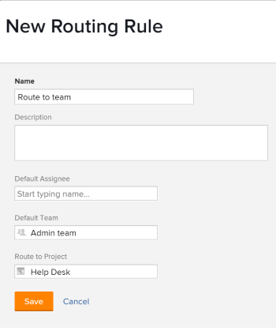

# Crear reglas de enrutamiento

Las reglas de enrutamiento controlan lo que Adobe Workfront hace con los problemas cuando se envían a una cola de solicitudes. Para obtener más información sobre la creación de colas de solicitud, consulte [Crear una cola de solicitud](../../../manage-work/requests/create-and-manage-request-queues/create-request-queue.md).

Las reglas de enrutamiento envían problemas a usuarios específicos o a funciones de trabajo que están mejor equipadas para resolver el problema o la solicitud enviados. Las reglas de enrutamiento generalmente están asociadas con temas de cola, que se utilizan para controlar qué regla de enrutamiento se aplicará al problema o la solicitud.

## Requisitos de acceso

<!--drafted - replace the table at P&P:

<table style="table-layout:auto"> 
 <col> 
 <col> 
 <tbody> 
  <tr> 
   <td role="rowheader">Adobe Workfront plan*</td> 
   <td> 
Any 
 </td> 
  </tr> 
  <tr> 
   <td role="rowheader">Adobe Workfront license*</td> 
   <td> 
Current license: Standard 
 
   Or
   
Legacy license: Plan 
 </td> 
  </tr> 
  <tr> 
   <td role="rowheader">Access level configurations*</td> 
   <td> 
Edit access to Projects
 
<b>NOTE</b>
   
   If you still don't have access, ask your Workfront administrator if they set additional restrictions in your access level. For information on how a Workfront administrator can modify your access level, see <a href="../../../administration-and-setup/add-users/configure-and-grant-access/create-modify-access-levels.md" class="MCXref xref">Create or modify custom access levels</a>.
 </td> 
  </tr> 
  <tr> 
   <td role="rowheader">Object permissions</td> 
   <td> 
 Manage permissions to the project
 
For information on requesting additional access, see <a href="../../../workfront-basics/grant-and-request-access-to-objects/request-access.md" class="MCXref xref">Request access to objects </a>.
 </td> 
  </tr> 
 </tbody> 
</table>
-->

Debe tener lo siguiente:

<table style="table-layout:auto"> 
 <col> 
 <col> 
 <tbody> 
  <tr> 
   <td role="rowheader">plan de Adobe Workfront*</td> 
   <td> 
Cualquiera 
 </td> 
  </tr> 
  <tr> 
   <td role="rowheader">Licencia de Adobe Workfront*</td> 
   <td> 
Plan 
 </td> 
  </tr> 
  <tr> 
   <td role="rowheader">Configuraciones de nivel de acceso*</td> 
   <td> 
Editar acceso a Proyectos
 
<b>NOTA</b>

Si todavía no tiene acceso, pregunte a su administrador de Workfront si establece restricciones adicionales en su nivel de acceso. Para obtener información sobre cómo un administrador de Workfront puede modificar su nivel de acceso, consulte <a href="../../../administration-and-setup/add-users/configure-and-grant-access/create-modify-access-levels.md" class="MCXref xref">Crear o modificar niveles de acceso personalizados</a>.
 </td>
</tr> 
  <tr> 
   <td role="rowheader">Permisos de objeto</td> 
   <td> 
 Administrar permisos para el proyecto
 
Para obtener información sobre la solicitud de acceso adicional, consulte <a href="../../../workfront-basics/grant-and-request-access-to-objects/request-access.md" class="MCXref xref">Solicitar acceso a objetos </a>.
 </td> 
  </tr> 
 </tbody> 
</table>

*Para saber qué plan, tipo de licencia o acceso tiene, póngase en contacto con el administrador de Workfront

## Crear una regla de enrutamiento

1. Vaya al proyecto al que desee agregar las reglas de enrutamiento para las solicitudes.
1. Haga clic en **Reglas de enrutamiento** en el panel izquierdo. Es posible que tenga que hacer clic en **Mostrar más**, luego **Reglas de enrutamiento**.
1. Haga clic en **Nuevas reglas de enrutamiento** para agregar la nueva regla.
1. Especifique la siguiente información para la regla de enrutamiento:

   <table style="table-layout:auto"> 
    <col> 
    <col> 
    <thead> 
     </thead> 
    <tbody> 
     <tr> 
      <td role="rowheader"><strong>Nombre</strong> </td> 
      <td> 
Nombre de la regla de enrutamiento. Puede ver la regla de enrutamiento si tiene acceso para ver esta información en el proyecto.
 </td> 
     </tr> 
     <tr> 
      <td role="rowheader"><strong>Descripción</strong> </td> 
      <td>Añada una descripción para la regla de enrutamiento.</td> 
     </tr> 
     <tr> 
      <td role="rowheader"><strong>Usuario asignado predeterminado*</strong> </td> 
      <td>Agregue un usuario activo o una función de trabajo activa a la que se deben asignar los nuevos problemas. Solo puede tener un usuario asignado predeterminado en este campo. </td> 
     </tr> 
     <tr> 
      <td role="rowheader"><strong>Equipo predeterminado*</strong> </td> 
      <td>Agregue un equipo activo al que se debe asignar el nuevo problema. Solo puede tener un equipo predeterminado en este campo.

   
<b>NOTA</b>

   Una vez enviado el problema, puede editar sus asignaciones y asignar otros usuarios, funciones o equipos. Para obtener más información, consulte  <a href="../../../manage-work/issues/manage-issues/assign-issues.md">Asignación de problemas </a>.

   </td> 
     </tr> 
     <tr> 
      <td role="rowheader"><strong>Ruta al proyecto</strong> </td> 
      <td>Este es el proyecto en el que se agrega el problema.</td> 
     </tr> 
    </tbody> 
   </table>

   >[!NOTE]
   >
   >*Si un usuario, función de trabajo o equipo se desactivan después de asociarse a una regla de enrutamiento, las solicitudes siguen enviándose a ellos. Debe realizar periódicamente un inventario de todas las reglas de enrutamiento y reemplazar las asignaciones desactivadas por las activas.

   Cuando se envía un problema a un proyecto, los usuarios con permisos sobre el problema reciben los permisos establecidos en ese proyecto. Para obtener información sobre la configuración de permisos en proyectos, consulte [Uso compartido de un proyecto en Adobe Workfront](../../../workfront-basics/grant-and-request-access-to-objects/share-a-project.md).

   

1. Haga clic en **Guardar**.

   Este proceso solo define la regla de enrutamiento. Para garantizar que el problema se enrute cuando se envía a la cola de solicitudes, debe seleccionar la regla de enrutamiento en la variable **Detalles de cola** ficha **Ruta predeterminada**.

   Para obtener información sobre cómo agregar una ruta predeterminada a una cola de solicitudes, consulte [Crear una cola de solicitud](../../../manage-work/requests/create-and-manage-request-queues/create-request-queue.md).

   Si desea asociar varias reglas de enrutamiento con la cola de solicitudes, debe crear varios temas de cola y asociar cada uno con una regla de enrutamiento independiente. Para obtener más información sobre la creación de un tema de cola, consulte [Crear temas de cola](../../../manage-work/requests/create-and-manage-request-queues/create-queue-topics.md).
