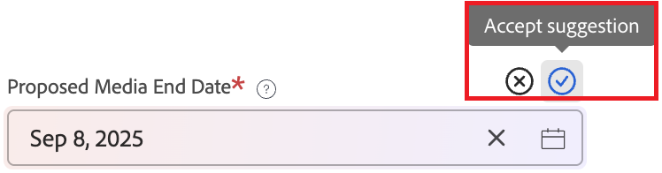

# Completar automáticamente una solicitud con datos de solicitudes anteriores

AI puede ayudarle a completar automáticamente los campos de solicitud en función de solicitudes anteriores. Puede aprobar o rechazar estas sugerencias antes de enviar la solicitud.

El completado automático no sobrescribe los campos que ya haya rellenado.

Los usuarios no reciben sugerencias de datos a los que no tienen acceso de otro modo.

## Requisitos de acceso

+++ Expanda para ver los requisitos de acceso para la funcionalidad en este artículo.

<table style="table-layout:auto"> 
 <col> 
 <col> 
 <tbody> 
  <tr> 
   <td role="rowheader">Paquete de Adobe Workfront</td> 
   <td> 
Cualquiera 
 </td> 
  </tr> 
  <tr> 
   <td role="rowheader">Licencia de Adobe Workfront</td> 
   <td> 
Colaborador o superior

   
Solicitud o superior

    </td> 
  </tr> 
  <tr> 
   <td role="rowheader">Configuraciones de nivel de acceso</td> 
   <td> 
Editar acceso a Problemas
  </td> 
  </tr> 
   <td role="rowheader">Permisos de objeto</td> 
   <td>
Acceso para añadir solicitudes a una cola de solicitudes
 
Ver permisos superiores en la solicitud existente
 
Para obtener información sobre cómo configurar una cola de solicitudes, consulte <a href="../../../manage-work/requests/create-and-manage-request-queues/create-request-queue.md" class="MCXref xref">Crear una cola de solicitudes</a>. 
 </td> 
  <tr>
  </tr>
 </tbody> 
</table>

Para obtener más información, consulte [Requisitos de acceso en la documentación de Workfront](/help/quicksilver/administration-and-setup/add-users/access-levels-and-object-permissions/access-level-requirements-in-documentation.md).

+++

## Obtener sugerencias al rellenar el formulario

El completado automático puede sugerir valores de campo mientras rellena el formulario. A medida que introduce valores en los campos de solicitud, Workfront compara esos valores con las solicitudes anteriores. Si el valor introducido se correlaciona estrechamente con otros valores de campo en contextos similares en solicitudes anteriores, Workfront sugiere esos valores.

Por ejemplo, si una clínica siempre utiliza el mismo código de facturación, Workfront sugeriría ese código de facturación en el campo apropiado cuando se introduzca el nombre de la clínica.

Para utilizar sugerencias basadas en solicitudes anteriores:

1. Comience a crear una solicitud.

   Para obtener instrucciones, consulte [Crear y enviar solicitudes](/help/quicksilver/manage-work/requests/create-requests/create-submit-requests.md).

1. Empiece a rellenar los campos.

   A medida que rellena los campos, otros campos pueden mostrar sugerencias.

1. Para cada sugerencia de campo, seleccione **Aceptar** o **Rechazar** para ese campo.

   

   O

   Seleccione **Aceptar todo** o **Rechazar todo** en la parte superior de la página para aceptar o rechazar todas las sugerencias.

   >[!NOTE]
   >
   >Las sugerencias que no se hayan revisado se aceptarán automáticamente cuando envíe la solicitud.
