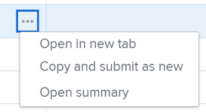

# Copiar y enviar solicitudes

<!--The highlighted information on this page refers to functionality not yet generally available. It is available only in the Preview environment. -->

Cuando envía solicitudes similares con frecuencia, puede copiar una solicitud enviada existente. En este caso, puede copiar una solicitud existente, realizar cambios mínimos en ella y volver a enviarla como una solicitud nueva.

## Requisitos de acceso

<!--drafted - replace table with P&P:

<table style="table-layout:auto"> 
 <col> 
 <col> 
 <tbody> 
  <tr> 
   <td role="rowheader">Adobe Workfront plan*</td> 
   <td> 
Any
 </td> 
  </tr> 
  <tr> 
   <td role="rowheader">Adobe Workfront license*</td> 
   <td>
Current license: Contributor or higher
 
   Or
   
Legacy license: Request or higher
 </td> 
  </tr> 
  <tr> 
   <td role="rowheader">Access level configurations*</td> 
   <td> 
Edit access to Issues
 
<b>NOTE</b> 
   
   If you still don't have access, ask your Workfront administrator if they set additional restrictions in your access level. For information on how a Workfront administrator can modify your access level, see <a href="../../../administration-and-setup/add-users/configure-and-grant-access/create-modify-access-levels.md" class="MCXref xref">Create or modify custom access levels</a>.
 </td> 
  </tr> 
  <tr> 
   <td role="rowheader">Object permissions</td> 
   <td> 
Access to add requests to a request queue
 
View or higher permissions on the existing request
 
For information on setting up a request queue, see <a href="../../../manage-work/requests/create-and-manage-request-queues/create-request-queue.md" class="MCXref xref">Create a Request Queue</a>. 
 </td> 
  </tr> 
 </tbody> 
</table>
-->
Debe tener el siguiente acceso para realizar los pasos de este artículo:

<table style="table-layout:auto"> 
 <col> 
 <col> 
 <tbody> 
  <tr> 
   <td role="rowheader">plan Adobe Workfront*</td> 
   <td> 
Cualquiera
 </td> 
  </tr> 
  <tr> 
   <td role="rowheader">Licencia de Adobe Workfront*</td> 
   <td> 
Solicitud o superior
 </td> 
  </tr> 
  <tr> 
   <td role="rowheader">Configuraciones de nivel de acceso*</td> 
   <td> 
Editar acceso a Problemas
 
<b>NOTA</b>

Si sigue sin tener acceso, pregunte al administrador de Workfront si ha establecido restricciones adicionales en su nivel de acceso. Para obtener información sobre cómo un administrador de Workfront puede modificar su nivel de acceso, consulte <a href="../../../administration-and-setup/add-users/configure-and-grant-access/create-modify-access-levels.md" class="MCXref xref">Crear o modificar niveles de acceso personalizados</a>.
 </td>
</tr> 
  <tr> 
   <td role="rowheader">Permisos de objeto</td> 
   <td> 
Acceso para agregar solicitudes a una cola de solicitudes
 
Ver permisos superiores en la solicitud existente
 
Para obtener información sobre cómo configurar una cola de solicitudes, consulte <a href="../../../manage-work/requests/create-and-manage-request-queues/create-request-queue.md" class="MCXref xref">Crear una cola de solicitudes</a>. 
 </td> 
  </tr> 
 </tbody> 
</table>

&#42;Para saber qué plan, tipo de licencia o acceso tiene, póngase en contacto con su administrador de Workfront.

## Requisitos previos

Debe tener una solicitud que usted o alguien de su organización haya enviado anteriormente para poder copiarla y volver a enviarla. Si la solicitud pertenece a otra persona, debe tener al menos acceso a Ver para poder copiarla y enviarla como nueva.

## Consideraciones sobre cómo copiar y enviar solicitudes como nuevas

* Solo puede copiar y enviar solicitudes enviadas. No puede copiar solicitudes redactadas.
* Puede copiar y enviar solicitudes que haya enviado originalmente, o solicitudes que otros hayan enviado y tenga acceso al menos a Ver.
* Siempre tiene acceso para copiar y enviar una copia de sus propias solicitudes, a menos que alguien le quite los permisos.
* El acceso para copiar y enviar solicitudes enviadas originalmente por otros usuarios se puede conceder automáticamente a personas de la misma compañía cuando el creador de la cola de solicitudes habilita la **Las personas de la misma compañía heredarán los mismos permisos en todas las solicitudes** en las áreas Detalles de cola o Editar proyecto. Deshabilitar esta configuración solo permite que el solicitante original vea sus propias solicitudes.

  Para obtener más información, consulte los siguientes artículos:

   * [Crear una cola de solicitudes](../../../manage-work/requests/create-and-manage-request-queues/create-request-queue.md)
   * [Editar proyectos](../../../manage-work/projects/manage-projects/edit-projects.md)

* Puede actualizar la copia de la solicitud original antes de volver a enviarla como una solicitud nueva.
* Si se producen los siguientes cambios después de enviar la solicitud original, ya no podrá copiarla y volver a enviarla:

   * Se eliminó la cola de solicitudes.
   * Se eliminó el tema de la cola.

     >[!TIP]
     >
     >Si el tema de la cola era el único en la cola de solicitudes, aún puede copiar y enviar la solicitud y se guardará en la propia cola.

   * La cola de solicitudes ya no se publica como cola de solicitudes de ayuda. Para obtener más información, consulte [Crear una cola de solicitudes](../../../manage-work/requests/create-and-manage-request-queues/create-request-queue.md).
   * Si la cola de solicitudes no tiene ningún tema en cola y la solicitud original se envió antes de enero de 2022.

   * El estado del proyecto asociado a la cola de solicitudes ya no es Actual.

* Puede copiar y enviar una copia de una solicitud convertida si esta se ha conservado en el proceso de conversión. Para obtener más información, consulte [Información general sobre la conversión de problemas en Adobe Workfront](../../../manage-work/issues/convert-issues/convert-issues.md).

  >[!TIP]
  >
  >La solicitud copiada no está vinculada a un objeto de resolución.

## Copiar y enviar solicitudes

1. Haga clic en **Menú principal** icono  en la esquina superior derecha de Adobe Workfront, haga clic en **Solicitudes**.
1. (Condicional) Si la sección Enviada no se muestra de forma predeterminada, haga clic en **Enviado** en el panel izquierdo.
1. Busque la solicitud que desea copiar y enviar como nueva y realice una de las siguientes acciones:

   * Selecciónelo y haga clic en el botón **Copiar y enviar como nuevo** icono  en la esquina superior izquierda de la lista Solicitudes enviadas. <!--update this icon the 23.3 preview release, or shortly after: replace this step with this: Select it, then click the **Copy** icon  in the upper-left corner of the Submitted requests list.-->

   <!-- reveal this tip for 23.3 preview release:
   >[!TIP]
   >
   > If you did not select a request first, the Copy icon is dimmed. 
   -->

   * Haga clic en **Más** menú  a la derecha del nombre de la solicitud y haga clic en **Copiar y enviar como nuevo** <!--ensure this does not change with the Copy icon improvements with 23.3 preview-->

     O

     Haga clic con el botón derecho en la solicitud seleccionada y luego haga clic en **Copiar y enviar como nuevo**.

     

     >[!TIP]
     >
     >Cuando no tiene acceso para crear problemas, recibe la advertencia de que el administrador le ha restringido la creación de solicitudes.

1. (Opcional) Actualice la siguiente información, si es necesario:

   * **Tipo de solicitud**: la cola de solicitudes en la que se guarda la solicitud copiada. De forma predeterminada, la solicitud copiada se guarda en la cola de solicitudes de la solicitud original.
   * **Grupos de temas** y **Temas de cola**, si están seleccionadas. Los nombres o los grupos de temas y los temas de colas se personalizan según el entorno. De forma predeterminada, la solicitud copiada se guarda en los grupos de temas y en los temas de cola de la solicitud original.

     >[!TIP]
     >
     >Si la ruta cambia de la ruta de la solicitud original, el creador de la cola de solicitudes modifica la cola.

1. (Opcional) Actualice la información de la solicitud copiada. Según los campos que habilite el creador de la cola de solicitudes en la **Campos de nuevos problemas** de la sección **Detalles de cola** en el proyecto, puede encontrar cualquiera de los siguientes campos:

   <table style="table-layout:auto"> 
    <col> 
    <col> 
    <tbody> 
     <tr> 
      <td role="rowheader"><strong>Asunto</strong> </td> 
      <td>Muestra el nombre de la solicitud original. Actualícelo si es necesario. De lo contrario, Workfront asigna un nombre a la solicitud copiada <b>Copia de &lt;name of="" original="" request=""&gt;</b>. Este es un campo obligatorio.</td> 
     </tr> 
     <tr> 
      <td role="rowheader"><strong>Descripción</strong> </td> 
      <td>Muestra la descripción de la solicitud original. Actualícelo si es necesario.</td> 
     </tr> 
     <tr> 
      <td role="rowheader"><strong>URL</strong> </td> 
      <td> 
Muestra la dirección URL de la solicitud original. Actualícelo si es necesario.
 </td> 
     </tr> 
     <tr> 
      <td role="rowheader"><strong>Prioridad</strong> </td> 
      <td> 
Especifique la prioridad de la solicitud. La prioridad debe definir la rapidez con la que cree que se debe resolver esta solicitud. Las opciones predeterminadas son:
 
       <ul> 
        <li>Ninguno</li> 
        <li>Bajo</li> 
        <li>Normal</li> 
        <li>Alto</li> 
        <li>Urgente</li> 
       </ul> 
El administrador de Workfront puede modificar los nombres de las prioridades.
 </td> 
     </tr> 
     <tr> 
      <td role="rowheader"><strong>Gravedad</strong> </td> 
      <td> 
Especifique la gravedad de la solicitud. La gravedad debe definir el impacto de esta solicitud en su trabajo en caso de que no se resuelva a tiempo. Las opciones predeterminadas son:
 
       <ul> 
        <li>Cosmético</li> 
        <li>Causa confusión</li> 
        <li>Error con solución</li> 
        <li>Error sin solución</li> 
        <li>Error fatal</li> 
       </ul> 
El administrador de Workfront puede modificar los nombres de las gravedades.
 </td> 
     </tr> 
     <tr> 
      <td role="rowheader"><strong>Contacto primario</strong> </td> 
      <td>El contacto principal de una solicitud es usted, ya que usted es la persona indicada para abordar cualquier pregunta relacionada con la solicitud. Sin embargo, puede cambiarlo por cualquier otro usuario de Workfront.</td> 
     </tr> 
     <tr data-mc-conditions=""> 
      <td role="rowheader"><strong>Asignaciones</strong> </td> 
      <td> 
Indique el nombre de un usuario, rol o equipo activo al que se debe asignar la solicitud. 
 
 Puede especificar más de un usuario, rol o equipo. 
 
Según la configuración de la cola de solicitudes, es posible que solo pueda asignar la solicitud a uno o dos tipos de recursos, en lugar de a los tres. 
 
Se recomienda utilizar reglas de enrutamiento para las colas de solicitudes, de modo que se puedan enrutar automáticamente a los recursos adecuados. 
 </td> 
     </tr> 
     <tr> 
      <td role="rowheader" colspan="2"> 

Según la configuración de la cola de solicitudes, es posible que solo pueda asignar un tipo de recurso a la solicitud (por ejemplo, usuarios). Si una regla de enrutamiento también está asociada a la cola de solicitudes y enruta automáticamente la solicitud a un tipo diferente de recurso (por ejemplo, un equipo), la solicitud se asigna tanto a la entidad que especifique manualmente al enviar la solicitud (usuarios) como al recurso especificado en la regla de enrutamiento (el equipo).
 
Para obtener más información, consulte los siguientes artículos:
 
        <ul> 
         <li> 
<a href="../../../manage-work/requests/create-and-manage-request-queues/create-request-queue.md" class="MCXref xref">Crear una cola de solicitudes</a> 
 </li> 
         <li> 
<a href="../../../manage-work/requests/create-and-manage-request-queues/create-routing-rules.md" class="MCXref xref">Crear reglas de enrutamiento</a>   
 </li> 
        </ul> 
 </td> 
     </tr> 
     <tr> 
      <td role="rowheader"><strong>Horas planificadas</strong> </td> 
      <td> 
Calcule cuántas horas tardaría esta solicitud en completarse.
 </td> 
     </tr> 
     <tr> 
      <td role="rowheader"><strong>Fecha planificada de inicio</strong> </td> 
      <td> 
La fecha en la que debería comenzar el trabajo en esta solicitud.
 </td> 
     </tr> 
     <tr> 
      <td role="rowheader"><strong>Fecha planificada de finalización</strong> </td> 
      <td>La fecha en la que desea que se resuelva esta solicitud.</td> 
     </tr> 
     <tr> 
      <td role="rowheader"><strong>Estado</strong> </td> 
      <td>El estado predeterminado de una nueva solicitud es "Nuevo". Es posible que el administrador de Workfront haya cambiado el nombre de este estado. También puede cambiar el estado a otro en este menú desplegable.</td> 
     </tr> 
     <tr> 
      <td role="rowheader"><strong>Documentos</strong> </td> 
      <td> 
Agregue documentos a su solicitud. Los documentos adjuntos a la solicitud original no se transfieren a la solicitud copiada.
 
<b>SUGERENCIA</b>

   Según la configuración de la cola de solicitudes, la sección Documentos podría mostrarse antes o después de los campos personalizados.
 
 
 </td>
   </tr> 
    </tbody> 
   </table>

1. (Opcional) Actualice la información de los formularios personalizados adjuntos si es necesario.

   >[!TIP]
   >
   >* Todos los formularios personalizados adjuntos a la solicitud original y los valores incluidos en los campos personalizados se transfieren a la solicitud copiada. Esto incluye campos que contienen lógica.
   >* No se pueden eliminar los formularios personalizados de la solicitud copiada.

1. Clic **Enviar**.

   La solicitud copiada se envía como una nueva solicitud en la cola de solicitudes especificada.
