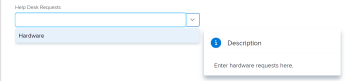
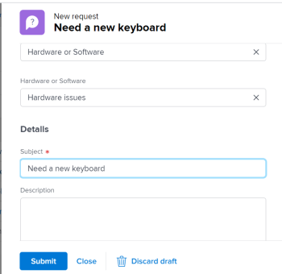

# Creación y envío de solicitudes de Adobe Workfront

<!--Audited: 12/2023-->

<!--

(NOTE: Linked to the UI - do not change/ remove; THIS IS NOW SPLIT IN THREE ARTICLES>> MAKE SURE THE TRANSITION TO THE OTHER TWO IS CLEAR SINCE THIS IS LINKED TO UI)

(NOTE: If they come out with templates AND drafts, consider splitting this article to keep Create in one and Working with Drafts and Requests in another??)

(NOTE: this article is linked from Submitting Workfront Requests from Salesforce) 

-->

El trabajo planificado se representa en Adobe Workfront mediante proyectos y tareas. Sin embargo, podría trabajar en un entorno en el que el trabajo no planificado, en forma de solicitudes, pueda realizarse en cualquier momento. Workfront proporciona un flujo de trabajo para dar cabida a este tipo de entorno mediante el uso de colas de solicitudes.

Después de crear una solicitud en una Cola de solicitudes, puede asignarla para que se complete o puede convertirla en una tarea o un proyecto.\
Para obtener más información sobre cómo convertir problemas en una tarea o un proyecto, consulte el artículo [Información general sobre la conversión de problemas en Adobe Workfront](../../../manage-work/issues/convert-issues/convert-issues.md).

Puede crear una solicitud de las siguientes maneras:

* Desde cero como se describe en este artículo.
* De borradores. Para obtener más información, consulte [Crear solicitudes a partir de borradores](../../../manage-work/requests/create-requests/create-requests-from-drafts.md).
* Desde una solicitud existente, copiando y enviando una copia. Para obtener más información, consulte [Copiar y enviar solicitudes](../../../manage-work/requests/create-requests/copy-and-submit-requests.md).

## Requisitos de acceso

+++ Expanda para ver los requisitos de acceso para la funcionalidad en este artículo.

Debe tener el siguiente acceso para realizar los pasos de este artículo:

<table style="table-layout:auto"> 
 <col> 
 <col> 
 <tbody> 
  <tr> 
   <td role="rowheader">plan Adobe Workfront*</td> 
   <td> 
Cualquiera 
 </td> 
  </tr> 
  <tr> 
   <td role="rowheader">Licencia de Adobe Workfront*</td> 
   <td> 
Nuevo: Colaborador o superior

   O
   
Actual: Solicitud o superior

    </td> 
  </tr> 
  <tr> 
   <td role="rowheader">Configuraciones de nivel de acceso*</td> 
   <td> 
Editar acceso a Problemas
  </td> 
  </tr> 
 </tbody> 
</table>

Para obtener más información sobre esta tabla, consulte [Requisitos de acceso en la documentación de Workfront](/help/quicksilver/administration-and-setup/add-users/access-levels-and-object-permissions/access-level-requirements-in-documentation.md).

+++

## Requisitos previos para utilizar colas de solicitudes

Un administrador de Workfront debe crear colas de solicitudes y ponerlas a disposición de los usuarios para que puedan utilizar esta funcionalidad. Un usuario con una licencia de Planificador y con acceso de Edición a Proyectos y Administración de permisos para un proyecto específico también puede crear Colas de solicitudes.

Para obtener información sobre cómo crear colas de solicitudes, consulte el artículo [Crear una cola de solicitudes](../../../manage-work/requests/create-and-manage-request-queues/create-request-queue.md).

Un administrador de Workfront debe crear los siguientes componentes de una cola de solicitudes:

* Proyecto en estado Actual, publicado como Cola de solicitudes de ayuda.
* Temas de colas.\
  Para obtener más información, consulte el artículo [Crear temas de cola](../../../manage-work/requests/create-and-manage-request-queues/create-queue-topics.md).

* Reglas de enrutamiento.\
  Para obtener más información, consulte el artículo [Crear reglas de enrutamiento](../../../manage-work/requests/create-and-manage-request-queues/create-routing-rules.md).

* (Opcional) Grupos de temas.\
  Para obtener más información, consulte el artículo [Crear grupos de temas](../../../manage-work/requests/create-and-manage-request-queues/create-topic-groups.md).

* (Opcional) Solicite un formulario personalizado.\
  Para obtener más información, consulte el artículo [Crear o editar un formulario personalizado](../../../administration-and-setup/customize-workfront/create-manage-custom-forms/create-or-edit-a-custom-form.md).

* (Opcional) Solicite el proceso de aprobación.\
  Para obtener más información, consulte el artículo [Crear un proceso de aprobación para elementos de trabajo](../../../administration-and-setup/customize-workfront/configure-approval-milestone-processes/create-approval-processes.md).

## Crear solicitudes y generar borradores en la aplicación web de Workfront

Al crear una solicitud en la aplicación web de Workfront, Workfront la guarda como borrador antes de enviarla. Workfront crea un borrador en cuanto se selecciona la cola de solicitudes y se empieza a introducir información para ella.

Puede seguir enviando la solicitud o puede completar toda la información que tenga disponible y salir de ella para terminarla más tarde. Workfront guarda el borrador de la solicitud que ha iniciado en la carpeta Borradores.

>[!IMPORTANT]
>
>Tenga en cuenta lo siguiente al trabajar con borradores:
>
>* Workfront no crea solicitudes de borrador cuando las envía desde una aplicación de terceros, como enviarlas por correo electrónico a Workfront o crearlas con cualquier otra aplicación. Cuando envía una solicitud desde fuera de la aplicación web de Workfront, esta se guarda en la sección Enviada.
>* Si la estructura de una cola de solicitudes cambia, ya no podrá acceder a los borradores existentes. Por ejemplo, si se quita un tema de la cola o se agrega un grupo de temas, los borradores guardados ya no estarán accesibles.
>

Para obtener información sobre la creación de solicitudes a partir de borradores existentes, consulte [Crear solicitudes a partir de borradores](../../../manage-work/requests/create-requests/create-requests-from-drafts.md). Para obtener información sobre la eliminación de borradores de solicitudes, consulte también [Eliminar un borrador de solicitud](../../../manage-work/requests/create-requests/delete-request-draft.md).

Para crear una solicitud en la aplicación web de Workfront:

1. Haga clic en **[!UICONTROL Menú principal]** icono  en la esquina superior derecha de Adobe Workfront o (si está disponible), haga clic en el botón **[!UICONTROL Menú principal]** icono  en la esquina superior izquierda.

   <!--
   <MadCap:conditionalText data-mc-conditions="QuicksilverOrClassic.Draft mode">
   </MadCap:conditionalText>
   -->

1. Clic  **Solicitudes**, luego haga clic en **Nueva solicitud** en la esquina superior derecha de la página.

   >[!TIP]
   >
   >* Puede acceder a la opción Nueva solicitud desde cualquier sección del área de Solicitudes.
   >* La opción Nueva solicitud aparece atenuada cuando no tiene acceso para crear problemas.

1. (Condicional) Haga clic dentro de **Tipo de solicitud** y realice una de las siguientes acciones:

   * Desde el **Rutas recientes** , seleccione una ruta utilizada recientemente para abrir una cola de solicitudes. Una ruta de acceso incluye la cola de solicitudes, los grupos de temas y el tema de la cola que ha enviado recientemente. Las tres últimas rutas se muestran de forma predeterminada.

     >[!NOTE]
     >
     >Workfront guarda una ruta solo cuando realmente se ha enviado una solicitud. No crea rutas para las solicitudes redactadas.

     

   * Desde el **Colas de solicitudes** , seleccione una cola de solicitudes.
   * Escriba una palabra clave que pertenezca a una ruta a la que se haya accedido anteriormente para buscar una cola de solicitudes.

     Por ejemplo, si tiene una cola de solicitudes llamada &quot;Servicio de asistencia&quot; con un grupo de temas llamado &quot;Ubicación&quot; y un tema de colas llamado &quot;Remoto&quot;, puede escribir &quot;remoto&quot; y se mostrarán todas las colas de solicitudes que contienen &quot;remoto&quot; en cualquier elemento de su ruta.

     >[!TIP]
     >
     >Cuando se escribe un nombre que contiene un carácter especial, la cola de solicitudes, el tema de cola o el grupo de temas se muestran incluso cuando se omite escribir el carácter.

     

     La lista de colas de solicitud disponibles y las rutas recientes se actualiza dinámicamente para incluir solo las rutas que contienen la palabra clave que está resaltada en los resultados.

     Los resultados de la búsqueda se muestran en las siguientes áreas:

     <table style="table-layout:auto"> 
      <col> 
      <col> 
      <tbody> 
       <tr> 
        <td role="rowheader">Colas de solicitudes</td> 
        <td>Solicitar colas que contengan la palabra clave en su nombre</td> 
       </tr> 
       <tr> 
        <td role="rowheader">Solicitar rutas</td> 
        <td> 
Rutas (que incluyen colas de solicitudes, grupos de temas y temas de colas) que contienen la palabra clave en cualquiera de los nombres de sus elementos
 </td> 
       </tr> 
      </tbody> 
     </table>

   >[!TIP]
   >
   >* Las 200 primeras colas de solicitudes se muestran de forma predeterminada en orden alfabético.
   >* El nombre de la cola de solicitudes es el nombre del proyecto que se ha publicado como cola de solicitudes de ayuda.
   >* La descripción del proyecto configurado como cola de solicitudes seleccionada se muestra a la derecha del nombre de la cola de solicitudes.
   >   
   >Para obtener más información sobre cómo publicar un proyecto como cola de solicitudes de ayuda, vea el artículo [Crear una cola de solicitudes](../../../manage-work/requests/create-and-manage-request-queues/create-request-queue.md).

1. En el **Nueva solicitud** en el formulario, realice una de las siguientes acciones:

   * (Condicional) Seleccione un borrador disponible en el mensaje de notificación que se muestra en el campo Tipo de solicitud.

     Esta área solo se muestra si ha guardado borradores antes sin enviarlos.

     Los tres borradores más recientes de tres temas de cola diferentes se muestran de forma predeterminada.

     

   * Comience a introducir una nueva solicitud en la cola seleccionada.

     Un nuevo borrador se guarda automáticamente en la sección Borradores después de que empiece a introducir información para la nueva solicitud y asigne un nombre a la solicitud en el campo Asunto.

1. (Opcional) Si la cola de solicitudes incluye grupos de temas, seleccione el nombre del grupo de temas en el primer campo desplegable. De lo contrario, seleccione un Tema de la cola.

   >[!TIP]
   >
   >Cuando pasa el ratón sobre un grupo de temas o un tema de la cola, el campo Descripción aparece a la derecha. Contiene información adicional sobre el grupo de temas o tema de cola.
   >
   >
   >   >
   >

   Puede tener hasta 10 niveles de grupos de temas integrados en la cola de solicitudes.\
   Para obtener más información sobre cómo crear grupos de temas, consulte el artículo [Crear grupos de temas](../../../manage-work/requests/create-and-manage-request-queues/create-topic-groups.md). Para obtener más información sobre la creación de temas de colas, vea el artículo [Crear temas de cola](../../../manage-work/requests/create-and-manage-request-queues/create-queue-topics.md).

   >[!TIP]
   >
   >Si seleccionó un borrador o una ruta de acceso anterior, los grupos de temas y los temas de colas ya están seleccionados. Puede seleccionar otro diferente, si es necesario.

1. Según los campos que haya activado el administrador de Workfront en la **Campos de nuevos problemas** de la sección **Detalles de cola** subpestaña del proyecto, puede encontrar cualquiera de los siguientes campos al enviar una nueva solicitud:

   <table style="table-layout:auto"> 
    <col> 
    <col> 
    <tbody> 
     <tr> 
      <td role="rowheader"><strong>Asunto</strong> </td> 
      <td>Especifique un nombre para la solicitud. Este es un campo obligatorio.</td> 
     </tr> 
     <tr> 
      <td role="rowheader"><strong>Descripción</strong> </td> 
      <td>Especifique una descripción para la solicitud.</td> 
     </tr> 
     <tr> 
      <td role="rowheader"><strong>URL</strong> </td> 
      <td> 
Especifique una dirección URL que pueda estar relacionada con la solicitud.
 </td> 
     </tr> 
     <tr> 
      <td role="rowheader"><strong>Prioridad</strong> </td> 
      <td> 
Especifique una prioridad para la solicitud. La prioridad debe definir la rapidez con la que cree que se debe resolver esta solicitud. Las opciones predeterminadas son: 
 
       <ul> 
        <li>Ninguno</li> 
        <li>Bajo </li> 
        <li>Normal</li> 
        <li>Alto</li> 
        <li>Urgente</li> 
       </ul> 
El administrador del sistema puede modificar los nombres de las prioridades.
 </td> 
     </tr> 
     <tr> 
      <td role="rowheader"><strong>Gravedad</strong> </td> 
      <td> 
Especifique una gravedad para la solicitud. La gravedad debe definir el impacto de esta solicitud en su trabajo en caso de que no se resuelva a tiempo. Las opciones predeterminadas son:
 
       <ul> 
        <li>Cosmético</li> 
        <li>Causa confusión</li> 
        <li>Error con solución</li> 
        <li>Error sin solución</li> 
        <li>Error fatal</li> 
       </ul> 
El administrador del sistema puede modificar los nombres de las gravedades.
 </td> 
     </tr> 
     <tr> 
      <td role="rowheader"><strong>Contacto principal</strong> </td> 
      <td>El contacto principal de una solicitud es usted, ya que usted es la persona indicada para abordar cualquier pregunta relacionada con la solicitud. Sin embargo, puede cambiarlo por cualquier otro usuario de Workfront.</td> 
     </tr> 
     <tr data-mc-conditions="QuicksilverOrClassic.Quicksilver"> 
      <td role="rowheader"><strong>Asignaciones</strong> </td> 
      <td> 
Especifique el nombre de un usuario activo, rol o equipo al que se debe asignar la solicitud. 
 
Solo se puede especificar un equipo.

   
 Según la configuración de la cola de solicitudes, es posible que solo pueda asignar uno o dos tipos de recursos a la solicitud, en lugar de los tres (por ejemplo, puede que solo pueda asignar la solicitud a los usuarios).

   
Si una regla de enrutamiento también está asociada a la cola de solicitudes y enruta automáticamente la solicitud a un tipo diferente de recurso (por ejemplo, un equipo), la solicitud se asigna tanto a la entidad que especifique manualmente al enviar la solicitud (usuarios) como al recurso especificado en la regla de enrutamiento (el equipo). 

   
 Para obtener más información, consulte los siguientes artículos:
 
      <ul> 
      <li> 
<a href="../../../manage-work/requests/create-and-manage-request-queues/create-request-queue.md" class="MCXref xref">Crear una cola de solicitudes</a> 
 </li> 
      <li> 
<a href="../../../manage-work/requests/create-and-manage-request-queues/create-routing-rules.md" class="MCXref xref">Crear reglas de enrutamiento</a>   
 </li> 
      </ul> 

   
Se recomienda utilizar reglas de enrutamiento para las colas de solicitudes, de modo que se puedan enrutar automáticamente a los recursos adecuados. 
 </td> 
     </tr>

   <tr> 
      <td role="rowheader"><strong>Horas planificadas</strong> </td> 
      <td> 
Calcule cuántas horas tardaría esta solicitud en completarse.
 </td> 
     </tr> 
     <tr> 
      <td role="rowheader"><strong>Fecha planificada de inicio</strong> </td> 
      <td> 
Especifique la fecha en la que debe comenzar el trabajo en esta solicitud.
 </td> 
     </tr> 
     <tr> 
      <td role="rowheader"><strong>Fecha planificada de finalización</strong> </td> 
      <td>Especifique la fecha en la que desea que se resuelva esta solicitud.</td> 
     </tr> 
     <tr> 
      <td role="rowheader"><strong>Estado</strong> </td> 
      <td>El estado predeterminado de una nueva solicitud es "Nuevo". Es posible que el administrador del sistema haya cambiado el nombre de este estado. También puede cambiar el estado a otro en este menú desplegable.</td> 
     </tr> 
     <tr> 
      <td role="rowheader"><strong>Documentos</strong> </td> 
      <td> 
Agregue documentos a su solicitud. 
 
 Según la configuración de la cola de solicitudes, la sección Documentos podría mostrarse antes o después de los campos personalizados. 
 
Los documentos que se cargan en Workfront se almacenan durante 24 horas en un borrador de solicitud. Después, debe volver a adjuntarlos cuando vuelva a editar y enviar el borrador. Los documentos vinculados desde otras unidades se guardan en el borrador de forma permanente. 
 </td> 
     </tr> 
    </tbody> 
   </table>

1. (Opcional) Si el administrador de Workfront ha asociado un formulario personalizado a la cola de solicitudes o al tema de la cola, especifique los campos dentro del formulario personalizado.\
   Los formularios personalizados son diferentes para cada instancia de Workfront.
1. (Opcional y condicional) En cualquier momento mientras introduce la solicitud, haga clic en [!UICONTROL **Descartar borrador**] si desea eliminar el borrador que se crea automáticamente. Esto elimina el borrador que no se puede recuperar. Se mostrará un mensaje de confirmación para confirmar que está eliminando el borrador.

1. (Opcional) Haga clic en [!UICONTROL **Deshacer**] en el mensaje de confirmación si desea revertir la acción y conservar el borrador.

1. Realice una de las siguientes acciones:

   * Clic **Enviar** si está listo para enviar la solicitud. La solicitud se guarda en la sección Enviada En función de la regla de enrutamiento de la cola de solicitudes, esta solicitud puede redirigirse a un proyecto diferente al designado como cola de solicitudes. Para obtener información sobre las reglas de enrutamiento, consulte [Crear reglas de enrutamiento](../../../manage-work/requests/create-and-manage-request-queues/create-routing-rules.md).

     O

     Clic **Cerrar** si no está listo para enviarlo y es posible que vuelva y lo termine más tarde. La solicitud se guardará en la sección Borradores y estará disponible la próxima vez que envíe una solicitud para esta cola de solicitudes.

     

   Al enviar la solicitud, el borrador se eliminará automáticamente y no se podrá restaurar.

   Para obtener información sobre cómo abordar las solicitudes entrantes, consulte el artículo [Administrar solicitudes de trabajo y equipo](../../../people-teams-and-groups/work-with-team-requests/manage-work-and-team-requests.md).

   Para obtener información sobre cómo localizar solicitudes enviadas o redactadas, consulte también [Localizar solicitudes enviadas](../../../manage-work/requests/create-requests/locate-submitted-requests.md).

## Crear solicitudes desde fuera de Workfront

Puede compartir un vínculo directo a una cola de solicitudes cuando envíe una nueva solicitud e incrustarla en otras aplicaciones. Los usuarios que acceden a este vínculo desde la web o desde otras aplicaciones también deben iniciar sesión con una cuenta activa de Workfront para poder acceder a esta cola y enviar solicitudes a la misma. Para obtener más información, consulte [Compartir un vínculo a una cola de solicitudes](../../../manage-work/requests/create-requests/share-link-to-request-queue.md).

## Creación de solicitudes por correo electrónico en Workfront

Si la cola de solicitudes está habilitada para recibir solicitudes por correo electrónico, puede enviar las solicitudes por correo electrónico directamente a la dirección de correo electrónico asociada a la cola.

El texto del cuerpo del correo electrónico se agrega como descripción de la solicitud.

>[!NOTE]
>
>El formato de HTML se elimina cuando la solicitud entra en Workfront, pero las firmas y el contenido del subproceso Responder a existente no se eliminan y aparecen en la descripción de la solicitud.

Para obtener información sobre cómo habilitar una cola de solicitudes para recibir solicitudes por correo electrónico, consulte [Permitir que los usuarios envíen por correo electrónico un problema a un proyecto de cola de solicitudes](../../../manage-work/requests/create-requests/enable-email-issues-into-projects.md).

## Crear solicitudes con el cliente de Outlook

Puede enviar solicitudes utilizando el cliente de Outlook. Puede crear una nueva solicitud o convertir un correo electrónico en una solicitud.

Para obtener información acerca del envío de solicitudes mediante el cliente de Outlook, vea el artículo [Crear una solicitud de Adobe Workfront desde un correo electrónico de Outlook](../../../workfront-integrations-and-apps/using-workfront-with-outlook/create-a-wf-request-from-an-outlook-email.md).

## Creación de solicitudes mediante la aplicación móvil de Workfront

Puede enviar solicitudes mediante la aplicación móvil en su smartphone. Puede crear una nueva solicitud y enviarla a las colas de solicitudes a las que tiene acceso para ver en la aplicación web.

Para obtener información sobre el envío de solicitudes a través de la aplicación móvil, consulte la sección Solicitudes en los artículos:

* [Adobe Workfront para Android](../../../workfront-basics/mobile-apps/using-the-workfront-mobile-app/workfront-for-android.md#requests)
* [Adobe Workfront para iOS](../../../workfront-basics/mobile-apps/using-the-workfront-mobile-app/workfront-for-ios.md#requests)

## Creación de solicitudes desde otras aplicaciones

Puede enviar solicitudes utilizando cualquier aplicación que se haya integrado con Workfront:

* Puede crear una integración personalizada entre Workfront y otra aplicación que le permita enviar solicitudes a Workfront desde la otra aplicación.\
  Para obtener más información sobre las integraciones de Workfront personalizadas, consulte el artículo [Integraciones de Adobe Workfront](../../../administration-and-setup/configure-integrations/workfront-integrations-1.md).

* Puede enviar solicitudes desde Salesforce si ha instalado la aplicación de Workfront para Salesforce.\
  Para obtener información sobre el envío de solicitudes desde Salesforce mediante nuestra aplicación de Workfront para Salesforce, consulte el artículo [Envío de solicitudes de Adobe Workfront desde objetos de Salesforce](../../../workfront-integrations-and-apps/using-workfront-with-salesforce/submit-workfront-requests-from-salesforce-objects.md).

## Localizar solicitudes enviadas

Para obtener información sobre cómo localizar solicitudes enviadas o redactadas, consulte [Localizar solicitudes enviadas](../../../manage-work/requests/create-requests/locate-submitted-requests.md).
