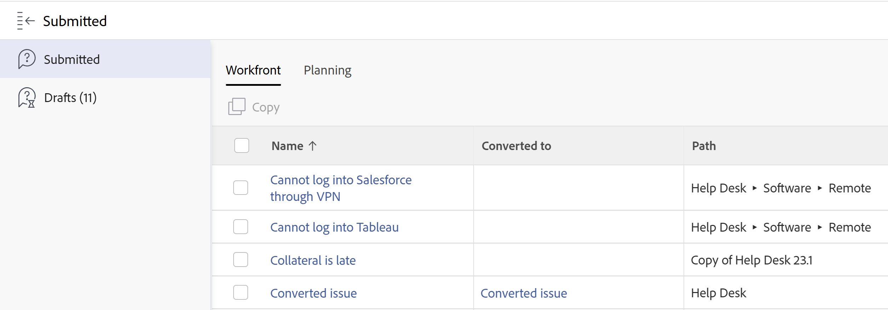

# Localizar solicitudes enviadas

<!--The highlighted information on this page refers to functionality not yet generally available. It is available only in the Preview environment.-->

Puede localizar los siguientes tipos de solicitudes que ha enviado u otra persona ha enviado, o solicitudes que ha iniciado pero que nunca ha terminado de enviar. Puede localizar estas solicitudes en las siguientes áreas de Adobe Workfront:

* La pestaña **Workfront** del área de Solicitudes en Workfront: Busque las solicitudes enviadas a las colas de solicitudes de Workfront en las siguientes secciones:
   * **Sección Enviado**: todas las solicitudes que ha enviado u otra persona ha enviado, a las que, como mínimo, tenga acceso de visualización.
   * **Sección Borrador**: todas las solicitudes que ha iniciado, pero que nunca ha terminado ni enviado. Para obtener más información sobre las solicitudes de borrador, consulte [Crear y enviar solicitudes de Adobe Workfront](../../../manage-work/requests/create-requests/create-submit-requests.md).

  >[!TIP]
  >
  >Solo puede ver sus propias solicitudes de borrador.

* La pestaña **Planning** del área de solicitudes en Workfront: busque las solicitudes enviadas a los formularios de solicitud de Workfront Planning. Su organización debe adquirir un paquete de Workfront Planning. Para obtener más información, consulte los siguientes artículos:

   * [Creación y administración de un formulario de solicitud en Adobe Workfront Planning](/help/quicksilver/planning/requests/create-request-form.md)
   * [Envío de solicitudes de Adobe Workfront Planning para crear registros](/help/quicksilver/planning/requests/submit-requests.md)

## Requisitos de acceso

+++ Expanda para ver los requisitos de acceso para la funcionalidad en este artículo.

Debe tener el siguiente acceso para realizar los pasos de este artículo:

<table style="table-layout:auto"> 
 <col> 
 <col> 
 <tbody> 
  <tr> 
   <td role="rowheader">Plan de Adobe Workfront</td> 
   <td> 
Cualquiera 
 </td> 
  </tr> 
  <tr> 
   <td role="rowheader">Licencia de Adobe Workfront</td> 
   <td> 
Nuevo: colaborador o superior

   O
   
Actual: solicitud o superior

    </td> 
  </tr> 
  <tr> 
   <td role="rowheader">Configuraciones de nivel de acceso</td> 
   <td>
Editar acceso a Problemas
</td> 
  </tr>
  <tr>
   <td role="rowheader">Permisos de objeto</td> 
   <td>
Ver permisos o superiores en las solicitudes
</td> 
  </tr> 
 </tbody> 
</table>

Para obtener más información sobre el contenido de esta tabla, consulte [Requisitos de acceso en la documentación de Workfront](/help/quicksilver/administration-and-setup/add-users/access-levels-and-object-permissions/access-level-requirements-in-documentation.md).

+++

## Localizar solicitudes enviadas

Para localizar solicitudes que ha enviado u otros usuarios han enviado:

{{step1-to-requests}}

1. (Condicional) Si su organización compró un paquete de Workfront Planning, haga clic en la pestaña **Workfront** para ver las solicitudes de Workfront.
1. Haga clic en **Enviado** en el panel izquierdo para ver todas las solicitudes enviadas.

   Puede ver hasta 2000 solicitudes, que pueden mostrarse en varias páginas.

   >[!TIP]
   >
   >No puede personalizar las columnas en la lista de solicitudes enviadas.

   

1. Las siguientes columnas se muestran de forma predeterminada:

   <table style="table-layout:auto"> 
      <col> 
      <col> 
      <tbody> 
      <tr> 
         <td role="rowheader">Nombre</td> 
         <td> 
Nombre de la solicitud.
 
Seleccione el nombre de una solicitud para abrirla. 
 
<b>Sugerencia</b>

   Si el problema no se ha conservado al convertirse en una tarea o en un proyecto, el nombre del problema aparece atenuado y ya no se puede hacer clic en él. Para obtener información sobre la conversión de problemas, consulte <a href="../../../manage-work/issues/convert-issues/convert-issues.md" class="MCXref xref">Información general sobre la conversión de problemas en Adobe Workfront</a>. 
 </td>
   </tr> 
      <tr> 
         <td role="rowheader">Se ha convertido a</td> 
         <td> 
Nombre del objeto de resolución, que puede ser una tarea o un proyecto al que se haya convertido la solicitud. 
 
Haga clic en el nombre de la tarea o proyecto para abrirlos. 
 
Si la solicitud no se ha convertido, este campo está vacío. 
 </td> 
      </tr> 
      <tr> 
         <td role="rowheader">Ruta</td> 
         <td>Nombre de la cola de solicitudes, grupos de temas y temas de colas en los que se haya enviado originalmente la solicitud. </td> 
      </tr> 
      <tr> 
         <td role="rowheader">Estado</td> 
         <td>Estado actual de la solicitud o del objeto de resolución (tarea o proyecto)</td> 
      </tr> 
      <tr> 
         <td role="rowheader">Fecha de entrada</td> 
         <td>Fecha en la que se envió la solicitud o fecha en la que se creó el objeto de resolución si la solicitud se eliminó al convertirse. </td> 
      </tr> 
      <tr> 
         <td role="rowheader">Fecha de última actualización</td> 
         <td> 
Fecha en la que se actualizó la solicitud por última vez.
 
La lista de solicitudes enviadas se ordena por este campo de forma predeterminada. 
 </td> 
      </tr> 
      </tbody> 
      </table>

1. (Opcional) Haga clic en el encabezado de una columna para ordenar los datos por ella.

   >[!TIP]
   >
   >Cuando se aleja de la lista de solicitudes enviadas, se conserva la opción de ordenación seleccionada.

1. (Opcional) Seleccione una solicitud en la lista y, a continuación, haga clic en el icono **Abrir resumen**  para abrir el panel Resumen y mostrar información adicional sobre la solicitud, añadir comentarios, documentos o asignarla. Para obtener información sobre el panel Resumen, consulte [Información general del resumen](../../../workfront-basics/the-new-workfront-experience/summary-overview.md).

   >[!TIP]
   >
   >Si el panel Resumen ya está abierto, el icono Abrir resumen cambia a Cerrar resumen.

1. (Opcional y condicional) Haga clic en el icono **X** en la esquina superior derecha o en el icono **Cerrar resumen**  para cerrar el panel Resumen.

   Si un problema se convirtió en una tarea o proyecto y el problema se eliminó en el proceso de conversión, el panel Resumen está en blanco. Para obtener información sobre la conversión de problemas, consulte [Información general sobre la conversión de problemas en Adobe Workfront](../../../manage-work/issues/convert-issues/convert-issues.md).

1. Desde el **icono de filtro**  en la parte superior derecha de la lista, seleccione cualquiera de los filtros enumerados en la tabla siguiente.

   >[!TIP]
   >
   >No se pueden modificar los filtros en la sección Enviadas del área Solicitudes.

   <table style="table-layout:auto"> 
    <col> 
    <col> 
    <tbody> 
     <tr> 
      <td role="rowheader">Todas</td> 
      <td>Todas las solicitudes enviadas, independientemente del estado o de quién las envió.</td> 
     </tr> 
     <tr> 
      <td role="rowheader">Abrir</td> 
      <td> 
Todas las solicitudes enviadas que están abiertas actualmente, independientemente de quién las envió. Solo las solicitudes para las que tenga al menos permisos de visualización se muestran aquí si no las había enviado usted mismo. 
 
Las solicitudes sin una fecha de finalización real o cuyo objeto de resolución no tenga una fecha de finalización real se muestran en la subpestaña Abrir.
 
<b>Sugerencia</b>

   Las solicitudes con cualquier estado que no sea igual a Cerrado se consideran abiertas.
 </td>
   </tr> 
     <tr> 
      <td role="rowheader">Mis solicitudes</td> 
      <td>Solicitudes enviadas independientemente de su estado. </td> 
     </tr> 
     <tr> 
      <td role="rowheader">Mis solicitudes abiertas</td> 
      <td> 
Solicitudes que ha enviado que aún están abiertas. 
 
Las solicitudes sin fecha de finalización real o cuyo objeto de resolución no tenga una fecha de finalización real se muestran en la subpestaña Mis solicitudes abiertas. 
 
<b>Sugerencia</b>

   Las solicitudes que no están en un estado equivalente a Cerrado se consideran abiertas.
 </td>
   </tr> 
    </tbody> 
   </table>

1. (Opcional) Haga clic en el icono **Filtrar página**  en la parte superior de la lista para buscar una solicitud por su nombre. La lista se actualiza con los resultados que coinciden con los criterios de búsqueda.

   <!--
   <li value="9" data-mc-conditions="QuicksilverOrClassic.Draft mode"> 
Click the&nbsp;<strong>Complete</strong> subtab to view requests that have been completed.
 
(NOTE: this step will stay drafted even after release. We can't see Completed at this time!)  Requests with an Actual Completion Date or whose resolving object has an Actual Completion Date are listed in the Complete subtab. Once a request receives an Actual Completion Date, it stays in the Recently Completed area for 10 business days. After that, it is moved to the Completed area.  For information about resolving and resolvable objects, see the article <a href="../../../manage-work/issues/convert-issues/resolving-and-resolvable-objects.md" class="MCXref xref">Overview of Resolving and Resolvable Objects </a>.
 </li>
   -->

   <!--
   <li value="10" data-mc-conditions="QuicksilverOrClassic.Draft mode">(Optional) Select an option from the <strong>Sort by</strong> drop-down menu to sort the requests by the following criteria:&nbsp; &nbsp;(NOTE:&nbsp;this step will stay drafted even after release. We can't see Completed at this time!) &nbsp;
   <ul>
   <li><strong>Assigned To</strong>: Requests are sorted alphabetically by the name of the assignee using the following criteria:&nbsp;
   <ul>
   <li>All requests assigned to users are sorted first, in the order of the users' names.</li>
   <li>Requests assigned to job roles are sorted secondly, in the order of the job roles' names and are listed after all the requests assigned to users.</li>
   <li>Requests that are assigned to teams are sorted last, in the order of the teams' names and are listed after all the requests assigned to users and those assigned to job roles.</li>
   <li>All unassigned requests are listed last, in the order of their Entry Date. </li>
   </ul></li>
   <li><strong>Submitted On</strong>: Requests are sorted chronologically by the date when they were submitted.</li>
   <li><strong>Recently Updated</strong> (this is the default): Requests are sorted chronologically by the date of their last update.</li>
   <li><strong>Name</strong>: Requests are sorted alphabetically by name.&nbsp;</li>
   <li><strong>Priority</strong>: Requests are sorted in the order of their priority.</li>
   <li><strong>Queue</strong>: Requests are sorted alphabetically by the name of the requests queue where they were submitted.&nbsp;</li>
   <li><strong>Status</strong>: Requests are sorted alphabetically by their status.&nbsp;</li>
   </ul></li>
   -->

1. Haga clic en **Borradores** para ver todas las solicitudes redactadas. Workfront guarda un número ilimitado de borradores para cada cola de solicitudes en esta carpeta. Cuando se introduce una nueva solicitud para un tema de la cola que ya tiene un borrador, se le pedirá que utilice uno existente. Para obtener más información, consulte [Crear solicitudes a partir de borradores](../../../manage-work/requests/create-requests/create-requests-from-drafts.md).

1. (Opcional y condicional) Si su organización compró un paquete de Workfront Planning, haga clic en la pestaña **Planning** y, a continuación, haga clic en **Enviado** en el panel izquierdo para ver las solicitudes de Workfront Planning.

   

   Para obtener más información, consulte [Enviar solicitudes de Adobe Workfront Planning para crear registros](/help/quicksilver/planning/requests/submit-requests.md).

 

 

 
