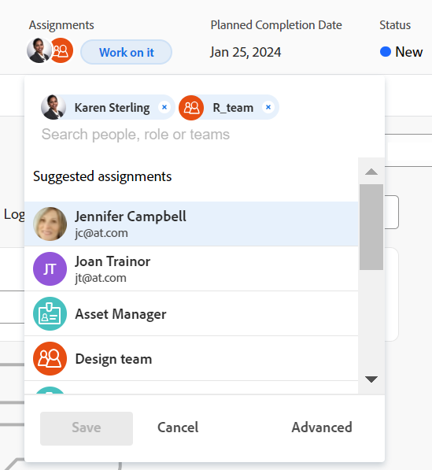

# Asignar tareas

<!--Audited: 07/2024-->

<!--remove the span class preview from everywhere but the Rate Card roles referencs must stay in yellow; replace the intro with preview and fast track only but not sure if with the link to third quarter release?!-->

La información resaltada en esta página hace referencia a una funcionalidad que aún no está disponible de forma general. Solo está disponible en el entorno de vista previa para todos los clientes o en el entorno de producción para los clientes que habilitaron versiones rápidas.

Para obtener información acerca de las versiones rápidas, consulte [Habilitar o deshabilitar las versiones rápidas para su organización](/help/quicksilver/administration-and-setup/set-up-workfront/configure-system-defaults/enable-fast-release-process.md).

Para obtener información acerca de la versión actual, consulte [Información general sobre la versión del tercer trimestre de 2024](/help/quicksilver/product-announcements/product-releases/24-q3-release-activity/24-q3-release-overview.md).

Puede asignar tareas a usuarios, roles o equipos para indicar quién es el responsable de completar las tareas. Puede asignar una tarea a varios recursos a la vez.

>[!TIP]
>
>Puede asignar varios usuarios, roles o equipos. Solo puede asignar usuarios activos, roles y equipos.
>
>Si se asignó un usuario, un rol o un equipo antes de desactivarlos, permanecen asignados al elemento de trabajo. En este caso, se recomienda lo siguiente:
>
>* Reasignar el elemento de trabajo a los recursos activos.
>* Asocie los usuarios de un equipo desactivado a un equipo activo y reasigne el elemento de trabajo al equipo activo.
>

El número de usuarios asignados a una tarea y la programación de la tarea El propietario puede modificar las fechas planificadas de una tarea, lo que resulta en cambiar la cronología del proyecto. Para obtener información acerca del impacto de asignar varios usuarios a una tarea, vea [Información general sobre la modificación de asignaciones de tareas](../../../manage-work/tasks/assign-tasks/modify-task-assignments-overview.md).

Además de este artículo, le recomendamos que lea los siguientes artículos para obtener más información sobre la asignación de tareas:

* [Información general sobre la modificación de asignaciones de tareas](../../../manage-work/tasks/assign-tasks/modify-task-assignments-overview.md)
* [Información general sobre asignaciones inteligentes](../../../manage-work/tasks/assign-tasks/smart-assignments.md)
* [Realizar asignaciones inteligentes](../../../manage-work/tasks/assign-tasks/make-smart-assignments.md)
* [Crear asignaciones avanzadas](../../../manage-work/tasks/assign-tasks/create-advanced-assignments.md)
* [Modificar asignaciones de varios usuarios en una lista de tareas](../../../manage-work/tasks/assign-tasks/modify-multiple-assignments-in-task-list.md)
* [Editar tareas](../../../manage-work/tasks/manage-tasks/edit-tasks.md)
* [Información general sobre la planificación de un proyecto](../../../manage-work/projects/planning-a-project/plan-project.md)
* [Información general sobre la fecha planificada de finalización de la tarea](../../../manage-work/tasks/task-information/task-planned-completion-date.md)
* [Establecer fecha planificada de finalización del proyecto](../../../manage-work/projects/planning-a-project/project-planned-completion-date.md)
* [Configurar preferencias de proyecto en todo el sistema](../../../administration-and-setup/set-up-workfront/configure-system-defaults/set-project-preferences.md)
* [Información general sobre la asignación de trabajo en el Distribuidor de cargas de trabajo](../../../resource-mgmt/workload-balancer/assign-work-in-workload-balancer.md)

## Requisitos de acceso

+++ Expanda para ver los requisitos de acceso para la funcionalidad en este artículo.

<table style="table-layout:auto"> 
 <col> 
 <col> 
 <tbody> 
  <tr> 
   <td role="rowheader">plan de Adobe Workfront</td> 
   <td> 
Cualquiera
 </td> 
  </tr> 
  <tr> 
   <td role="rowheader">Licencia de Adobe Workfront*</td> 
   <td> 
Nuevo: estándar

   
Actual: Trabajo o superior

   </td> 
  </tr> 
  <tr> 
   <td role="rowheader">Configuraciones de nivel de acceso</td> 
   <td> 
Editar acceso a Proyectos y tareas
 
Acceso de visualización o superior a los usuarios
 </td> 
  </tr> 
  <tr> 
   <td role="rowheader">Permisos de objeto</td> 
   <td> </td> 
  </tr> 
 </tbody> 
</table>

*Para obtener más información, consulte [Requisitos de acceso en la documentación de Workfront](/help/quicksilver/administration-and-setup/add-users/access-levels-and-object-permissions/access-level-requirements-in-documentation.md).
+++

## Consideraciones para varias asignaciones a roles de trabajo, equipos y usuarios

Tenga en cuenta lo siguiente al asignar varios recursos a un elemento de trabajo:

* Los usuarios pueden tener más de una función de trabajo asociada a su perfil. Para obtener información sobre cómo asociar usuarios con roles de trabajo, consulte [Editar el perfil de un usuario](../../../administration-and-setup/add-users/create-and-manage-users/edit-a-users-profile.md).

* Si asigna más de un usuario a una tarea o un problema, el primer usuario que seleccione se designa automáticamente como el propietario de la tarea o el problema.
Para obtener instrucciones sobre cómo cambiar esto, consulte la información sobre la opción Convertir en principal en el artículo [Crear asignaciones avanzadas](create-advanced-assignments.md).

* Un equipo no puede ser un usuario asignado principal de una tarea o un problema. Solo se puede designar a un usuario o un rol como principal en una tarea o un problema.

<!-- If a task is assigned to multiple teams, the primary team sees the Work On It button. waiting on team to verify if this is true. (Courtney)
You cannot make a team be a Primary on a task/ issue. (Alina) -->

* Las tareas y los problemas de un proyecto pueden asignarse primero a uno o varios equipos o roles. Cuando el proyecto esté listo para iniciarse, es posible que también deban asignarse a los usuarios:

  <table>
  <col> 
  <col> 
  <tbody>
  <tr>
   <td>Equipos</td>
   <td>Si asigna una tarea a un equipo y también asigna un usuario, la tarea permanece asignada al equipo y al usuario, incluso si el usuario no es miembro del equipo.</td>
  </tr>
  <tr>
   <td>Roles</td>
   <td>
Si asigna una tarea o un problema a una o varias funciones y, a continuación, también asigna un usuario, decide qué función de trabajo asociar al usuario adicional (si corresponde) según las siguientes reglas:

     <ul>
      <li>Si solo hay una función de trabajo asignada y coincide con la función principal del usuario (configurada en su perfil), la tarea o el problema se asigna únicamente a ese usuario.</li>
      <li>Si se asignan varios roles y al menos uno de ellos coincide con uno de los otros roles del usuario, la tarea o el problema se asignan al usuario (el rol se selecciona aleatoriamente si hay varias coincidencias), junto con cualquier rol adicional asignado</li>
      <li>Si hay al menos una función asignada y no coinciden las funciones del usuario, la tarea o el problema se asignan a la función o las funciones y al usuario.</li>
     </ul>
   
Para obtener información acerca de la función principal de un usuario y otras funciones, vea <a href="../../../administration-and-setup/add-users/create-and-manage-users/edit-a-users-profile.md">Editar el perfil de un usuario</a>.

   </td> 
     </tr>
  </tbody>
  </table>

<!--

<h2>Considerations for multiple user assignments and using schedules</h2>

(NOTE: moved to the Modify task assignments overview standalone article)

You can assign multiple resources to a task. When you assign a user to a task, Workfront uses the user's schedule to calculate the planned dates for the task which ultimately determine the timeline of the project. Using the schedule of the user takes into account their time off, holidays, and weekend days which are considered non-working days when task activity cannot occur. 

When you assign multiple users to a task, your Workfront administrator or a group administrator determines which one of the following schedules Workfront uses to determine the planned dates of the tasks, based on schedules: 

<ul>
<li> 
<strong>The Primary Assignee's schedule</strong>: this is the schedule associated with the user designated as the task Owner.
 
For information about associating users with schedules, see <a href="../../../administration-and-setup/add-users/create-and-manage-users/edit-a-users-profile.md" class="MCXref xref">Edit a user's profile</a>.
 </li>
<li><strong>The Project's schedule</strong>: this is the schedule associated with the project. For adding a schedule to a project, see <a href="../../../manage-work/projects/manage-projects/edit-projects.md" class="MCXref xref">Edit projects</a>.</li>
</ul>

For information about setting up which schedule a project uses in the case of multiple assignments, see <a href="../../../administration-and-setup/set-up-workfront/configure-system-defaults/set-project-preferences.md" class="MCXref xref">Configure system-wide project preferences</a>. 

-->

## Asignar una sola tarea

1. Vaya a la tarea que desee asignar.
1. Haga clic en **Asignar a** en el campo **Asignaciones** del encabezado de la tarea

   O

   Haga clic en el nombre de las asignaciones si la tarea o el problema ya está asignado.

   En el entorno de producción:
   

   En el entorno de vista previa:
   

1. Realice una de las siguientes acciones:

   * Comience a escribir el nombre del usuario, rol o equipo que desea asignar y, a continuación, haga clic en él cuando aparezca en la lista.

     >[!TIP]
     >
     >Al agregar una asignación de usuario, observe el avatar, la función principal del usuario o su dirección de correo electrónico para distinguir entre usuarios con nombres idénticos. Los usuarios deben estar asociados con al menos un rol para verlo a medida que los agregue.
     >
     >Debe tener activada la configuración Ver información de contacto en su nivel de acceso para que los usuarios vean los correos electrónicos de los usuarios. Para obtener más información, consulte [Conceder acceso a usuarios](../../../administration-and-setup/add-users/configure-and-grant-access/grant-access-other-users.md).
     >
     >Al agregar una asignación de rol, puede buscar el rol o la ubicación. Seleccione una función de la lista Funciones del puesto para utilizar la tarifa de facturación predeterminada para la asignación, o seleccione una función de puesto de la tarjeta Tarifa para utilizar la tarifa de facturación de la tarjeta Tarifa. Para obtener más información sobre las tarjetas de tarifas, consulte [Administrar tarjetas de tarifas](/help/quicksilver/administration-and-setup/set-up-workfront/configure-system-defaults/manage-rate-cards.md).

   * (Condicional) Haga clic en uno de los nombres de las listas **Asignaciones sugeridas**, **Usuarios y equipos**, o **Funciones del puesto** o **Funciones de la tarjeta de tarifas** cuando se muestren. Para obtener más información, vea [Información general sobre asignaciones inteligentes](../../../manage-work/tasks/assign-tasks/smart-assignments.md).

     Puede empezar a escribir el nombre de cualquier usuario, equipo o función del trabajo que desee asignar a la tarea y, a continuación, seleccionarla cuando se muestre en la lista.

   * Haga clic en **Avanzado**

     Para obtener información sobre cómo realizar asignaciones avanzadas, vea [Crear asignaciones avanzadas](../../../manage-work/tasks/assign-tasks/create-advanced-assignments.md).

1. Haga clic en **Guardar**.
1. (Opcional y condicional) Si hace clic en **Avanzado**, haga clic en el icono **X** que aparece junto al nombre de la asignación en el panel derecho de la tarea para quitar una asignación.

## Asignar una tarea a una lista

Puede asignar tareas en una lista o un informe cuando cualquiera de los campos de asignación esté visible en la vista de la lista. Es una forma más rápida de asignar tareas. Este artículo describe cómo modificar asignaciones para una tarea de una lista. Para obtener información acerca de cómo modificar varias asignaciones para varias tareas de una lista, vea [Modificar varias asignaciones de usuario en una lista de tareas](../../../manage-work/tasks/assign-tasks/modify-multiple-assignments-in-task-list.md).

Según el campo que esté visible en la vista, puede asignar las siguientes entidades a la tarea:

| Campo | Entidades asignadas |
|---|---|
| **Asignar a** | Asignar un usuario |
| **Asignado** | Asignar un usuario |
| **Asignaciones** | Asignar usuarios, roles o equipos |

Para asignar tareas en una lista:

1. Vaya a una lista de tareas que tenga los campos Asignado a, Asignado o Asignaciones en la vista.
1. (Opcional) Haga clic en el menú desplegable **Guardar automáticamente** y seleccione una de las siguientes opciones:

   | Opción | Descripción de opción |
   |---|---| 
   | Autoguardar | Los cambios que realice en las tareas se guardan automáticamente y no puede revertirlos |
   | Guardado manual | Debe guardar manualmente los cambios. Puede revertir los cambios antes de guardarlos. |
   | Planificación de calendario | Debe guardar manualmente los cambios. Puede revertir los cambios antes de guardarlos. Guardar los cambios y todas las dependencias del proyecto es más rápido que al seleccionar Guardar de forma manual. |

   Para obtener más información sobre cómo guardar tareas a medida que las edita en una lista, vea [Editar tareas en una lista](../../../manage-work/tasks/manage-tasks/edit-tasks-in-a-list.md).

1. Para asignar tareas, realice una de las siguientes acciones:

   * Haga clic dentro de los campos **Asignado a** o **Asignado** y empiece a escribir el nombre de un usuario activo que desee asignar a la tarea; a continuación, haga clic en él cuando se muestre en la lista.
   * Haga clic dentro del campo **Asignaciones** y empiece a escribir el nombre de un usuario, rol o equipo activo que desee asignar a la tarea; a continuación, haga clic en él cuando se muestre en la lista.

     >[!TIP]
     >
     >Al agregar una asignación de usuario, observe el avatar, la función principal del usuario o su dirección de correo electrónico para distinguir entre usuarios con nombres idénticos. Los usuarios deben estar asociados con al menos un rol para verlo a medida que los agregue.
     >
     >Debe tener activada la configuración Ver información de contacto en su nivel de acceso para que los usuarios vean los correos electrónicos de los usuarios. Para obtener más información, consulte [Conceder acceso a usuarios](../../../administration-and-setup/add-users/configure-and-grant-access/grant-access-other-users.md)
     >
     >Al agregar una asignación de rol, puede buscar el rol o la ubicación. Seleccione el sistema/rol predeterminado para utilizar la tarifa de facturación predeterminada para la asignación o seleccione un rol de tarjeta de tarifas para utilizar la tarifa de facturación de la tarjeta de tarifas. Para obtener más información sobre las tarjetas de tarifas, consulte [Administrar tarjetas de tarifas](/help/quicksilver/administration-and-setup/set-up-workfront/configure-system-defaults/manage-rate-cards.md).

1. (Condicional) Cuando esté visible en el campo **Asignaciones**, haga clic en el icono **Personas** en la esquina superior derecha del cuadro de asignaciones para abrir el cuadro **Asignaciones avanzadas** y crear asignaciones avanzadas.

   <!--
   there is a People icon in NWE but it's hard to see - you need to assign the task to at least 2 users, not roles, or teams, before it shows up

   -->

   Para obtener más información, consulte [Crear asignaciones avanzadas](../../../manage-work/tasks/assign-tasks/create-advanced-assignments.md).

   >[!TIP]
   >
   >No puede realizar asignaciones avanzadas desde los campos Asignado a o Asignado.

1. Después de agregar los usuarios asignados a la tarea, pulse Intro o haga clic en cualquier lugar de la página para guardar los cambios si selecciona Guardar automáticamente. De lo contrario, haga clic en **Guardar**.

## Asignar varias tareas a un usuario

1. Vaya a una lista de tareas que desee asignar de forma masiva.
1. (Condicional) Asegúrese de que la opción **Guardar automáticamente** esté seleccionada si está en una lista de tareas de un proyecto.

   >[!IMPORTANT]
   >
   >No puede editar las tareas de forma masiva al guardar las tareas manualmente en un proyecto.

1. Seleccione varias tareas en la lista de tareas.
1. Haga clic en **Editar**.

   Se abre el cuadro de diálogo **Editar tareas**.

1. En el área **Asignaciones**, seleccione la casilla **Usuario asignado** y, a continuación, empiece a escribir el nombre de un usuario, rol o equipo que desee asignar a todas las tareas.

   >[!IMPORTANT]
   >
   >Si alguna de las tareas ya está asignada, los recursos que indique aquí se agregan a las tareas en lugar de reemplazar los recursos existentes en las tareas.

1. (Opcional) Seleccione el botón de opción de la columna **Propietario de la tarea** para indicar qué recurso es el principal asignado o el Propietario de la tarea, cuando asigne más de un recurso a la tarea. Esto no está disponible para equipos.
1. (Condicional) Especifique la **Asignación %** para cada recurso asignado a la tarea si todas las tareas seleccionadas tienen un tipo de duración de asignación calculada o condicionada por el esfuerzo. Esto indica la cantidad de tiempo que estos recursos deben dedicar a completar la tarea. Esto solo está disponible para usuarios y funciones del puesto.

   O

   Especifique la cantidad de **Horas** para cada recurso asignado a la tarea si todas las tareas que seleccionó tienen un Tipo de duración simple. El total de todas las horas de todos los recursos debe ser igual al número de horas planificadas para la tarea.

   >[!IMPORTANT]
   >
   >No puede especificar el porcentaje de asignación ni el número de horas por recurso si las tareas seleccionadas tienen diferentes tipos de duración o si las tareas seleccionadas tienen diferentes tipos de duración.

   Para obtener información acerca del tipo de duración de las tareas, vea [Información general sobre la duración de la tarea y el tipo de duración](../../../manage-work/tasks/taskdurtn/task-duration-and-duration-type.md).

1. (Opcional) Seleccione un rol que el usuario debe cumplir en la tarea del menú desplegable **Elegir un rol** en la columna **Rol de asignado** cuando asigne usuarios a las tareas. Si no selecciona ninguna función, Workfront selecciona automáticamente la función principal del usuario.

1. (Opcional) Si desea quitar los usuarios asignados existentes de todas las tareas, realice una de las siguientes acciones:

   1. Empiece a escribir el nombre del usuario, rol o equipo que desee quitar de la tarea, selecciónelo cuando aparezca en la lista y haga clic en **Quitar usuario asignado** para quitar más usuarios asignados.
   1. Haga clic en **Quitar todas las personas asignadas existentes** para quitar todas las personas asignadas de todas las tareas seleccionadas.

1. Haga clic en **Guardar cambios**.
1. (Opcional y condicional) Cuando los campos Asignado a o Asignaciones se muestren en su lista de tareas, haga clic dentro de una de estas columnas para una tarea y luego haga clic en el **icono X** junto al nombre de un usuario asignado para quitarlo de la tarea.

<!--

<h2>Considerations about unassigning tasks</h2>

(NOTE: moved this to the new article: /Content/Manage work/Tasks/Assign tasks/modify-task-assignments-overview.htm)

You can remove assignments from one task at a time, or you can remove assignments from multiple tasks in bulk.

For more information about removing assignments from tasks in bulk, see <a href="../../../manage-work/tasks/assign-tasks/modify-multiple-assignments-in-task-list.md" class="MCXref xref">Modify multiple user assignments in a task list</a>. 

Consider the following when removing assignments from tasks: 

<ul>
<li>When you unassign a user from a task, the task remains assigned to the job role that the user fulfilled on the task.</li>
<li>When you unassign a job role or a team from a task, the task remains unassigned if it is not assigned to any other resources. </li>
</ul>

-->

