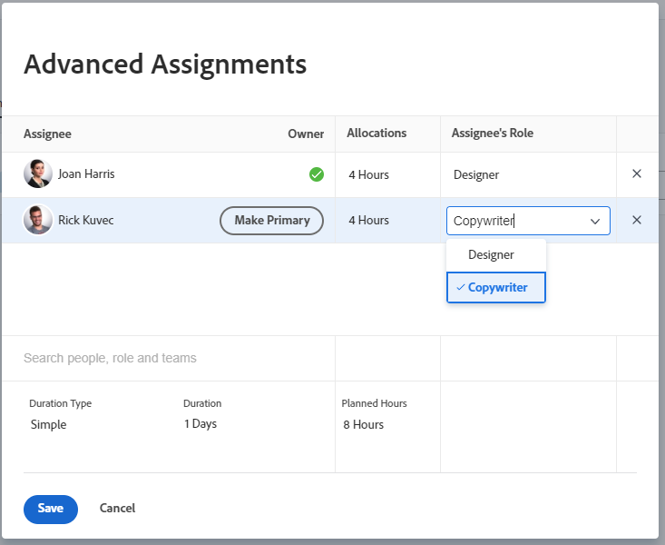

# Crear asignaciones avanzadas

<!-- Audited: 11/2025-->

<!--remove the bullet indicated when we get rid of the new/old experience of editing tasks-->

<!--

 

The highlighted information on this page refers to functionality not yet generally available. It is available only in the Preview environment for all customers. The same features will also be available in the Production environment for all customers starting with  a week from the Preview release.      

For more information, see [Interface modernization](/help/quicksilver/product-announcements/product-releases/interface-modernization/interface-modernization.md).  

 
-->

Puede administrar asignaciones de tareas o problemas mediante Asignaciones avanzadas.

Puede ajustar la siguiente información de asignación al realizar asignaciones avanzadas:

* Asignar usuarios a la tarea o problema (esto puede realizarse fuera de una asignación avanzada).
* Ajuste y redistribuya el número de horas que se asignan a cada usuario asignado.
* Determine qué usuario debe designarse como propietario o principal asignado a la tarea o al problema.
* Especifique la función que cumple cada usuario al trabajar en la tarea o el problema.
  <!--* Override the billing rate for a job role.-->

>[!NOTE]
>
>Al asignar usuarios para trabajar, su disponibilidad según sus programaciones afecta a las fechas planificadas y proyectadas de las tareas y problemas. Para obtener información acerca de las programaciones, consulte [Crear una programación](../../../administration-and-setup/set-up-workfront/configure-timesheets-schedules/create-schedules.md).

## Áreas de Adobe Workfront donde puede realizar asignaciones avanzadas

Este artículo describe cómo acceder a las asignaciones avanzadas en el encabezado de la tarea o del problema.

Además, puede realizar asignaciones avanzadas en las siguientes áreas de Workfront:

* En listas e informes cuando el campo Asignaciones aparece en la vista.
* En la sección Asignaciones al editar una tarea. Para obtener más información, consulte [Editar tareas](../../../manage-work/tasks/manage-tasks/edit-tasks.md). <!--When we remove the old/ new experience: take this bullet out completely; in the new Edit Task experience, this is no longer possible-->
* En el encabezado de la tarea o del problema, en el área Asignaciones.
* En el Distribuidor de cargas de trabajo. Para obtener más información, consulte [Asignar trabajo manualmente mediante el Distribuidor de cargas de trabajo](../../../resource-mgmt/workload-balancer/assign-work-in-workload-balancer-manually.md).

## Requisitos de acceso

+++ Expanda para ver los requisitos de acceso para la funcionalidad en este artículo.

<table style="table-layout:auto"> 
 <col> 
 <col> 
 <tbody> 
  <tr> 
   <td>paquete de Adobe Workfront</td> 
   <td> 
Cualquiera
 </td> 
  </tr> 
  <tr> 
   <td>Licencia de Adobe Workfront</td> 
   <td> 
Estándar

   
Trabajo o superior

   </td> 
  </tr> 
  <tr> 
   <td role>Configuraciones de nivel de acceso</td> 
   <td> 
Editar el acceso a Tareas y Problemas
  </td> 
  </tr> 
  <tr> 
   <td>Permisos de objeto</td> 
   <td> 
Aportar o permisos superiores a la tarea o al problema
</td> 
  </tr> 
 </tbody> 
</table>

Para obtener más información, consulte [Requisitos de acceso en la documentación de Workfront](/help/quicksilver/administration-and-setup/add-users/access-levels-and-object-permissions/access-level-requirements-in-documentation.md).

+++

## Realizar asignaciones avanzadas

1. Vaya al proyecto donde desea asignar una tarea o un problema.
1. Haga clic en **Tareas** o **Problemas** en el panel izquierdo y, a continuación, haga clic en el nombre de una tarea o problema en la lista.

   >[!TIP]
   >
   >Puede realizar asignaciones avanzadas directamente en la lista de tareas o problemas. Haga clic dentro del campo **Asignaciones** en la misma línea que la tarea o el problema y, a continuación, haga clic en **Avanzadas** en la parte inferior de la lista o en el **icono Personas** en la esquina superior derecha del cuadro de asignaciones para abrir la ventana Asignaciones avanzadas. Vaya al paso 5 para continuar creando asignaciones avanzadas.
   >

1. Haga clic en **Asignar a** en el campo **Asignaciones** del encabezado de la tarea o el problema

   O

   Haga clic en uno de los nombres asignados si la tarea o el problema ya están asignados.

1. Haga clic en **Avanzadas**.

   

1. En el campo **Buscar personas, roles y equipos**, empiece a escribir el nombre de un usuario, rol o equipo y, a continuación, haga clic en el nombre cuando aparezca en la lista desplegable.

   >[!NOTE]
   >
   >Si el nombre del usuario contiene un carácter especial, debe incluirlo en el campo de búsqueda.

1. (Opcional) Siga agregando usuarios asignados en el cuadro **Buscar personas, roles y equipos** para agregar varios recursos a la tarea o al problema.

   >[!TIP]
   >
   >* Puede asignar varios usuarios, funciones o equipos. Solo puede asignar usuarios, funciones y equipos activos.
   >
   >
   >* Al añadir una asignación de usuario, observe el avatar, la función principal del usuario o su dirección de correo electrónico para distinguir entre usuarios con nombres idénticos.
   >Los usuarios deben estar asociados con al menos una función para verla a medida que los añade.
   >Debe tener habilitada la configuración Ver información de contacto en su nivel de acceso para que los usuarios vean los correos electrónicos de los usuarios. Para obtener más información, consulte [Conceder acceso a usuarios](../../../administration-and-setup/add-users/configure-and-grant-access/grant-access-other-users.md).
   >
   >
   >* Si un usuario, un rol o un equipo se han asignado antes de que se desactiven, permanecerán asignados al elemento de trabajo. En este caso, se recomienda lo siguiente:
   >   
   >   * Reasignar el elemento de trabajo a los recursos activos.
   >   * Asocie los usuarios de un equipo desactivado a un equipo activo y reasigne el elemento de trabajo al equipo activo.

   <!-- SHOULD BE THIRD BULLET POINT IN TIP TABLE WHEN THIS FEATURE IS RELEASED 
    * When adding a job role assignment, you can search for the job role or location. Select the System/Default Job Role to use the default billing rate for the assignment, or select a Rate Card Job Role to override the rate at the assignment level. For more information on rate cards, see [Manage rate cards](/help/quicksilver/administration-and-setup/set-up-workfront/configure-system-defaults/manage-rate-cards.md).
    -->

1. Especifique la siguiente información para cada usuario de la columna **Usuario asignado**:

   * **Propietario**: pase el puntero por encima del nombre del usuario asignado y haga clic en **Convertir en principal** en el campo Propietario si desea marcar al usuario asignado como propietario de la tarea o problema. La casilla de verificación verde indica que el usuario especificado es el contacto principal de la tarea o el problema. Adobe Workfront marca el primer usuario o función que asigna a una tarea o problema como Asignación principal o Propietario. No se puede designar a un equipo como propietario principal de una tarea o un problema.

     >[!IMPORTANT]
     >
     >Según la forma en que el administrador de Workfront o el administrador del grupo hayan configurado las preferencias del proyecto, Workfront podría utilizar la programación del propietario de la tarea para calcular la línea de tiempo de la tarea cuando tenga varios usuarios asignados a la tarea. Para obtener información acerca de los usuarios asignados a varias tareas, consulte la sección “Asignar varios usuarios a una tarea” en el artículo [Asignar tareas](../../../manage-work/tasks/assign-tasks/assign-tasks.md).

   * **Asignaciones**: cuando el tipo de duración de una tarea sea Simple, especifique el número de horas que cada usuario o rol debe asignarse a la tarea. La suma de todas las horas asignadas a cada usuario es igual al número que aparece en el campo **Horas planificadas** en la parte inferior de la columna Asignaciones. En todos los demás casos, especifique el porcentaje de tiempo (o asignación) que desea que el usuario asignado dedique a resolver la tarea o el problema.

     >[!TIP]
     >   
     >   * Después de modificar manualmente las asignaciones de las tareas, las horas planificadas de las tareas podrían actualizarse en consecuencia. Para obtener más información, consulte la sección “Actualizar las horas planificadas de la tarea al administrar las asignaciones de usuario” en el artículo [Información general sobre las horas planificadas](../../../manage-work/tasks/task-information/planned-hours.md).
     >   * No se pueden modificar manualmente las asignaciones de los problemas.
     >   * No se pueden modificar manualmente las asignaciones de los equipos asignados a las tareas.

   * **Función del usuario asignado:** seleccione la función que el usuario debe usar al desempeñar esta asignación.  La función principal del usuario se muestra de forma predeterminada. Haga clic en el cuadro **Rol de asignado** para seleccionar otro rol. Al asignar primero la tarea o el problema a una función y, a continuación, añadir un usuario que pueda cumplir dicha función como segunda asignación, la lista de usuarios sugeridos se filtra para los usuarios que pueden cumplir las funciones ya asignadas a la tarea y al problema.

     

   <!--

   * **Location**: The location comes from the rate card, if a rate card attached to the project uses locations with the job roles. The location can't be changed. 

   * **Billing Rates**: The billing rate for a user comes from the system rate for the user or their associated job role. The billing rate for a job role comes from the system rate or from the rate card, if a rate card is attached to the project. Existing billing rates are not displayed in this field. Click in the field to change the billing rate for this specific task assignment.

   
-->

   * **Tipo de duración**: esta opción solo está disponible para tareas. Haga clic en el nombre del tipo de duración y seleccione un tipo de duración en el menú desplegable. Para obtener más información sobre los tipos de duración, consulte [Información general sobre la duración de la tarea y los tipos de duración](../../../manage-work/tasks/taskdurtn/task-duration-and-duration-type.md).

   * **Duración:** puede actualizar este campo para una tarea cuando disponga de permisos de administración para la tarea.

     Para obtener más información, consulte [Información general sobre la duración de la tarea y el tipo de duración](../../../manage-work/tasks/taskdurtn/task-duration-and-duration-type.md). Al editar en lotes la información de la asignación, aparece un cuadro de diálogo similar para asignar usuarios, horas, asignación y el propietario de la tarea.

   * **Horas planificadas**: cuando el tipo de duración sea Asignación calculada o Simple, actualice el número de horas planificadas. Como resultado, los porcentajes de asignación o las horas de cada recurso se distribuyen de forma uniforme. Workfront calcula las horas planificadas cuando el tipo de duración es Trabajo calculado o Condicionado por el esfuerzo. Para obtener más información, consulte [Información general sobre la duración de la tarea y el tipo de duración](../../../manage-work/tasks/taskdurtn/task-duration-and-duration-type.md).

1. Haga clic en **Guardar**.
