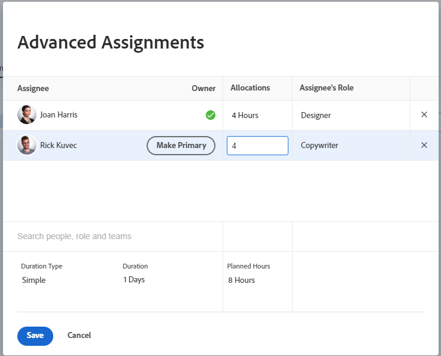

# Administrar horas de asignación de usuarios y funciones en las tareas

<!--Audited: 10/2025-->

<!--remove new/old experience references when they remove the New/ Old experience toggle from the Edit Tasks box-->

<!--

 

The highlighted information on this page refers to functionality not yet generally available. It is available only in the Preview environment for all customers. The same features will also be available in the Production environment for all customers starting with  a week from the Preview release.      

For more information, see [Interface modernization](/help/quicksilver/product-announcements/product-releases/interface-modernization/interface-modernization.md).  

-->

Las horas de asignación representan la cantidad total de tiempo que un recurso asignado está planificado para trabajar en una tarea. Las horas representan el tiempo que se asigna a un usuario en un día determinado o en un día de la semana, una semana o un mes a lo largo de la duración de la tarea.

Puede modificar las horas de asignación cuando realice asignaciones avanzadas en una tarea.

>[!NOTE]
>
>Al asignar usuarios para trabajar, su disponibilidad según sus programaciones afecta a las fechas planificadas y proyectadas de las tareas y problemas. Para obtener información acerca de las programaciones, consulte [Crear una programación](../../../administration-and-setup/set-up-workfront/configure-timesheets-schedules/create-schedules.md).

## Requisitos de acceso

+++ Expanda para ver los requisitos de acceso para la funcionalidad en este artículo.

<table style="table-layout:auto"> 
 <col> 
 <col> 
 <tbody> 
  <tr> 
   <td>Paquete de Adobe Workfront</td> 
   <td> 
Cualquiera
 </td> 
  </tr> 
  <tr> 
   <td>Licencia de Adobe Workfront</td> 
   <td> 
Estándar

   
Trabajo o superior

   </td> 
  </tr> 
  <tr> 
   <td>Configuraciones de nivel de acceso</td> 
   <td>Editar acceso a Tareas</td> 
  </tr> 
  <tr> 
   <td>Permisos de objeto</td>
   <td>
Contribuir o permisos superiores para la tarea

   
Edite los permisos para actualizar las horas de asignación en el cuadro Editar tarea.
 
   <!--
   Not true anymore:
   
<b>NOTE</b>

   

   You can no longer manage allocation hours in the Edit task box when editing tasks in the new experience.
 
For information, see <a href="/help/quicksilver/manage-work/tasks/manage-tasks/edit-tasks.md">Edit tasks</a>.

   -->
   </td>
  </tr>
 </tbody>
</table>

Para obtener más información, consulte [Requisitos de acceso en la documentación de Workfront](/help/quicksilver/administration-and-setup/add-users/access-levels-and-object-permissions/access-level-requirements-in-documentation.md).

+++

## Consideraciones para modificar las horas de asignación de una tarea

>[!IMPORTANT]
>
>Después de modificar manualmente las asignaciones para cada tarea, las horas planificadas de las tareas podrían actualizarse en consecuencia. Para obtener más información, consulte la sección [Actualizar las horas planificadas de una tarea al administrar las asignaciones de usuario](../../../manage-work/tasks/task-information/planned-hours.md#update) en el artículo [Información general de Horas planificadas](../../../manage-work/tasks/task-information/planned-hours.md).

* El total de horas asignadas a recursos individuales asignados a la tarea representa las horas planificadas de la tarea.
* Si hay un usuario o una asignación de rol en una tarea, la cantidad de horas asignadas al usuario o rol coincide con las Horas planificadas de la tarea.
* En el caso de múltiples asignaciones, a cada usuario o rol de trabajo se le asigna, de forma predeterminada, la misma cantidad de horas para trabajar en la tarea, si el tipo de duración de la tarea es simple. Para obtener más información, consulte los siguientes artículos:

   * [Información general sobre la duración y el tipo de duración de la tarea](../../../manage-work/tasks/taskdurtn/task-duration-and-duration-type.md)
   * [Información general del tipo de duración: simple](../../../manage-work/tasks/taskdurtn/simple-duration-type.md)

* Cuando la tarea tiene un tipo de duración simple, puedes cambiar manualmente la cantidad de horas asignadas a cada usuario o rol de trabajo para indicar que algunos de los asignados a la tarea podrían tener más tiempo para trabajar en ella que otros.
* No se puede modificar la cantidad de horas asignadas a los equipos asignados a las tareas.
* No puede modificar manualmente la asignación de usuarios o funciones para los problemas.
* También puede administrar las asignaciones diarias, semanales o mensuales de usuarios a tareas o problemas mediante el Distribuidor de cargas de trabajo. Para obtener más información, consulte [Administrar asignaciones de usuario en el Distribuidor de cargas de trabajo](../../../resource-mgmt/workload-balancer/manage-user-allocations-workload-balancer.md).

## Modificar las horas de asignación de usuarios o funciones de una tarea

1. Vaya a una tarea cuyas asignaciones desee cambiar las horas de asignación.
1. Haga clic en el área **Asignaciones** del encabezado de la tarea y, a continuación, haga clic en **Avanzadas**.
1. Asegúrese de que el **Tipo de duración** de la tarea sea **Simple**.
1. Modifique el campo **Asignaciones** para cada usuario asignado a la tarea. Son asignaciones generales para cada asignación a esta tarea, para toda la duración de la tarea. Esto también podría actualizar las **horas planificadas** generales de la tarea.

   Puede ver una de estas pantallas en función del paquete de flujo de trabajo o Workfront de su organización.

   

   

1. Haga clic en **Guardar**.
