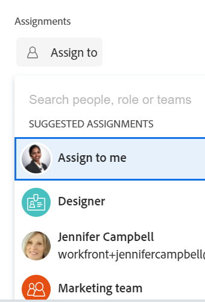

# Información general sobre asignaciones inteligentes

La información resaltada en esta página hace referencia a funcionalidades que aún no están disponibles de forma general. Solo está disponible en el entorno de vista previa para todos los clientes.

Para obtener más información sobre la programación actual de versiones, consulte [Información general sobre la versión del primer trimestre de 2024](/help/quicksilver/product-announcements/product-releases/24-q1-release-activity/24-q1-release-overview.md).

Al administrar asignaciones de tareas y problemas, puede utilizar asignaciones inteligentes para identificar quién es el mejor recurso para completar el trabajo. Las asignaciones inteligentes son sugerencias que Adobe Workfront presenta al asignar elementos de trabajo a recursos en función de un algoritmo que determina el recurso más adecuado para el trabajo. Las asignaciones inteligentes pueden ser usuarios, puestos o equipos.

>[!NOTE]
>
>Al sugerir usuarios, las asignaciones inteligentes no tienen en cuenta la disponibilidad del usuario. Sin embargo, su disponibilidad según sus programaciones afecta las Fechas planificadas y proyectadas de las tareas y problemas cuando se les asigna. Para obtener información sobre las programaciones, consulte el artículo [Creación de una programación](../../../administration-and-setup/set-up-workfront/configure-timesheets-schedules/create-schedules.md).

Este artículo contiene información general sobre las asignaciones inteligentes. Para obtener información sobre el uso de asignaciones inteligentes para asignar tareas y problemas a los usuarios, consulte [Realización de asignaciones inteligentes](../../../manage-work/tasks/assign-tasks/make-smart-assignments.md).

## Información general sobre asignaciones inteligentes

Tenga en cuenta lo siguiente al trabajar con asignaciones inteligentes:

* El algoritmo funciona de forma independiente para tareas y problemas. Esto significa que la lista de usuarios sugeridos para problemas puede diferir de la lista de usuarios sugeridos para una tarea, ya que Workfront crea las listas de acuerdo con los criterios pertenecientes a problemas y tareas por separado.
* Las asignaciones inteligentes no recomiendan roles de trabajo ni equipos. En su lugar, son sugerencias de usuarios que se adaptan mejor a una tarea o a un problema.
* Las asignaciones sugeridas siempre son usuarios activos.
* El usuario que aparezca primero debe ser el que mejor coincida con la tarea.

## Buscar sugerencias de asignación inteligente

Puede ver las asignaciones inteligentes en las áreas siguientes, donde puede asignar tareas o problemas:

* Lista de problemas o informe de problemas en la columna Asignaciones

  

* Lista de tareas o informe en la columna Asignaciones 

  

* Un encabezado de tarea en el campo Asignaciones

  

* Un encabezado de problema en el campo Asignaciones

  

* El panel Resumen de tareas o problemas del área Asignaciones

  

* El campo Asignaciones de un elemento enumerado en el área de Inicio del área Asignaciones, al abrir una tarea o un problema

  

* Distribuidor de cargas de trabajo en el área Asignado este a al asignar una tarea o un problema

  

## Criterios de asignaciones inteligentes

Las asignaciones inteligentes funcionan de forma diferente para las tareas que para los problemas.

### Criterios de asignaciones inteligentes para tareas

El cálculo de asignaciones inteligentes de tareas funciona en dos fases que utilizan dos algoritmos diferentes.

Según el algoritmo que encuentre la asignación inteligente, las asignaciones se enumerarán en dos secciones independientes del campo Asignaciones. Para obtener más información, consulte [Realización de asignaciones inteligentes](/help/quicksilver/manage-work/tasks/assign-tasks/make-smart-assignments.md).

#### Primera fase del cálculo de asignación inteligente para tareas

En la primera fase del cálculo de las asignaciones inteligentes, Workfront calcula una puntuación de similitud para cada asignación.

>[!NOTE]
>
>La primera fase del cálculo de asignaciones inteligentes no se aplica a las siguientes áreas de tareas:
>
>* Asignaciones masivas en el Distribuidor de cargas de trabajo.
>* Tarjetas conectadas en tableros.

El cálculo de la puntuación de similitud y el orden en que se enumeran las asignaciones tienen en cuenta lo siguiente:

* Se asigna una puntuación del 100% a una asignación existente en la que los nombres de las tareas, proyectos y portafolios son idénticos a los de la tarea que intenta asignar. Los nombres de proyecto y portafolio de la tarea de una asignación existente también deben coincidir con el proyecto y portafolio de la tarea que intenta asignar.

* Si sólo parte de esta información de otras asignaciones coincide con las tareas existentes, la puntuación podría ser inferior al 100%.

  Por ejemplo, si asigna una tarea denominada &quot;Mi segunda tarea&quot; a un proyecto denominado &quot;Mi proyecto&quot; en un portafolio denominado &quot;Mi portafolio&quot; y ya tiene una tarea denominada &quot;Mi tarea&quot; en otro proyecto denominado &quot;Mi proyecto&quot; en un portafolio denominado &quot;Mi portafolio&quot;, el usuario asignado a &quot;Mi tarea&quot; podría obtener una puntuación del 95 % porque el nombre de la tarea existente y la tarea que está intentando asignar ahora son similares, pero no idénticos.

  >[!TIP]
  >
  >  Workfront busca coincidencias únicamente en los campos Nombre de tareas, proyectos y portafolios y no en ningún otro campo.

* Una asignación podría obtener una puntuación más alta cuando se le asignen a muchas tareas del sistema con nombres similares. Por ejemplo, si se asigna un equipo llamado &quot;Desarrollo&quot; al 50 % de las tareas del sistema que contienen &quot;IA&quot; en el nombre y ahora se asigna otra tarea con &quot;AI&quot; en el nombre, la puntuación del equipo &quot;Desarrollo&quot; es mayor. En este caso, los nombres de los proyectos y portafolios no son tan importantes.

* Teniendo en cuenta este sistema de puntuación, las primeras 7 sugerencias se enumeran como asignaciones inteligentes, en orden descendente de sus puntuaciones. No se muestran las asignaciones con puntuaciones inferiores al 40 %.

* Si varias asignaciones tienen puntuaciones idénticas, se muestran en orden de fecha en que se realizaron las asignaciones, empezando por la fecha más reciente.

  Por ejemplo, si Rick fue asignado a una tarea similar hoy temprano y Jennifer fue asignada a una tarea similar hace dos días, Rick aparece primero.

* Las asignaciones identificadas en esta fase se enumeran en la **Asignaciones sugeridas** del campo Asignaciones.

* Si no hay coincidencias con este cálculo, se inicia la segunda fase de las asignaciones inteligentes, que se calcula con un algoritmo diferente.

#### Segunda fase del cálculo de asignaciones inteligentes para tareas

Si no se encuentran coincidencias en el primer paso de las asignaciones inteligentes de tareas, Workfront calcula las asignaciones inteligentes de las tareas de la misma manera que las calcula para los problemas.

Para obtener más información, consulte la sección [Criterios de asignaciones inteligentes para tareas y problemas](#smart-assignments-criteria-for-tasks-and-issues) en este artículo.

Las asignaciones identificadas en esta fase se enumeran en la **Resultados** del campo Asignaciones. <!--update this to "Other assignments"-->

### Criterios de asignaciones inteligentes para tareas y problemas

>[!NOTE]
>
>Los siguientes criterios se aplican a las tareas sólo cuando la primera fase del cálculo de asignación inteligente de tareas no encontró ninguna coincidencia. Para obtener más información, consulte la sección [Primera fase del cálculo de asignación inteligente para tareas](#first-phase-of-smart-assignment-calculation-for-tasks) en este artículo. Los siguientes criterios siempre se aplican a los problemas de forma predeterminada. 

Los usuarios se recomiendan en la lista desplegable asignaciones inteligentes en función de una combinación de los siguientes criterios (enumerados en orden de lo más importante a lo menos importante):

1. Usuarios asignados a otros elementos de trabajo en los últimos 30 días por el usuario que realiza la asignación. Se muestran los 50 primeros usuarios que coinciden con este criterio. El usuario que se asigna con mayor frecuencia se muestra primero.

2. Si el elemento de trabajo se asigna a un equipo o rol, la lista de usuarios sugeridos se filtra aún más teniendo en cuenta las asignaciones existentes a continuación. En este caso, solo se muestran los siguientes usuarios en la lista de sugerencias:

   * Usuarios cuyo equipo de inicio es el equipo asignado al elemento de trabajo.
   * Usuarios cuya función principal es la función asignada al elemento de trabajo.

>[!TIP]
>
>* Si no hay ninguna función o equipo asignado en la tarea o el problema, Workfront muestra todos los usuarios asignados durante los últimos 30 días, hasta 50 usuarios.
>
>* Si no ha realizado ninguna asignación en los últimos 30 días, sólo se mostrarán en la lista de asignaciones inteligentes los usuarios que pertenezcan al equipo asignado o que tengan la función asignada al elemento de trabajo.

<!--the commented out piece in the tip above was live before but I am not totally sure that smart assignments look at your team. I think they look JUST at the team/ role assigned to the work item; see this help site request for more info: https://experience.adobe.com/#/@adobeinternalworkfront/so:hub-Hub/workfront/issue/62fd222200037eb87572c5b6ad6bf53e/overview -->
<!--

<h3>Smart assignments criteria for the Production environment</h3>

(NOTE: drafted,this was the case BEFORE we updated the logic in the WB - with the 21.4 release)

Smart assignments display on tasks and issues when the following conditions are met:

<ul>
<li>The task or issue is subordinate to a parent task or issue that has a user, team, or job role currently assigned. </li>
</ul>

Smart assignments display the top twenty recommendations based on a proprietary algorithm that uses your own team information.

Users are recommended in the smart assignments drop-down list based on a combination of the following criteria (listed in order from most important to least important):

<ul>
<li>The user has the team assigned to the task or issue designated as their Home Team</li>
<li>The user is also assigned to the parent task</li>
<li>The user has the same primary job role as is currently assigned to the task or issue</li>
<li>The user has the team assigned to the parent task or issue designated as their Home Team</li>
<li>The user is associated with the same primary job role currently assigned to the parent task</li>
<li>The user is a member of the same team as the user who assigned the task or issue and the team is designated as their Home Team</li>
<li>The user is a member of the same Home Group as the user who is assigning the task or issue</li>
<li>The user has the same primary job role as the user who is assigning the task or issue.</li>
</ul>

-->

<!--

<h2>Make smart assignments</h2>

(NOTE:&nbsp;this was moved to its own article: make-smart-assignments.) 

Smart assignments are available in most locations where you can make assignments in Workfront.

You can use smart assignments on tasks and issues that have previously been assigned to a job role or a team.
 <note type="note">
You must have a Plan or a Work license and have at least Contribute permissions to a task or an issue to be able to make assignments to the task or the issue. You must have the Make Assignments option enabled in your permission level to make assignments.
</note>

To use smart assignments:

<ol>
<li value="1">Navigate to an issue or a task and click one of the following fields to edit them:  
<ul>
<li>
The <strong>Assignments</strong> field in the task or issue header
</li>
<li>The <strong>Assignments</strong> field of a task or issue list using in-line editing in a task or issue list. </li>
<li>The <strong>Assignee</strong> field after you have clicked <strong>Advanced</strong> from a task or an issue. </li>
</ul></li>
<li value="2"> 
Place your cursor in the assignment field, and wait for two seconds, then the <strong>Suggestions</strong> list is displayed.
 
Users displayed in this list are the smart assignment suggestions for the task or the issue. 
 
  
 </li>
<li value="3"> 
Select the user in the recommendations list by clicking their name. 
 
If there are no suggestions, the suggestion list does not open.
 </li>
<li value="4">(Optional) If you do not want to use one of the recommended users from the smart assignments list, start typing the name of the desired user and select the name when it appears in the list.</li>
<li value="5">Click <strong>Enter</strong> to make the assignment. </li>
</ol>

-->
