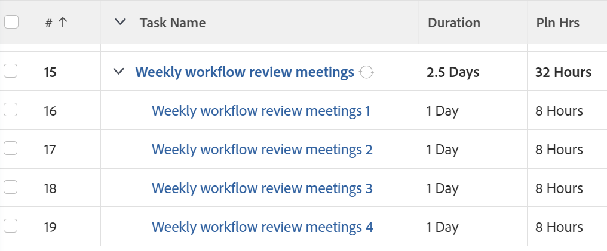

# Creación de tareas recurrentes

Puede crear tareas recurrentes para las tareas que tenga que repetir como parte de un solo proyecto.

Para obtener información general acerca de las tareas recurrentes, incluido el impacto de la edición de una tarea recurrente existente, consulte [Información general sobre tareas recurrentes](../../../manage-work/tasks/manage-tasks/recurring-tasks-overview.md).

## Requisitos de acceso

Debe tener el siguiente acceso para realizar los pasos de este artículo:

<table style="table-layout:auto"> 
 <col> 
 <col> 
 <tbody> 
  <tr> 
   <td role="rowheader">plan Adobe Workfront*</td> 
   <td> 
Cualquiera
 </td> 
  </tr> 
  <tr> 
   <td role="rowheader">Licencia de Adobe Workfront*</td> 
   <td> 
Trabajo o superior
 </td> 
  </tr> 
  <tr> 
   <td role="rowheader">Configuraciones de nivel de acceso*</td> 
   <td> 
Editar acceso a Tareas y Proyectos
 
Nota: Si sigue sin tener acceso, pregunte al administrador de Workfront si ha establecido restricciones adicionales en su nivel de acceso. Para obtener información sobre el acceso a las tareas, consulte <a href="../../../administration-and-setup/add-users/configure-and-grant-access/grant-access-tasks.md" class="MCXref xref">Conceder acceso a tareas</a>. Para obtener información sobre cómo un administrador de Workfront puede cambiar su nivel de acceso, consulte <a href="../../../administration-and-setup/add-users/configure-and-grant-access/create-modify-access-levels.md" class="MCXref xref">Crear o modificar niveles de acceso personalizados</a>. 
 </td> 
  </tr> 
  <tr> 
   <td role="rowheader">Permisos de objeto</td> 
   <td> 
Permisos de contribución al proyecto con capacidad para agregar tareas o superior
 
Al crear una tarea, recibe automáticamente permisos de administración para la tarea
 
 Para obtener información sobre los permisos de tareas, consulte <a href="../../../workfront-basics/grant-and-request-access-to-objects/share-a-task.md" class="MCXref xref">Compartir una tarea </a>. 
 
Para obtener información sobre cómo solicitar permisos adicionales, consulte <a href="../../../workfront-basics/grant-and-request-access-to-objects/request-access.md" class="MCXref xref">Solicitud de acceso a objetos </a>.
 </td> 
  </tr> 
 </tbody> 
</table>

&#42;Para saber qué plan, tipo de licencia o acceso tiene, póngase en contacto con su administrador de Workfront.

## Crear una tarea recurrente

>[!NOTE]
>
>No puede crear una tarea recurrente modificando una tarea existente. Debe crear una tarea desde cero.

1. Vaya al proyecto en el que desea crear una tarea recurrente y, a continuación, haga clic en **Tareas** en el panel izquierdo.
1. Clic **Nueva tarea**.

   Aparece el cuadro de diálogo Nueva tarea.

   

1. Clic **Más opciones** a continuación, introduzca un nombre para la tarea en **Nombre de tarea** field.
1. Continúe actualizando la tarea del mismo modo que lo haría si agregara una tarea nueva. Para obtener más información sobre cómo agregar una tarea nueva, consulte [Creación de tareas en un proyecto](../../../manage-work/tasks/create-tasks/create-tasks-in-project.md).

   >[!TIP]
   >
   >   La Duración y las Horas planificadas indicadas para una nueva tarea recurrente son la Duración y las Horas planificadas de cada ocurrencia. La duración de la tarea principal es el tiempo entre la fecha planificada de inicio de la tarea más temprana y la fecha planificada de finalización de la tarea más reciente. Las horas planificadas de la tarea principal son el total de todas las horas planificadas de todas las ocurrencias.

1. Clic **Información general** en el panel izquierdo.
1. Desplácese hacia abajo hasta el **Horario de periodicidad** , luego seleccione la **Convertir esta tarea en recurrente** opción.

   

1. En el **Frecuencia** , seleccione el número de unidades de tiempo en que desea que se produzca la tarea y el tipo de unidades de tiempo. Seleccione entre las siguientes opciones:

   <table style="table-layout:auto"> 
    <col> 
    <col> 
    <thead> 
     <tr> 
      <th>Tipo de periodicidad</th> 
      <th>Descripción</th> 
     </tr> 
    </thead> 
    <tbody> 
     <tr> 
      <td role="rowheader"><strong>Día</strong> </td> 
      <td> 
La tarea se repite cada día, cada 2 días, cada 3 días, etc., según la cadencia seleccionada. Puede configurar las tareas para que se repitan hasta cada sexto día. El valor predeterminado es 1 día. 
 </td> 
     </tr> 
     <tr> 
      <td role="rowheader"><strong>Día laborable</strong> </td> 
      <td> 
 La tarea se repite cada día laborable, cada 2 días laborables, cada 3 días laborables, etc., según la cadencia seleccionada. Puede configurar las tareas para que se repitan hasta cada sexto día laborable.
 
Esta opción utiliza la programación predeterminada definida por el administrador del sistema, tal como se describe en <a href="../../../administration-and-setup/set-up-workfront/configure-timesheets-schedules/create-schedules.md" class="MCXref xref">Creación de una programación</a>.
 </td> 
     </tr> 
     <tr> 
      <td role="rowheader"><strong>Semana</strong> </td> 
      <td> 
 La tarea se repite cada semana, cada 2 semanas, cada 3 semanas, etc., según la cadencia seleccionada.
 
En el <strong>Repeticiones</strong> , seleccione el día de la semana en el que desea que se realice cada tarea. Puede seleccionar varios días. 
 </td> 
     </tr> 
     <tr> 
      <td role="rowheader"><strong>Mes</strong> </td> 
      <td> 
La tarea se repite cada mes, cada 2 meses, cada 3 meses, etc., según la cadencia seleccionada. Puede seleccionar entre 1 y 12 meses. 
 
En el <strong>Repeticiones</strong> , seleccione entre las siguientes opciones cuando desee que se produzca la tarea:
 
       <ul> 
        <li> 
<strong>cada mes en el día &lt;month date=""&gt;</strong> 
 
Puede seleccionar entre 1 y 30 días o bien seleccionar <strong>último</strong>. Por ejemplo, puede seleccionar "cada mes el día 30". 
 </li> 
        <li> 
<strong>cada mes en el &lt;number&gt; &lt;day of="" the="" week=""&gt;</strong> 
 
En el primer menú desplegable, puede seleccionar un número entre 1 y 4 para el número de la semana del mes o puede seleccionar "último". 
 
En el segundo menú desplegable, puede seleccionar cualquier día de la semana. 
 
Por ejemplo, puede seleccionar "cada mes el segundo martes". 
 </li> 
       </ul> </td> 
     </tr> 
    </tbody> 
   </table>

   >[!NOTE]
   >
   >Si tiene una excepción de programación asociada a la programación del proyecto, las tareas recurrentes no pueden iniciarse durante la excepción. Las tareas recurrentes que se producen durante la excepción de programación están programadas para iniciarse el primer día hábil que sigue a la excepción. Para obtener más información sobre las excepciones de programación, consulte el artículo [Creación de una programación](../../../administration-and-setup/set-up-workfront/configure-timesheets-schedules/create-schedules.md).

1. En el **Inicia** , seleccione la fecha y la hora en que desea que comiencen las tareas recurrentes.
1. En el **Finaliza** , seleccione la fecha y la hora en que desea completar las tareas recurrentes

   O

   Seleccionar **después `<number>` Ocurrencias** para indicar cuántas veces debe producirse la tarea recurrente. Workfront crea el mismo número de repeticiones para las tareas que el número indicado en este campo.

1. Clic **Crear tarea.**

   Se muestra la lista de tareas. La tarea recurrente se crea como una tarea principal y todas las recurrencias son sus tareas secundarias. Workfront generó automáticamente los nombres de las tareas secundarias, utilizando el nombre introducido para el principal seguido de un número. Para obtener más información sobre los campos que se rellenan automáticamente desde la tarea principal recurrente, consulte [Información general sobre tareas recurrentes](../../../manage-work/tasks/manage-tasks/recurring-tasks-overview.md).

   

1. (Opcional) Modifique cada tarea recurrente como lo haría con cualquier otra tarea del proyecto.

   Por ejemplo, puede agregar asignaciones, predecesoras y duraciones, así como modificar cualquier otra información sobre la tarea, incluidos los campos personalizados.

   >[!IMPORTANT]
   >
   >Modificar la periodicidad principal después de que los hijos se hayan modificado individualmente puede causar información diferente entre los hijos o entre los hijos y el padre. Para obtener más información, consulte [Información general sobre tareas recurrentes](../../../manage-work/tasks/manage-tasks/recurring-tasks-overview.md).
