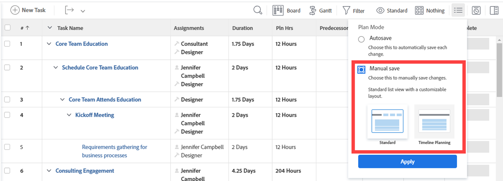

# Creación de tareas en un proyecto

Sólo puede crear tareas en un proyecto una vez creado el proyecto.

Por ejemplo, después de crear un proyecto, puede que desee agregar tareas y modificarlas para organizar el plan del proyecto. Para obtener más información sobre la creación de un proyecto, consulte [Creación de un proyecto](../../../manage-work/projects/create-projects/create-project.md).

Para obtener información sobre la creación de tareas personales que no están en un proyecto, consulte la sección &quot;Crear una tarea personal&quot; en el artículo [Crear elementos de trabajo desde el área de Inicio](../../../workfront-basics/using-home/using-the-home-area/create-work-items-in-home.md).

Este artículo describe cómo crear tareas desde cero. También puede crear tareas de las siguientes maneras:

* Copiando o duplicando tareas existentes. Para obtener más información, consulte [Copiar y duplicar tareas](../../../manage-work/tasks/manage-tasks/copy-and-duplicate-tasks.md).
* Al mover tareas de un proyecto a otro. Para obtener más información, consulte [Mover tareas](../../../manage-work/tasks/manage-tasks/move-tasks.md).

## Requisitos de acceso

<!--drafted for P&P - replace the table:

<table style="table-layout:auto"> 
 <col> 
 <col> 
 <tbody> 
  <tr> 
   <td role="rowheader">Adobe Workfront plan*</td> 
   <td> 
Any
 </td> 
  </tr> 
  <tr> 
   <td role="rowheader"> 
Adobe Workfront license*
 </td> 
   <td>
Current license: Standard
 
   Or
   
Legacy license: Work or higher
 </td> 
  </tr> 
  <tr> 
   <td role="rowheader">Access level configurations*</td> 
   <td> 
Edit access to Tasks and Projects
 
Note: If you still don't have access, ask your Workfront administrator if they set additional restrictions in your access level. For information about access to tasks, see <a href="../../../administration-and-setup/add-users/configure-and-grant-access/grant-access-tasks.md" class="MCXref xref">Grant access to tasks</a>. For information on how a Workfront administrator can change your access level, see <a href="../../../administration-and-setup/add-users/configure-and-grant-access/create-modify-access-levels.md" class="MCXref xref">Create or modify custom access levels</a>. 
 </td> 
  </tr> 
  <tr> 
   <td role="rowheader">Object permissions</td> 
   <td> 
Contribute permissions to the project with ability to Add Tasks or higher
 
When you create a task you automatically receive Manage permissions to the task
 
 For information about task permissions, see <a href="../../../workfront-basics/grant-and-request-access-to-objects/share-a-task.md" class="MCXref xref">Share a task </a>. 
 
For information on requesting additional permissions, see <a href="../../../workfront-basics/grant-and-request-access-to-objects/request-access.md" class="MCXref xref">Request access to objects </a>.
 </td> 
  </tr> 
 </tbody> 
</table>
-->
Debe tener el siguiente acceso para realizar los pasos de este artículo:

<table style="table-layout:auto"> 
 <col> 
 <col> 
 <tbody> 
  <tr> 
   <td role="rowheader">plan Adobe Workfront*</td> 
   <td> 
Cualquiera
 </td> 
  </tr> 
  <tr> 
   <td role="rowheader"> 
Licencia de Adobe Workfront*
 </td> 
   <td> 
Trabajo o superior
 </td> 
  </tr> 
  <tr> 
   <td role="rowheader">Configuraciones de nivel de acceso*</td> 
   <td> 
Editar acceso a Tareas y Proyectos
 
Nota: Si sigue sin tener acceso, pregunte al administrador de Workfront si ha establecido restricciones adicionales en su nivel de acceso. Para obtener información sobre el acceso a las tareas, consulte <a href="../../../administration-and-setup/add-users/configure-and-grant-access/grant-access-tasks.md" class="MCXref xref">Conceder acceso a tareas</a>. Para obtener información sobre cómo un administrador de Workfront puede cambiar su nivel de acceso, consulte <a href="../../../administration-and-setup/add-users/configure-and-grant-access/create-modify-access-levels.md" class="MCXref xref">Crear o modificar niveles de acceso personalizados</a>. 
 </td> 
  </tr> 
  <tr> 
   <td role="rowheader">Permisos de objeto</td> 
   <td> 
Permisos de contribución al proyecto con capacidad para agregar tareas o superior
 
Al crear una tarea, recibe automáticamente permisos de administración para la tarea
 
 Para obtener información sobre los permisos de tareas, consulte <a href="../../../workfront-basics/grant-and-request-access-to-objects/share-a-task.md" class="MCXref xref">Compartir una tarea </a>. 
 
Para obtener información sobre cómo solicitar permisos adicionales, consulte <a href="../../../workfront-basics/grant-and-request-access-to-objects/request-access.md" class="MCXref xref">Solicitud de acceso a objetos </a>.
 </td> 
  </tr> 
 </tbody> 
</table>

&#42;Para saber qué plan, tipo de licencia o acceso tiene, póngase en contacto con su administrador de Workfront.

## Creación de tareas en un proyecto

1. Vaya al proyecto donde desea crear una tarea.
1. Clic **Tareas** en el panel izquierdo.
1. (Condicional) Si está viendo la lista de tareas en una vista Agile, haga clic en **Vista de lista** icono  en la esquina superior derecha para mostrar la lista de tareas.
1. (Opcional) Haga clic en **Modo de planificación** icono  y seleccione **Guardado manual** y, a continuación, seleccione **Standard** o **Planificación de calendario**. Esto deshabilita la **Autoguardar** que está activada de forma predeterminada.

   

   >[!TIP]
   >
   >Puede invertir los cambios al seleccionar Guardar de forma manual.

1. Cree una nueva tarea mediante uno de los procedimientos siguientes:

   * Clic **Nueva tarea** al principio de la lista de tareas
   * Clic **Agregar más tareas** al final de la lista de tareas

   

1. (Condicional) Si hizo clic en **Nueva tarea** haga lo siguiente:

   1. Especifique cualquiera de los campos de la lista limitada de campos dentro de **Nueva tarea** y haga clic en **Crear tarea** si desea crear rápidamente una tarea.

      O

      Para actualizar todos los campos de la tarea, haga clic en **Más opciones** para abrir **Crear tarea** cuadro.

      

      El **Crear tarea** se abre el cuadro.

      

       

      >[!NOTE]
      >
      >Según la forma en que el administrador de Workfront configure la plantilla de diseño, los campos del cuadro Crear tarea podrían mostrar diferentes campos en el entorno. Para obtener más información, consulte [Personalización de la vista Detalles mediante una plantilla de diseño](../../../administration-and-setup/customize-workfront/use-layout-templates/customize-details-view-layout-template.md).

   1. Especifique información para las siguientes áreas en el panel izquierdo del cuadro Crear tarea:

      * Nombre de la tarea
      * Información general
      * Asignaciones
      * Formularios personalizados
      * Finanzas
      * Configuración

        Para obtener información sobre la definición de todos los campos relacionados con tareas en una tarea, consulte [Editar tareas](../../../manage-work/tasks/manage-tasks/edit-tasks.md).

   1. (Condicional y opcional) Si desea que la tarea sea recurrente, actualice el **Frecuencia de periodicidad** field. Para obtener más información sobre la creación de tareas recurrentes, consulte [Creación de tareas recurrentes](../../../manage-work/tasks/create-tasks/create-recurring-tasks.md).
   1. (Opcional) Haga clic en **Documentos** en el panel izquierdo para adjuntar un documento a la nueva tarea, haga clic en **Agregar o vincular archivos** para agregar un documento a la tarea desde el equipo, otro servicio o vincular documentos y carpetas desde el equipo u otro servicio.

1. (Condicional) Si hizo clic en **Agregar más tareas** en el paso 5, empiece a introducir la información de la tarea mediante la edición en línea y, a continuación, pulse Entrar.

   <!--
   
(NOTE: ensure this stays accurate)

   -->

   Se recomienda utilizar esta opción, especialmente cuando se añaden varias tareas a la lista.

   

1. (Condicional) Realice una de las siguientes acciones:

   * Si hace clic en **Nueva tarea** en el paso 5, haga clic en **Crear tarea** para guardar los cambios y agregar la nueva tarea al proyecto.

     <!--   
     
(NOTE: is this step still right?)
   
     -->

   * Si hace clic en **Agregar más tareas** en el paso 5, haga lo siguiente:

     <!--   
     
(NOTE: is this step still right?) 
   
     -->

      1. Haga clic en cualquier lugar del explorador para enviar los cambios o pulse Intro.
      1. (Opcional) En la lista de tareas, seleccione la tarea recién creada y haga clic en **Sangría**.

         Esto hace que la nueva tarea sea secundaria o subtarea de la tarea anterior.

         Para obtener más información sobre las tareas secundarias, consulte [Información general sobre tareas](../../../manage-work/tasks/task-information/tasks-overview.md).

      1. (Condicional) Si ha desactivado la variable **Autoguardar** después de pulsar **Agregar más tareas**, puede hacer lo siguiente:

         * Clic **Deshacer** en cualquier momento para revertir el último cambio, o **Cancelar** para revertir todos los cambios realizados en la lista de tareas.
         * Si anteriormente hizo clic en **Deshacer**, haga clic en **Rehacer** para volver a aplicar el último cambio cancelado.
         * Clic **Guardar** para guardar los cambios en la lista de tareas.
