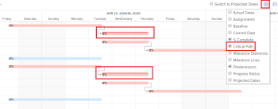

# Descripción general de la ruta crítica del proyecto

La determinación de la ruta crítica de un proyecto es una forma automática de que Adobe Workfront marque una secuencia de tareas en un proyecto que pueden afectar a la cronología del proyecto. Las tareas que pueden afectar a la cronología del proyecto se marcan como tareas de ruta crítica.

Las siguientes funciones pueden afectar a la ruta crítica de un proyecto:

* Estructura de desglose de trabajo del proyecto.

   Para obtener más información sobre la estructura de desglose de trabajo, consulte [Determinar la estructura de desglose de trabajo de un proyecto](../../../manage-work/projects/planning-a-project/determine-project-work-breakdown-structure.md)

* Tiempo (duración) que tardará cada tarea en completarse.
* Las dependencias entre las tareas.

   Tenga en cuenta lo siguiente:

   * Cuando una tarea en la ruta crítica tiene una relación predecesora, sus predecesores y sucesores también están en la ruta crítica si los cambios en las fechas de los predecesores o los sucesores afectan directamente a sus dependientes.

      >[!TIP]
      >
      >Cuando la fecha del sucesor de una tarea no afecta directamente a la fecha de sus tareas dependientes y no afecta a las fechas del proyecto, la tarea sucesora no está en la ruta crítica.
      >
      >
      >     >

   * Cuando una subtarea se identifica como una tarea de Ruta crítica, la tarea principal también se identifica como una tarea de Ruta crítica, si la Fecha y hora de inicio proyectadas del elemento principal es la misma que la de la subtarea.

Teniendo en cuenta estas funciones, el sistema calcula la ruta crítica utilizando la ruta más larga entre la tarea más temprana y la tarea que determina el final del proyecto. El cálculo de ruta crítica tiene en cuenta la hora más temprana y la más reciente en que cada tarea puede comenzar y finalizar sin hacer que el proyecto sea más largo. Este proceso determina qué tareas son &quot;críticas&quot; (y pertenecen a la ruta más larga) y cuáles tienen &quot;flotación total&quot; (se puede retrasar sin hacer el proyecto más largo).

Cualquier retraso en la actividad de una tarea en la ruta crítica afecta directamente a la fecha de finalización prevista del proyecto (no hay flotación en la ruta crítica).

## Requisitos de acceso

Debe tener el siguiente acceso para realizar los pasos de este artículo:

<table style="table-layout:auto"> 
 <col> 
 <col> 
 <tbody> 
  <tr> 
   <td role="rowheader">plan de Adobe Workfront*</td> 
   <td> 
Cualquiera
 </td> 
  </tr> 
  <tr> 
   <td role="rowheader">Licencia de Adobe Workfront*</td> 
   <td> 
Trabajo o superior
 </td> 
  </tr> 
  <tr> 
   <td role="rowheader">Configuraciones de nivel de acceso*</td> 
   <td> 
Ver o acceso superior a Tareas
 
Nota: Si todavía no tiene acceso, pregunte a su administrador de Workfront si establece restricciones adicionales en su nivel de acceso. Para obtener información sobre cómo un administrador de Workfront puede modificar su nivel de acceso, consulte <a href="../../../administration-and-setup/add-users/configure-and-grant-access/create-modify-access-levels.md" class="MCXref xref">Crear o modificar niveles de acceso personalizados</a>.
 </td> 
  </tr> 
  <tr> 
   <td role="rowheader">Permisos de objeto</td> 
   <td> 
Ver o permisos superiores en una tarea 
 
Para obtener información sobre la solicitud de acceso adicional, consulte <a href="../../../workfront-basics/grant-and-request-access-to-objects/request-access.md" class="MCXref xref">Solicitar acceso a objetos </a>.
 </td> 
  </tr> 
 </tbody> 
</table>

&#42;Para saber qué plan, tipo de licencia o acceso tiene, póngase en contacto con el administrador de Workfront.

## Ver la ruta crítica

Puede ver las tareas que pertenecen a la ruta crítica en las siguientes áreas de la aplicación Workfront:

* [Ver la ruta crítica en el gráfico de Gantt](#view-the-critical-path-in-the-gantt-chart)
* [Ver la ruta crítica en una lista de tareas o un informe](#view-the-critical-path-in-a-task-list-or-report)

### Ver la ruta crítica en el gráfico de Gantt {#view-the-critical-path-in-the-gantt-chart}

Para ver las tareas en la ruta crítica del diagrama de Gantt:

1. Vaya a un proyecto para el que desee ver la ruta crítica.
1. Haga clic en **Tareas** en el panel izquierdo.
1. Haga clic en el **Diagrama de Gantt** en la esquina superior derecha de la lista de tareas.

   

1. Expanda el **Opciones** y, a continuación, active la **Ruta crítica** .

   Las tareas que se encuentran en la ruta crítica tienen una línea roja por encima de su cronología en el gráfico de Gantt.

   

### Ver la ruta crítica en una lista de tareas o un informe {#view-the-critical-path-in-a-task-list-or-report}

Para ver qué tareas están en la ruta crítica en una lista de tareas:

1. Vaya a un proyecto para el que desee ver la ruta crítica.
1. Haga clic en **Tareas** en el panel izquierdo.
1. En el **Ver** menú desplegable, seleccione **Estado**.

   Las tareas que se encuentran en la ruta crítica tienen un **Ruta crítica** en la variable **Indicadores** de la lista.

   Puede aplicar la misma vista a un informe de tareas.

   Para obtener más información sobre la creación de informes, consulte el artículo [Crear un informe personalizado](../../../reports-and-dashboards/reports/creating-and-managing-reports/create-custom-report.md).

   O

   En el **Filtro** menú desplegable, seleccione **Nuevo filtro**.

1. Haga clic en **Agregar regla de filtro** y empiece a escribir **Es crítico** en el **Mostrar solo tareas en las que ...** campo .

1. Selecciónela cuando aparezca en la lista.
1. Haga clic en **Guardar filtro**.

   La lista solo debe mostrar las tareas que se encuentran en la ruta crítica.
