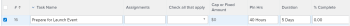

# Editar tareas en una lista {#edit-tasks-in-a-list}

Puede editar la información de una tarea en una lista de tareas editando los campos mostrados en la lista. Para obtener información sobre otras formas de editar tareas, consulte [Editar tareas](../../../manage-work/tasks/manage-tasks/edit-tasks.md).

## Requisitos de acceso

Debe tener el siguiente acceso para realizar los pasos de este artículo:

<table style="table-layout:auto"> 
 <col> 
 <col> 
 <tbody> 
  <tr> 
   <td role="rowheader">plan de Adobe Workfront*</td> 
   <td> 
Cualquiera
 </td> 
  </tr> 
  <tr> 
   <td role="rowheader">Licencia de Adobe Workfront*</td> 
   <td> 
Trabajo o superior
 </td> 
  </tr> 
  <tr> 
   <td role="rowheader">Configuraciones de nivel de acceso*</td> 
   <td> 
Editar acceso a Tareas y proyectos
 
Nota: Si todavía no tiene acceso, pregunte a su administrador de Workfront si establece restricciones adicionales en su nivel de acceso. Para obtener información sobre cómo un administrador de Workfront puede cambiar su nivel de acceso, consulte <a href="../../../administration-and-setup/add-users/configure-and-grant-access/create-modify-access-levels.md" class="MCXref xref">Crear o modificar niveles de acceso personalizados</a>.
 </td> 
  </tr> 
  <tr> 
   <td role="rowheader">Permisos de objeto</td> 
   <td> 
Contribute o permisos superiores para la tarea y el proyecto
 
Para obtener información sobre la solicitud de acceso adicional, consulte <a href="../../../workfront-basics/grant-and-request-access-to-objects/request-access.md" class="MCXref xref">Solicitar acceso a objetos </a>.
 </td> 
  </tr> 
 </tbody> 
</table>

&#42;Para saber qué plan, tipo de licencia o acceso tiene, póngase en contacto con el administrador de Workfront.

## Consideraciones sobre la edición de tareas en una lista {#considerations-about-editing-tasks-in-a-list}

Editar tareas en una lista es una forma rápida de realizar cambios en varias tareas simultáneamente, con una vista clara de cómo los cambios podrían afectar a la cronología del proyecto.

Tenga en cuenta lo siguiente al editar tareas en una lista:

* A diferencia de la necesidad de administrar permisos para la tarea al editarla en el cuadro de edición, puede editar una tarea en una lista solo con permisos de Contribute para la tarea. Esto le permite editar la siguiente información limitada para la tarea:

   * Descripción
   * Estado
   * Porcentaje completado
   * Información de formulario personalizado

      >[!NOTE]
      >
      >Puede editar un campo personalizado de tarea en una lista solo si tiene permisos para actualizar el campo.

   * Horas de registro
   * Modificar asignaciones
   * Ver información financiera
   * Añadir gastos, tareas o problemas

* Puede editar una tarea en las listas siguientes:

   * La sección Tareas del proyecto
   * Sección Subtareas del proyecto
   * Un informe de tareas

      >[!NOTE]
      >
      >De forma predeterminada, Workfront guarda automáticamente los cambios realizados en las tareas de la sección Subtareas o de un informe de tareas.

* Puede controlar cuándo Workfront guarda los cambios realizados en las tareas de una lista. Los cambios se pueden guardar automáticamente o manualmente.

   Para obtener información sobre cómo configurar cuándo Workfront guarda los cambios realizados en las tareas de una lista, consulte la [Seleccione una opción de guardado al editar tareas en una lista](#select-a-save-option-when-editing-tasks-in-a-list) en este artículo.

## Seleccione una opción de guardado al editar tareas en una lista {#select-a-save-option-when-editing-tasks-in-a-list}

Puede decidir dónde se guardan automáticamente los cambios realizados en las tareas de una lista, a medida que se producen, o si desea guardar manualmente cada cambio.

>[!IMPORTANT]
>
>Dependiendo de si guarda las tareas de forma automática o manual, puede sobrescribir la información de otra persona mientras edita las tareas en una lista. Para obtener información sobre cómo Workfront guarda los cambios en las tareas que realiza simultáneamente con otros usuarios, consulte [Información general sobre cómo guardar cambios simultáneos en una lista de tareas](../../../manage-work/tasks/manage-tasks/save-concurrent-changes-in-a-task-list.md).

Cuando guarda los cambios en una lista para un proyecto que tiene seleccionados Automático o Automático y Cambio activado como Tipo de actualización, Workfront actualiza la línea de tiempo del proyecto, junto con todas las dependencias del proyecto y entre proyectos. Los cálculos de línea de tiempo pueden tardar mucho tiempo si el proyecto es grande o si hay muchas dependencias. Algunos métodos para editar una lista de tareas pueden ser más rápidos que otros, según el método que seleccione para guardar los cambios.

Puede controlar cuándo Workfront guarda los cambios realizados en las tareas de una lista. Existen los siguientes escenarios: 

* Después de cada actualización, Workfront puede guardar automáticamente los cambios.

   Para obtener más información, consulte la sección [Editar tareas en una lista y guardar cambios automáticamente](#edit-tasks-in-a-list-and-automatically-save-changes) en este artículo.

* Puede controlar cuándo aplica varios cambios a la vez utilizando manualmente el botón Guardar .

   Para obtener más información, consulte la sección [Editar tareas en una lista y guardar cambios manualmente](#edit-tasks-in-a-list-and-manually-save-changes) en este artículo.

### Editar tareas en una lista y guardar cambios automáticamente {#edit-tasks-in-a-list-and-automatically-save-changes}

>[!TIP]
>
>Guardar los cambios y todas las dependencias del proyecto podría ser más lento si el proyecto tiene más de 2000 tareas o si tiene muchas dependencias.

Tenga en cuenta lo siguiente al guardar automáticamente los cambios de la lista de tareas:

* Puede aplicar una vista personalizada a la lista de tareas y editar los campos relacionados con las tareas a los que tenga acceso para actualizarlos.
* No puede revertir los cambios guardados automáticamente. Esta es la configuración predeterminada.
* Workfront vuelve a calcular la cronología del proyecto y todas las dependencias del proyecto y entre proyectos automáticamente después de cada cambio, cuando el tipo de actualización del proyecto es automático o automático y en caso de cambio. Para obtener información sobre el tipo de actualización del proyecto, consulte [Seleccione el tipo de actualización del proyecto](../../../manage-work/projects/manage-projects/select-project-update-type.md).

Para editar tareas en una lista y guardar cambios automáticamente:

1. Vaya al proyecto y, a continuación, haga clic en el **Tareas** para obtener más información.
1. Haga clic en el **Menú del modo Plan**  en la parte superior de la lista y asegúrese de que la variable **Autoguardar** está seleccionada.

   

1. Edite cualquier campo para el que tenga permisos de actualización manual.

   

1. (Opcional) Presione **Escape** para cancelar los cambios.
1. Pulse Intro para guardar los cambios en las tareas y en la cronología del proyecto.
1. (Opcional) Haga clic con el botón derecho en una tarea que desee modificar.

   O

   Haga clic en el **Más** menú  a la derecha del nombre de la tarea.

1. (Opcional) Seleccione entre las siguientes opciones:

   <table style="table-layout:auto"> 
    <col> 
    <col> 
    <tbody> 
     <tr> 
      <td role="rowheader"><strong>Abrir en una pestaña nueva</strong></td> 
      <td>Abre la tarea en una nueva ficha del explorador. </td> 
     </tr> 
     <tr> 
      <td role="rowheader"><strong>Editar</strong></td> 
      <td>
Abre el <strong>Editar tarea</strong> , donde puede editar la tarea.

Para obtener información sobre cómo editar una tarea, consulte <a href="#edit-tasks-in-a-list" class="MCXref xref">Editar tareas en una lista</a>.
</td> 
     </tr> 
     <tr> 
      <td role="rowheader">Eliminar</td> 
      <td>
Elimina la tarea.

Para obtener información sobre la eliminación de tareas, consulte <a href="../../../manage-work/tasks/manage-tasks/delete-tasks.md" class="MCXref xref">Eliminar tareas</a>.
</td> 
     </tr> 
     <tr> 
      <td role="rowheader">Sangría</td> 
      <td>
Sangra la tarea en un nivel. 

Esta opción solo se muestra en tareas independientes.
</td> 
     </tr> 
     <tr> 
      <td role="rowheader">Anulación de sangría</td> 
      <td>
Anula la tarea en un nivel. 

Esta opción solo se muestra en las tareas secundarias. 
</td> 
     </tr> 
     <tr> 
      <td role="rowheader">Insertar la tarea arriba</td> 
      <td>Inserta una tarea encima de la tarea seleccionada.</td> 
     </tr> 
     <tr> 
      <td role="rowheader">Insertar tarea debajo</td> 
      <td>Inserta una tarea bajo la tarea seleccionada</td> 
     </tr> 
     <tr> 
      <td role="rowheader">Duplicar</td> 
      <td>
Crea una versión duplicada de la tarea dentro del mismo proyecto. 
</td> 
     </tr> 
     <tr> 
      <td role="rowheader">Copiar en</td> 
      <td>
Copia la tarea en otro proyecto.

Para obtener información sobre cómo copiar y duplicar tareas, consulte <a href="../../../manage-work/tasks/manage-tasks/copy-and-duplicate-tasks.md" class="MCXref xref">Copiar y duplicar tareas</a>.
</td> 
     </tr> 
     <tr> 
      <td role="rowheader">Mover a</td> 
      <td>
Mueve la tarea a otro proyecto.

Para obtener información sobre cómo mover tareas, consulte <a href="../../../manage-work/tasks/manage-tasks/move-tasks.md" class="MCXref xref">Mover tareas</a>.
</td> 
     </tr> 
    </tbody> 
   </table>

   Los cambios se guardan automáticamente y no se pueden revertir.

### Editar tareas en una lista y guardar cambios manualmente {#edit-tasks-in-a-list-and-manually-save-changes}

Puede guardar manualmente los cambios realizados en las tareas de una lista. Cuando guarda los cambios de esta forma, tiene la flexibilidad de revertirlos antes de guardarlos.

>[!TIP]
>
>* No se pueden revertir los cambios realizados en las tareas de una lista al editarlas en la sección Subtareas o en un informe de tareas.
>* No existen limitaciones en cuanto a la cantidad de cambios que puede revertir. Puede revertir todas una por una hasta que alcance el estado original de las tareas.
>

Tenga en cuenta lo siguiente al guardar cambios en una lista de tareas manualmente:

* Para guardar los cambios de la lista de tareas manualmente, necesita permisos para Administrar las tareas y el proyecto.
* No puede editar el proyecto. La opción para editar el proyecto está desactivada.
* No se puede actualizar la información en el encabezado del proyecto. Solo puede hacer lo siguiente al guardar manualmente los cambios en la lista de tareas:

   * Suscríbase al proyecto.
   * Añada el proyecto a la lista de favoritos.
   * Abra una tarea haciendo clic en su nombre en la lista.

* Edite las tareas de forma masiva. El icono Editar se desactiva al seleccionar varias tareas.
* Workfront déclencheur las notificaciones sobre los cambios realizados en las tareas solo después de guardar los cambios.

Existen dos maneras de guardar manualmente los cambios en las tareas de una lista. Estas dos maneras se describen a continuación.

* [Guarde los cambios en una lista de tareas manualmente al seleccionar la opción Guardar manual estándar](#save-changes-in-a-task-list-manually-when-you-select-the-manual-save-standard-option)
* [Guarde los cambios en una lista de tareas manualmente al seleccionar la opción Guardar manual planificación de línea de tiempo](#save-changes-in-a-task-list-manually-when-you-select-the-manual-save-timeline-planning-option)

#### Guarde los cambios en una lista de tareas manualmente al seleccionar la opción Guardar manual estándar {#save-changes-in-a-task-list-manually-when-you-select-the-manual-save-standard-option}

>[!TIP]
>
>Si el proyecto tiene más de 2000 tareas o si tiene muchas dependencias, puede tardar un rato en identificar visualmente los cambios que realice en las tareas y cómo afectan estos cambios a todas las dependencias del proyecto. En este caso, guardar los cambios puede tardar más si el proyecto tiene más de 2000 tareas o si tiene muchas dependencias.

Tenga en cuenta lo siguiente al actualizar tareas en una lista después de seleccionar la opción Guardar manual estándar :

* Puede aplicar una vista personalizada a la lista de tareas y editar los campos relacionados con tareas que tenga permisos para Administrar en esa vista.
* Workfront calcula la escala de tiempo del proyecto y todas las dependencias del proyecto y entre proyectos después de hacer clic en Guardar, cuando el tipo de actualización del proyecto es automático o automático y en cambio. Para obtener información sobre el tipo de actualización del proyecto, consulte [Seleccione el tipo de actualización del proyecto](../../../manage-work/projects/manage-projects/select-project-update-type.md).

Para editar tareas en una lista al seleccionar la opción Guardar manual estándar :

1. Vaya a un proyecto y, a continuación, haga clic en el **Tareas** sección .
1. Haga clic en el **Modo de plan** menú  en la parte superior de la lista y seleccione **Guardar manualmente** y haga clic en **Estándar** > **Aplicar**.

   

   Se muestra una configuración de la barra de herramientas con opciones para deshacer, rehacer y guardar los cambios.

   

1. Haga clic dentro de cualquier campo para el que tenga permisos de actualización manual. El campo se puede editar y puede realizar cambios.

   

1. Pulse Intro para guardar temporalmente los cambios realizados.
1. (Opcional) Haga clic en el **Icono Deshacer**  para revertir un cambio y devolver un campo a su estado original.
1. (Opcional y condicional) Haga clic en el botón **Icono Rehacer**  para restaurar el cambio revertido.

1. (Opcional) Haga clic con el botón derecho en una tarea que desee modificar.

   O

   Haga clic en el **Más** menú .

1. (Opcional) Seleccione entre las siguientes opciones:

   <table style="table-layout:auto"> 
    <col> 
    <col> 
    <tbody> 
     <tr> 
      <td role="rowheader"><strong>Abrir en una pestaña nueva</strong> </td> 
      <td>Abre la tarea en una nueva ficha del explorador. </td> 
     </tr> 
     <tr> 
      <td role="rowheader">Eliminar</td> 
      <td>Para obtener información sobre la eliminación de tareas, consulte <a href="../../../manage-work/tasks/manage-tasks/delete-tasks.md" class="MCXref xref">Eliminar tareas</a>.</td> 
     </tr> 
     <tr> 
      <td role="rowheader">Sangría</td> 
      <td> 
Sangra la tarea en un nivel. 
 
Esta opción solo se muestra en tareas independientes.
 </td> 
     </tr> 
     <tr> 
      <td role="rowheader">Anulación de sangría</td> 
      <td> 
Anula la tarea en un nivel. 
 
Esta opción solo se muestra en las tareas secundarias. 
 </td> 
     </tr> 
     <tr> 
      <td role="rowheader">Insertar la tarea arriba</td> 
      <td>Inserta una tarea encima de la tarea seleccionada.</td> 
     </tr> 
     <tr> 
      <td role="rowheader">Insertar tarea debajo</td> 
      <td>Inserta una tarea bajo la tarea seleccionada</td> 
     </tr> 
     <tr> 
      <td role="rowheader">Duplicar</td> 
      <td> 
Crea una versión duplicada de la tarea dentro del mismo proyecto. 
 
Para obtener información sobre cómo copiar y duplicar tareas, consulte <a href="../../../manage-work/tasks/manage-tasks/copy-and-duplicate-tasks.md" class="MCXref xref">Copiar y duplicar tareas</a>.
 </td> 
     </tr> 
    </tbody> 
   </table>

1. Workfront actualiza todas las dependencias del proyecto y entre proyectos al realizar cambios en la cronología de tareas.
1. Haga clic en **Guardar** si desea mantener los cambios de la tarea de forma permanente y guardar la cronología del proyecto.

#### Guarde los cambios en una lista de tareas manualmente al seleccionar la opción Guardar manual planificación de línea de tiempo {#save-changes-in-a-task-list-manually-when-you-select-the-manual-save-timeline-planning-option}

Guardar los cambios y todas las dependencias del proyecto es más rápido. Esto no está disponible para proyectos con más de 2000 tareas.

>[!IMPORTANT]
>
>Se recomienda utilizar esta opción al editar una larga lista de tareas de más de unos pocos cientos que tienen muchas dependencias. El uso de esta opción le permite identificar visualmente los cambios mucho más rápido que con la opción Guardar manualmente .

Tenga en cuenta lo siguiente al utilizar la opción Guardar manualmente planificación de línea de tiempo en una lista de tareas:

* No puede aplicar la opción de planificación manual para guardar la línea de tiempo a proyectos que tengan más de 2000 tareas.
* No se puede aplicar una vista, filtro o agrupación personalizados a la lista de tareas. Los menús desplegables Ver, Filtrar y Agrupar, así como el icono Vista ÁGIL, están desactivados. La vista que se aplica de forma predeterminada contiene un número limitado de campos.
* La línea de tiempo del proyecto y todas las dependencias del proyecto se calculan automáticamente después de cada cambio cuando el tipo de actualización del proyecto es automático o automático y al cambiar.
* Las dependencias entre proyectos se calculan después de hacer clic en Guardar, cuando el tipo de actualización del proyecto es automático o automático y en cambio. Para obtener información sobre el tipo de actualización del proyecto, consulte [Seleccione el tipo de actualización del proyecto](../../../manage-work/projects/manage-projects/select-project-update-type.md).

Para editar tareas en una lista al utilizar la opción Guardar manualmente planificación de línea de tiempo:

1. Vaya a un proyecto y, a continuación, haga clic en el **Tareas** para obtener más información.
1. Haga clic en el **Modo de plan** menú  en la parte superior de la lista y seleccione **Guardar manualmente** y haga clic en **Planificación de la cronología**> **Aplicar**.

   Esta opción está atenuada para los proyectos con más de 2000 tareas.

   

   >[!TIP]
   >
   >Cuando sale de esta página, Workfront vuelve a activar la opción Guardar automáticamente .

   Observe los siguientes cambios en la lista:

   * Los menús desplegables Ver, Agrupar y Filtrar se eliminan y la vista se reemplaza por los siguientes campos:

      * Número de tarea
      * Nombre de la tarea
      * Tipo de restricción
      * Duración
      * Fecha planificada de inicio
      * Fecha planificada de finalización
      * Predecesoras
      * Asignaciones
      * Estado
      * Porcentaje completado
   * Se elimina el icono Vista Águila .
   * Se muestra una configuración de la barra de herramientas con opciones para deshacer, rehacer y guardar los cambios.

      

1. Edite cualquier campo para el que tenga permisos de actualización manual.

   

1. Pulse Intro para guardar temporalmente los cambios realizados.
1. (Opcional) Haga clic en el **Icono Deshacer**  para revertir un cambio y devolver un campo a su estado original.
1. (Opcional y condicional) Haga clic en el botón **Icono Rehacer**  para restablecer el cambio revertido.

1. (Opcional) Haga clic con el botón derecho en una tarea que desee modificar

   O

   Haga clic en el **Más** menú .

1. Seleccione entre las siguientes opciones:

   <table style="table-layout:auto"> 
    <col> 
    <col> 
    <tbody> 
     <tr> 
      <td role="rowheader"><strong>Abrir en una pestaña nueva</strong> </td> 
      <td>Abre la tarea en una nueva ficha del explorador. </td> 
     </tr> 
     <tr> 
      <td role="rowheader">Eliminar</td> 
      <td>Para obtener información sobre la eliminación de tareas, consulte <a href="../../../manage-work/tasks/manage-tasks/delete-tasks.md" class="MCXref xref">Eliminar tareas</a>.</td> 
     </tr> 
     <tr> 
      <td role="rowheader">Sangría</td> 
      <td> 
Sangra la tarea en un nivel. 
 
Esta opción solo se muestra en tareas independientes.
 </td> 
     </tr> 
     <tr> 
      <td role="rowheader">Anulación de sangría</td> 
      <td> 
Anula la tarea en un nivel. 
 
Esta opción solo se muestra en las tareas secundarias. 
 </td> 
     </tr> 
     <tr> 
      <td role="rowheader">Insertar la tarea arriba</td> 
      <td>Inserta una tarea encima de la tarea seleccionada.</td> 
     </tr> 
     <tr> 
      <td role="rowheader">Insertar tarea debajo</td> 
      <td>Inserta una tarea bajo la tarea seleccionada</td> 
     </tr> 
     <tr> 
      <td role="rowheader">Duplicar</td> 
      <td> 
Crea una versión duplicada de la tarea dentro del mismo proyecto. 
 
Para obtener información sobre cómo copiar y duplicar tareas, consulte <a href="../../../manage-work/tasks/manage-tasks/copy-and-duplicate-tasks.md" class="MCXref xref">Copiar y duplicar tareas</a>.
 </td> 
     </tr> 
    </tbody> 
   </table>

1. Workfront actualiza todas las dependencias del proyecto y entre proyectos al cambiar la cronología de una tarea.
1. Haga clic en **Guardar** si desea mantener los cambios de la tarea de forma permanente y guardar la cronología del proyecto.

## Editar una tarea en una lista mediante el Resumen

1. Vaya al proyecto que contenga las tareas que desee editar.
1. Haga clic en **Tareas** en el panel izquierdo.

   Se muestra la lista de tareas del proyecto.

1. Haga clic en el menú Más  después del nombre de la tarea, haga clic en **Abrir resumen**. Seleccione la tarea que desee editar y, a continuación, haga clic en el botón **Icono Abrir resumen**  en la esquina superior derecha de la lista.

   La variable **Resumen** se abre.

   

1. (Opcional) Haga clic en el **Icono X** en la parte superior derecha del resumen para cerrar el panel y editar las tareas en línea.

   Siga los pasos para editar una tarea en una lista para editarla en línea.

   Para obtener información sobre cómo editar la tarea en una lista, consulte [Consideraciones sobre la edición de tareas en una lista](#considerations-about-editing-tasks-in-a-list) en este artículo.

1. (Opcional) Escriba una actualización para la tarea en la **Actualizaciones** .
1. Haga clic en cualquiera de los siguientes iconos o áreas para ir a la tarea y editar la información en el nivel de tarea:

   | Documentos | Haga clic en **Haga clic aquí para agregar** para añadir documentos a la tarea. |
   |---|---|
   | Detalles | Haga clic en para actualizar la información sobre la tarea. |
   | Formularios personalizados | Haga clic en para agregar o quitar Forms personalizado o actualizar información sobre los formularios. |
   | Horas | Haga clic en para registrar las horas. |
   | Rutas de aprobación | Haga clic en para añadir aprobaciones de tareas. |

   {style="table-layout:auto"}

1. Haga clic en el botón Atrás del explorador para volver a la lista de tareas cuando termine de actualizar la tarea.

## Editar tareas de forma masiva

Puede editar varias tareas a la vez. Asegúrese de que tiene permisos de administración para las tareas para poder editarlas.

1. Vaya a un proyecto que contenga tareas que desee editar de forma masiva.
1. Haga clic en **Tareas** en el panel izquierdo.
1. Asegúrese de que la variable **Autoguardar** está seleccionada.

   >[!IMPORTANT]
   >
   >No puede editar tareas de forma masiva al guardar tareas manualmente.

   Para obtener más información sobre cómo guardar cambios en tareas de una lista, consulte la sección [Consideraciones sobre la edición de tareas en una lista](#considerations-about-editing-tasks-in-a-list) en este artículo.

1. Seleccione varias tareas en la lista de tareas.
1. Haga clic en el **Icono Editar** .

   La variable **Editar tareas** se abre.

1. Especifique la información que desea cambiar para todas las tareas seleccionadas.

   Editar la información de todas las tareas es idéntico a editar la información de una tarea. Si desea editar la duración de la tarea, las tareas seleccionadas deben tener la misma restricción de tareas; de lo contrario, la variable **Duración** no se rellena.

   Para obtener más información sobre cómo editar una tarea, consulte [Editar tareas](../../../manage-work/tasks/manage-tasks/edit-tasks.md).

   >[!NOTE]
   >
   >La información que está cambiando sobre todas las tareas seleccionadas anulará la información existente sobre tareas individuales, excepto para el **Asignaciones** campo . Añadir un nuevo usuario asignado en una edición masiva agregará ese usuario asignado a todas las tareas seleccionadas. Si se asignan otros usuarios asignados a las tareas seleccionadas, se les seguirá asignando además del añadido mediante la edición masiva.

1. Haga clic en **Forms personalizado** para editar los formularios personalizados adjuntos a todas las tareas seleccionadas. En la lista solo aparecen los formularios personalizados activos.

   Si las tareas seleccionadas no tienen formularios personalizados comunes, no se muestra ningún formulario en esta sección.

   Solo se pueden editar los campos de los formularios adjuntos a todas las tareas seleccionadas y que tienen permisos para editar.

1. (Opcional) En la sección Forms personalizado , seleccione el **Volver a calcular expresiones personalizadas** para asegurarse de que todos los campos personalizados calculados que se encuentran en los formularios personalizados adjuntos a las tareas seleccionadas estén actualizados.
1. Haga clic en **Guardar cambios**.

   Todos los cambios realizados ahora están visibles en todas las tareas seleccionadas.

Para obtener información sobre la edición masiva de formularios personalizados, consulte la sección &quot;Editar varios Forms personalizados al editar objetos por lotes&quot; en [Administrar formularios personalizados adjuntos a objetos](../../../workfront-basics/work-with-custom-forms/manage-custom-forms-attached-to-objects.md).
