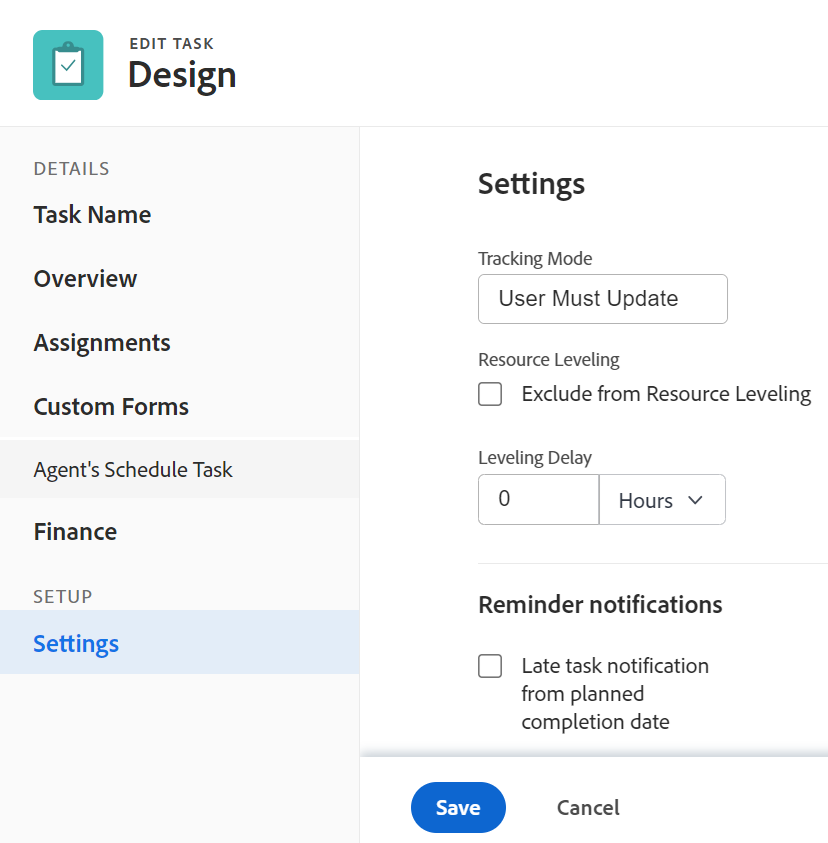

# Editar tareas

<!--

(NOTE: some information in this area is repeated in the following articles. If you need to update a fied, update it in both:

** Task finances in details

** Task information in overview)

-->

Puede editar información sobre las tareas que ha creado o a las que tiene permisos de Contribute o Administrar.

## Requisitos de acceso

Debe tener el siguiente acceso para realizar los pasos de este artículo:

<table style="table-layout:auto"> 
 <col> 
 <col> 
 <tbody> 
  <tr> 
   <td role="rowheader">plan de Adobe Workfront*</td> 
   <td> 
Cualquiera 
 </td> 
  </tr> 
  <tr> 
   <td role="rowheader">Licencia de Adobe Workfront*</td> 
   <td> 
Trabajo o superior
 </td> 
  </tr> 
  <tr> 
   <td role="rowheader">Nivel de acceso*</td> 
   <td> 
Editar acceso a Tareas y proyectos
 
<b>NOTA</b>

Si todavía no tiene acceso, pregunte a su administrador de Workfront si establece restricciones adicionales en su nivel de acceso. Para obtener información sobre cómo un administrador de Workfront puede cambiar su nivel de acceso, consulte <a href="../../../administration-and-setup/add-users/configure-and-grant-access/create-modify-access-levels.md" class="MCXref xref">Crear o modificar niveles de acceso personalizados</a>.
 </td>
</tr> 
  <tr> 
   <td role="rowheader">Permisos de objeto</td> 
   <td> 
    <ul> 
     <li> 
Contribuir permisos a una tarea para editarla en el área Detalles de la tarea 
 </li> 
     <li> 
Administrar permisos para una tarea para editarla en el cuadro Editar tarea
 </li> 
    </ul> 
    <ul> 
     <li> 
Contribute o permisos superiores para el proyecto
 </li> 
    </ul> 
Para obtener información sobre la solicitud de acceso adicional, consulte <a href="../../../workfront-basics/grant-and-request-access-to-objects/request-access.md" class="MCXref xref">Solicitar acceso a objetos </a>.
 </td> 
  </tr> 
 </tbody> 
</table>

&#42;Para saber qué plan, tipo de licencia o acceso tiene, póngase en contacto con el administrador de Workfront.

## Limitaciones para las tareas de edición

Existen algunas limitaciones que pueden impedir la edición de tareas.

Tenga en cuenta lo siguiente al editar tareas:

* Actualizar tareas déclencheur notificaciones para proyectos que tengan el estado actual. Para evitar confusiones entre los usuarios asignados a las tareas, limite las tareas de edición en la medida de lo posible cuando el proyecto esté en estado Actual .
* No puede editar tareas que se encuentren en un proceso de aprobación. Solo puede registrar la hora o actualizar el estado de una tarea en un proceso de aprobación.

   

* Puede editar y agregar documentos a tareas de un proyecto que tenga el estado Finalizado, Finalizado o Pendiente de aprobación solo cuando el administrador de Workfront o un administrador de grupo hayan habilitado esta funcionalidad en el área Preferencias del proyecto. Para obtener información sobre cómo definir las preferencias del proyecto, consulte [Configurar las preferencias de proyecto de todo el sistema](../../../administration-and-setup/set-up-workfront/configure-system-defaults/set-project-preferences.md).

* Siempre puede editar la siguiente información sobre una tarea cuando el proyecto esté marcado como Completado, Muerto o en un Proceso de aprobación:

   * Tiempo de registro
   * Editar gastos existentes
   * Adjuntar un formulario personalizado

## Editar una tarea en una lista

Puede editar la información de una tarea en una lista de tareas, editando en línea los campos mostrados en la vista de la lista.

Para obtener información sobre la edición de tareas en listas, consulte [Editar tareas en una lista](../../../manage-work/tasks/manage-tasks/edit-tasks-in-a-list.md).

## Editar una tarea en una lista mediante el Resumen

Puede editar una tarea en una lista mediante el panel Resumen. Para obtener información sobre la edición de una tarea en el panel Resumen, consulte la sección &quot;Editar una tarea en el resumen&quot; en la sección [Editar tareas en una lista](../../../manage-work/tasks/manage-tasks/edit-tasks-in-a-list.md) artículo.

## Editar una tarea en el cuadro Editar tarea

Puede editar una tarea mediante las áreas Editar tarea o Detalles de tarea . Los siguientes pasos describen la edición de una tarea en el cuadro Editar tarea.

1. Haga clic en el **Menú principal** icono  en la esquina superior derecha de Adobe Workfront.

1. Haga clic en **Proyectos** y, a continuación, haga clic en el nombre de un proyecto para abrirlo.
1. Haga clic en **Tareas** en el panel izquierdo.
1. Haga clic en la tarea que desee editar.
1. (Opcional) Para editar información limitada sobre una tarea, haga clic en **Detalles de la tarea** en el panel izquierdo.

   

   Considere la posibilidad de editar información en las siguientes áreas de la sección Detalles de la tarea :

   * **Información general**

      Esta área está expandida de forma predeterminada.

   * **Formularios personalizados**

      Los nombres de los formularios de aduanas solo se muestran si hay formularios personalizados adjuntos al objeto.

   * **Finanzas**
   >[!NOTE]
   >
   >Según la forma en que el administrador de Workfront o el administrador de grupo hayan modificado la plantilla de diseño, los campos del área Detalles de la tarea podrían reorganizarse o no mostrarse. Para obtener más información, consulte [Personalización de la vista Detalles mediante una plantilla de diseño](../../../administration-and-setup/customize-workfront/use-layout-templates/customize-details-view-layout-template.md).

   Para obtener información sobre los campos visibles en la sección Detalles de la tarea ,

   continúe editando la tarea en el cuadro Editar tarea como se describe a continuación.

   Para editar la información de la sección Detalles , haga lo siguiente:

   1. (Opcional) Haga clic en el **Contraer todo** icono  en la esquina superior derecha para contraer todas las áreas.
   1. (Opcional y condicional) Cuando un área esté contraída, haga clic en el botón **flecha hacia la derecha**  junto a cada área para expandir el área que desea editar.
   1. Para obtener más información sobre la edición de información en la ficha Detalles de la tarea, consulte los siguientes artículos:

      * [Administrar información de tarea en el área Información general de detalles de tarea](../../../manage-work/tasks/manage-tasks/task-information-in-overview.md)
      * [Administrar finanzas de tarea en la sección Detalles de la tarea](../../../manage-work/tasks/manage-tasks/task-finances-in-details.md)
   1. (Opcional) Si no hay formularios personalizados adjuntos a la tarea, empiece a escribir el nombre de un formulario en el **Agregar formulario personalizado** , selecciónelo cuando aparezca en la lista y haga clic en **Guardar cambios**.
   1. (Opcional) Haga clic en el **Exportar** icono  para exportar la información general y de formularios personalizados a un archivo PDF, haga clic en **Exportar**. Seleccione una de las siguientes opciones:

      * Seleccionar todo (solo se muestra cuando hay al menos un formulario personalizado adjunto)
      * Información general
      * El nombre de uno o varios formularios personalizados

      El archivo del PDF se descarga a su equipo.

      

      Para obtener más información, consulte [Exportar formularios personalizados y detalles de objetos](../../../workfront-basics/work-with-custom-forms/export-custom-forms-details.md).

1. Para editar toda la información sobre la tarea, haga clic en el botón **Más** menú  junto al nombre de la tarea y, a continuación, haga clic en **Editar**.

   O

   En una lista de tareas, seleccione una tarea y haga clic en el **Editar** icono  en la parte superior de la lista.

   Se abre el cuadro Editar tarea.

   >[!IMPORTANT]
   >
   >Debe tener permisos de gestión para la tarea para ver la opción Editar .

   Todos los campos de tareas están disponibles en el cuadro Editar tarea y se agrupan por las áreas que aparecen en el panel izquierdo.

   >[!NOTE]
   >
   >Según la forma en que el administrador de Workfront o el administrador de grupo hayan modificado la plantilla de diseño, los campos del área Detalles de la tarea podrían reorganizarse o no mostrarse. Para obtener más información, consulte [Personalización de la vista Detalles mediante una plantilla de diseño](../../../administration-and-setup/customize-workfront/use-layout-templates/customize-details-view-layout-template.md).

   Considere la posibilidad de especificar información en cualquiera de las secciones siguientes:

   * [Nombre de la tarea](#task-name)
   * [Información general](#overview)
   * [Asignaciones](#assignments)
   * [Formularios personalizados](#Custom%C2%A0F)
   * [Finanzas](#finance)
   * [Configuración](#settings)

   >[!NOTE]
   >
   >Dependiendo de cómo configure el administrador de Workfront o el administrador de grupo nuestra plantilla de diseño, los campos del cuadro Editar tarea podrían reorganizarse o no mostrarse. Para obtener más información, consulte [Personalización de la vista Detalles mediante una plantilla de diseño](../../../administration-and-setup/customize-workfront/use-layout-templates/customize-details-view-layout-template.md).

### Nombre de la tarea {#task-name}

1. Comience a editar la tarea como se describe anteriormente.
1. Haga clic en **Nombre de la tarea** en el panel izquierdo.

   

1. Actualice el nombre de la tarea.

1. Haga clic en **Guardar** o continúe con las secciones siguientes.

### Información general {#overview}

1. Comience a editar la tarea como se describe anteriormente.
1. Haga clic en **Información general** en el panel izquierdo.

   

1. Actualice la siguiente información sobre la tarea:

   <table style="table-layout:auto"> 
    <col> 
    <col> 
    <tbody> 
     <tr> 
      <td role="rowheader">Descripción</td> 
      <td>Agregue información adicional sobre la tarea. </td> 
     </tr> 
     <tr> 
      <td colspan="2" role="rowheader">Sección de información básica </td> 
     </tr> 
     <tr> 
      <td role="rowheader">Estado</td> 
      <td> 
Seleccione el estado de la tarea que indica en qué fase de desarrollo se encuentra la tarea.
 
<b>SUGERENCIA</b>

   Puede actualizar el estado de la tarea en el encabezado de la tarea. 
 </td>
   </tr> 
     <tr> 
      <td role="rowheader">Prioridad</td> 
      <td> 
Se trata de un indicador visual que le permite priorizar sus tareas. 
 
Seleccione entre las siguientes opciones: 
 
       <ul> 
      <li> 
 Ninguno
 </li> 
      <li> 
 Bajo 
 </li> 
      <li> 
Normal 
 </li> 
      <li> 
Alto 
 </li> 
      <li> 
 Urgente 
 </li> 
       </ul> 
Según las preferencias de proyecto seleccionadas por el administrador de Workfront, los nombres de las prioridades pueden ser diferentes para usted. Para obtener información sobre las prioridades de tareas, consulte <a href="../../../manage-work/tasks/task-information/task-priority.md" class="MCXref xref">Actualizar prioridad de tareas</a>. 
 </td> 
     </tr> 
     <tr> 
      <td colspan="2" role="rowheader">Sección de fechas y restricciones de tareas </td> 
     </tr> 
     <tr> 
      <td role="rowheader">Restricción de tarea</td> 
      <td> 
Decida cuándo se debe completar la tarea especificando una Restricción de tarea. 
 
Seleccione entre las siguientes opciones: 
 
       <ul> 
      <li> 
Fechas fijas 
 
Especifique un <strong>Inicio planificado</strong> y <strong>Fecha de finalización planeada</strong>. 
 </li> 
      <li> 
Debe iniciarse el 
 
Especifique un <strong>Fecha de inicio planeada</strong>. 
 </li> 
      <li> 
Debe finalizarse el 
 
Especifique un <strong>Fecha de finalización planeada</strong>. 
 </li> 
       </ul> 
       <ul> 
      <li> 
Tan pronto como sea posible
 </li> 
      <li> 
Tan tarde como sea posible
 </li> 
      <li> 
Lo más temprano disponible
 </li> 
      <li> 
 Lo más tarde posible
 </li> 
      <li> 
No iniciar después del 
 </li> 
      <li> 
Especificar una fecha de inicio planificada
 </li> 
      <li> 
No iniciar antes del 
 
Especifique un <strong>Fecha de inicio planeada</strong>. 
 </li> 
      <li> 
 Finalizar A Más Tardar
 
Especifique un <strong>Fecha de finalización planeada</strong>. 
 </li> 
      <li> 
 Finalizar No anterior a
 
Especifique un <strong>Fecha de finalización planeada</strong>
 </li> 
       </ul> 
Para obtener más información sobre la restricción de tareas, consulte <a href="../../../manage-work/tasks/task-constraints/task-constraint-overview.md" class="MCXref xref">Información general sobre la restricción de tareas</a>.
 </td> 
     </tr> 
     <tr> 
      <td role="rowheader">Fecha y hora de confirmación</td> 
      <td> 
Esta es la fecha en la que el usuario asignado a la tarea se compromete a completarla. Puede ser diferente a la fecha de finalización planeada. Solo las personas asignadas pueden editar este campo. Para obtener información sobre fechas de confirmación en Workfront, consulte <a href="../../../manage-work/projects/updating-work-in-a-project/overview-of-commit-dates.md" class="MCXref xref">Resumen de la fecha de confirmación</a>. 
 </td> 
     </tr> 
     <tr> 
      <td role="rowheader">Fecha y hora de inicio planificadas</td> 
      <td> 
Cuando se planifica el inicio de la tarea. La fecha de inicio prevista de una tarea está establecida e influida por varios factores:
 
       <ul> 
      <li>Según la preferencia de todo el sistema para la fecha de inicio planificada de la tarea, la fecha de inicio de una nueva tarea en un proyecto puede ser hoy o la fecha de inicio del proyecto, de forma predeterminada. El administrador del grupo para el grupo asociado con el proyecto también puede establecer esta preferencia para el grupo. Para obtener más información sobre las preferencias de tareas de nivel de sistema o de grupo, consulte <a href="../../../administration-and-setup/set-up-workfront/configure-system-defaults/set-task-issue-preferences.md" class="MCXref xref">Configurar las preferencias de problemas y tareas de todo el sistema</a>.</li> 
      <li>En función de los predecesores de la tarea, Workfront selecciona la fecha de inicio prevista como la siguiente fecha disponible después de que los predecesores hayan finalizado o comenzado, en función de la relación predecesora. Para obtener más información sobre las relaciones predecesoras, consulte <a href="../../../manage-work/tasks/use-prdcssrs/predecessors-overview.md" class="MCXref xref">Descripción general de las predecesoras de tareas</a>.</li> 
      <li>El administrador del proyecto o el propietario de la tarea pueden establecer manualmente la fecha de inicio planificada cuando la restricción de la tarea es Fechas fijas o Debe comenzar el. Para obtener más información sobre las restricciones de tareas, consulte <a href="../../../manage-work/tasks/task-constraints/task-constraint-overview.md" class="MCXref xref">Información general sobre la restricción de tareas</a>.</li> 
       </ul> </td> 
     </tr> 
     <tr> 
      <td role="rowheader">Fecha y hora de finalización planificadas</td> 
      <td> 
La fecha de finalización prevista, tal como se muestra cuando se planifica la tarea. La fecha de finalización prevista se puede establecer por varios factores:
 
       <ul> 
      <li>La fecha de finalización planificada se calcula a partir de la fecha de inicio planificada añadiendo la Duración de la tarea a la fecha de inicio planificada. Cuando el administrador de proyectos o Workfront especifica la duración de la tarea, se déclencheur una actualización a la fecha de finalización prevista. Si la fecha planeada cambia, a menudo se debe a que se ha actualizado la Duración del .</li> 
      <li>El administrador del proyecto o el propietario de la tarea pueden establecer manualmente la fecha de finalización planificada cuando la restricción de la tarea es Fechas fijas o Debe finalizar el. Para obtener más información sobre las restricciones de tareas, consulte <a href="../../../manage-work/tasks/task-constraints/task-constraint-overview.md" class="MCXref xref">Información general sobre la restricción de tareas</a>.</li> 
      <li>Si el tipo de duración de la tarea cambia y el número de recursos de las tareas cambia al mismo tiempo, también cambiará la fecha de finalización prevista. Para obtener más información sobre los tipos de duración, consulte <a href="../../../manage-work/tasks/taskdurtn/task-duration-and-duration-type.md" class="MCXref xref">Información general sobre la duración y el tipo de duración de la tarea</a>.</li> 
       </ul> </td> 
     </tr> 
     <tr> 
      <td role="rowheader">Fecha y hora de inicio reales</td> 
      <td> 
Especifique una Fecha de inicio real para la tarea. El valor predeterminado suele rellenarse automáticamente cuando se cambia el estado de la tarea a In Progress. El administrador del proyecto o el propietario de la tarea también pueden modificar manualmente la fecha de inicio real. 
 </td> 
     </tr> 
     <tr> 
      <td role="rowheader">Fecha y hora de finalización real</td> 
      <td> 
Especifique la fecha y la hora reales cuando se complete la tarea. La fecha y hora predeterminadas en que se completa una tarea siempre coinciden con la hora real en que se completa el estado. El administrador del proyecto o el propietario de la tarea también pueden modificar manualmente la fecha de finalización real. 
 </td> 
     </tr> 
     <tr> 
      <td role="rowheader"><b>Sección Tiempo de trabajo</b></td> 
     </tr> 
     <tr> 
      <td role="rowheader">Esfuerzo de trabajo </td> 
      <td>

   
La cantidad de esfuerzo necesario para completar la tarea. El administrador de proyectos puede decidir utilizar este campo en lugar de Horario planificado para estimar el esfuerzo necesario para completar una tarea. Este campo solo está visible cuando se cumplen las siguientes condiciones:
 
      <ul> 
      <li> 
La tarea tiene un Tipo de duración simple. 
 
<b>SUGERENCIA</b>

   Si cambia el Tipo de duración de la tarea, este campo se atenúa. 
 </li>
   <li>El administrador de proyectos ha habilitado el campo Utilizar esfuerzo de trabajo para calcular automáticamente las horas planificadas de la tarea en el proyecto. </li> 
      </ul> 
      
Seleccione entre las siguientes opciones:
 
      <ul> 
      <li>Pequeño</li> 
      <li>Medio (este es el valor predeterminado para una nueva tarea)</li> 
      <li>Grande</li> 
      </ul> 
      
<b>NOTA</b>

   Actualizar la cantidad de esfuerzo podría actualizar la tarea Horario planificado. La actualización es inmediata si el tipo de actualización del proyecto es automático. Cuando el tipo de actualización del proyecto es manual, debe volver a calcular la cronología para ver las horas planificadas actualizadas. 

   
Para obtener información sobre el uso de Esfuerzo de Trabajo en lugar de Horas planificadas para estimar el esfuerzo de la tarea, consulte <a href="../../../manage-work/tasks/task-information/work-effort.md" class="MCXref xref">Información general sobre el esfuerzo de trabajo</a>. 
 
    </td> 
     </tr> 
    </tbody> 
   </table>

1. Haga clic en **Guardar** o continúe con las secciones siguientes.

### Asignaciones {#assignments}

1. Comience a editar la tarea como se describe anteriormente.
1. Haga clic en **Asignaciones** en el panel izquierdo.

   

1. Haga clic en **Buscar personas, roles y equipos** y empiece a escribir el nombre de un usuario, función o equipo que desee asignar a la tarea. A continuación, haga clic en él o pulse Intro cuando aparezca en la lista.

   >[!NOTE]
   >
   >Si el nombre del usuario contiene un carácter especial, debe incluir el carácter especial en el campo de búsqueda.

   >[!TIP]
   >
   >Puede asignar varios usuarios, funciones de trabajo o equipos. Solo puede asignar usuarios activos, funciones de trabajo y equipos.
   >
   >Si se asignó un usuario, una función de trabajo o un equipo antes de desactivarlos, se asignarán al elemento de trabajo. En este caso, se recomienda lo siguiente:
   >
   >* Reasigne el elemento de trabajo a los recursos activos.
   >* Asocie a los usuarios de un equipo desactivado con un equipo activo y reasigne el elemento de trabajo al equipo activo.

1. (Opcional) Indique si un usuario asignado es el usuario asignado principal de la tarea, seleccionando la variable **Propietario** botón de opción junto a su nombre. Un equipo no puede ser el usuario asignado principal de una tarea.
1. (Condicional y opcional) Actualice los campos siguientes:

   <table style="table-layout:auto"> 
    <col> 
    <col> 
    <tbody> 
     <tr> 
      <td role="rowheader">Tipo de duración</td> 
      <td> 
Esto identifica la relación entre lo siguiente: 
 
       <ul> 
      <li> 
Número de recursos asignados a una tarea 
 </li> 
      <li> 
El esfuerzo total necesario para completar la tarea 
 </li> 
      <li> 
 Duración total de la tarea. 
 </li> 
       </ul> 
Su administrador de Workfront  o un administrador de grupo selecciona la configuración predeterminada Tipo de duración para las tareas del sistema o del grupo. Para obtener información sobre la configuración de los valores predeterminados del proyecto, consulte <a href="../../../administration-and-setup/set-up-workfront/configure-system-defaults/set-project-preferences.md" class="MCXref xref">Configurar las preferencias de proyecto de todo el sistema</a>. 
 
Los tipos de duración permiten establecer asignaciones de recursos coherentes en función de las necesidades de la tarea. Para obtener más información sobre el tipo de duración de una tarea, consulte <a href="../../../manage-work/tasks/taskdurtn/task-duration-and-duration-type.md" class="MCXref xref">Información general sobre la duración y el tipo de duración de la tarea</a>. 
 
Seleccione entre las siguientes opciones: 
 
       <ul> 
      <li> 
Asignación calculada 
 </li> 
      <li> 
 Trabajo calculado 
 </li> 
      <li> 
Condicionada por el esfuerzo 
 </li> 
      <li> 
Sencilla
 </li> 
       </ul> </td> 
     </tr> 
     <tr data-mc-conditions="QuicksilverOrClassic.Quicksilver"> 
      <td role="rowheader">Duración por resolicitud</td> 
      <td> 
Esto solo se muestra en el elemento principal de las tareas recurrentes. Muestra la duración de cada tarea recurrente. Para obtener información sobre la creación de tareas recurrentes, consulte <a href="../../../manage-work/tasks/create-tasks/create-recurring-tasks.md" class="MCXref xref">Crear tareas recurrentes</a>. 
 
 <b>NOTA</b>

   Las duraciones modificadas en tareas recurrentes individuales no muestran el valor indicado en este campo. 
 </td>
   </tr> 
     <tr> 
      <td role="rowheader">Duración</td> 
      <td> 
      
 
      
 
      
Es la cantidad de tiempo que permite que una tarea permanezca abierta antes de que se complete. 
 
      
<b>IMPORTANTE</b>

   Debido a que la duración de la tarea suele ser la cantidad de tiempo entre las fechas de inicio planeado y de finalización planeada, afecta a la cronología del proyecto.

   
Para indicar la duración de la tarea y la unidad de tiempo, haga lo siguiente:
 
      <ul> 
      <li> 
Escriba la duración y seleccione una de las unidades de tiempo disponibles en el menú desplegable.
 
<b>SUGERENCIA</b>

      Cuando actualice la Duración de las tareas en una lista de tareas, puede utilizar la abreviatura de la unidad de tiempo. 
 </li> 
      </ul> 
      
 Puede elegir entre las opciones de tiempo normal o de tiempo transcurrido en la siguiente tabla: 
 
      <table style="table-layout:auto"> 
      <col> 
      <col data-mc-conditions=""> 
      <tbody> 
      <tr> 
      <td>Unidad de tiempo</td> 
      <td>Abreviación</td> 
      </tr> 
      <tr> 
      <td>minutos</td> 
      <td>L</td> 
      </tr> 
      <tr> 
      <td>Horas</td> 
      <td>H</td> 
      </tr> 
      <tr> 
      <td>Días. Este es el valor predeterminado. </td> 
      <td>D</td> 
      </tr> 
      <tr> 
      <td>Semanas</td> 
      <td>M</td> 
      </tr> 
      <tr> 
      <td>Meses</td> 
      <td>M</td> 
      </tr> 
      <tr> 
      <td>Minutos transcurridos</td> 
      <td>EM</td> 
      </tr> 
      <tr> 
      <td>Horas transcurridas</td> 
      <td>EH</td> 
      </tr> 
      <tr> 
      <td>Días transcurridos</td> 
      <td>ED</td> 
      </tr> 
      <tr> 
      <td>Semanas transcurridas</td> 
      <td>EW</td> 
      </tr> 
      <tr> 
      <td>Meses transcurridos</td> 
      <td>ET</td> 
      </tr> 
      </tbody> 
   </table>

   
<b>NOTA</b>

   
El tiempo transcurrido es una unidad de tiempo para la duración de una tarea. Es la hora entre la Fecha de Inicio Planificado y la Fecha de Finalización Planificada de una tarea que incluye festivos, fines de semana y tiempo libre. En otras palabras, el tiempo transcurrido es el paso de días naturales.

   El tiempo regular tiene en cuenta los festivos, los fines de semana y el tiempo libre, y los excluye de la Duración de la tarea. Para obtener más información sobre la duración de la tarea, consulte <a href="../../../manage-work/tasks/taskdurtn/task-duration-and-duration-type.md" class="MCXref xref">Información general sobre la duración y el tipo de duración de la tarea</a>. 

   
 
   
 </td> 
   </tr> 
   <tr> 
   <td role="rowheader">Horas planificadas</td> 
   <td> 
Especifique la cantidad de horas planificadas para la tarea, en horas. Este es el tiempo real que tardarían los asignadores de la tarea en completarla. Solo se puede especificar la cantidad de horas planificadas para una tarea cuando el tipo de duración está establecido en Asignación calculada. Para obtener más información sobre los tipos de duración, consulte <a href="../../../manage-work/tasks/taskdurtn/task-duration-and-duration-type.md" class="MCXref xref">Información general sobre la duración y el tipo de duración de la tarea</a>.
 </td> 
   </tr> 
   <tr> 
   <td role="rowheader">Asignación</td> 
   <td> 
Si la restricción de tareas está calculada por trabajo o esfuerzo, especifique la variable <strong>Asignación %</strong> (porcentaje de asignación) para cada usuario asignado. Es la cantidad de tiempo desde la programación del usuario asignado que puede invertir en esta tarea. Si se cambia el porcentaje de asignación de un usuario asignado, se cambiarán las horas planificadas de una tarea. 
 
Cuando la restricción de tareas es simple, puede especificar lo siguiente:
 
      <ul> 
      <li> 
Horas de asignación de cada usuario asignado.
 </li> 
      <li> 
Horas previstas de la tarea
 </li> 
      <li> 
Duración de la tarea
 </li> 
      </ul> </td> 
   </tr> 
   <tr> 
   <td role="rowheader">Rol de asignado</td> 
   <td> 
Seleccione una función de la <strong>Función del usuario asignado</strong> menú desplegable cuando seleccionó a una persona como usuario asignado. Esta es la función que el usuario asignado puede desempeñar en esta tarea. 
 
<b>SUGERENCIA</b>

   En el menú desplegable solo aparecen las funciones de trabajo asociadas a cada usuario asignado de su perfil.
 </td>
   </tr> 
      </tbody> 
      </table>

1. Haga clic en **Guardar** o continúe con las secciones siguientes.

### Formularios personalizados

Puede definir formularios personalizados predeterminados para que se adjunten automáticamente a las tareas cuando éstas se añadan a un proyecto. Para obtener información sobre la configuración del proyecto para incluir formularios personalizados de tareas predeterminados para todas las tareas nuevas, consulte la sección &quot;Tareas&quot; en el artículo [Editar proyectos](../../../manage-work/projects/manage-projects/edit-projects.md).

1. Comience a editar la tarea como se ha descrito anteriormente.
1. Haga clic en **Forms personalizado** en el panel izquierdo, o haga clic en el nombre de un formulario personalizado si ya está adjunto.

   

1. Haga clic en **Agregar formulario personalizado** y seleccione el formulario personalizado o los formularios que desea asociar a la tarea. Debe crear los formularios personalizados antes de que estén disponibles para seleccionarlos en este campo. En la lista solo aparecen los formularios personalizados activos.

   Para obtener más información sobre la creación de formularios personalizados, consulte [Crear o editar un formulario personalizado](../../../administration-and-setup/customize-workfront/create-manage-custom-forms/create-or-edit-a-custom-form.md).Puede agregar hasta diez formularios personalizados a una tarea.

1. (Condicional) Si adjuntó un formulario personalizado a la tarea, edite los campos del formulario. Debe especificar todos los campos obligatorios para poder guardar la tarea.

   >[!NOTE]
   >
   >Dependiendo de cómo el administrador de Workfront establezca los permisos para las secciones del formulario personalizado, no todos pueden ver o editar los mismos campos en un formulario personalizado determinado. Los permisos para editar campos dentro de una sección de un formulario personalizado dependen de los permisos que tenga en la propia tarea. Para obtener información sobre la configuración de permisos de tareas, consulte [Compartir una tarea](../../../workfront-basics/grant-and-request-access-to-objects/share-a-task.md).

1. Haga clic en **Guardar** o continúe con las secciones siguientes.

### Finanzas {#finance}

1. Comience a editar la tarea tal como se describe en la sección [Editar tareas](#Edit2) en este artículo.
1. Haga clic en **Finanzas** en el panel izquierdo.

   

1. Actualice los campos siguientes:

   <table style="table-layout:auto"> 
    <col> 
    <col> 
    <tbody> 
     <tr> 
      <td role="rowheader">Tipo de costo</td> 
      <td> 
Especifique el tipo de coste para la tarea. Esto determinará cómo se calcula el coste de la tarea, en función del número de horas en las tareas. 
 
Seleccione entre las siguientes opciones: 
 
       <ul> 
        <li> 
Sin costo
 </li> 
        <li> 
Fijo por hora 
 </li> 
        <li> 
 Usuario por hora 
 </li> 
        <li> 
 Rol por hora
 </li> 
       </ul> 
Para obtener más información sobre el seguimiento de costes, consulte <a href="../../../manage-work/projects/project-finances/track-costs.md" class="MCXref xref">Seguimiento de costes</a> . El administrador de Workfront o un administrador de grupos selecciona la configuración predeterminada Tipo de coste para las tareas del sistema o del grupo. Para obtener información sobre la configuración de los valores predeterminados del proyecto, consulte <a href="../../../administration-and-setup/set-up-workfront/configure-system-defaults/set-project-preferences.md" class="MCXref xref">Configurar las preferencias de proyecto de todo el sistema</a> .
 </td> 
     </tr> 
     <tr> 
      <td role="rowheader">Tipo de ingresos</td> 
      <td> 
Especifique el tipo de ingresos para la tarea. Esto determina cómo se calcula el resultado de la tarea, en función del número de horas que haya en las tareas. 
 
Seleccione entre las siguientes opciones: 
 
       <ul> 
      <li> 
 No facturable 
 </li> 
      <li> 
Usuario por hora 
 </li> 
      <li> 
Rol por hora 
 </li> 
      <li> 
Fijo por hora 
 </li> 
      <li> 
Usuario por hora sin tope 
 </li> 
      <li> 
Rol por hora con tope 
 </li> 
      <li> 
Usuario por hora más fijos 
 </li> 
      <li> 
Rol por hora más fijos 
 </li> 
      <li> 
Ingresos fijos 
 </li> 
       </ul> 
Para obtener más información sobre el seguimiento de ingresos, consulte<a href="../../../manage-work/projects/project-finances/billing-and-revenue-overview.md" class="MCXref xref">Información general sobre facturación e ingresos</a> . 
 
El administrador de Workfront o el administrador de grupos seleccionan la configuración predeterminada Tipo de ingresos para las tareas del sistema o del grupo. Para obtener información sobre la configuración de los valores predeterminados del proyecto, consulte <a href="../../../administration-and-setup/set-up-workfront/configure-system-defaults/set-project-preferences.md" class="MCXref xref">Configurar las preferencias de proyecto de todo el sistema</a>.
 </td> 
     </tr> 
    </tbody> 
   </table>

1. Haga clic en **Guardar** o continúe con la siguiente sección.

### Configuración {#settings}

1. Comience a editar la tarea tal como se describe en la sección [Editar tareas](#Edit2) en este artículo.
1. Haga clic en **Configuración** en el panel izquierdo.

   

1. Actualice los campos siguientes:

   <table style="table-layout:auto"> 
    <col> 
    <col> 
    <tbody> 
     <tr> 
      <td role="rowheader">Modo de seguimiento</td> 
      <td> 
Especifique cómo se realiza el seguimiento del estado de progreso de la tarea. 
 
Seleccione entre las siguientes opciones: 
 
       <ul> 
      <li> 
 El usuario debe actualizar 
 </li> 
      <li> 
Asumir a tiempo 
 </li> 
      <li> 
Ignorar advertencias tardías
 </li> 
      <li> 
 Autocompletar 
 </li> 
      <li> 
Predecesora 
 </li> 
       </ul> 
Para obtener más información sobre el modo de seguimiento en las tareas, consulte <a href="../../../manage-work/tasks/task-information/task-tracking-mode.md" class="MCXref xref">Información general sobre el modo de seguimiento de tareas</a>.
 </td> 
     </tr> 
     <tr> 
      <td role="rowheader">Nivelación de recursos</td> 
      <td> 
Seleccione el <strong>Excluir de la redistribución de recursos</strong> campo si desea que los recursos asignados a la tarea se excluyan de la redistribución.
 </td> 
     </tr> 
     <tr> 
      <td role="rowheader">Retraso de nivelación</td> 
      <td> 
Especifique el retardo de redistribución, en horas. 
 
 Para obtener más información sobre la redistribución de retrasos, consulte <a href="../../../manage-work/tasks/task-information/task-leveling-delay.md" class="MCXref xref">Actualizar retraso de redistribución de tareas</a>. 
 </td> 
     </tr> 
     <tr> 
      <td role="rowheader">Proceso de aprobación</td> 
      <td> 
Seleccione un proceso de aprobación que desee asociar a la tarea. El administrador de Workfront debe definir los procesos de aprobación a nivel de sistema para poder asociarlos a las tareas. Un usuario con acceso administrativo a procesos de aprobación también puede crear procesos de aprobación específicos del grupo. 
 
Para obtener más información sobre la creación de procesos de aprobación, consulte <a href="../../../administration-and-setup/customize-workfront/configure-approval-milestone-processes/create-approval-processes.md">Creación de un proceso de aprobación para elementos de trabajo</a>. Tenga en cuenta lo siguiente al agregar procesos de aprobación: 
 
       <ul>

   <li> 
En la lista solo se muestran los procesos de aprobación activos. 
 </li>

   <li> 
En la lista se muestran los procesos de aprobación de todo el sistema y de grupos específicos. Un proceso de aprobación asociado a un grupo que no sea el del proyecto no se muestra en la lista. 

   
<b>IMPORTANTE</b>

   Si el grupo del proyecto cambia, el proceso de aprobación específico del grupo anteriormente adjunto se convierte en un proceso de aprobación de un solo uso. Para obtener más información sobre cómo los cambios en el grupo del proyecto o en el proceso de aprobación afectan a la configuración de aprobación, consulte <a href="../../../administration-and-setup/customize-workfront/configure-approval-milestone-processes/how-changes-affect-group-approvals.md">Efecto de los cambios en el grupo y el proceso de aprobación en los procesos de aprobación asignados</a>. 

   </li>

   <li> 
Puede definir los procesos de aprobación predeterminados para que se adjunten automáticamente a las tareas cuando se añaden a un proyecto. Para obtener información sobre la configuración del proyecto para incluir los procesos de aprobación de tareas predeterminados, consulte la sección "Tareas" en el artículo <a href="../../../manage-work/projects/manage-projects/edit-projects.md" class="MCXref xref">Editar proyectos</a>. 
 </li>

   <li> 
Cuando se realizan tareas de edición masiva, existen los siguientes escenarios: 
 
      <ul> 
      <li> 
Cuando se seleccionan varias tareas del mismo grupo, en este campo se muestran tanto los procesos de aprobación de nivel de sistema como de nivel de grupo. 
 </li> 
      <li> 
Cuando se seleccionan varias tareas de diferentes grupos, solo se muestran en este campo los procesos de aprobación a nivel de sistema. 
 </li> 
      <li> 
Cuando alguna de las tareas tiene un proceso de aprobación de un solo uso adjunto, se reemplaza por el proceso de aprobación de nivel de sistema o de grupo que seleccione. 
 </li>

   </ul> </li> 
      </ul> </td> 
     </tr> 
    </tbody> 
   </table>
    </li>

1. Haga clic en **Guardar**.

<!--notes from the table: 
(NOTE: this bullet stays here although the sections it might appear in are QS only, so we can use the snippet for both Qs and classic)
       -->

## Editar una tarea en el encabezado de la tarea (limitado)

Puede editar una cantidad limitada de información en el encabezado de la tarea.

El administrador del sistema o del grupo puede personalizar los campos que se ven en el encabezado de la tarea. Para obtener más información, consulte [Personalización de encabezados de objeto mediante una plantilla de diseño](../../../administration-and-setup/customize-workfront/use-layout-templates/customize-object-headers.md).

Los siguientes campos se incluyen en el encabezado del proyecto de forma predeterminada:

* Nombre de la tarea
* Porcentaje completado
* Asignaciones
* Fecha y hora de finalización planificadas

   >[!CAUTION]
   >
   >Algunas restricciones de tarea y otras dependencias pueden impedir la edición de este campo. Para obtener información sobre las restricciones de tareas, consulte [Información general sobre la restricción de tareas](../../../manage-work/tasks/task-constraints/task-constraint-overview.md).

* Estado
* Tome decisiones de aprobación si está configurado como aprobador en un proceso de aprobación actual

## Editar tareas de forma masiva

Puede editar tareas de forma masiva en una lista y actualizar toda su información al mismo tiempo que selecciona para guardar automáticamente los cambios que está realizando en las tareas de la lista.

Para obtener información sobre cómo guardar tareas de forma masiva , consulte la sección &quot;Editar tareas de forma masiva&quot; en el artículo [Editar tareas en una lista](../../../manage-work/tasks/manage-tasks/edit-tasks-in-a-list.md).
