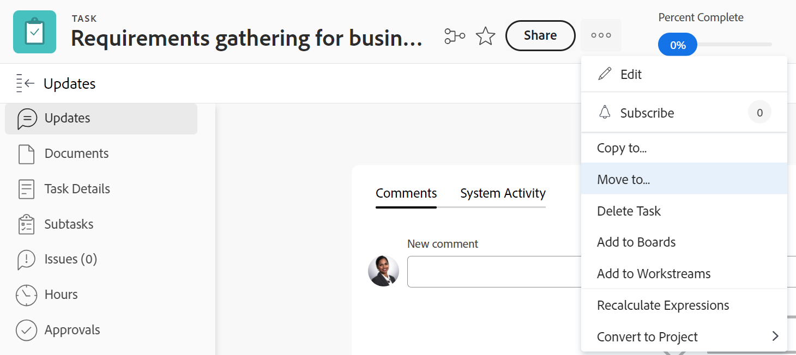

# Mover tareas

<!--Audited: 12/2024-->

La información resaltada en esta página hace referencia a una funcionalidad que aún no está disponible de forma general. Solo está disponible en el entorno de vista previa para todos los clientes. Después de las versiones mensuales en Production, las mismas funciones también están disponibles en el entorno Production para los clientes que habilitaron versiones rápidas. 

Para obtener información sobre las versiones rápidas, consulte [Habilitar o deshabilitar las versiones rápidas para su organización](/help/quicksilver/administration-and-setup/set-up-workfront/configure-system-defaults/enable-fast-release-process.md). 

Puede mover tareas en Adobe Workfront entre los siguientes objetos:

* Una tarea ad hoc a un proyecto.
* Una tarea de un proyecto a otro.
* Una tarea de un proyecto bajo un elemento principal diferente en otro proyecto.
* Una tarea dentro del mismo proyecto bajo un elemento principal diferente.

Puede mover una tarea a nivel de tarea o puede moverla desde una lista de tareas.
Puede mover una sola tarea o mover varias tareas a la vez desde una lista de tareas.

## Requisitos de acceso

+++ Expanda para ver los requisitos de acceso para la funcionalidad en este artículo.

Debe tener el siguiente acceso para realizar las acciones de este artículo:

<table style="table-layout:auto"> 
 <col> 
 <col> 
 <tbody> 
  <tr> 
   <td role="rowheader">Plan de Adobe Workfront</td> 
   <td> 
Cualquiera
 </td> 
  </tr> 
  <tr> 
   <td role="rowheader">Licencia de Adobe Workfront*</td> 
   <td> 
Nuevo plan: Standard 
 
 
o
  

Plan actual: Trabajo o superior 
 </td> 
  </tr> 
  <tr> 
   <td role="rowheader">Configuraciones de nivel de acceso</td> 
   <td> 
Editar el acceso a Tareas y Proyectos
 </td> 
  </tr> 
  <tr> 
   <td role="rowheader">Permisos de objeto</td> 
   <td> 
Administrar permisos para las tareas
 
Permisos de aportación o superiores al proyecto con capacidad para Añadir tareas
  </td> 
  </tr> 
 </tbody> 
</table>

*Para obtener información, consulte [Requisitos de acceso en la documentación de Workfront](/help/quicksilver/administration-and-setup/add-users/access-levels-and-object-permissions/access-level-requirements-in-documentation.md).

+++

## Consideraciones a la hora de mover tareas

Tenga en cuenta lo siguiente al mover una tarea:

* Cuando se mueve una tarea de un proyecto a otro, es posible que se recalculen las fechas de la tarea. Para realizar un nuevo cálculo se tendrá en consideración la programación que utiliza el nuevo proyecto y la información de Programación desde del proyecto.

* Tiene la oportunidad de seleccionar el traslado de algunos elementos asociados con la tarea a la tarea desplazada durante el proceso de traslado. Sin embargo, de forma predeterminada, los siguientes objetos se transfieren a la tarea desplazada:

   * Problemas
   * Horas registradas
   * Comentarios del usuario
   * Información de formularios y campos personalizados
   * Subtareas

Los elementos siguientes no se mueven con la tarea de forma predeterminada:

* Hitos

* El administrador del sistema o del grupo puede impedir que mueva tareas que tengan horas registradas, según la configuración de la preferencia Permitir que los usuarios muevan tareas y problemas con horas registradas en el área Configuración. Para obtener más información, consulte [Configurar las preferencias de tareas y problemas de todo el sistema](/help/quicksilver/administration-and-setup/set-up-workfront/configure-system-defaults/set-task-issue-preferences.md).

## Mover tareas a una lista

1. Vaya al proyecto que contiene la tarea o tareas que desea mover.
1. Haga clic en **Tareas** en el panel izquierdo para mostrar la lista de tareas.
1. Haga clic en el icono **Modo de plan**, compruebe que la opción **Guardar automáticamente** esté habilitada y, a continuación, seleccione las tareas que desee mover.

   

   >[!IMPORTANT]
   >
   >No es posible mover tareas cuando la opción **Guardar automáticamente** está deshabilitada.

1. (Opcional y condicional) Si desea mover las tareas seleccionadas dentro del mismo proyecto, haga clic en las tareas seleccionadas, arrástrelas y suéltelas donde desee colocarlas en el proyecto.

   Después de colocar las tareas en el lugar correcto del proyecto, los cambios realizados en la jerarquía de tareas se guardan inmediatamente. Toda la información asociada con cada tarea se desplaza con las tareas.

1. (Condicional) Seleccione la tarea o tareas que desee mover y realice una de las siguientes acciones:

   * Haga clic en el menú **Más**  en la parte superior de la lista de tareas y, a continuación, haga clic en **Mover a**.
   * Haga clic con el botón derecho en las tareas seleccionadas y luego haga clic en **Mover a**.
   * Al seleccionar una tarea, haga clic en el menú **Más**  junto al nombre de la tarea en la lista y, a continuación, haga clic en **Mover a**.

   

   Se muestra el cuadro **Mover tarea**

1. Continúe moviendo la tarea, como se describe en la sección [Mover una tarea al nivel de tarea](#move-a-task-at-the-task-level) de este artículo, empezando por el paso 4.

   <!--
   is this still accurate?!
   -->

## Mover una tarea al nivel de tarea {#move-a-task-at-the-task-level}

Además de mover tareas de una lista de tareas, también puede mover una tarea al nivel de tarea, una vez que la haya abierto.

1. Encuentre una tarea en el sistema de Workfront buscándola.
1. Haga clic en el nombre de la tarea para abrirla.
1. Haga clic en el menú desplegable **Más**  junto al nombre de la tarea y, a continuación, haga clic en **Mover a**. Aparece el cuadro Mover tarea.

   

1. (Opcional) Actualice el **Nombre de la tarea**. La tarea se mueve con el nuevo nombre a la nueva ubicación. Workfront no registra el nombre original de la tarea.

   >[!TIP]
   >
   >El campo Nombre de la tarea aparece atenuado y no se puede editar al seleccionar mover varias tareas en una lista. Puede pasar el puntero por encima del campo Nombre de la tarea y se mostrará una lista de todas las tareas seleccionadas.
   >
   >
   >

1. Escriba el nombre del **Proyecto de destino** al que desea mover la tarea en el campo **Seleccionar proyecto de destino**.

   Si desea mover la tarea dentro del mismo proyecto, escriba el nombre del proyecto actual.

   >[!TIP]
   >
   >* El nombre del proyecto distingue entre mayúsculas y minúsculas.
   >* También puede empezar a escribir el número de referencia o introducir el ID del proyecto. Esto puede ayudarle a distinguir entre proyectos con nombres idénticos.
   >* En la lista solo se muestran 100 proyectos.

1. (Condicional) Haga clic en **Solicitar acceso** para solicitar acceso al proyecto si no tiene acceso al proyecto seleccionado.
1. (Condicional) Continúe moviendo la tarea al proyecto de destino seleccionado sin solicitar acceso si tiene acceso para añadir tareas a una de las tareas del proyecto de destino.

   

   >[!TIP]
   >
   >Se muestran mensajes similares si el proyecto seleccionado está pendiente de aprobación, completado o inactivo, cuando el administrador de Workfront impide añadir tareas a estos proyectos. Para obtener más información, consulte [Configurar las preferencias de proyecto de todo el sistema](../../../administration-and-setup/set-up-workfront/configure-system-defaults/set-project-preferences.md).

1. (Opcional) Haga clic en **Opciones** en el panel izquierdo.

   O

   Desplácese hacia abajo hasta la sección **Opciones** del cuadro Mover tarea y, a continuación, anule la selección de cualquiera de los elementos que aparecen en la tabla siguiente para quitarlos de las tareas que se han movido. Todas las opciones están seleccionadas de forma predeterminada.

   >[!IMPORTANT]
   >
   >Si se anula la selección de elementos en la lista Opciones, se pierden datos. La información de la tarea existente se eliminará y no se podrá recuperar.

   <table style="table-layout:auto"> 
    <col> 
    <col> 
    <tbody> 
     <tr> 
      <td role="rowheader">Seleccionar todo</td> 
      <td>Anule la selección de esta opción para eliminar toda la información de la tarea al moverla a su nueva ubicación. </td> 
     </tr> 
     <tr> 
      <td role="rowheader">Restricción</td> 
      <td> 
La restricción de tarea se establece en Lo antes posible o Lo más tarde posible según la configuración del modo de programación del proyecto.
 
 Si se selecciona, la restricción actual de la tarea se transfiere con la tarea. 
 
      
<b>NOTA</b>

   Cuando se mueve o copia una tarea con restricciones específicas de fecha a otro proyecto y las fechas de restricción de la tarea están fuera de las fechas del nuevo proyecto, o bien la restricción de la tarea cambia a Lo antes posible o Lo más tarde posible, o bien se ajustan las fechas planificadas de inicio o finalización de los proyectos.

   Los siguientes son ejemplos de restricciones específicas de la fecha:
   <ul>
      <li> Comenzar el</li>
      <li> Debe finalizarse el</li>
      <li> No iniciar antes del</li>
      <li> No iniciar después del</li>
      </ul>

   Para obtener información sobre las restricciones de tareas y cómo pueden verse afectadas las restricciones de tareas o las fechas de proyectos, consulte <a href="../../../manage-work/tasks/task-constraints/task-constraint-overview.md" class="MCXref xref">Información general sobre la restricción de tareas</a> y busque una restricción específica.
 </td>
   </tr> 
     <tr> 
      <td role="rowheader">Asignaciones</td> 
      <td> 
Todas las asignaciones se eliminan de la tarea. 
 </td> 
     </tr> 
     <tr> 
      <td role="rowheader">Proceso de aprobación</td> 
      <td>Todos los procesos de aprobación se eliminan de la tarea.</td> 
     </tr> 
     <tr> 
      <td role="rowheader">Progreso</td> 
      <td>El estado de la tarea es Nuevo. De lo contrario, se conserva el estado de la tarea existente. </td> 
     </tr> 
     <tr> 
      <td role="rowheader">Información financiera</td> 
      <td>La información financiera de la tarea se elimina y Workfront actualiza el tipo de coste de la tarea a Sin coste y el tipo de ingresos de la tarea a No facturable. </td> 
     </tr> 
     <tr> 
      <td role="rowheader">Todas las predecesoras</td> 
      <td> 
Si se selecciona, la dependencia se convierte en una predecesora entre proyectos cuando se mueve la tarea a otro proyecto. 
 </td> 
     </tr> 
     <tr> 
      <td role="rowheader">Documentos</td> 
      <td> 
Los documentos adjuntos a la tarea no se transfieren a la tarea desplazada. Esto incluye versiones, pruebas y documentos vinculados.
 
Esto no incluye las aprobaciones de documentos. Las aprobaciones de documentos nunca pueden moverse cuando se mueve una tarea.
 
      <b>NOTA</b>

   Si opta por no mover los documentos con la tarea, los documentos se eliminarán y se enviarán a la papelera de reciclaje durante 30 días. Un administrador puede restaurarlos y se restaurarán en la tarea trasladada.

   Si la tarea se elimina después de moverla, los documentos restaurados se colocarán en el área Documentos de la página del usuario del administrador que los restaura.

   </td> 
     </tr> 
     <tr> 
      <td role="rowheader">Notificaciones de recordatorio</td> 
      <td>Los recordatorios de la tarea no se transfieren a la tarea desplazada. </td> 
     </tr> 
     <tr> 
      <td role="rowheader">Gastos</td> 
      <td>Los gastos registrados en la tarea no se transfieren a la tarea desplazada. </td> 
     </tr> 
     <tr> 
      <td role="rowheader">Permisos</td> 
      <td> 
Workfront elimina los nombres de todas las entidades que se muestran en la lista de uso compartido de la tarea. 
 </td> 
     </tr> 
    </tbody> 
   </table>

1. (Opcional) Haga clic en **Seleccionar principal** en el panel izquierdo

   O

   Desplácese hasta la sección **Seleccionar principal** y, a continuación, seleccione la tarea en el proyecto de destino que desea que se convierta en la principal de la tarea desplazada.

   >[!TIP]
   >
   >Al seleccionar mover varias tareas en una lista, todas las tareas seleccionadas se convierten en las tareas secundarias del elemento principal seleccionado.

   Seleccione un elemento principal mediante una de las siguientes acciones:

   * En la lista de tareas, seleccione uno de los elementos principales del plan del proyecto.
   * Haga clic en el icono de búsqueda  y busque una tarea principal por su nombre.

   La tarea se muestra en la lista.

   

1. Seleccione el botón de opción del elemento principal, una vez encontrado.

   Si no selecciona una tarea principal, las tareas se mueven como tareas principales en lugar de como subtareas y se colocan al final de la lista de tareas en el proyecto de destino.

1. Haga clic en **Mover tarea**

   O

   Haga clic en **Mover tareas** al seleccionar varias tareas en una lista.

   Las tareas trasladadas ahora se encuentran en el proyecto especificado y son subtareas de una tarea principal o las últimas tareas del proyecto.
