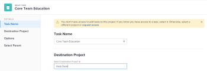

# Mover tareas

<!--Audited: 5/2025-->

<!--The highlighted information on this page refers to functionality not yet generally available. It is available only in the Preview environment for all customers. After the monthly releases to Production, the same features are also available in the Production environment for customers who enabled fast releases.    

For information about fast releases, see [Enable or disable fast releases for your organization](/help/quicksilver/administration-and-setup/set-up-workfront/configure-system-defaults/enable-fast-release-process.md). -->

Puede mover tareas en Adobe Workfront entre los siguientes objetos:

* Una tarea ad hoc a un proyecto.
* Una tarea de un proyecto a otro.
* Una tarea de un proyecto bajo un elemento principal diferente en otro proyecto.
* Una tarea dentro del mismo proyecto bajo un elemento principal diferente.

Puede mover una tarea en el nivel de tarea o puede moverla desde una lista de tareas.

Puede mover una sola tarea o mover varias tareas a la vez desde una lista de tareas.

## Requisitos de acceso

+++ Expanda para ver los requisitos de acceso para la funcionalidad en este artículo. 

<table style="table-layout:auto"> 
 <col> 
 <col> 
 <tbody> 
  <tr> 
   <td role="rowheader">paquete de Adobe Workfront</td> 
   <td> 
Cualquiera
 </td> 
  </tr> 
  <tr> 
   <td role="rowheader">Licencia de Adobe Workfront</td> 
   <td> 
Estándar 
 
 
Trabajo o superior
 </td> 
  </tr> 
  <tr> 
   <td role="rowheader">Configuraciones de nivel de acceso</td> 
   <td> 
Editar el acceso a Tareas y Proyectos
 </td> 
  </tr> 
  <tr> 
   <td role="rowheader">Permisos de objeto</td> 
   <td> 
Administrar permisos para las tareas
 
Permisos de aportación o superiores al proyecto con capacidad para Añadir tareas
  </td> 
  </tr> 
 </tbody> 
</table>

Para obtener más información, consulte [Requisitos de acceso en la documentación de Workfront](/help/quicksilver/administration-and-setup/add-users/access-levels-and-object-permissions/access-level-requirements-in-documentation.md).

+++

<!--Old:

<table style="table-layout:auto"> 
 <col> 
 <col> 
 <tbody> 
  <tr> 
   <td role="rowheader">Adobe Workfront plan</td> 
   <td> 
Any
 </td> 
  </tr> 
  <tr> 
   <td role="rowheader">Adobe Workfront license</td> 
   <td> 
New: Standard 
 
 
or
  

Current: Work or higher 
 </td> 
  </tr> 
  <tr> 
   <td role="rowheader">Access level configurations</td> 
   <td> 
Edit access to Tasks and Projects
 </td> 
  </tr> 
  <tr> 
   <td role="rowheader">Object permissions</td> 
   <td> 
Manage permissions to the tasks
 
Contribute or higher permissions to the project with ability to Add Tasks
  </td> 
  </tr> 
 </tbody> 
</table>-->

## Consideraciones a la hora de mover tareas

Tenga en cuenta lo siguiente al mover una tarea:

* El administrador del sistema o del grupo puede impedir que mueva tareas que hayan registrado horas según cómo configuren la preferencia Permitir a los usuarios mover tareas y problemas con horas registradas en el área de Configuración. Para obtener más información, consulte [Configurar las preferencias de tareas y problemas de todo el sistema](/help/quicksilver/administration-and-setup/set-up-workfront/configure-system-defaults/set-task-issue-preferences.md).

* Cuando se mueve una tarea de un proyecto a otro, es posible que se recalculen las fechas de la tarea. Para realizar un nuevo cálculo se tendrá en consideración la programación que utiliza el nuevo proyecto y la información de Programación desde del proyecto.

* Puede mover algunos elementos asociados con la tarea a la tarea desplazada durante el proceso de movimiento. Sin embargo, de forma predeterminada, los siguientes objetos se transfieren a la tarea desplazada:

   * Problemas
   * Horas registradas
   * Comentarios del usuario
   * Información de formularios y campos personalizados
   * Subtareas

* De forma predeterminada, los siguientes elementos no se mueven con la tarea:

   * Hitos

## Mover tareas a una lista

{{step1-to-projects}}

1. En la página **Proyectos**, seleccione el proyecto que contiene la tarea o tareas que desea mover.
1. Haga clic en **Tareas** en el panel izquierdo para mostrar la lista de tareas.
1. Haga clic en el icono **Modo de plan** , asegúrese de que la opción **Guardar automáticamente** esté habilitada y, a continuación, seleccione las tareas que desee mover.

   

   >[!IMPORTANT]
   >
   >No es posible mover tareas cuando la opción **Guardar automáticamente** está deshabilitada.

1. (Opcional y condicional) Si desea mover las tareas seleccionadas dentro del mismo proyecto, haga clic en las tareas seleccionadas y, a continuación, arrástrelas y suéltelas en el lugar del proyecto al que desee moverlas. Los cambios de la jerarquía de tareas se guardan inmediatamente y la información asociada a cada tarea se mueve con las tareas.

1. (Condicional) Seleccione la tarea o tareas que desee mover y realice una de las siguientes acciones:

   * Haga clic en el **Icono de más**  del menú en la parte superior de la lista de tareas y, a continuación, haga clic en **Mover a**.
   * Haga clic con el botón derecho en las tareas seleccionadas y luego haga clic en **Mover a**.
   * Al seleccionar una tarea, haga clic en el menú **Más**  junto al nombre de la tarea en la lista y, a continuación, haga clic en **Mover a**.

   Se muestra el cuadro **Mover tarea**.

1. Continúe moviendo la tarea, tal como se describe en la sección [Mover una tarea al nivel de tarea](#move-a-task-at-the-task-level) de este artículo.

   <!--
   is this still accurate?!
   -->

## Mover una tarea al nivel de tarea {#move-a-task-at-the-task-level}

Además de mover tareas de una lista de tareas, puede mover una tarea al nivel de tarea después de haberla abierto.

1. Encuentre una tarea en el sistema de Workfront buscándola.
1. Haga clic en el nombre de la tarea para abrirla.
1. Haga clic en el menú desplegable **Más**  junto al nombre de la tarea y luego haga clic en **Mover a**. Se muestra el panel lateral **Mover tarea**.

1. (Opcional) Actualice el **Nombre de la tarea**. La tarea se mueve con el nuevo nombre a la nueva ubicación.

   >[!TIP]
   >
   >El campo **Nombre de tarea** está atenuado y no se puede editar al seleccionar mover varias tareas en una lista. Puede pasar el ratón sobre el campo **Nombre de tarea** y se mostrará una lista de todas las tareas seleccionadas.
   >
   >
   >

1. En el campo **Seleccionar proyecto de destino**, escriba el nombre del proyecto al que desea mover la tarea. Si desea mover la tarea dentro del mismo proyecto, escriba el nombre del proyecto actual.

   >[!TIP]
   >
   >* El nombre del proyecto distingue entre mayúsculas y minúsculas.
   >* Puede buscar un proyecto escribiendo el número de referencia o el identificador del proyecto. Esto puede ayudarle a distinguir entre proyectos con nombres idénticos.
   >* En la lista solo se muestran 100 proyectos.

1. (Condicional) Si no cuenta con acceso al proyecto, haga clic en **Solicitar acceso**.
1. (Condicional) Continúe moviendo la tarea al proyecto de destino sin solicitar acceso si tiene acceso para agregar tareas a una de las tareas del proyecto de destino.

   

   >[!TIP]
   >
   >Se muestran mensajes similares si el proyecto seleccionado está en aprobación pendiente, completado o muerto cuando el administrador de Workfront impide añadir tareas a estos proyectos. Para obtener más información, consulte [Configurar las preferencias de proyecto de todo el sistema](../../../administration-and-setup/set-up-workfront/configure-system-defaults/set-project-preferences.md).

1. (Opcional) En la sección **Opciones**, anule la selección de cualquiera de los elementos enumerados en la tabla siguiente para quitarlos de las tareas movidas. Todas las opciones están seleccionadas de forma predeterminada.

   >[!IMPORTANT]
   >
   >Si se anula la selección de elementos en la lista **Options**, se perderán datos. La información de la tarea existente se eliminará y no se podrá recuperar.

   <table style="table-layout:auto"> 
    <col> 
    <col> 
    <tbody> 
     <tr> 
      <td role="rowheader">Seleccionar todo</td> 
      <td>Anule la selección de esta opción para eliminar toda la información de la tarea al moverla a su nueva ubicación. </td> 
     </tr> 
     <tr> 
      <td role="rowheader">Restricción</td> 
      <td> 
La restricción de tarea se establece en Lo antes posible o Lo más tarde posible según la configuración del modo de programación del proyecto.
 
 Si se selecciona, la restricción actual de la tarea se transfiere con la tarea. 
 
      
Nota: Al mover o copiar una tarea con delimitaciones específicas de fecha a otro proyecto y las fechas de delimitación de la tarea están fuera de las nuevas fechas de proyecto, la delimitación de tarea cambia a Lo antes posible o Lo más tarde posible, o se ajustan las fechas planificadas de inicio o finalización de los proyectos.

   Los siguientes son ejemplos de restricciones específicas de la fecha:
   <ul>
      <li> Comenzar el</li>
      <li> Debe finalizarse el</li>
      <li> No iniciar antes del</li>
      <li> No iniciar después del</li>
      </ul>

   Para más información, consulte <a href="../../../manage-work/tasks/task-constraints/task-constraint-overview.md" class="MCXref xref">Información general sobre la restricción de tarea</a>.
 </td>
   </tr> 
     <tr> 
      <td role="rowheader">Asignaciones</td> 
      <td> 
Todas las asignaciones se eliminan de la tarea. 
 </td> 
     </tr> 
     <tr> 
      <td role="rowheader">Proceso de aprobación</td> 
      <td>Todos los procesos de aprobación se eliminan de la tarea.</td> 
     </tr> 
     <tr> 
      <td role="rowheader">Progreso</td> 
      <td>El estado de la tarea se establece en Nuevo. De lo contrario, se conserva el estado de la tarea existente. </td> 
     </tr> 
     <tr> 
      <td role="rowheader">Información financiera</td> 
      <td>La información financiera de la tarea se elimina y Workfront actualiza el tipo de coste de la tarea a Sin coste y el tipo de ingresos de la tarea a No facturable. </td> 
     </tr> 
     <tr> 
      <td role="rowheader">Todas las predecesoras</td> 
      <td> 
Si se selecciona, la dependencia se convierte en una predecesora entre proyectos cuando se mueve la tarea a otro proyecto. 
 </td> 
     </tr> 
     <tr> 
      <td role="rowheader">Documentos</td> 
      <td> 
Los documentos adjuntos a la tarea no se transfieren a la tarea desplazada. Esto incluye versiones, pruebas y documentos vinculados.
 
Esto no incluye las aprobaciones de documentos. Las aprobaciones de documentos nunca pueden moverse cuando se mueve una tarea.
 
      
Nota: Si opta por no mover los documentos con la tarea, los documentos se eliminarán y se enviarán a la papelera de reciclaje durante 30 días. Un administrador puede restaurarlos y se restaurarán en la tarea trasladada. 

   
Si la tarea se elimina después de moverla, los documentos restaurados se colocarán en el área Documentos de la página del usuario del administrador que los restaura.

   </td> 
     </tr> 
     <tr> 
      <td role="rowheader">Notificaciones de recordatorio</td> 
      <td>Los recordatorios de la tarea no se transfieren a la tarea desplazada. </td> 
     </tr> 
     <tr> 
      <td role="rowheader">Gastos</td> 
      <td>Los gastos registrados en la tarea no se transfieren a la tarea desplazada. </td> 
     </tr> 
     <tr> 
      <td role="rowheader">Permisos</td> 
      <td> 
Workfront elimina los nombres de todas las entidades que se muestran en la lista de uso compartido de la tarea. 
 </td> 
     </tr> 
    </tbody> 
   </table>

1. (Opcional) En la sección **Seleccionar principal**, seleccione la tarea en el proyecto de destino que se convertirá en la principal de la tarea desplazada.

   >[!TIP]
   >
   >Al seleccionar mover varias tareas en una lista, todas las tareas seleccionadas se convierten en las tareas secundarias del elemento principal seleccionado.

   Seleccione un elemento principal mediante una de las siguientes acciones:

   * En la lista de tareas, seleccione uno de los elementos principales del plan del proyecto.
   * Haga clic en el icono de búsqueda  y busque una tarea principal por su nombre.

   La tarea se muestra en la lista.

   

   >[!NOTE]
   >
   >Si no selecciona una tarea principal, las tareas se mueven como tareas principales en lugar de como subtareas y se colocan al final de la lista de tareas en el proyecto de destino.

1. Haga clic en **Mover tarea**. Las tareas se mueven al proyecto especificado como subtareas de una tarea principal o como las últimas tareas del proyecto.
