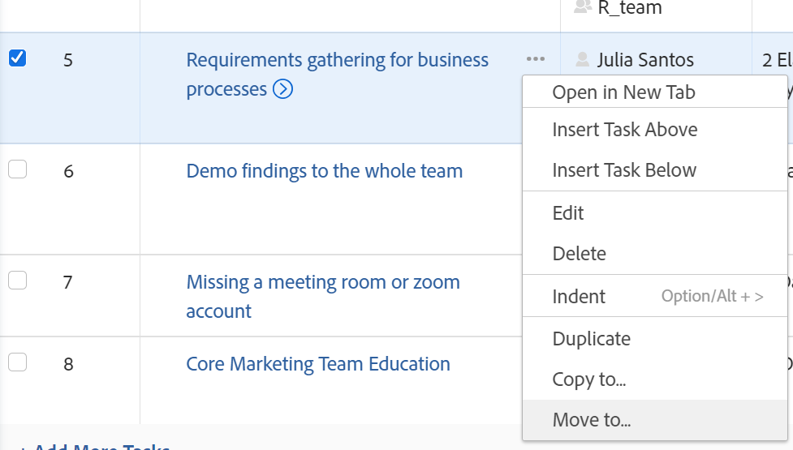
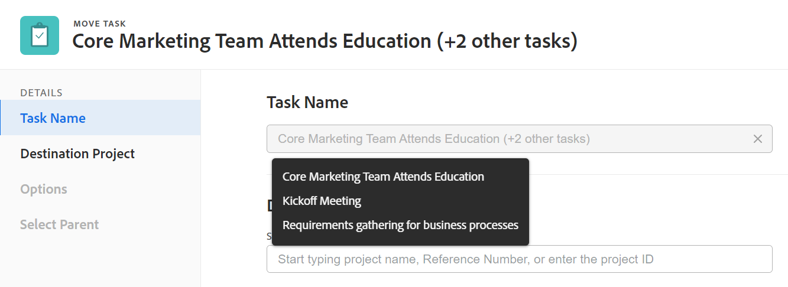

# Mover tareas

Puede mover tareas en Adobe Workfront entre los siguientes objetos:

* Una tarea ad hoc a un proyecto.
* Una tarea de un proyecto a otro.
* Una tarea de un proyecto bajo un elemento principal diferente en otro proyecto.
* Una tarea dentro del mismo proyecto bajo un elemento principal diferente.

Puede mover una tarea en el nivel de tarea o puede moverla desde una lista de tareas.
Puede mover una sola tarea o mover varias tareas a la vez desde una lista de tareas.

## Requisitos de acceso

Debe tener el siguiente acceso para realizar las acciones de este artículo:

<table style="table-layout:auto"> 
 <col> 
 <col> 
 <tbody> 
  <tr> 
   <td role="rowheader">plan Adobe Workfront*</td> 
   <td> 
Cualquiera
 </td> 
  </tr> 
  <tr> 
   <td role="rowheader">Licencias de Adobe Workfront*</td> 
   <td> 
Trabajo o superior
 </td> 
  </tr> 
  <tr> 
   <td role="rowheader">Configuraciones de nivel de acceso*</td> 
   <td> 
Editar acceso a Tareas y Proyectos
 
<b>NOTA</b>

Si sigue sin tener acceso, pregunte al administrador de Workfront si ha establecido restricciones adicionales en su nivel de acceso. Para obtener información sobre cómo un administrador de Workfront puede modificar su nivel de acceso, consulte <a href="../../../administration-and-setup/add-users/configure-and-grant-access/create-modify-access-levels.md" class="MCXref xref">Crear o modificar niveles de acceso personalizados</a>.
 </td>
</tr> 
  <tr> 
   <td role="rowheader">Permisos de objeto</td> 
   <td> 
Administrar permisos para las tareas
 
Aportar o permisos superiores al proyecto con capacidad para Agregar tareas
 
Para obtener información sobre cómo solicitar acceso adicional, consulte <a href="../../../workfront-basics/grant-and-request-access-to-objects/request-access.md" class="MCXref xref">Solicitud de acceso a objetos </a>.
 </td> 
  </tr> 
 </tbody> 
</table>

*Para saber qué plan, tipo de licencia o acceso tiene, póngase en contacto con su administrador de Workfront.

## Consideraciones para mover tareas

Tenga en cuenta lo siguiente al mover una tarea:

* Cuando se mueve una tarea de un proyecto a otro, es posible que se recalculen las fechas de la tarea. Para volver a calcular se tendrá en cuenta la programación que utiliza el nuevo proyecto y la información de Programar a partir del proyecto.

* Tiene la oportunidad de seleccionar mover algunos elementos asociados con la tarea a la tarea desplazada durante el proceso de movimiento. Sin embargo, de forma predeterminada, los siguientes objetos se transfieren a la tarea desplazada:

   * Problemas
   * Horas registradas
   * Comentarios del usuario
   * Formularios personalizados e información de campos personalizados
   * Subtareas

Los elementos siguientes no se mueven con la tarea de forma predeterminada:

* Hitos

## Mover tareas a una lista

1. Vaya al proyecto que contiene la tarea o tareas que desea mover.
1. Clic **Tareas** en el panel izquierdo para mostrar la lista de tareas.
1. Haga clic en **Modo de planificación** icono  y asegurarse de que las **Autoguardar** la opción está activada y, a continuación, seleccione la tarea o tareas que desee mover.

   

   >[!IMPORTANT]
   >
   >No puede mover tareas cuando la variable **Autoguardar** La opción está desactivada.

1. (Opcional y condicional) Si desea mover las tareas seleccionadas dentro del mismo proyecto, haga clic en las tareas seleccionadas, arrástrelas y suéltelas donde desee que se muevan en el proyecto.

   Después de colocar las tareas en el lugar correcto del proyecto, los cambios realizados en la jerarquía de tareas se guardan inmediatamente. Toda la información asociada con cada tarea se mueve con las tareas.

1. (Condicional) Seleccione la tarea o tareas que desee mover y realice una de las siguientes acciones:

   * Haga clic en **Más** menú  en la parte superior de la lista de tareas y haga clic en **Mover a**.
   * Haga clic con el botón derecho en las tareas seleccionadas y luego haga clic en **Mover a**.
   * Al seleccionar una tarea, haga clic en **Más** menú  junto al nombre de la tarea en la lista y haga clic en **Mover a**.

   

   Aparece el cuadro Mover tarea

1. Continúe moviendo la tarea, tal como se describe en la sección [Mover una tarea al nivel de tarea](#move-a-task-at-the-task-level) en este artículo, a partir del paso 4.

   <!--
   is this still accurate?!
   -->

## Mover una tarea al nivel de tarea {#move-a-task-at-the-task-level}

Además de mover tareas de una lista de tareas, también puede mover una tarea al nivel de tarea, una vez que la haya abierto.

1. Busque una tarea en el sistema de Workfront.
1. Haga clic en el nombre de la tarea para abrirla.
1. Haga clic en **Más** menú desplegable  junto al nombre de la tarea y haga clic en **Mover a**. Aparece el cuadro Mover tarea.

   

1. (Opcional) Actualice el **Nombre de tarea**. La tarea se mueve con el nuevo nombre a la nueva ubicación. Workfront no registra el nombre original de la tarea.

   >[!TIP]
   >
   >El campo Nombre de tarea aparece atenuado y no se puede editar al seleccionar mover varias tareas en una lista. Puede pasar el ratón sobre el campo Nombre de tarea y se mostrará una lista de todas las tareas seleccionadas.
   >
   >
   >

1. Escriba el nombre del **Proyecto de destino** donde desea que se mueva la tarea en el **Seleccionar proyecto de destino** field.

   Si desea mover la tarea dentro del mismo proyecto, escriba el nombre del proyecto actual.

   >[!TIP]
   >
   >* El nombre del proyecto distingue entre mayúsculas y minúsculas.
   >* También puede empezar a escribir el número de referencia o introducir el ID del proyecto. Esto puede ayudarle a distinguir entre proyectos con nombres idénticos.
   >* En la lista solo se muestran 100 proyectos.

1. (Condicional) Haga clic en **Solicitar acceso** para solicitar acceso al proyecto, en caso de que no tenga acceso al proyecto seleccionado.
1. (Condicional) Continúe moviendo la tarea al proyecto de destino seleccionado sin solicitar acceso si tiene acceso para agregar tareas a una de las tareas del proyecto de destino.

   

   >[!TIP]
   >
   >Se muestran mensajes similares si el proyecto seleccionado está en aprobación pendiente, completado o muerto, cuando el administrador de Workfront impide añadir tareas a estos proyectos. Para obtener más información, consulte [Configurar las preferencias de proyecto de todo el sistema](../../../administration-and-setup/set-up-workfront/configure-system-defaults/set-project-preferences.md).

1. (Opcional) Haga clic en **Opciones** en el panel izquierdo

   O

   Desplácese hacia abajo hasta el **Opciones** en el cuadro Mover tarea y, a continuación, anule la selección de cualquiera de los elementos que aparecen en la tabla siguiente para quitarlos de las tareas que se han movido Todas las opciones están seleccionadas de forma predeterminada.

   >[!IMPORTANT]
   >
   >Si se anula la selección de elementos en la lista Opciones, se pierden datos. La información de la tarea existente se eliminará y no se podrá recuperar.

   <table style="table-layout:auto"> 
    <col> 
    <col> 
    <tbody> 
     <tr> 
      <td role="rowheader">Seleccionar todo</td> 
      <td>Anule la selección de esta opción para eliminar toda la información de la tarea al moverla a su nueva ubicación. </td> 
     </tr> 
     <tr> 
      <td role="rowheader">Restricción</td> 
      <td> 
La restricción de tarea se establece en Lo antes posible o Lo más tarde posible según la configuración del modo de programación del proyecto.
 
 Si se selecciona, la restricción actual de la tarea se transfiere con la tarea. 
 
      
<b>NOTA</b>

   Al mover o copiar una tarea con delimitaciones específicas de fecha a otro proyecto y las fechas de delimitación de la tarea están fuera de las fechas del nuevo proyecto, o bien la delimitación de tarea cambia a Lo antes posible o Lo más tarde posible, o bien se ajustan las fechas planificadas de inicio o finalización de los proyectos.

   Los siguientes son ejemplos de restricciones específicas de la fecha:
   <ul>
      <li> Comenzar el</li>
      <li> Debe finalizarse el</li>
      <li> No iniciar antes del</li>
      <li> No iniciar después del</li>
      </ul>

   Para obtener información sobre las delimitaciones de tareas y cómo pueden verse afectadas las delimitaciones de tareas o las fechas de proyectos, consulte <a href="../../../manage-work/tasks/task-constraints/task-constraint-overview.md" class="MCXref xref">Información general sobre restricciones de tarea</a> y busque una restricción específica.
 </td>
   </tr> 
     <tr> 
      <td role="rowheader">Asignaciones</td> 
      <td> 
Todas las asignaciones se quitan de la tarea. 
 </td> 
     </tr> 
     <tr> 
      <td role="rowheader">Proceso de aprobación</td> 
      <td>Todos los procesos de aprobación se eliminan de la tarea.</td> 
     </tr> 
     <tr> 
      <td role="rowheader">Progreso</td> 
      <td>El estado de la tarea es Nuevo. De lo contrario, se conserva el estado de la tarea existente. </td> 
     </tr> 
     <tr> 
      <td role="rowheader">Información financiera</td> 
      <td>La información financiera de la tarea se elimina y Workfront actualiza el tipo de coste de la tarea a Sin coste y el tipo de ingresos de la tarea a No facturable. </td> 
     </tr> 
     <tr> 
      <td role="rowheader">Todas las predecesoras</td> 
      <td> 
Si se selecciona, la dependencia se convierte en una predecesora entre proyectos cuando se mueve la tarea a otro proyecto. 
 </td> 
     </tr> 
     <tr> 
      <td role="rowheader">Documentos</td> 
      <td> 
Los documentos adjuntos a la tarea no se transfieren a la tarea desplazada. Esto incluye versiones, pruebas y documentos vinculados.
 
Esto no incluye las aprobaciones de documentos. Las aprobaciones de documentos nunca se pueden mover cuando se mueve una tarea.
 
      <b>NOTA</b>

   Si opta por no mover los documentos con la tarea, los documentos se eliminarán y se enviarán a la papelera de reciclaje durante 30 días. Un administrador puede restaurarlos y se restaurarán en la tarea que se haya movido.

   Si la tarea se elimina después de moverla, los documentos restaurados se colocarán en el área Documentos de la página del usuario del administrador que los restaura.

   </td> 
     </tr> 
     <tr> 
      <td role="rowheader">Notificaciones de recordatorio</td> 
      <td>Los recordatorios de la tarea no se transfieren a la tarea desplazada. </td> 
     </tr> 
     <tr> 
      <td role="rowheader">Gastos</td> 
      <td>Los gastos registrados en la tarea no se transfieren a la tarea desplazada. </td> 
     </tr> 
     <tr> 
      <td role="rowheader">Permisos</td> 
      <td> 
Workfront quita los nombres de todas las entidades que se muestran en la lista de uso compartido de la tarea. 
 </td> 
     </tr> 
    </tbody> 
   </table>

1. (Opcional) Haga clic en **Seleccionar principal** en el panel izquierdo

   O

   Desplácese hasta **Seleccionar principal** y, a continuación, seleccione la tarea en el proyecto de destino en la que desea que se convierta en la principal de la tarea desplazada.

   >[!TIP]
   >
   >Al seleccionar mover varias tareas en una lista, todas las tareas seleccionadas se convierten en las tareas secundarias del elemento principal seleccionado.

   Seleccione un padre mediante una de las siguientes acciones:

   * En la lista de tareas, seleccione uno de los elementos primarios del plan del proyecto.
   * Haga clic en el icono de búsqueda  y busque una tarea principal por su nombre.

   La tarea se muestra en la lista.

   

1. Seleccione el botón de opción del elemento principal, una vez encontrado.

   Si no selecciona una tarea principal, las tareas se mueven como tareas principales en lugar de como subtareas y se colocan al final de la lista de tareas en el proyecto de destino.

1. Clic **Mover tarea**

   O

   Clic **Mover tareas** cuando selecciona varias tareas en una lista.

   Las tareas movidas ahora se encuentran en el proyecto especificado y son subtareas de una tarea principal o las últimas tareas del proyecto.
