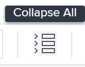

# Administrar finanzas de tareas en la sección Detalles de tareas

<!--

(NOTE: some of the information (fields) in this article is also in the Edit tasks article; if you need to update one field, to it in both articles)

-->

Puede ver o editar la información financiera de una tarea accediendo al área Información general de la sección Detalles de la tarea. Hay un número limitado de campos que puede ver o editar en esta área.

Para obtener información sobre cómo editar toda la información financiera de una tarea, consulte [Editar tareas](../../../manage-work/tasks/manage-tasks/edit-tasks.md).

## Requisitos de acceso

+++ Expanda para ver los requisitos de acceso para la funcionalidad en este artículo. 

<table style="table-layout:auto"> 
 <col> 
 <col> 
 <tbody> 
  <tr> 
   <td role="rowheader">Paquete de Adobe Workfront</td> 
   <td> 
Para utilizar los tipos de costos e ingresos por hora de usuario y rol y agregar una relación de horas extra: Flujo de trabajo Ultimate

      
Para editar todas las demás configuraciones y utilizar todos los demás tipos de ingresos y costes: Cualquier paquete de Workfront o flujo de trabajo
 </td> 
  </tr> 
  <tr> 
   <td role="rowheader">Licencia de Adobe Workfront</td> 
   <td>
Estándar
 
   
Trabajo o superior
 </td> 
  </tr> 
  <tr> 
   <td role="rowheader">Configuraciones de nivel de acceso</td> 
   <td> 
Editar acceso a proyectos y tareas
 
Ver acceso a datos financieros o superior
 
Debe tener acceso de edición a los datos financieros para editar la información financiera sobre las tareas
 </td> 
  </tr> 
  <tr> 
   <td role="rowheader">Permisos de objeto</td> 
   <td> 
Ver permisos de la tarea que incluyen Ver finanzas o superior
 
Debe tener permisos de Administración en la tarea que incluya Editar finanzas para editar la información financiera de las tareas
</td> 
  </tr> 
 </tbody> 
</table>

Para obtener más información, consulte [Requisitos de acceso en la documentación de Workfront](/help/quicksilver/administration-and-setup/add-users/access-levels-and-object-permissions/access-level-requirements-in-documentation.md).

+++

<!--
Old:
<table style="table-layout:auto"> 
 <col> 
 <col> 
 <tbody> 
  <tr> 
   <td role="rowheader">Adobe Workfront plan*</td> 
   <td> 
Any
 </td> 
  </tr> 
  <tr> 
   <td role="rowheader">Adobe Workfront license*</td> 
   <td> 
Work or higher
 </td> 
  </tr> 
  <tr> 
   <td role="rowheader">Access level configurations*</td> 
   <td> 
Edit access to Projects and Tasks
 
View access to Financial Data or higher
 
You must have Edit access to Financial Data to edit financial information on tasks
 
Note: If you still don't have access, ask your Workfront administrator if they set additional restrictions in your access level. For information on how a Workfront administrator can change your access level, see <a href="../../../administration-and-setup/add-users/configure-and-grant-access/create-modify-access-levels.md" class="MCXref xref">Create or modify custom access levels</a>.
 </td> 
  </tr> 
  <tr> 
   <td role="rowheader">Object permissions</td> 
   <td> 
View permissions to the task that include View Finance or higher
 
You must have Manage permissions on the task that include Edit Finance to edit financial information on tasks
 
For information on requesting additional access, see <a href="../../../workfront-basics/grant-and-request-access-to-objects/request-access.md" class="MCXref xref">Request access to objects </a>.
 </td> 
  </tr> 
 </tbody> 
</table>
-->

## Editar las finanzas de la tarea en la sección Detalles de la tarea

1. Vaya a un proyecto en el que desee ver una tarea.

   >[!NOTE]
   >
   >Para encontrar una tarea, también puede buscarla y hacer clic en el nombre para acceder a la tarea. Para obtener más información sobre cómo buscar objetos en Workfront, consulte [Buscar en Adobe Workfront](../../../workfront-basics/navigate-workfront/search/search-workfront.md).

1. Haga clic en **Tareas** en el panel izquierdo.
1. Haga clic en el nombre de una tarea que desee ver.
1. Haga clic en **Detalles de la tarea**.
1. (Opcional) Haga clic en el icono **Contraer todo** en la parte superior derecha de la página Detalles de la tarea.

   

   >[!NOTE]
   >
   >Según la forma en que el administrador de Workfront o el administrador de grupos configuren la plantilla de diseño, los campos de la sección Detalles de tarea podrían volver a organizarse o no mostrarse. Para obtener más información, consulte [Personalizar la vista de detalles con una plantilla de diseño](../../../administration-and-setup/customize-workfront/use-layout-templates/customize-details-view-layout-template.md).

1. Haga clic en **Finanzas** para expandir y ver la información financiera de la tarea.

   Haga clic en el icono **Editar**  en la esquina superior derecha de la sección Detalles y, a continuación, haga clic en **Finanzas**.

1. Edite cualquier campo que esté disponible para la edición haciendo clic en el campo o haga clic en **+Añadir** para añadir información a un campo vacío.
1. Revise o edite la siguiente información en el área **Finanzas**:

   <table style="table-layout:auto"> 
    <col> 
    <col> 
    <tbody> 
     <tr> 
      <td role="rowheader">Tipo de costo</td> 
      <td> 
Especifique el Tipo de coste de la tarea. Esto determina cómo se calcula el coste de la tarea, en función del número de horas de las tareas. 
 
Seleccione entre las siguientes opciones: 
 
       <ul> 
        <li> 
Sin coste
 </li> 
        <li> 
Fijo por hora 
 </li> 
        <li> 
 Usuario por hora 
 </li> 
        <li> 
 Rol por hora
 </li> 
        <li> 
Usuario y función por hora
 </li> 
       </ul> 
Para obtener más información sobre los costes de seguimiento, consulte <a href="../../../manage-work/projects/project-finances/track-costs.md" class="MCXref xref">Costes de seguimiento</a>. El administrador de Workfront o de un grupo selecciona la configuración predeterminada Tipo de coste para las tareas del sistema o del grupo. Para obtener información sobre cómo establecer los valores predeterminados del proyecto, consulte <a href="../../../administration-and-setup/set-up-workfront/configure-system-defaults/set-project-preferences.md" class="MCXref xref">Configurar las preferencias de proyecto de todo el sistema</a>.
 </td> 
     </tr> 
     <tr> 
      <td role="rowheader">Tipo de ingresos</td> 
      <td> 
Especifique el Tipo de ingresos para la tarea. Esto determina cómo se calculan los ingresos de la tarea, en función del número de horas de las tareas. 
 
Seleccione entre las siguientes opciones: 
 
       <ul> 
        <li> 
 No facturable 
 </li> 
        <li> 
Usuario por hora 
 </li> 
        <li> 
Rol por hora 
 </li> 
        <li> 
Usuario y función por hora
 </li>
        <li> 
Fijo por hora 
 </li> 
        <li> 
Usuario por hora sin límite 
 </li> 
        <li> 
Rol por hora con límite 
 </li>
        <li> 
Usuario y rol por hora con tope
 </li> 
        <li> 
Usuario por hora más fijos 
 </li> 
        <li> 
Rol por hora más fijos 
 </li> 
        <li> 
Usuario y función por hora más fijos
 </li>
        <li> 
Ingresos fijos 
 </li> 
       </ul> 
Para obtener más información sobre el seguimiento de los ingresos, vea<a href="../../../manage-work/projects/project-finances/billing-and-revenue-overview.md" class="MCXref xref">Información general sobre facturación e ingresos</a> y <a href="/help/quicksilver/manage-work/projects/project-finances/overview-revenue-cost-hierarchy.md">Información general sobre la jerarquía de ingresos y costos</a>. 
 
El administrador de Workfront o del grupo selecciona la configuración predeterminada Tipo de ingresos para las tareas del sistema o del grupo. Para obtener información sobre cómo establecer los valores predeterminados del proyecto, consulte <a href="../../../administration-and-setup/set-up-workfront/configure-system-defaults/set-project-preferences.md" class="MCXref xref">Configurar las preferencias de proyecto de todo el sistema</a>.
 </td> 
     </tr> 
     <tr> 
      <td role="rowheader">Costo planificado</td> 
      <td> 
Se trata de un cálculo que muestra el coste de la tarea en función de las horas planificadas, el tipo de coste y la tasa por hora de usuarios o funciones. Para obtener más información sobre los costes de seguimiento, consulte <a href="../../../manage-work/projects/project-finances/track-costs.md" class="MCXref xref">Costes de seguimiento</a>. 
 </td> 
     </tr> 
     <tr> 
      <td role="rowheader">Costo real</td> 
      <td> 
 Se trata de un cálculo que muestra el coste de la tarea en función de las horas reales, el tipo de coste y la tarifa por hora de usuarios o funciones. Para obtener más información sobre los costes de seguimiento, consulte <a href="../../../manage-work/projects/project-finances/track-costs.md" class="MCXref xref">Costes de seguimiento</a>.
 </td> 
     </tr> 
     <tr> 
      <td role="rowheader">Ingresos planificados</td> 
      <td> 
Se trata de un cálculo que muestra los ingresos asociados a la tarea en función de las horas planificadas, el tipo de ingresos y la tasa por hora de los usuarios o las funciones. Para obtener más información sobre los costes de seguimiento, consulte <a href="../../../manage-work/projects/project-finances/track-costs.md" class="MCXref xref">Costes de seguimiento</a>.
 </td> 
     </tr> 
     <tr> 
      <td role="rowheader">Ingresos reales</td> 
      <td> 
Se trata de un cálculo que muestra los ingresos asociados a la tarea en función de las horas reales, el tipo de ingresos y la tarifa por hora de los usuarios o las funciones. Para obtener más información sobre los costes de seguimiento, consulte <a href="../../../manage-work/projects/project-finances/track-costs.md" class="MCXref xref">Costes de seguimiento</a>.
 </td> 
     </tr> 
     <tr>
      <td>Proporción de horas extra</td> 
      <td>
Introduzca el multiplicador de horas extra para la tarea como, por ejemplo, 1,5 o 2,0. El valor predeterminado es 1,0 (sin multiplicador). Para obtener más información, vea <a href="/help/quicksilver/manage-work/projects/project-finances/define-overtime-ratio.md">Definir una proporción de horas extra</a>.

Para ver el campo Proporción de horas extra:

       <ul>
       <li>El tipo de ingresos de la tarea debe ser Usuario y Rol por hora. Para obtener más información, consulte <a href="/help/quicksilver/manage-work/projects/project-finances/overview-revenue-cost-hierarchy.md">Información general sobre la jerarquía de ingresos y costos</a>.</li>
       <li>El campo debe estar habilitado en la plantilla de diseño para el área Finanzas en la vista Detalles de la tarea. Para obtener más información, consulte <a href="/help/quicksilver/administration-and-setup/customize-workfront/use-layout-templates/customize-details-view-layout-template.md">Personalizar la vista de detalles con una plantilla de diseño</a>.</li>
       </ul>
      </td>
     </tr>
     <tr> 
      <td role="rowheader">CPI/SPI/CSI</td> 
      <td> 
Estas son métricas de rendimiento de tareas que muestran el rendimiento de la tarea en un momento determinado. Sus valores se calculan según el método de índice de rendimiento del proyecto. Para obtener más información, consulte los artículos siguientes:
 
       <ul> 
        <li> 
<a href="../../../manage-work/projects/project-finances/calculate-cpi.md" class="MCXref xref">Calcular el índice de rendimiento de costes (CPI)</a> 
 </li> 
        <li> 
<a href="../../../manage-work/projects/project-finances/calculate-spi.md" class="MCXref xref">Calcular índice de rendimiento de programación (SPI) </a> 
 </li> 
        <li> 
 
<a href="../../../manage-work/projects/project-finances/calculate-csi.md" class="MCXref xref">Calcular índice de rendimiento de programación de costes (CSI)</a> 
 
 </li> 
       </ul> </td> 
     </tr> 
     <tr> 
      <td role="rowheader">Calcular estimación al finalizar (EAC)</td> 
      <td> 
Este es un cálculo que muestra el coste total de la tarea al finalizar. Para obtener más información acerca de la estimación al finalizar, consulte <a href="../../../manage-work/projects/project-finances/calculate-eac.md" class="MCXref xref">Calcular estimación al finalizar (EAC)</a>.
 </td> 
     </tr> 
    </tbody> 
   </table>

1. (Condicional) Si está editando los campos en la sección Finanzas, haga clic en **Guardar cambios**.
