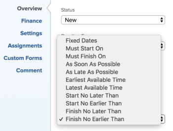

# Información general sobre la restricción de tarea: no finalizar antes del

No finalizar antes del (FNET) es una delimitación de tarea que programa una tarea para que finalice después de la fecha especificada.

## Descripción general de la restricción No terminar antes del

Tenga en cuenta lo siguiente cuando utilice la delimitación No finalizar antes del (FNET) para una tarea:

* Debe utilizar esta restricción cuando el proyecto esté programado desde la fecha de finalización. En este caso, puede proporcionar una restricción suave a la tarea antes de forzar a que otras tareas dependientes muestren En riesgo.
* Cuando se usa FNET en un proyecto programado **Desde la fecha de inicio**, la restricción programa la tarea como lo haría si la restricción fuera Lo antes posible.
* Cuando se mueve o copia una tarea con una delimitación FNET a otro proyecto, la delimitación de la tarea o las fechas del proyecto pueden cambiar dependiendo de cuáles sean las fechas de delimitación y cuáles sean las fechas de inicio y finalización del proyecto. Se dan los siguientes escenarios:

   * Cuando el proyecto de destino se programa desde el inicio:

      * Cuando la fecha de restricción de tarea es anterior a la fecha de inicio planificada del proyecto, la restricción de tarea cambia a Lo antes posible.
      * Cuando la fecha de restricción de tarea es posterior a la fecha planificada de finalización del proyecto, la fecha planificada de finalización del proyecto cambia para coincidir con la fecha de restricción de finalización de la tarea.

   * Cuando se programa el proyecto de destino a partir de la finalización:

      * Cuando la fecha de restricción de tarea es posterior a la fecha de finalización del proyecto, la restricción de tarea cambia a Lo más tarde posible.
      * Cuando la fecha de restricción de tarea es anterior a la fecha de inicio planificada del proyecto, la fecha de inicio planificada del proyecto cambia para coincidir con la fecha de restricción de inicio de la tarea.

   * Independientemente de la programación del proyecto, cuando la fecha de restricción de tarea se encuentra dentro de las fechas de inicio y finalización del proyecto, no hay cambios en las fechas de restricción de tarea o del proyecto.

  Para obtener información sobre cómo mover tareas, consulte [Mover tareas](../../../manage-work/tasks/manage-tasks/move-tasks.md). Para obtener más información acerca de cómo copiar tareas, vea [Copiar y duplicar tareas](../../../manage-work/tasks/manage-tasks/copy-and-duplicate-tasks.md).

  Para obtener información sobre cómo actualizar la restricción de tarea en una tarea, consulte [Actualizar la restricción de tarea de una tarea](../../../manage-work/tasks/task-constraints/update-task-constraint-of-task.md).

<!--

<h2>Use the Finish No Earlier Than constraint</h2>

(NOTE: replaced with new article linked above) 

To update the Task Constraint to Finish No Earlier Than:

<ol>
<li value="1">Go to a task whose Task Constraint you want to update.</li>
<li value="2"> 
Click the <strong>More</strong> icon  next to the task name, then click <strong>Edit</strong>.
 </li>
<li value="3"> 
In the <strong>Overview</strong> section, expand the <strong>Task Constraint</strong> drop-down menu.
 </li>
<li value="4"> 
Select <strong>Finish No Earlier Than</strong>.
 
  
 </li>
<li value="5"> 
Specify a <strong>Planned Completion Date</strong>.
 
The task must complete no earlier than this date. 
 </li>
<li value="6">Click <strong>Save Changes.</strong> </li>
</ol>

-->
