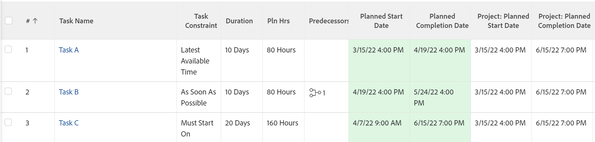

# Información general sobre la restricción de tarea: Última hora disponible

Última hora disponible (LAT) es un tipo de restricción de tarea en Adobe Workfront.

## Utilizar la última restricción de tarea de tiempo disponible

Puede utilizar la restricción LAT cuando desee programar una tarea para que comience a la hora más tardía disponible después de considerar las relaciones predecesora-sucesora en el proyecto.

Esta restricción difiere de Lo antes posible en que no obligará a que se vuelvan a programar predecesoras o sucesoras. En su lugar, solo afectará a la programación de la tarea con la que está asociado, estableciéndola en la última hora disponible en función de su relación con otras tareas.

Para obtener información sobre cómo actualizar la restricción de tarea en una tarea, consulte [Actualizar la restricción de tarea de una tarea](../../../manage-work/tasks/task-constraints/update-task-constraint-of-task.md).

<!--

To update the Task Constraint to Latest Available Time:

(NOTE: replaced with new article linked above) 

<ol>
<li value="1">Go to a task whose Task Constraint you want to update.</li>
<li value="2"> 
Click the <strong>More</strong> icon  next to the task name, then click <strong>Edit</strong>.
 </li>
<li value="3">In the <strong>Overview</strong> section, expand the <strong>Task Constraint</strong> drop-down menu.</li>
<li value="4"> 
Select <strong>Latest Available Time</strong>.
 </li>
<li value="5">Click <strong>Save Changes</strong>.</li>
</ol>

-->

## La diferencia entre Última hora disponible y Lo más tarde posible

<!--

(NOTE: [! This section is duplicated in "As Late As Possible"] - inserted snippet in both (Alina)) 

-->

La restricción Último tiempo disponible difiere de la restricción Lo más tarde posible cuando existen los siguientes criterios:

* El proyecto está programado desde la fecha de inicio
* Las tareas del proyecto tienen una relación de predecesoras
* La tarea sucesora tiene una restricción de tarea flexible

En esta situación:

* **Última hora disponible:** El uso de la restricción de tiempo disponible más reciente en la tarea predecesora da prioridad a la restricción flexible de la tarea sucesora.

  **Ejemplo:** Por ejemplo, la Tarea A es la predecesora de la Tarea B. La Tarea A tiene la última restricción de tiempo disponible y la Tarea B tiene la restricción Lo antes posible. En este caso, la tarea A está programada lo más cerca posible del comienzo del proyecto.

  

* **Lo más tarde posible:** En este escenario, si se utiliza la restricción Lo más tarde posible en la tarea predecesora, se da prioridad a la tarea predecesora.

  **Ejemplo:** Por ejemplo, la Tarea A es predecesora de la Tarea B. La Tarea A tiene la restricción Lo más tarde posible y la Tarea B tiene la restricción Lo antes posible. En este caso, la tarea A está programada lo más cerca posible del final del proyecto.

  

<!--

(NOTE: this content was here before but it was wrong - according to this issue in Hub, per Dev, the correct functionality is in the snippet above: https://hub.workfront.com/task/6193c6910004bce9de07cda7757f3ce8/updates?email-source=subscribedCommunication) 

The Latest Available Time constraint differs from the As Late As Possible constraint when the following criteria exist:

<ul>
<li> The project is scheduled From Completion </li>
<li> Tasks in the project have a predecessor relationship </li>
<li> The predecessor task has a flexible task constraint </li>
</ul>

 In this situation: 

<ul>
<li> 
<strong>Latest Available Time:</strong> Using the Latest Available Time constraint on the successor task gives priority to flexible constraint of the predecessor.
 
For example, Task A is a predecessor to Task B. Task B has the Latest Available Time constraint and Task A has the As Soon As Possible constraint. In this situation, Task B is scheduled as close to the start of the project as possible.
 </li>
<li> 
<strong>As Late As Possible:</strong> In this scenario, using the As Late As Possible constraint on the successor task gives the priority to the successor task.
 
For example, Task A is a predecessor to Task B. Task B has the As Late As Possible constraint and Task A has the As Soon As Possible constraint. In this situation, Task B is scheduled as close to the end of the project as possible.
 </li>
</ul>

-->
