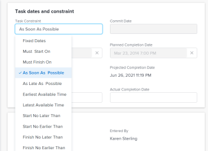

# Actualizar la restricción de tarea de una tarea

Las restricciones de tarea determinan cuándo debe comenzar y finalizar una tarea en un proyecto. Para más información, consulte [Información general sobre la restricción de tarea](../../../manage-work/tasks/task-constraints/task-constraint-overview.md).

## Requisitos de acceso

+++ Expanda para ver los requisitos de acceso para la funcionalidad en este artículo. 

<table style="table-layout:auto"> 
 <col> 
 <col> 
 <tbody> 
  <tr> 
   <td role="rowheader">Paquete de Adobe Workfront</td> 
   <td> 
Cualquiera
 </td> 
  </tr> 
  <tr> 
   <td role="rowheader">Licencia de Adobe Workfront</td> 
   <td>
Estándar
 
   
Trabajo o superior
 </td> 
  </tr> 
  <tr> 
   <td role="rowheader">Configuraciones de nivel de acceso</td> 
   <td> 
Acceso de visualización o superior a los proyectos
 
Editar acceso a Tareas
</td> 
  </tr> 
  <tr> 
   <td role="rowheader">Permisos de objeto</td> 
   <td> 
Administrar el acceso a la tarea
</td> 
  </tr> 
 </tbody> 
</table>

Para obtener más información, consulte [Requisitos de acceso en la documentación de Workfront](/help/quicksilver/administration-and-setup/add-users/access-levels-and-object-permissions/access-level-requirements-in-documentation.md).

+++

<!--
Old:

<table style="table-layout:auto"> 
 <col> 
 <col> 
 <tbody> 
  <tr> 
   <td role="rowheader">Adobe Workfront plan*</td> 
   <td> 
Any 
 </td> 
  </tr> 
  <tr> 
   <td role="rowheader">Adobe Workfront license*</td> 
   <td> 
Work or higher
 </td> 
  </tr> 
  <tr> 
   <td role="rowheader">Access level configurations*</td> 
   <td> 
View or higher access to Projects
 
Edit access to Tasks
 
Note: If you still don't have access, ask your Workfront administrator if they set additional restrictions in your access level. For information on how a Workfront administrator can modify your access level, see <a href="../../../administration-and-setup/add-users/configure-and-grant-access/create-modify-access-levels.md" class="MCXref xref">Create or modify custom access levels</a>.
 </td> 
  </tr> 
  <tr> 
   <td role="rowheader">Object permissions</td> 
   <td> 
Manage access to the task 
 
For information on requesting additional access, see <a href="../../../workfront-basics/grant-and-request-access-to-objects/request-access.md" class="MCXref xref">Request access to objects </a>.
 </td> 
  </tr> 
 </tbody> 
</table>
-->

## Actualizar la restricción de tarea de una tarea

1. Haga clic en **Menú principal** > **Proyectos** y, a continuación, haga clic en un proyecto para acceder él.
1. Haga clic en la sección **Tareas** en el panel izquierdo.
1. Haga clic en **Detalles de la tarea** en el panel izquierdo y, a continuación, en el área Información general, haga clic en **Restricción de tarea**.

   

1. Seleccione entre las siguientes opciones

   | Fechas fijas | Para obtener más información, consulte [Información general sobre la restricción de tarea: fechas fijas](../../../manage-work/tasks/task-constraints/fixed-dates.md). |
   |---|---|
   | Debe iniciarse el | Para obtener más información, consulte [Información general sobre la restricción de tarea: debe iniciarse el](../../../manage-work/tasks/task-constraints/must-start-on.md). |
   | Debe finalizarse el | Para obtener más información, consulte [Información general sobre la restricción de tarea: debe finalizarse el](../../../manage-work/tasks/task-constraints/must-finish-on.md). |
   | Lo antes posible | Para obtener más información, consulte [Información general sobre la restricción de tarea: lo antes posible](../../../manage-work/tasks/task-constraints/as-soon-as-possible.md). |
   | Lo más tarde posible | Para obtener más información, consulte [Información general sobre la restricción de tarea: lo más tarde posible](../../../manage-work/tasks/task-constraints/as-late-as-possible.md). |
   | Lo más temprano disponible | Para obtener más información, consulte [Información general sobre la restricción de tarea: lo más temprano disponible](../../../manage-work/tasks/task-constraints/earliest-available-time.md). |
   | Lo más tarde posible | Para obtener más información, consulte [Información general sobre la restricción de tarea: lo más tarde posible](../../../manage-work/tasks/task-constraints/latest-available-time.md). |
   | No iniciar después del | Para obtener más información, consulte [Información general sobre la restricción de tarea: no iniciar después del](../../../manage-work/tasks/task-constraints/start-no-later-than.md). |
   | No iniciar antes del | Para obtener más información, consulte [Información general sobre la restricción de tarea: no iniciar antes del](../../../manage-work/tasks/task-constraints/start-no-earlier-than.md). |
   | No terminar después de | Para obtener más información, consulte [Información general sobre la restricción de tarea: no terminar después de](../../../manage-work/tasks/task-constraints/finish-no-later-than.md). |
   | No terminar antes de | Para obtener más información, consulte [Información general sobre la restricción de tarea: no terminar antes de](../../../manage-work/tasks/task-constraints/finish-no-earlier-than.md). |

   {style="table-layout:auto"}

1. Haga clic en **Guardar** **cambios**.

