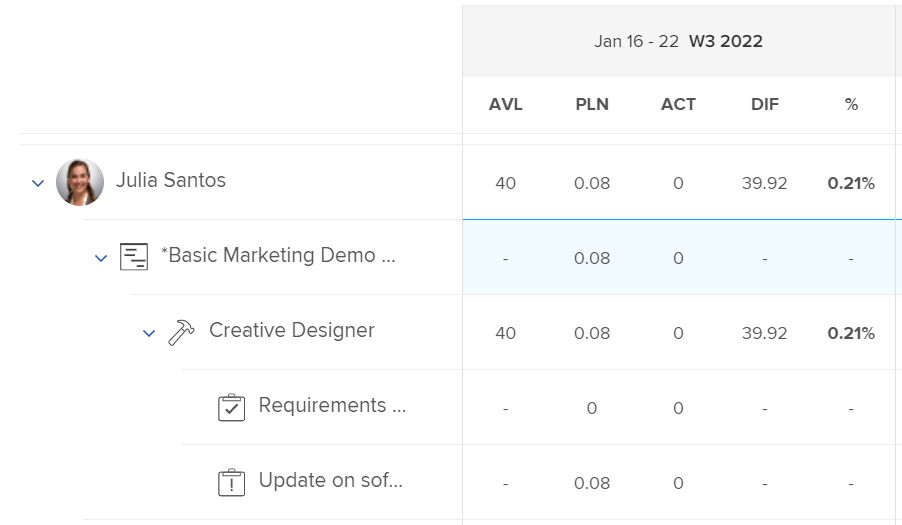

# Información general sobre las horas planificadas

<!-- Audited: 01/2024 -->

Las horas planificadas asociadas con una tarea, un problema o un proyecto representan la cantidad de tiempo necesario para que los usuarios asignados completen la tarea, el problema o el proyecto.

## Consideraciones sobre las horas planificadas en Adobe Workfront

* Las horas planificadas se asocian principalmente a elementos de trabajo (tareas y problemas) de Adobe Workfront. Las horas planificadas de los elementos de trabajo se transfieren a las horas planificadas de sus proyectos.
* De forma predeterminada, Workfront distribuye las horas planificadas de tareas y problemas de forma equitativa a todos los días de la duración de una tarea o problema.
* Cuando los usuarios y las funciones se asignan a tareas y problemas, las horas planificadas de esas tareas y problemas se asocian a las asignaciones de usuarios o funciones.
* Debe definir el valor de las horas planificadas para tareas y problemas si desea utilizar las herramientas de administración de recursos en Workfront.
* Solo se puede modificar el valor de las horas planificadas en tareas para algunos tipos de duración.

  Para obtener más información acerca de cómo modificar las horas planificadas en tareas relacionadas con el tipo de duración de las tareas, vea la sección [Actualizar horas planificadas de tareas según el tipo de duración](#update-task-planned-hours-based-on-duration-type) en este artículo.

* Puede modificar el valor de la opción Horas planificadas en problemas en cualquier momento.
* No se puede modificar el valor de la opción Horas planificadas de proyectos o de tareas principales, ya que se trata de un total calculado de todas las horas planificadas para todas sus tareas y subtareas.
* La administración de asignaciones de usuarios mediante herramientas de administración de recursos puede cambiar el número de horas planificadas de tareas, problemas y proyectos, así como el de asignaciones asociadas con elementos de trabajo.

## Horas planificadas en tareas frente a Horas planificadas en proyectos {#planned-hours-on-tasks-vs-planned-hours-on-projects}

Las horas planificadas de las tareas se transfieren a las horas planificadas del proyecto. Las horas planificadas de los problemas no siempre se transfieren a las horas planificadas del proyecto.

En esta sección se describen las diferencias entre las horas planificadas para tareas y las planificadas para el proyecto. También describe dónde puede ver las horas planificadas de problemas que se transfieren al proyecto.

### Horas planificadas para tareas {#planned-hours-on-tasks}

Las horas planificadas de una tarea indican la cantidad de tiempo estimado que puede llevar hacer el trabajo de esa tarea. De forma predeterminada, Workfront distribuye la cantidad total de horas planificadas de forma uniforme para cada día dentro de la duración de todas las tareas. La cantidad diaria de horas planificadas pasan a ser las asignaciones diarias de esa tarea. Si la tarea está asignada a varios recursos, a cada recurso se le asigna la misma cantidad de horas diarias de forma predeterminada.

Con el Distribuidor de cargas de trabajo, puede modificar las asignaciones diarias para los usuarios asignados a las tareas. Esta acción también puede actualizar las horas planificadas de la tarea cuando el tipo de duración de la tarea es simple. Para obtener más información, consulte la sección “Actualizar las horas planificadas de una tarea al administrar las asignaciones de usuario” en el artículo [Administrar asignaciones de usuario en el Distribuidor de cargas de trabajo](../../../resource-mgmt/workload-balancer/manage-user-allocations-workload-balancer.md).

Cuando una tarea contiene subtareas, las horas planificadas de la tarea principal son la suma de todas las horas planificadas de cualquier subtarea. Las horas planificadas de una tarea principal no se pueden actualizar.

>[!NOTE]
>
>A diferencia de las horas planificadas, las horas reales de una tarea principal son las horas que se han registrado directamente en la tarea principal. No representan una suma de las horas reales de las tareas secundarias.\
>Para obtener más información sobre las horas reales, consulte [Ver horas reales](../../../manage-work/tasks/task-information/actual-hours.md).

### Horas planificadas en los proyectos {#planned-hours-on-projects}

La cantidad de horas planificadas en un proyecto no se pueden editar. Las horas planificadas de un proyecto son una suma calculada de todas las horas planificadas para todas las tareas del proyecto.

La inclusión de problemas en el cálculo de las horas planificadas depende de la ubicación del proyecto en la que esté viendo las horas planificadas. Puede ver las horas planificadas de un proyecto en las siguientes ubicaciones dentro del proyecto:

* **Sección de Detalles del proyecto y cuadro Editar proyecto**: solo se tienen en cuenta las horas planificadas para las tareas del proyecto. Las horas planificadas para los problemas del proyecto no se tienen en cuenta al ver el número total de horas planificadas para el proyecto en la sección Detalles del proyecto o en el cuadro Editar proyecto.

* **El Distribuidor de cargas de trabajo**: en el Distribuidor de cargas de trabajo para los proyectos, solo se muestran las horas planificadas asociadas con las tareas visibles en el Distribuidor de cargas de trabajo. Las asignaciones diarias de usuario pueden cambiar las horas planificadas diarias del proyecto en el Distribuidor de cargas de trabajo.
* **Sección Utilización**: las horas planificadas asociadas con los usuarios asignados a las tareas y los problemas del proyecto se tienen en cuenta al ver el número total de horas planificadas para el proyecto en la sección Utilización.
* **Panel Asignación de funciones** en la lista de tareas: en esta área se muestran las horas planificadas para las tareas y los problemas del proyecto que están asignados a una función o a un usuario asociado con una función. Las horas planificadas asociadas con tareas y problemas que no están asignados o que están asignados a equipos no se muestran en esta área. Para obtener más información, consulte [Vista de horas planificadas del proyecto en el panel Asignación de funciones](../../../manage-work/projects/planning-a-project/view-planed-hours-in-role-allocation-panel.md).

## Distribución de horas planificadas a lo largo de la duración de una tarea

De forma predeterminada, Workfront distribuye las horas planificadas de forma uniforme a lo largo de la duración de una tarea y asigna un número igual de horas planificadas a cada día de la tarea, según la disponibilidad de la programación del proyecto.

Por ejemplo, si una tarea está configurada para iniciarse a las 16:00 h y a la programación le queda una hora el primer día de la tarea, Workfront coloca una hora planificada el primer día de la duración de la tarea y, a continuación, divide el resto de las horas planificadas equitativamente entre el resto de días de la duración de la tarea.

>[!NOTE]
>
>Las horas planificadas por día o asignación diaria son la asignación de horas planificadas para cada día durante la duración de la tarea. Si la tarea tiene una asignación, este número representa las horas planificadas por día y por asignación. Si la tarea tiene varias asignaciones, las horas planificadas por día y asignación son diferentes a las horas planificadas por día para la tarea. No hay representación visual en Workfront para las horas planificadas por día y asignación, para tareas con varias asignaciones.

## Localizar y comprender los valores de horas planificadas

Puede encontrar los valores de horas planificadas en varias áreas de Workfront.

El número de horas planificadas que se muestran se origina a partir de los elementos de trabajo del proyecto o se calcula de forma diferente en función del área y del objeto en el que se visualizan.

Puede localizar las horas planificadas en las siguientes áreas de Workfront:

* [La sección Detalles de un proyecto, tarea o problema](#the-details-section-of-a-project-task-or-issue)
* [Cuadro Editar tarea o Editar problema](#the-edit-task-or-edit-issue-box)
* [Informes](#reports)
* [Distribuidor de cargas de trabajo](#the-workload-balancer)
* [Planificador de recursos](#the-resource-planner)
* [Informe de utilización](#the-utilization-report)
* [El panel Asignación de funciones](#the-role-allocation-panel)

### La sección Detalles de un proyecto, tarea o problema {#the-details-section-of-a-project-task-or-issue}

Las horas planificadas en la sección Detalles de una tarea, problema o proyecto son las horas planificadas totales asociadas al artículo.

Para obtener más información sobre las horas planificadas del proyecto, consulte la sección [Horas planificadas en tareas frente a Horas planificadas en proyectos](#planned-hours-on-tasks-vs-planned-hours-on-projects) en este artículo.

### El cuadro Editar tarea o Editar problema {#the-edit-task-or-edit-issue-box}

Las horas planificadas en el cuadro de diálogo Editar de una tarea o problema son las horas planificadas totales del elemento correspondiente.

Para obtener más información sobre las horas planificadas del proyecto, consulte la sección [Horas planificadas en tareas vs. Horas planificadas en proyectos](#planned-hours-on-tasks-vs-planned-hours-on-projects) en este artículo.

Para las tareas, puede editar la cantidad de horas planificadas solo para ciertos tipos de duración. Para obtener más información, consulte la sección [Actualizar horas planificadas de tarea según el tipo de duración](#update-task-planned-hours-based-on-duration-type) en este artículo.

Puede ver la asignación individual de horas planificadas para cada usuario o rol asignado a la tarea o problema en el área Asignaciones.

### Informes {#reports}

Puede añadir el campo Horas planificadas en los informes de proyecto, tarea y problema.

La columna Horas planificadas se incluye en la vista estándar de una lista de tareas de forma predeterminada.

Las horas planificadas en un informe de tarea, problema o proyecto son las horas planificadas totales del elemento correspondiente, tal como se muestran en la sección Detalles o en el cuadro de edición de los elementos.

Para obtener información sobre cómo crear informes, consulte [Crear un informe personalizado](../../../reports-and-dashboards/reports/creating-and-managing-reports/create-custom-report.md).

>[!NOTE]
>
>Si crea un informe de proyecto (datos financieros) y lo agrupa por fecha, las horas planificadas podrían mostrar una parte de las horas planificadas del proyecto según la cronología de las tareas del proyecto. De forma predeterminada, Workfront distribuye las horas planificadas de las tareas de forma equitativa para cada día de la duración de la tarea. Las horas planificadas para un lapso de tiempo determinado coinciden con la distribución equitativa establecida por Workfront para ese lapso de tiempo en el informe de Proyecto (datos financieros).

<!--
### The Scheduling areas  {#the-scheduling-areas}

The Planned Hours for tasks and issues display in the Scheduling areas in the Planned Hours field.

You can view the daily allocation of Planned Hours for each user assigned to a task or an issue in the Scheduling areas.

The daily hour amount represents one of the following:

* the default amount equally distributed by Workfront for each day of the Duration of the tasks or issues
* the adjusted daily allocation managed by resource managers.

  For information about adjusting daily allocations in the Scheduling tools, see [Manage user allocations in the Scheduling areas](../../../resource-mgmt/resource-scheduling/manage-allocations-scheduling-areas.md).
-->

### Distribuidor de cargas de trabajo {#the-workload-balancer}

Las siguientes horas planificadas para tareas, problemas y proyectos se muestran en el Distribuidor de cargas de trabajo a la derecha del nombre de la tarea, el problema o el proyecto:

* En el caso de las tareas y los problemas, se muestran las horas planificadas asociadas a ellos.
* En los proyectos, se muestra el total de horas planificadas de las tareas y problemas visibles en la pantalla.

  >[!TIP]
  >
  >El Distribuidor de cargas de trabajo no muestra todas las horas planificadas de un proyecto como pueden verse en el área de detalles del proyecto.

Puede ver la asignación diaria de horas planificadas de cada usuario asignado a una tarea o a un problema en el Distribuidor de cargas de trabajo.

La cantidad diaria de horas planificadas representa una de las siguientes opciones: 

* la cantidad predeterminada distribuida equitativamente por Workfront para cada día de la duración de las tareas, los problemas o el proyecto
* la asignación diaria ajustada administrada por los administradores de recursos

  Para obtener información sobre cómo ajustar las asignaciones diarias en el Distribuidor de cargas de trabajo, consulte [Administrar asignaciones de usuario en el Distribuidor de cargas de trabajo](../../../resource-mgmt/workload-balancer/manage-user-allocations-workload-balancer.md).

### El Planificador de recursos {#the-resource-planner}

El Planificador de recursos muestra las horas planificadas para proyectos, tareas y problemas.

Puede ver las asignaciones semanales de horas planificadas para los usuarios y los roles asociados con los elementos de trabajo en la columna PLN del Planificador de recursos.

>[!TIP]
>
>Los ajustes de asignación diarios en el Distribuidor de cargas de trabajo influyen en las asignaciones semanales de las tareas y problemas del Planificador de recursos.

El número de horas planificadas para cada objeto difiere según la vista que aplique al Planificador de recursos. Para obtener más información, consulte [Información general sobre horas, EJC y costes en las vistas Proyecto y Función del Planificador de recursos](../../../resource-mgmt/resource-planning/overview-of-planner-hour-fte-cost-information-in-role-project-views.md).

La cantidad semanal de horas planificadas para tareas y problemas representa una de las siguientes opciones:

* la cantidad semanal predeterminada distribuida equitativamente por Workfront para cada día de la duración de las tareas o problemas
* la asignación semanal ajustada administrada por los administradores de recursos en el Distribuidor de cargas de trabajo

  Para obtener información sobre cómo ajustar las asignaciones diarias en el Distribuidor de cargas de trabajo, consulte [Administrar asignaciones de usuarios en el Distribuidor de cargas de trabajo](../../../resource-mgmt/workload-balancer/manage-user-allocations-workload-balancer.md).

La cantidad semanal de proyectos, usuarios y funciones se ve afectada por las cantidades semanales de Horas planificadas para las tareas y problemas asociados con ellos.

### El Informe de utilización {#the-utilization-report}

Las horas planificadas para el proyecto son las asociadas con las asignaciones de cada tarea y problema.

>[!IMPORTANT]
>
>Tenga en cuenta que las horas planificadas en el informe de utilización están asociadas con las asignaciones y no con las propias tareas y problemas. Las horas planificadas en el informe de utilización no siempre coinciden con las horas planificadas en las tareas y problemas del proyecto.Sin embargo, las horas planificadas no coinciden con las horas asociadas con las asignaciones de tareas y problemas.

Puede ver los siguientes tipos de horas planificadas en el informe de utilización:

* el total de horas planificadas de todas las asignaciones del proyecto durante la vida general de los proyectos incluidos
* el total de horas planificadas de todas las asignaciones solo para el intervalo de fechas especificado (puede especificar una semana o mes individual).

  Cuando se ajusta la asignación diaria de horas del usuario mediante el Distribuidor de cargas de trabajo, las horas planificadas para un intervalo de fechas específico se pueden ver afectadas si las fechas seleccionadas en el informe de utilización contienen solo una parte de la duración de una tarea o problema. Para obtener información sobre cómo ajustar las asignaciones diarias para los usuarios, consulte [Administrar asignaciones de usuarios en el Distribuidor de cargas de trabajo](../../../resource-mgmt/workload-balancer/manage-user-allocations-workload-balancer.md).

Para obtener más información, consulte [Ver información sobre la utilización de recursos](../../../resource-mgmt/resource-utilization/view-utilization-information.md).

### El panel Asignación de funciones

Las horas planificadas en el panel Asignación de funciones representan el número de horas planificadas asociadas con cada función del puesto asignada a las tareas o problemas del proyecto durante toda la duración del proyecto. El número coincide con la función Horas planificadas del Planificador de recursos.

>[!TIP]
>
>Tenga en cuenta que las horas planificadas asociadas con los usuarios no se muestran en el panel Asignación de funciones.

Para obtener más información, consulte [Mostrar la asignación de funciones para proyectos e iniciativas en el Distribuidor de cargas de trabajo](../../../scenario-planner/show-role-allocation-workload-balancer.md).

## Actualizar horas planificadas de la tarea según el tipo de duración {#update-task-planned-hours-based-on-duration-type}

Puede actualizar el total de horas planificadas de las tareas al editar las tareas solo si las tareas tienen un determinado tipo de duración.

Se dan los siguientes escenarios:

* Solo puede modificar las horas planificadas para tareas cuando utiliza los tipos de asignación calculada o de duración simple al editar una tarea.

  Para obtener más información sobre el tipo de duración de asignación calculada, consulte [Información general del tipo de duración: Asignación calculada](../../../manage-work/tasks/taskdurtn/calculated-assignment.md).

  Para obtener más información acerca del tipo de duración simple, consulte [Información general del tipo de duración: Simple](../../../manage-work/tasks/taskdurtn/simple-duration-type.md).

* Puede actualizar las horas planificadas para tareas en el Distribuidor de cargas de trabajo solo para tareas de tipo de duración simple al administrar las asignaciones de los usuarios a las tareas. Para obtener información sobre cómo administrar las asignaciones de usuarios en el Distribuidor de cargas de trabajo, consulte [Administrar asignaciones de usuarios en el Distribuidor de cargas de trabajo](../../../resource-mgmt/workload-balancer/manage-user-allocations-workload-balancer.md).
* No puede modificar las horas planificadas para tareas con un tipo de duración de trabajo calculado o condicionada por el esfuerzo. En estos casos, Workfront determina las horas planificadas en función de la duración de la tarea; sin embargo, en este caso las horas planificadas siempre son iguales a la duración (en horas) y no se ven afectadas por la asignación porcentual de los recursos asignados.

  Para obtener más información sobre el tipo de duración condicionada por el esfuerzo, consulte [Información general sobre el tipo de duración: Condicionada por el esfuerzo](../../../manage-work/tasks/taskdurtn/effort-driven.md).

  Para obtener más información sobre el tipo de duración de Trabajo calculado, consulte [Información general del tipo de duración: Trabajo calculado](../../../manage-work/tasks/taskdurtn/calculated-work.md).

## Actualizar las horas planificadas de una tarea al administrar las asignaciones de usuario

Puede actualizar las horas planificadas para tareas cuando actualice manualmente las asignaciones de usuarios o roles a tareas. Esto sólo es posible cuando las tareas tienen un Tipo de duración Simple.

Para obtener más información, consulte [Información general sobre el tipo de duración: Simple](../../../manage-work/tasks/taskdurtn/simple-duration-type.md).

Puede actualizar la asignación general de los usuarios y las funciones asignadas a la tarea, o las asignaciones diarias de los usuarios al utilizar el Distribuidor de cargas de trabajo.

Para obtener información sobre cómo administrar las asignaciones generales de usuarios y roles para las tareas, consulte [Administrar horas de asignación de usuarios y roles en las tareas](../../../manage-work/tasks/assign-tasks/manage-allocation-hours-on-tasks.md).

Para obtener información acerca de cómo administrar las asignaciones diarias de tareas, consulte [Administrar asignaciones de usuarios en el Distribuidor de cargas de trabajo](../../../resource-mgmt/workload-balancer/manage-user-allocations-workload-balancer.md).

Cuando se actualizan manualmente las asignaciones de funciones de usuario o trabajo para tareas, existen los siguientes escenarios:

* Si no se han actualizado manualmente las asignaciones de usuarios o roles para activar un cambio en las horas planificadas de la tarea, las horas planificadas permanecerán sin cambios al añadir, quitar o reemplazar asignaciones en la tarea. Al añadir una nueva asignación a la tarea, las asignaciones individuales se redistribuyen entre todas las personas asignadas.
* Cuando haya actualizado manualmente las asignaciones para activar un cambio en las Horas planificadas de una tarea, las Horas planificadas disminuyen cuando elimina asignaciones de la tarea . No se modifican cuando se sustituye una asignación.
* Cuando se actualicen manualmente las asignaciones para activar un cambio en las horas planificadas de la tarea y se añada una nueva asignación, a esta se le asignarán 0 horas por defecto. Debe actualizar manualmente su asignación a la tarea, lo que podría afectar a las horas planificadas.
* Cuando no se han actualizado manualmente las asignaciones para activar un cambio en las Horas planificadas de la tarea y se eliminan todas las asignaciones a la tarea, las Horas planificadas permanecen sin cambios.
* Cuando haya actualizado manualmente las asignaciones para activar un cambio en las horas planificadas de la tarea y quite todas las asignaciones de la tarea, las horas planificadas también se quitarán y las de la tarea pasarán a ser 0.

>[!NOTE]
>
>Por ejemplo, si una tarea tiene 10 horas planificadas y dispone de dos usuarios asignados, de forma predeterminada se les asignarán 5 horas a cada uno.
>
>* Si no actualiza la asignación de un usuario individual o las asignaciones diarias mediante el Distribuidor de cargas de trabajo y quita a alguno o a todos los usuarios asignados de la tarea, las horas planificadas de la tarea se mantendrán en 10 horas.
>* Si cambia manualmente las asignaciones a 4 y 6 horas, respectivamente, y quita el usuario asignado a 6 horas, así como su función, las horas planificadas de la tarea se actualizarán a 4 horas. Si también quita el usuario que se ha asignado a 4 horas, pero mantiene la función asociada al usuario que ha quitado, las horas planificadas de la tarea se mantendrán en 4 horas. Si quita el último usuario asignado a 4 horas, así como su función, y la tarea permanece sin asignar, las horas planificadas de la tarea pasarán a ser 0.

## Actualizar horas planificadas de la tarea automáticamente mediante Esfuerzo laboral

Cuando se utiliza Esfuerzo laboral con el fin de estimar el esfuerzo necesario para que se complete una tarea, la cantidad de horas planificadas para las tareas se actualiza automáticamente. Esto solo es posible para tareas con un tipo de duración simple.

Para obtener información sobre el uso de Esfuerzo laboral para estimar el esfuerzo de la tarea, consulte [Información general de esfuerzo laboral](../../../manage-work/tasks/task-information/work-effort.md).

<!--

(NOTE: this issue has the explanation of how Planned Hours should work - from Vazgen and Anna: https://hub.workfront.com/issue/6217dced00730b7034c4b808339a35ce/

-->

<!--

Details of their comments: 

-->

<!--

Anna Asatryan

3/22/2022 At 3:16 PM

&nbsp;

to Mark Paul, Corrie Butler, Arman Simonyan, Gagik Khalatyan, Alina Wilson, Artur Sargsyan, Vazgen Babayan, Anna Asatryan

I have done some rough calculations on what the planned hours/revenues should look like Book.xlsx . And if we look, for example at the 2 users highlighted in one of the screenshots their planned hours look way off from what the calculation looks like in the spreadsheet (i.e. equally distributed allocation). When looking at the Workload balancer (the second screenshot), as an example for the user Yashas Mitta, I can see that the allocation has been modified. Obviously the utilization report calculates the allocations based on the modified contouring using the new work per day calculation. The project financial report uses the old, equal distribution of allocation along the full duration of the task. Hence. there is a difference when grouping per periods.

Vazgen Babayan

I believe we will need to prioritise syncing the project financial data report with the new work per day.

Alina Wilson

@Anna Asatryan , do you have a definition of what we should say in documentation (glossary, for example) for how the Planned Hours (or Planned Revenue) is calculated, keeping in mind that we don't document the concept of "workPerDay". We call them "daily allocations", for example, but let me know if that's accurate, too.

Vazgen Babayan

Last Thursday at 3:13 PM

I think an important note here is that regardless the calculation, even if the both views used the same formula, they will not display the same data, because the underlying data sources are different. The Financial Data report does not respect user-entered allocations in Workload Balancer at this moment. So there will be a clear discrepancy, as Anna showed in her message. My recommendation for communication will be to explain that the data sources are different so there can be a mismatch in data and that we will look into addressing that on our roadmap.

Alina Wilson

So far, I hear you guys say this (with my questions for confirmation/ comments in bold):

- the utilization report calculates the allocations based on the modified contouring using the new work per day calculation (so this is what we see in the Workload Balancer, right?)

- the project financial report uses the old, equal distribution of allocation along the full duration of the task (this is before the daily allocations for example were modified in the WB, right?)

I have these additional questions:

- what does the Project Details show? Which Planned Hours, for instance - because earlier, we had a question about this also. - which numbers?

- what does any Planned Hours/ Planned Revenue field that can be pulled in any other report (outside of Financial Data and Utilization reports) show? - which numbers?

- are there any other areas I am not thinking of that we need to document, @Corrie Butler

I will try to document all the possible areas where these display but please help. Thanks!

Vazgen Babayan

Last Saturday at 3:41 PM

<ul>
<li> 
Confirming the first two points 
 </li>
</ul>

For the following questions

<ul>
<li> 
Project details show an aggregated sum of task planned hours. It doesn't have anything to do with the work per day because it always deals with total numbers for the whole duration of the Project/Task.
 </li>
<li> 
Same thing applies to the Planned Hours and Planned Revenue fields in reports - they show totals for the whole Project/Task duration and thus have no use of work per day.
 </li>
<li> 
Can't think of any other fields related to this right now.
 </li>
<li> 
In general, if I were to summarize the system behavior, it's as follows:
 </li>
<li> 
Every area that only deals with total numbers of Planned Hours / Planned Revenue, uses the numbers entered on the tasks. Those are Task / Project Details, reports exposing those fields.
 </li>
<li> 
Areas that deal with time-sensitive portions of Planned Hours / Planned Revenue, use work per day. Those are all Resource Management tools - Workload Balancer, Resource Planner, Utilization Report, importing projects via Scenario Planner.
 </li>
<li> 
All the areas in the second point support user-edited allocations made in Workload Balancer.
 </li>
<li> 
Scheduling area and Project Financial Data reports use the old version of the work per day, which doesn't respect user-edited allocations from Workload Balancer.
 </li>
<li> 
Scheduling will be removed this year, and we need to do work to move the Project Financial Data reports to the new work per day sometime after Q3.
 </li>
</ul>

Alina Wilson

@Vazgen Babayan , one clarifying question: when you say "Scheduling and Project Financial Data reports use the old version of the work per day, which doesn't respect user-edited allocations from WB" - you mean that those use the system default which spreads the allocations evenly, correct? Because you can edit (daily) allocations in Scheduling tools, but it doesn't use that, correct? It uses the default of the daily allocation that the system figures out when dividing the Planned Hours by the number of days in the Duration. Please let me know. And thanks!

Anna Asatryan

Yesterday at 11:42 AM

@Alina Wilson , that's correct, when saying "Scheduling and Project Financial Data reports use the old version of the work per day, which doesn't respect user-edited allocations from WB" Vazgen meant that it spreads the allocation evenly.

As for the scheduling, the allocation modification that's being done there isn't reflected anywhere else in the application other than in the Scheduling itself. That's probably one of the reasons it's being deprecated.

-->

<!--

   

-->

<!--

(NOTE: everything below is drafted because I replaced it with the table above)

-->

<!--

You can find the Planned Hours information on tasks, issues, or projects in the following locations:

-->

<!--

The Planned Hours in the Details  section  of a task, issue, or project are the total Planned Hours of the respective item. 

Finding the Planned Hours in the Details  section  is identical for tasks, issues, and projects. 
 <note type="tip">
You cannot edit the Planned Hours of projects manually, as they are a calculation of all Planned Hours of all the tasks on the project.
</note>

To locate the Planned Hours value on the Details  section  of a task: 

<ol>
<li value="1">Go to a task for which you want to review the Planned Hours.</li>
<li value="2"> 
Click <strong>Task Details</strong> in the left panel. 
 </li>
<li value="3"> 
Click the <strong>Overview</strong> area and notice the Planned Hours value.
 
This value represents the time it would take the user assigned to the task to complete it. 
 </li>
</ol>

-->

<!--

<h3> </h3>

The Planned Hours in the Edit box of a task, issue, or project are the total Planned Hours of the respective item. 

Finding the Planned Hours while editing a task or an issue is identical. 
 <note type="tip">
You cannot edit the Planned Hours of projects manually, as they are a calculation of all Planned Hours of all the tasks on the project.
</note>

To locate the value of Planned Hours while editing a task:

<ol>
<li value="1">Go to the task or issue you want to view Planned Hours for.</li>
<li value="2"> 
Click the <strong>More</strong> icon  next to the task name, then click <strong>Edit</strong>.
 
The Planned Hours are located in the <strong>Overview</strong> section. 
 </li>
</ol>

-->

<!--

The Planned Hours column is included in the Standard view of a task list, by default. For issues and projects, you can add it to the view, when you are editing the view or when you build a report. 

The Planned Hours in a task, issue, or project report are the total Planned Hours of the respective item as they display in the Details  section  or the Edit box of the items. 

Adding the Planned Hours column to a project view is similar to building a view in a project report. 

To show Planned Hours in a project report:

<ol>
<li value="1"> 
Click the <strong>Main Menu</strong> icon  in the upper-right corner of Workfront, then click <strong>Reports</strong>. 
 </li>
<li value="2">Click <strong>New Report</strong>, then choose <strong>Project</strong> as your object.</li>
<li value="3">Click <strong>Add Column</strong>, and start typing <strong>Planned Hours</strong> when the <strong>Show in this column</strong> drop-down field is displayed. Select the field when it appears in the list.</li>
<li value="4"> 
Click <strong>Save + Close</strong> to save the report. 
 
The Planned Hours column shows the total number of Planned Hours on each project. 
 </li>
</ol>

-->

<!--

Planned Hours in Resource Management tools
 <note type="important">
When viewing Planned Hours in the Resource Management tools by a specific time frame, the daily allocations for each work item and the daily allocations for the resources assigned to the work items during that time frame can influence the daily Planned Hours of projects or work items.
</note>

You can see the value of Planned Hours for your tasks, issues, or projects when using the following Resource Management tools:

<ul>
<li> 
Resource Planner
 
For information about using the Resource Planner, see <a href="../../../resource-mgmt/resource-planning/get-started-resource-planner.md" class="MCXref xref">Resource Planner overview</a>.
 </li>
<li> 
Utilization Report.
 
For information about the utilization report, see <a href="../../../reports-and-dashboards/reports/using-built-in-reports/resource-utilization-report.md" class="MCXref xref">Overview of the Resource Utilization report</a>.
 </li>
<li>

Workload Balancer or Scheduling areas in the following sections:

<ul>
<li>Scheduling or Workload Balancer sections in the Resourcing area</li>
<li>Scheduling or Workload Balancer section at the project level</li>
<li>Schedule or Workload Balancer section at the team level</li>
</ul>

 
For information about scheduling resources, see <a href="../../../resource-mgmt/resource-scheduling/get-started-resource-scheduling.md" class="MCXref xref">Get started with Resource Scheduling</a>.
 
For information about the Workload Balancer, see <a href="../../../resource-mgmt/workload-balancer/overview-workload-balancer.md" class="MCXref xref">Workload Balancer overview</a>. 
 </li>
<li> 
<b>Role Allocation panel</b> in the project  task list or  Workload Balancer: The Planned Hours for the tasks and the issues on the project that are assigned to a job role or a user associated with a job role are taken into account in this area. For more information, see <a href="../../../manage-work/projects/planning-a-project/view-planed-hours-in-role-allocation-panel.md" class="MCXref xref">View project Planned Hours in the Role Allocation panel</a>. 
 </li>
</ul>

-->
