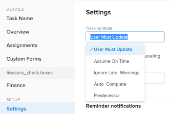

# Establecer el modo de seguimiento para las tareas

<!--Audited: 01/2025-->

El modo de seguimiento de una tarea determina cómo se actualiza el estado de progreso de la tarea en Adobe Workfront.

Para obtener más información sobre el modo de seguimiento de las tareas, consulte [Información general sobre el modo de seguimiento de las tareas](../../../manage-work/tasks/task-information/task-tracking-mode.md).

## Requisitos de acceso

+++ Expanda para ver los requisitos de acceso para la funcionalidad en este artículo. 

<table style="table-layout:auto"> 
 <col> 
 <col> 
 <tbody> 
  <tr> 
   <td role="rowheader">Paquete de Adobe Workfront</td> 
   <td> 
Cualquiera
 </td> 
  </tr> 
  <tr> 
   <td role="rowheader">Licencia de Adobe Workfront</td> 
   <td> 
Estándar

Trabajo o superior
 
   </td> 
  </tr> 
  <tr> 
   <td role="rowheader">Configuraciones de nivel de acceso</td> 
   <td> 
Editar acceso a Tareas 
 </td> 
  </tr> 
  <tr> 
   <td role="rowheader">Permisos de objeto</td> 
   <td> 
Administración de permisos en una tarea
 </td> 
  </tr> 
 </tbody> 
</table>

*Para obtener información, consulte [Requisitos de acceso en la documentación de Workfront](/help/quicksilver/administration-and-setup/add-users/access-levels-and-object-permissions/access-level-requirements-in-documentation.md).

+++

<!--
old: 
<table style="table-layout:auto"> 
 <col> 
 <col> 
 <tbody> 
  <tr> 
   <td role="rowheader">Adobe Workfront plan</td> 
   <td> 
Any
 </td> 
  </tr> 
  <tr> 
   <td role="rowheader">Adobe Workfront license*</td> 
   <td> 
New: Standard
 
   Or
   
Current: Work or higher
 
   </td> 
  </tr> 
  <tr> 
   <td role="rowheader">Access level configurations</td> 
   <td> 
Edit access to Tasks 
 </td> 
  </tr> 
  <tr> 
   <td role="rowheader">Object permissions</td> 
   <td> 
Manage permissions on a task
 </td> 
  </tr> 
 </tbody> 
</table>

-->

## Establecer el modo de seguimiento para las tareas

1. Vaya a la tarea para la que desee establecer el modo de seguimiento.
1. Haga clic en el icono **Más** junto al nombre de la tarea y, a continuación, haga clic en **Editar**.

   Se abrirá el cuadro de diálogo Editar tarea.

1. En la sección **Configuración**, use el menú desplegable **Modo de seguimiento** para seleccionar el Modo de seguimiento para la tarea.

   

1. Seleccione entre las siguientes opciones:

   * El usuario debe actualizar (esta es la opción predeterminada)
   * Asumir a tiempo
   * Ignorar advertencias tardías
   * Completar automáticamente
   * Predecesora

   Para obtener más información sobre el modo de seguimiento, consulte [Información general sobre el modo de seguimiento de las tareas](../../../manage-work/tasks/task-information/task-tracking-mode.md)

1. Haga clic en **Guardar**.
