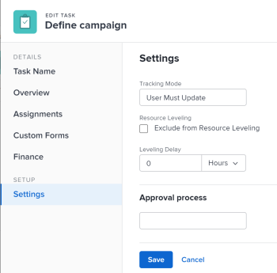

# Actualización del retraso de redistribución de tareas

A veces, puede haber conflictos entre las programaciones de tareas de un proyecto. Puede redistribuir recursos o solucionar conflictos de recursos, reprogramando recursos y tareas para que todas las tareas se puedan completar dentro de una programación realista. Para obtener información acerca de la redistribución de tareas, consulte [Redistribuir recursos en el gráfico de Gantt](../../../manage-work/gantt-chart/use-the-gantt-chart/level-resources-in-gantt.md).

Como gerente del proyecto o como asignado de la tarea, también puede añadir un retraso de redistribución en tareas individuales para tener en cuenta los conflictos de recursos o de programación. En otras palabras, una tarea se puede programar con un retraso para garantizar que, cuando Adobe Workfront nivele las tareas, una programación más realista supere los conflictos de recursos.

Si se añade un retraso de redistribución a una tarea, se ajusta la Fecha proyectada de finalización de la tarea. Para obtener información acerca de la fecha proyectada de finalización, consulte [Información general sobre la fecha proyectada de finalización de proyectos, tareas y problemas](../../../manage-work/projects/planning-a-project/project-projected-completion-date.md).

## Requisitos de acceso

+++ Expanda para ver los requisitos de acceso para la funcionalidad en este artículo.

<table style="table-layout:auto"> 
 <col> 
 <col> 
 <tbody> 
  <tr> 
   <td role="rowheader">Paquete de Adobe Workfront</td> 
   <td> 
Cualquiera
 </td> 
  </tr> 
  <tr> 
   <td role="rowheader">Licencia de Adobe Workfront</td> 
   <td> 
Estándar

   
Trabajo o superior
 </td> 
  </tr> 
  <tr> 
   <td role="rowheader">Configuraciones de nivel de acceso</td> 
   <td> 
Editar el acceso a Tareas y Proyectos
</td> 
  </tr> 
  <tr> 
   <td role="rowheader">Permisos de objeto</td> 
   <td> 
Permisos de administración para tareas 
 
Permisos de aportación o superiores para proyectos
 </td> 
  </tr> 
 </tbody> 
</table>

Para obtener más información, consulte [Requisitos de acceso en la documentación de Workfront](/help/quicksilver/administration-and-setup/add-users/access-levels-and-object-permissions/access-level-requirements-in-documentation.md).

+++

<!--
Old:

<table style="table-layout:auto"> 
 <col> 
 <col> 
 <tbody> 
  <tr> 
   <td role="rowheader">Adobe Workfront plan*</td> 
   <td> 
Any
 </td> 
  </tr> 
  <tr> 
   <td role="rowheader">Adobe Workfront license*</td> 
   <td> 
Work or higher
 </td> 
  </tr> 
  <tr> 
   <td role="rowheader">Access level configurations*</td> 
   <td> 
Edit access to Tasks and Projects
 
Note: If you still don't have access, ask your Workfront administrator if they set additional restrictions in your access level. For information on how a Workfront administrator can modify your access level, see <a href="../../../administration-and-setup/add-users/configure-and-grant-access/create-modify-access-levels.md" class="MCXref xref">Create or modify custom access levels</a>.
 </td> 
  </tr> 
  <tr> 
   <td role="rowheader">Object permissions</td> 
   <td> 
Manage permissions to Tasks 
 
Contribute or higher permissions to Projects
 
For information on requesting additional access, see <a href="../../../workfront-basics/grant-and-request-access-to-objects/request-access.md" class="MCXref xref">Request access to objects </a>.
 </td> 
  </tr> 
 </tbody> 
</table>
-->

## Añadir un retraso de redistribución a una tarea

1. Vaya a una tarea para la que desee añadir un retraso de redistribución.
1. Haga clic en el icono **Más** a la derecha del nombre de la tarea y, a continuación, haga clic en **Editar**.

1. Haga clic en **Configuración**.

   

1. Especifique el **Retraso de distribución**, en horas, y después elija una unidad de tiempo.\
   Es el tiempo que el recurso tardará en iniciar la tarea debido a conflictos de recursos.

   Seleccione entre las siguientes opciones para unidades de tiempo:

   * minutos
   * Horas. Es la opción predeterminada.
   * Días
   * Semanas
   * Meses
   * Minutos transcurridos
   * Horas transcurridas
   * Días transcurridos
   * Semanas transcurridas
   * Meses transcurridos

   >[!TIP]
   >
   >El tiempo transcurrido es una unidad de tiempo de la duración de una tarea. Es el tiempo entre la fecha de inicio planificada y la fecha de finalización planificada de una tarea que incluye días festivos, fines de semana y días libres. En otras palabras, el tiempo transcurrido es el paso de los días del calendario.

1. Haga clic en **Guardar**.

