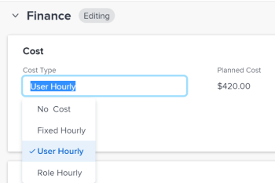

# Actualizar el tipo de coste de tarea

El coste planificado y real de las tareas y sus costes de mano de obra vienen determinados por el tipo de coste de cada tarea.

Puede configurar el Tipo de coste para tareas individuales dentro del proyecto. Cada tipo de coste afecta a los valores de Coste planificado y Coste real.

Para obtener información sobre el seguimiento de costos en Adobe Workfront, vea [Seguimiento de costos](../../../manage-work/projects/project-finances/track-costs.md).

## Requisitos de acceso

+++ Expanda para ver los requisitos de acceso para la funcionalidad en este artículo.

<table style="table-layout:auto"> 
 <col> 
 <col> 
 <tbody> 
  <tr> 
   <td role="rowheader">Paquete de Adobe Workfront</td> 
   <td> 
Cualquiera
 </td> 
  </tr> 
  <tr> 
   <td role="rowheader">Licencia de Adobe Workfront</td> 
   <td> 
Estándar

   
Plan
 </td> 
  </tr> 
  <tr> 
   <td role="rowheader">Configuraciones de nivel de acceso</td> 
   <td> 
Editar el acceso a Proyectos, Tareas y Datos Financieros
</td> 
  </tr> 
  <tr> 
   <td role="rowheader">Permisos de objeto</td> 
   <td> 
Permisos de aportación o superiores para un proyecto
 
Permisos de administración de una tarea
 </td> 
  </tr> 
 </tbody> 
</table>

Para obtener más información, consulte [Requisitos de acceso en la documentación de Workfront](/help/quicksilver/administration-and-setup/add-users/access-levels-and-object-permissions/access-level-requirements-in-documentation.md).

+++

<!--
Old:

<table style="table-layout:auto"> 
 <col> 
 <col> 
 <tbody> 
  <tr> 
   <td role="rowheader">Adobe Workfront plan*</td> 
   <td> 
Any
 </td> 
  </tr> 
  <tr> 
   <td role="rowheader">Adobe Workfront license*</td> 
   <td> 
Plan 
 </td> 
  </tr> 
  <tr> 
   <td role="rowheader">Access level configurations*</td> 
   <td> 
Edit access to Projects, Tasks, and Financial Data
 
Note: If you still don't have access, ask your Workfront administrator if they set additional restrictions in your access level. For information on how a Workfront administrator can modify your access level, see <a href="../../../administration-and-setup/add-users/configure-and-grant-access/create-modify-access-levels.md" class="MCXref xref">Create or modify custom access levels</a>.
 </td> 
  </tr> 
  <tr> 
   <td role="rowheader">Object permissions</td> 
   <td> 
Contribute or higher permissions to a project
 
Manage permissions to a task
 
For information on requesting additional access, see <a href="../../../workfront-basics/grant-and-request-access-to-objects/request-access.md" class="MCXref xref">Request access to objects </a>.
 </td> 
  </tr> 
 </tbody> 
</table>
-->

## Configurar el tipo de coste de una tarea individual

1. Vaya a la tarea donde desea configurar el tipo de coste.
1. Haga clic en **Detalles de la tarea** en el panel izquierdo y, a continuación, expanda el área de **Finanzas**.
1. Haga doble clic en **Tipo de coste** y seleccione el tipo de coste que desea aplicar a la tarea.

   

   Seleccione entre las siguientes opciones:

   * Sin coste
   * Fijo por hora
   * Usuario por hora
   * Rol por hora

   Para obtener más información acerca de cada tipo de coste de tarea, consulte [Rastrear costes](../../../manage-work/projects/project-finances/track-costs.md).

1. Haga clic en **Guardar** **cambios** **.**
