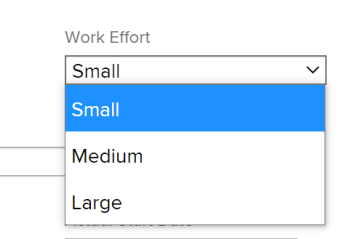

# Información general de esfuerzo laboral

<!--Audited: 01/2024-->

<!--
(NOTE: Linked to the UI >> in the Project/ Template edit box > Tasks area> Learn more)
-->

Como administrador del proyecto, puede decidir cómo desea calcular la cantidad de trabajo necesario para completar las tareas de un proyecto. Calcule la cantidad de trabajo necesario para completar las tareas utilizando uno de los siguientes indicadores:

<table style="table-layout:auto"> 
 <col> 
 <col> 
 <tbody> 
  <tr> 
   <td role="rowheader">Horas planificadas</td> 
   <td> <p> Una entrada numérica manual o un cálculo de Adobe Workfront que muestra el número de horas que tardarían los recursos asignados a una tarea en completarla. </p> <p>Tenga en cuenta lo siguiente sobre las horas planificadas: </p> 
    <ul> 
     <li>Este es el método predeterminado. </li> 
     <li>Solo puede actualizar de forma manual las horas planificadas para tareas con un tipo de duración de Asignación calculada o Simple. </li> 
    </ul> <p>Para obtener información sobre las horas planificadas, consulte <a href="../../../manage-work/tasks/task-information/planned-hours.md" class="MCXref xref">Información general de horas planificadas</a>. </p> </td> 
  </tr> 
  <tr> 
   <td role="rowheader">Esfuerzo de trabajo </td> 
   <td> <p>Una etiqueta manual que define si el esfuerzo diario por parte del usuario será menor, moderado o grande para completar una tarea. <!--
      <MadCap:conditionalText data-mc-conditions="QuicksilverOrClassic.Draft mode">
       The level of effort is estimated to be a percentage of the daily amount of working time. (NOTE: keep this drafted. Vazgen said it's not needed, but waiting for feedback from users)
      </MadCap:conditionalText>
     --> </p> <p>Tenga en cuenta lo siguiente sobre el esfuerzo laboral:</p> 
    <ul> 
     <li>Este campo solo está disponible para tareas con un tipo de duración simple. </li> 
     <li>Puede habilitar el uso de esta etiqueta y definir el porcentaje de tiempo de trabajo asociado a ella en el nivel de proyecto. </li> 
    </ul> </td> 
  </tr> 
 </tbody> 
</table>

Este artículo describe qué es el esfuerzo laboral y cómo debe utilizarlo al estimar la cantidad de trabajo para sus tareas.

>[!NOTE]
>
>Las horas planificadas y el esfuerzo laboral se influyen entre sí. La actualización de las horas planificadas puede actualizar el esfuerzo laboral y la actualización del esfuerzo laboral puede actualizar las horas planificadas de la tarea.

## Requisitos de acceso

+++ Expanda para ver los requisitos de acceso para la funcionalidad en este artículo.

<table style="table-layout:auto"> 
 <col> 
 <col> 
 <tbody> 
  <tr> 
   <td role="rowheader">Paquete de Adobe Workfront</td> 
   <td> <p>Cualquiera</p> </td> 
  </tr> 
  <tr> 
   <td role="rowheader">Licencia de Adobe Workfront</td> 
   <td> <p>Estándar</p>
   <p>Plan</p>
   </td> 
  </tr> 
  <tr> 
   <td role="rowheader">Configuraciones de nivel de acceso</td> 
   <td> <p>Editar acceso a proyectos y tareas</p> </td> 
  </tr> 
  <tr> 
   <td role="rowheader">Permisos de objeto</td> 
   <td> <p>Administrar permisos para un proyecto y sus tareas</p>  </td> 
  </tr> 
 </tbody> 
</table>

Para obtener más información, consulte [Requisitos de acceso en la documentación de Workfront](/help/quicksilver/administration-and-setup/add-users/access-levels-and-object-permissions/access-level-requirements-in-documentation.md).

+++

<!--Old:

<table style="table-layout:auto"> 
 <col> 
 <col> 
 <tbody> 
  <tr> 
   <td role="rowheader">Adobe Workfront plan</td> 
   <td> <p>Any</p> </td> 
  </tr> 
  <tr> 
   <td role="rowheader">Adobe Workfront license*</td> 
   <td> <p>Current: Plan </p>
   Or
   <p>New: Standard </p>
    </td> 
  </tr> 
  <tr> 
   <td role="rowheader">Access level configuration</td> 
   <td> <p>Edit access to Projects and Tasks</p> </td> 
  </tr> 
  <tr> 
   <td role="rowheader">Object permissions</td> 
   <td> <p>Manage permissions to a project and its tasks</p>  </td> 
  </tr> 
 </tbody> 
</table>-->

## Consideraciones sobre el uso de esfuerzo laboral

* Cuando las tareas del proyecto tienen 0 horas planificadas y habilita la opción Usar esfuerzo laboral para calcular automáticamente las horas planificadas de la tarea en el proyecto, el nivel predeterminado de esfuerzo laboral asociado a ellas será Moderado. Las horas planificadas se actualizan automáticamente para las tareas de tipo de duración simple. Para obtener más información, consulte la sección [Niveles de esfuerzo laboral](#levels-of-work-effort) en este artículo.
* Cuando las tareas del proyecto tienen horas planificadas superiores a 0 y habilita la opción Usar esfuerzo laboral para calcular automáticamente la configuración de Horas planificadas de la tarea en el proyecto, el nivel de esfuerzo laboral se actualiza según la cantidad de horas planificadas sin cambiar la cantidad de horas planificadas para tareas de tipo de duración simple. Para obtener más información, consulte la sección [Cómo calcula Workfront el esfuerzo laboral en función de las horas planificadas](#how-workfront-calculates-work-effort-based-on-planned-hours) en este artículo.
* Cuando las tareas del proyecto tienen 0 horas planificadas y habilita la opción Usar esfuerzo laboral para calcular automáticamente la configuración de Horas planificadas de la tarea en el proyecto y luego actualiza el nivel de esfuerzo laboral de Moderado a Menor o Grande, las horas planificadas también se actualizan. Para obtener más información, consulte la sección [Cómo calcula Workfront las horas planificadas en función del esfuerzo laboral](#how-workfront-calculates-planned-hours-based-on-work-effort) en este artículo.
* Cuando edita en línea las tareas y modifica tanto las Horas planificadas como el Esfuerzo laboral para la tarea al mismo tiempo, las Horas planificadas se actualizarán con el valor que especifique, mientras que el valor de Esfuerzo laboral se calcula en función de las Horas planificadas actualizadas.
* Cuando se actualiza el valor de Esfuerzo laboral de una tarea, la duración ya no se calcula automáticamente según las Horas planificadas. Para obtener más información sobre cómo se calcula la Duración para tareas de Duración simple, consulte [Información general del tipo de duración: Simple](../../../manage-work/tasks/taskdurtn/simple-duration-type.md).
* Al cambiar el Tipo de duración de una tarea de Simple a cualquier otro tipo, el campo Esfuerzo laboral se oculta en la tarea. Las horas planificadas permanecen sin cambios.
* No se puede actualizar el nivel de Esfuerzo laboral en una tarea principal. El nivel de Esfuerzo laboral de una tarea principal se calcula automáticamente en función del número de Horas planificadas para las tareas, que es un resumen de todas las tareas secundarias. Para obtener información acerca de las tareas principales, consulte [Creación de subtareas](../../../manage-work/tasks/create-tasks/create-subtasks.md).

## Habilitar mediante esfuerzo laboral en lugar de horas planificadas

1. Vaya a un proyecto y haga clic en el menú **Más** ; a continuación, haga clic en **Editar**.
1. Haga clic en **Configuración de la tarea** y, a continuación, seleccione la opción **Usar esfuerzo laboral para calcular automáticamente las horas planificadas para la tarea**. Esta opción está desactivada de forma predeterminada.

   

   Para obtener más información sobre cómo habilitar el uso del esfuerzo laboral en un proyecto, consulte la sección &quot;Configuración de tareas&quot; en el artículo [Editar proyectos](../../../manage-work/projects/manage-projects/edit-projects.md).

1. Haga clic en **Tareas** en el panel izquierdo y luego haga clic en el nombre de una tarea para acceder a ella.
1. Haga clic en el icono **Más** del menú  y luego haga clic en **Editar**. Asegúrese de que la tarea tenga un Tipo de duración simple.

   >[!TIP]
   >
   >También puede actualizar el esfuerzo laboral de una tarea en la sección Detalles de la tarea.

1. En el área **Información general**, haga clic en el menú desplegable Esfuerzo laboral para corregir la cantidad de esfuerzo necesario para completar la tarea.

   

   Para obtener más información sobre cómo actualizar el campo Esfuerzo laboral en una tarea, consulte los siguientes artículos:

   * La sección &quot;Información general&quot; en el artículo [Editar tareas](../../../manage-work/tasks/manage-tasks/edit-tasks.md)
   * [Administrar información de tareas en el área Información general de Detalles de tarea](../../../manage-work/tasks/manage-tasks/task-information-in-overview.md)

## Niveles de esfuerzo laboral {#levels-of-work-effort}

Como jefe de proyecto, puede identificar tres niveles de Esfuerzo laboral para sus proyectos. Cada nivel de esfuerzo equivale a un porcentaje del tiempo diario que los usuarios necesitan para completar la tarea.

Al configurar el nivel de Esfuerzo laboral, debe preguntarse: &quot;¿Cuánto tiempo debe invertir un usuario asignado a esta tarea en ella diariamente para realizarla a tiempo?&quot;

La siguiente tabla ilustra los posibles niveles de Esfuerzo laboral y los porcentajes correspondientes predeterminados. Como jefe de proyecto, puede actualizar los porcentajes para adaptarlos a las necesidades de su organización. Esto se hace al editar un proyecto. Para obtener información sobre cómo editar proyectos, consulte [Editar proyectos](../../../manage-work/projects/manage-projects/edit-projects.md).

Como administrador de Workfront, puede definir las Horas habituales por día laborable en el área de Preferencias de proyecto de la Configuración. Esta es la cantidad diaria de tiempo que se considera tiempo de trabajo. Para obtener información sobre cómo configurar las Preferencias de proyecto para su instancia de Workfront, consulte [Configurar las preferencias de proyecto para todo el sistema](../../../administration-and-setup/set-up-workfront/configure-system-defaults/set-project-preferences.md).

>[!NOTE]
>
>En los ejemplos siguientes, suponemos que el administrador de Workfront ha establecido la cantidad de Horas habituales por día laborable en 8 horas.

<table style="table-layout:auto"> 
 <col> 
 <col> 
 <tbody> 
  <tr> 
   <td>Nivel de esfuerzo laboral</td> 
   <td>Valores de porcentaje</td> 
  </tr> 
  <tr> 
   <td>Pequeño </td> 
   <td>Se establece un nivel de esfuerzo pequeño para completar una tarea en el 25 % de las Horas habituales por día laborable. Esto significa que una tarea asignada a este nivel de Esfuerzo de trabajo debe tardar hasta 2 horas al día en completarse en un día. <code>(0.25*8=2)</code></td> 
  </tr> 
  <tr> 
   <td>Media</td> 
   <td> <p>Un nivel de esfuerzo medio para completar una tarea se establece en el 50 % de las Horas habituales por día laborable. Esto significa que una tarea asignada a este nivel de esfuerzo de trabajo debe tardar más de 2 horas y menos de 6 en completarse en un día. <code>(0.50*80=4)</code> </p> <p>Nota: Cuando la opción Usar Esfuerzo laboral para calcular automáticamente las Horas planificadas de la tarea está habilitada en el proyecto, esta es la opción predeterminada para una tarea, si la tarea tenía 0 Horas planificadas antes de que esta opción estuviera habilitada. Esto hace que las Horas planificadas para la tarea se actualicen a 4 horas. </p> </td> 
  </tr> 
  <tr> 
   <td>Grande</td> 
   <td>Un gran nivel de esfuerzo para completar una tarea se establece en el 75 % de las Horas habituales por día laborable. Esto significa que una tarea asignada a este nivel de Esfuerzo laboral debe tardar 6 horas o más en completarse en un día. <code>(0.75*8=6)</code></td> 
  </tr> 
 </tbody> 
</table>

## Cómo calcula Workfront las Horas planificadas en función del Esfuerzo laboral {#how-workfront-calculates-planned-hours-based-on-work-effort}

Si habilita la opción Usar Esfuerzo laboral para calcular automáticamente las Horas planificadas de la tarea en un proyecto, Workfront calculará el número de Horas planificadas de una tarea con un Tipo de duración simple mediante la siguiente fórmula:

```
Task Planned Hours = Number of days in task Duration * Work Effort percentage * Typical hours per work day
```

Por ejemplo, una tarea con una Duración de 3 días y un Esfuerzo laboral medio tiene 12 Horas planificadas:

```
Planned Hours = 3*4=12
```

donde el valor de Horas habituales por día laborable es 8 horas.

>[!TIP]
>
>Cuando se asigna una tarea a varios recursos, las Horas planificadas se distribuyen de manera uniforme en cada recurso para cada día de la duración de la tarea.

## Cómo calcula Workfront el Esfuerzo laboral en función de las Horas planificadas {#how-workfront-calculates-work-effort-based-on-planned-hours}

Cuando habilita la opción Usar Esfuerzo laboral para calcular automáticamente las Horas planificadas de la tarea en un proyecto y ya tiene Horas planificadas en la tarea o edita el número de Horas planificadas en la tarea, Workfront actualiza el valor Esfuerzo laboral.

Workfront utiliza la siguiente fórmula para actualizar el nivel de Esfuerzo laboral según las Horas planificadas:

```
Work Effort level = Task Planned Hours / Duration / Typical hours per work day
```

Por ejemplo, si tiene una tarea con una Duración de 2 días y actualiza las Horas planificadas de 8 a 20 horas, el Esfuerzo laboral para la tarea se actualiza de Medio a Grande:

```
Work Effort level = 20 / 2 / 8 = 125 % = Large
```

## Buscar Esfuerzo laboral para tareas y proyectos

* [Esfuerzo laboral para proyectos](#work-effort-for-projects)
* [Esfuerzo laboral para tareas](#work-effort-for-tasks)

### Esfuerzo laboral para proyectos {#work-effort-for-projects}

Puede localizar la sección Esfuerzo laboral en un proyecto en la siguiente área:

* El área Configuración de tarea en el cuadro Editar proyecto

### Esfuerzo laboral para tareas {#work-effort-for-tasks}

Puede localizar el campo Esfuerzo laboral de una tarea en las siguientes áreas:

* El área Información general del cuadro Editar tarea
* El área Información general de la sección Detalles de tarea, en el área Tiempo de trabajo
* Lista de tareas o informe
