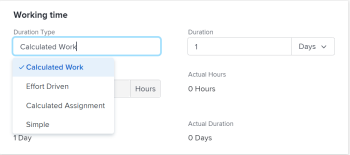

# Actualizar el tipo de duración de una tarea

El tipo de duración de una tarea identifica la relación entre el número de recursos asignados a una tarea, el esfuerzo total y la duración total de la tarea. Para obtener más información, consulte [Información general sobre la duración y el tipo de duración de las tareas](../../../manage-work/tasks/taskdurtn/task-duration-and-duration-type.md).

## Requisitos de acceso

+++ Expanda para ver los requisitos de acceso para la funcionalidad en este artículo.

<table style="table-layout:auto"> 
 <col> 
 <col> 
 <tbody> 
  <tr> 
   <td role="rowheader">Paquete de Adobe Workfront</td> 
   <td> 
Cualquiera
 </td> 
  </tr> 
  <tr> 
   <td role="rowheader">Licencia de Adobe Workfront</td> 
   <td>
Estándar o superior
 
   
Trabajo o superior
 </td> 
  </tr> 
  <tr> 
   <td role="rowheader">Configuraciones de nivel de acceso</td> 
   <td> 
Acceso de visualización o superior a los proyectos
 
Editar acceso a Tareas
 </td> 
  </tr> 
  <tr> 
   <td role="rowheader">Permisos de objeto</td> 
   <td> 
Administrar el acceso a la tarea 
</td> 
  </tr> 
 </tbody> 
</table>

Para obtener más información, consulte [Requisitos de acceso en la documentación de Workfront](/help/quicksilver/administration-and-setup/add-users/access-levels-and-object-permissions/access-level-requirements-in-documentation.md).

+++

<!--
Old:

<table style="table-layout:auto"> 
 <col> 
 <col> 
 <tbody> 
  <tr> 
   <td role="rowheader">Adobe Workfront plan*</td> 
   <td> 
Any 
 </td> 
  </tr> 
  <tr> 
   <td role="rowheader">Adobe Workfront license*</td> 
   <td> 
Work or higher
 </td> 
  </tr> 
  <tr> 
   <td role="rowheader">Access level configurations*</td> 
   <td> 
View or higher access to Projects
 
Edit access to Tasks
 
Note: If you still don't have access, ask your Workfront administrator if they set additional restrictions in your access level. For information on how a Workfront administrator can modify your access level, see <a href="../../../administration-and-setup/add-users/configure-and-grant-access/create-modify-access-levels.md" class="MCXref xref">Create or modify custom access levels</a>.
 </td> 
  </tr> 
  <tr> 
   <td role="rowheader">Object permissions</td> 
   <td> 
Manage access to the task 
 
For information on requesting additional access, see <a href="../../../workfront-basics/grant-and-request-access-to-objects/request-access.md" class="MCXref xref">Request access to objects </a>.
 </td> 
  </tr> 
 </tbody> 
</table>
-->

## Actualizar el tipo de duración de una tarea

Además de actualizar el tipo de duración de una tarea, tal y como se describe en este artículo, también es posible actualizar el tipo de duración al editar una tarea o al realizar asignaciones avanzadas. Para obtener más información, consulte:

* [Editar tareas](../../../manage-work/tasks/manage-tasks/edit-tasks.md)
* [Crear asignaciones avanzadas](../../../manage-work/tasks/assign-tasks/create-advanced-assignments.md)

Para actualizar el tipo de duración de una tarea:

1. Haga clic en **Menú principal** > **Proyectos** y, a continuación, haga clic en un proyecto para acceder él.
1. Haga clic en la sección **Tareas** del panel izquierdo.
1. Haga clic en **Detalles de la tarea** en el panel izquierdo y, a continuación, en el área Información general, haga clic en **Tipo de duración**.

   

1. Seleccione entre las siguientes opciones

   | Tipo de duración | Más información |
   |---|---|
   | Trabajo calculado | Para obtener más información, consulte [Información general sobre el tipo de duración: Trabajo calculado](../../../manage-work/tasks/taskdurtn/calculated-work.md). |
   | Condicionada por el esfuerzo | Para obtener más información, consulte [Información general sobre el tipo de duración: Condicionada por el esfuerzo](../../../manage-work/tasks/taskdurtn/effort-driven.md). |
   | Asignación calculada | Para obtener más información, consulte [Información general sobre el tipo de duración: Asignación calculada](../../../manage-work/tasks/taskdurtn/calculated-assignment.md). |
   | Simple | Para obtener más información, consulte [Información general sobre el tipo de duración: Simple](../../../manage-work/tasks/taskdurtn/simple-duration-type.md). |

1. Haga clic en **Guardar cambios**.
