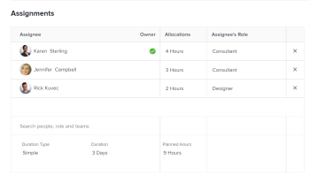

# Actualización de las horas planificadas y la duración de una tarea con un tipo de duración simple

De forma predeterminada, Adobe Workfront calcula la duración de una tarea con un tipo de duración simple en función de la cantidad de horas planificadas. Sin embargo, también puede editar manualmente la cantidad de horas planificadas y la duración de una tarea de duración simple en ciertas áreas de Workfront.

Puede editar las horas planificadas y la duración de una tarea con un tipo de duración simple en línea o en el nivel de tarea en el área Asignaciones.

Para obtener más información sobre cómo editar información en línea, consulte [Editar elementos en línea en una lista en Adobe Workfront](../../../workfront-basics/navigate-workfront/use-lists/inline-edit-objects.md).

En este artículo se describe cómo actualizar las horas y la duración planificadas de una tarea con un tipo de duración simple en el nivel de tarea, en el área Asignaciones.

## Requisitos de acceso

+++ Expanda para ver los requisitos de acceso para la funcionalidad en este artículo.

<table style="table-layout:auto"> 
 <col> 
 <col> 
 <tbody> 
  <tr> 
   <td role="rowheader">Paquete de Adobe Workfront</td> 
   <td> 
Cualquiera
 </td> 
  </tr> 
  <tr> 
   <td role="rowheader">Licencia de Adobe Workfront</td> 
   <td>
Estándar o superior
 
   
Trabajo o superior
 </td> 
  </tr> 
  <tr> 
   <td role="rowheader">Configuraciones de nivel de acceso</td> 
   <td> 
Acceso de visualización o superior a los proyectos
 
Editar acceso a Tareas
 </td> 
  </tr> 
  <tr> 
   <td role="rowheader">Permisos de objeto</td> 
   <td> 
Administrar el acceso a la tarea 
</td> 
  </tr> 
 </tbody> 
</table>

Para obtener más información, consulte [Requisitos de acceso en la documentación de Workfront](/help/quicksilver/administration-and-setup/add-users/access-levels-and-object-permissions/access-level-requirements-in-documentation.md).

+++

<!--
Old:

<table style="table-layout:auto"> 
 <col> 
 <col> 
 <tbody> 
  <tr> 
   <td role="rowheader">Adobe Workfront plan*</td> 
   <td> 
Any
 </td> 
  </tr> 
  <tr> 
   <td role="rowheader">Adobe Workfront license*</td> 
   <td> 
Work or higher
 </td> 
  </tr> 
  <tr> 
   <td role="rowheader">Access level configurations*</td> 
   <td> 
Edit access to Tasks
 
Note: If you still don't have access, ask your Workfront administrator if they set additional restrictions in your access level. For information on how a Workfront administrator can modify your access level, see <a href="../../../administration-and-setup/add-users/configure-and-grant-access/create-modify-access-levels.md" class="MCXref xref">Create or modify custom access levels</a>.
 </td> 
  </tr> 
  <tr> 
   <td role="rowheader">Object permissions</td> 
   <td> 
Manage permissions to the task
 
For information on requesting additional access, see <a href="../../../workfront-basics/grant-and-request-access-to-objects/request-access.md" class="MCXref xref">Request access to objects </a>.
 </td> 
  </tr> 
 </tbody> 
</table>
-->

## Actualización de las horas planificadas y la duración de una tarea con un tipo de duración simple

>[!IMPORTANT]
>
>Después de actualizar manualmente la Duración de una tarea de Duración simple, Workfront deja de calcularla en función de las Horas planificadas.

Para editar las horas planificadas y la duración de una tarea con un tipo de duración simple en la ventana Asignaciones avanzadas:

1. En una lista de tareas, haga clic en el nombre de la tarea para la que desea cambiar el tipo de duración.
1. Realice una de las siguientes acciones:

   * Haga clic en el icono **Más**  junto al nombre de la tarea, haga clic en **Editar** y, a continuación, en **Asignaciones**.
   * Haga clic en **Asignado a** o en el nombre de las asignaciones en el área Asignaciones del encabezado de la tarea y, a continuación, haga clic en **Avanzado**.

1. Escriba un valor total de **Horas planificadas** para todas las asignaciones, por ejemplo, 10 horas. El número total de horas planificadas se distribuye equitativamente entre todos los recursos asignados a la tarea.
1. (Opcional) Ajuste manualmente las horas planificadas de cada recurso asignado a la tarea. El número total de horas planificadas para la tarea se actualiza para reflejar las nuevas horas asignadas individualmente a los recursos.
1. Escriba un valor para la tarea **Duration**, por ejemplo 2 días.

   

1. Haga clic en **Guardar**.
