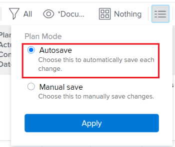

# Crear relaciones de predecesoras mediante el encadenamiento de tareas

Puede crear relaciones de predecesoras de varias formas en Adobe Workfront. Un método consiste en encadenar tareas.

Para obtener información acerca de las tareas predecesoras, consulte [Información general sobre las tareas predecesoras](../../../manage-work/tasks/use-prdcssrs/predecessors-overview.md).

Al encadenar tareas, puede permitir que el sistema cree automáticamente las relaciones de predecesoras en las tareas seleccionadas, en lugar de crear manualmente una relación en cada tarea. Se pueden seguir utilizando distintos tipos de relación de predecesoras entre las tareas.

## Requisitos de acceso

+++ Expanda para ver los requisitos de acceso para la funcionalidad en este artículo.

<table style="table-layout:auto"> 
 <col> 
 <col> 
 <tbody> 
  <tr> 
   <td role="rowheader">Paquete de Adobe Workfront</td> 
   <td> 
Cualquiera
 </td> 
  </tr> 
  <tr> 
   <td role="rowheader">Licencia de Adobe Workfront</td> 
   <td>
Estándar
 
   
Plan
 </td> 
  </tr> 
  <tr> 
   <td role="rowheader">Configuraciones de nivel de acceso</td> 
   <td> 
Editar el acceso a Tareas y Proyectos
 </td> 
  </tr> 
  <tr> 
   <td role="rowheader">Permisos de objeto</td> 
   <td> 
Administrar permisos para las tareas y el proyecto
</td> 
  </tr> 
 </tbody> 
</table>

Para obtener más información, consulte [Requisitos de acceso en la documentación de Workfront](/help/quicksilver/administration-and-setup/add-users/access-levels-and-object-permissions/access-level-requirements-in-documentation.md).

+++

<!--
Old:
<table style="table-layout:auto"> 
 <col> 
 <col> 
 <tbody> 
  <tr> 
   <td role="rowheader">Adobe Workfront plan</td> 
   <td> 
Any
 </td> 
  </tr> 
  <tr> 
   <td role="rowheader">Adobe Workfront license</td> 
   <td> 
   
Standard 

    
Plan 
 </td> 
  </tr> 
  <tr> 
   <td role="rowheader">Access level configurations</td> 
   <td> 
Edit access to Tasks and Projects
 
Note: If you still don't have access, ask your Workfront administrator if they set additional restrictions in your access level. For information on how a Workfront administrator can modify your access level, see <a href="../../../administration-and-setup/add-users/configure-and-grant-access/create-modify-access-levels.md" class="MCXref xref">Create or modify custom access levels</a>.
 </td> 
  </tr> 
  <tr> 
   <td role="rowheader">Object permissions</td> 
   <td> 
Manage permissions to the tasks and the project
 
For information on requesting additional access, see <a href="../../../workfront-basics/grant-and-request-access-to-objects/request-access.md" class="MCXref xref">Request access to objects</a>.
 </td> 
  </tr> 
 </tbody> 
</table>
-->

## Encadenar tareas para crear relaciones de predecesoras

1. Vaya al proyecto que contiene las tareas que desea encadenar.
1. Haga clic en **Tareas** en el panel izquierdo.
1. (Condicional) Seleccione **Guardar automáticamente** en la esquina superior derecha de la lista de tareas y, a continuación, seleccione las tareas que desee encadenar.

   

   >[!IMPORTANT]
   >
   >No es posible encadenar tareas en una lista de tareas cuando se guardan manualmente los cambios realizados en las tareas o cuando se utiliza el modo Planificación de cronología para guardar tareas.

1. Haga clic con el botón derecho en las tareas seleccionadas y, a continuación, haga clic en **Encadenar**.
1. Seleccione entre los siguientes tipos de dependencia:

   * **Finalizar-Iniciar**
   * **Finalizar-Finalizar**
   * **Iniciar-Iniciar**
   * **Iniciar-Finalizar**

   Para obtener más información acerca de los tipos de dependencia de predecesoras, consulte [Información general sobre los tipos de dependencia entre tareas](../../../manage-work/tasks/use-prdcssrs/task-dependency-types.md).

1. (Opcional) Haga clic en **Desencadenar** si algunas de las tareas se han encadenado anteriormente.

   >[!CAUTION]
   >
   >Solo se quitan las predecesoras secuenciales mediante la opción de desencadenar al editar tareas de forma masiva.

   Las tareas seleccionadas ahora están vinculadas por relaciones de predecesoras.
