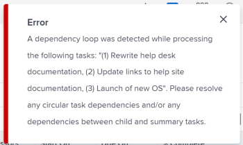
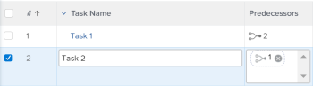

# Información general del bucle de dependencia de tareas

Al añadir relaciones de predecesoras a las tareas, puede encontrar bucles de dependencia. Para obtener información sobre las predecesoras, consulte [Información general sobre las tareas predecesoras](../../../manage-work/tasks/use-prdcssrs/predecessors-overview.md).

## Información general de bucle de dependencia

Los bucles de dependencia se producen cuando tiene dos o más tareas que dependen unas de otras para completarse. Adobe Workfront no permite crear una relación de predecesora entre tareas si crea un bucle de dependencia.

**Ejemplo:** La tarea 2 es predecesora de la tarea 1, lo que significa que debe completar la tarea 2 para poder empezar a trabajar en la tarea 1.

Si intenta hacer que la Tarea 1 sea la predecesora de la Tarea 2, se producirá un error de bucle de dependencia porque no podrá iniciar la Tarea 1 hasta que se haya completado la Tarea 2, pero la Tarea 2 no podrá iniciarse hasta que finalice la Tarea 1.

## Consideraciones sobre los bucles de dependencia

* Los bucles de dependencia pueden implicar más de dos tareas. A veces, cualquier número de elementos primarios de las tareas que está conectando con una relación predecesora son los que crean el bucle de dependencia.
* También puede producirse un bucle de dependencia si intenta hacer que una tarea principal sea la predecesora de una secundaria.
* En el caso de un bucle de dependencia, no se pueden guardar las tareas ni el proyecto. Para corregir el bucle de dependencia, debe volver a evaluar la relación de predecesoras entre las tareas enumeradas en el mensaje de error y quitar los conflictos antes de guardar las tareas o el proyecto.

