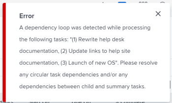

# Resumen del bucle de dependencia de tareas

Al agregar relaciones predecesoras a tareas, es posible que encuentre bucles de dependencia. Para obtener información sobre las predecesoras, consulte [Descripción general de las predecesoras de tareas](../../../manage-work/tasks/use-prdcssrs/predecessors-overview.md).

## Resumen del bucle de dependencia

Los bucles de dependencia se producen cuando tiene dos o más tareas que dependen unas de otras para completarse. Adobe Workfront no permite crear una relación predecesora entre tareas si crea un bucle de dependencia.

**Ejemplo:** La Tarea 2 es la predecesora de la Tarea 1, lo que significa que debe completar la Tarea 2 antes de comenzar a trabajar en la Tarea 1.

Si intenta convertir la Tarea 1 en predecesora de la Tarea 2, obtendrá un error de bucle de dependencia porque no puede iniciar la Tarea 1 hasta que la Tarea 2 se haya completado, pero la tarea 2 no se puede iniciar hasta que la Tarea 1 haya finalizado.

## Consideraciones sobre los bucles de dependencia

* Los bucles de dependencia pueden incluir más de dos tareas. A veces, cualquier número de elementos principales de las tareas que está conectando con una relación predecesora son los que crean el bucle de dependencia.
* También puede producirse un bucle de dependencia si intenta que un elemento principal sea el predecesor de un elemento secundario.
* En el caso de un bucle de dependencia, no puede guardar las tareas o el proyecto. Para corregir el bucle de dependencia, debe reevaluar la relación predecesora entre las tareas enumeradas en el mensaje de error y eliminar los conflictos antes de guardar las tareas o el proyecto.

 
