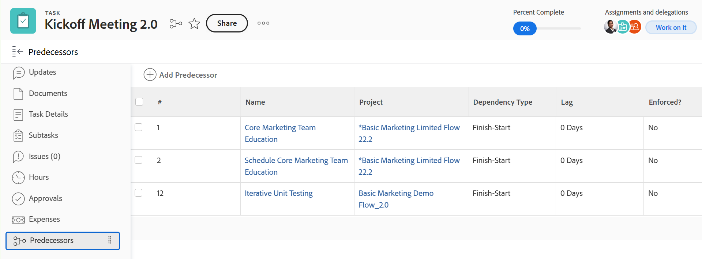
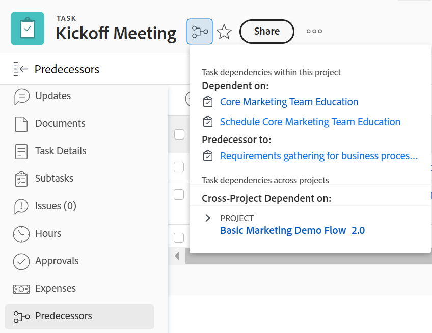

# Información general sobre predecesoras de tareas

<!--Audited: 12/2023-->

<!-- 

CONTEXT SENSITIVE HELP article. DO NOT CHANGE THE NAME OF THE ARTICLE/ DO NOT MOVE OR DELETE! -->

Una predecesora es la tarea de la que depende otra tarea (denominada tarea sucesora o dependiente). Adobe Workfront admite cinco tipos de dependencias de predecesoras. Para comprender las dependencias de predecesoras, vea [Información general sobre los tipos de dependencias entre tareas](../../../manage-work/tasks/use-prdcssrs/task-dependency-types.md).

## Información general sobre predecesoras

Es importante comprender la funcionalidad de las predecesoras para entender las escalas de tiempo de los proyectos.

Las relaciones de predecesoras de tareas existen tanto entre tareas de un mismo proyecto como entre tareas de distintos proyectos.

En el caso de dependencia entre proyectos, puede establecer predecesoras entre proyectos y entre tareas de dos proyectos diferentes.

Tanto si las tareas predecesoras como sucesoras pertenecen al mismo proyecto o a dos proyectos diferentes, las dependencias y las escalas de tiempo de cada proyecto se calculan de la misma manera.

En el caso de las tareas predecesoras, la línea de tiempo del proyecto se ve afectada por lo siguiente:

* Dependencia de predecesora
* Valor y tipo de retardo\
  Para obtener más información sobre la dependencia y los retardos, vea [Ejemplos de valores de predecesoras en una lista de tareas](#examples-of-predecessor-values-in-a-task-list).

  Por ejemplo, si la tarea A es la predecesora de la tarea B en una relación de inicio-final y la tarea B tiene una restricción de tarea de Lo antes posible, Workfront asigna a la tarea B una fecha de inicio planificada inmediatamente después de la fecha de finalización planificada de la tarea A, independientemente de si la predecesora se aplica o no.

Para comprender las relaciones de predecesoras, debe comprender lo siguiente:

* **Tipos de dependencias:** las predecesoras están vinculadas por varios tipos de dependencias. Para obtener más información sobre los tipos de dependencia, vea [Información general sobre los tipos de dependencia entre tareas](../../../manage-work/tasks/use-prdcssrs/task-dependency-types.md).

* **Aplicar una predecesora:** al aplicar una predecesora, la tarea sucesora no se puede iniciar hasta que se complete la predecesora. La tarea sucesora se muestra como iniciándose inmediatamente después de que finalice la predecesora.

  Cuando la tarea predecesora no se completa (o inicia) y no se aplica, la tarea sucesora puede comenzar, pero la escala de tiempo del proyecto se ve afectada por las fechas de las tareas predecesoras y sucesoras.

  Con una predecesora forzada, Workfront no permite que la tarea sucesora se marque como En curso o Completada hasta que se complete la predecesora.

  Sin embargo, Workfront permite que se informe de las horas de la tarea.\
  Para obtener más información sobre cómo aplicar predecesoras, vea [Aplicar predecesoras](../../../manage-work/tasks/use-prdcssrs/enforced-predecessors.md).

* **Retardos:** puede generar retardos en sus dependencias para crear un retardo que deba producirse después de la finalización de una tarea predecesora y antes de que pueda comenzar la tarea sucesora. Los retardos afectan a la escala de tiempo del proyecto.

  Para comprender los tipos de retardo, vea [Información general sobre tipos de retardo](../../../manage-work/tasks/use-prdcssrs/lag-types.md).

## Crear relaciones de predecesoras

Para crear predecesoras, consulte cualquiera de los siguientes artículos:

* Para establecer predecesoras mediante la pestaña Predecesoras de la tarea, vea [Crear una relación de predecesoras mediante el área Predecesoras](../../../manage-work/tasks/use-prdcssrs/create-predecessors-in-predecessors-area.md).
* Para establecer predecesoras en una lista de tareas, vea [Crear una relación de predecesoras en la lista de tareas](../../../manage-work/tasks/use-prdcssrs/create-predecessors-on-task-list.md).
* Para establecer relaciones de predecesoras encadenando tareas, vea [Crear relaciones de predecesoras encadenando tareas](../../../manage-work/tasks/use-prdcssrs/create-predecessors-by-chaining-tasks.md).
* Para establecer predecesoras entre proyectos, vea [Crear predecesoras entre proyectos](../../../manage-work/tasks/use-prdcssrs/cross-project-predecessors.md).

## Localizar las predecesoras de una tarea {#locate-the-predecessors-of-a-task}

Para buscar las predecesoras de una tarea, realice una de las siguientes acciones:

* Vaya al proyecto en el que está trabajando y haga lo siguiente:

   1. Busque la tarea para la que desea buscar las predecesoras y haga clic en la tarea.
   1. Haga clic en **Predecesoras** en el panel izquierdo.
   1. El nombre del proyecto en el que se encuentra la predecesora se muestra en la columna **Proyecto**.

      El número de la columna **#** muestra el número de la tarea predecesora. Por ejemplo, “6” significa la sexta tarea del proyecto.

      

* Vaya al proyecto en el que está trabajando y haga lo siguiente:

   1. Haga clic en la pestaña **Tareas**.
   1. Elija **Vista estándar** en la parte superior de la lista de tareas.
   1. La columna **Predecesoras** muestra los números de las tareas predecesoras.

      Para una tarea predecesora entre proyectos, la columna Predecesoras muestra el número de referencia del proyecto al que pertenece la tarea predecesora y el número de la tarea, separados por dos puntos.

      El icono de la predecesora se vuelve verde cuando la tarea predecesora se marca como completada. Esto indica que la tarea dependiente está lista para trabajar.

      Pase el puntero por encima de este valor para obtener más información sobre el predecesor, el proyecto y las fechas.

      

## Ejemplos de valores de tareas predecesoras en una lista de tareas {#examples-of-predecessor-values-in-a-task-list}

Cuando vea tareas predecesoras en una lista de tareas, puede que vea cualquiera de los siguientes tipos de tareas predecesoras con sus respectivos tipos de dependencia y cantidades de retraso:

* **1fs -** el número de tarea predecesora es 1. El tipo de dependencia es Fin-Inicio. En la línea de tiempo del proyecto, esta tarea está programada para iniciarse inmediatamente después de que finalice la tarea 1. A pesar de esto, aún puede marcarse como En curso o Completado.
* **1 -** el número de tarea predecesora es 1. Es igual que **1fs**, porque **fs** es la relación de predecesora predeterminada en Workfront.

* **1fse -** el número de tarea predecesora es 1. El tipo de dependencia es Finalizar-Iniciar-Forzado. En la línea de tiempo del proyecto, esta tarea se muestra como si comenzara inmediatamente después de que finalice la tarea 1. Workfront no permite que se marque como En curso o Completado hasta que se complete la tarea 1. Sin embargo, Workfront permite que se informe de las horas de la tarea.
* **1fs+3d -** el número de tarea predecesora es 1. El tipo de dependencia es Finalizar-Iniciar con un tiempo de retraso de 3 días. En la línea de tiempo del proyecto, esta tarea se muestra como el inicio de 3 días hábiles después de que finalice la tarea 1.
* **1fs-3d -** el número de tarea predecesora es 1. El tipo de dependencia es Finalizar-Iniciar con un tiempo de retraso de 3 días. En la línea de tiempo del proyecto, esta tarea se muestra como el inicio de 3 días laborables antes de que finalice la tarea predecesora.
* **1fs+3de**: el número de tarea predecesora es 1. El tipo de dependencia es Finalizar-Iniciar-Forzado con un tiempo de retraso de 3 días. En la línea de tiempo del proyecto, esta tarea se muestra como el inicio de 3 días hábiles después de que finalice la tarea 1. Workfront no permite que se marque como En curso o Completado hasta que se complete la tarea 1. Sin embargo, Workfront permite que se informe de las horas de la tarea.

  >[!NOTE]
  >
  >Debe añadir el valor obligatorio (**e**) al retraso y no a la tarea predecesora.

* **4515:2** el número de tarea predecesora es 2. - Se trata de una dependencia de tipo Fin a inicio no forzada con la tarea predecesora del proyecto con el número de referencia **4515**.

## Ver información de predecesora

Puede ver la información de tareas predecesoras en las siguientes áreas de Workfront. Esto incluye información sobre las tareas predecesoras entre proyectos:

* En el nivel de tarea, en la sección Tareas predecesoras.

  Para obtener información acerca de cómo ver la información de tareas predecesoras en la sección Tareas predecesoras, consulte la sección [Localizar las tareas predecesoras de una tarea](#locate-the-predecessors-of-a-task) en este artículo.

* En el gráfico Gantt.

  Para obtener información acerca de cómo mostrar tareas predecesoras en el gráfico Gantt, consulte [Configurar cómo se muestra la información en el gráfico Gantt](../../../manage-work/gantt-chart/use-the-gantt-chart/configure-info-on-gantt-chart.md).

* En una lista de tareas.

  Para ver información sobre las tareas predecesoras de las tareas en una lista de tareas, puede realizar una de las siguientes acciones:

   * Aplicar la vista estándar integrada en una lista de tareas.

     Para obtener información acerca de cómo ver la información de tareas predecesoras en la vista Estándar, consulte la sección [Buscar tareas predecesoras de una tarea](#locate-the-predecessors-of-a-task) en este artículo.

   * Crear una vista de tareas o un informe y añadir la columna Tareas predecesoras a esa vista.

     Para obtener más información acerca de cómo crear una vista personalizada para tareas con información de tareas predecesoras, consulte [Vista: detalles de tareas predecesoras](../../../reports-and-dashboards/reports/custom-view-filter-grouping-samples/view-predecessor-details.md).

* En el encabezado de la tarea al acceder a la tarea.

  
