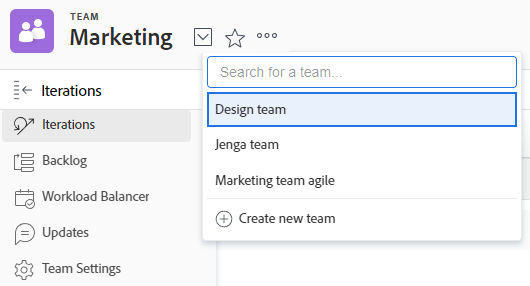

# Crear un equipo

Cuando crea un equipo, se convierte en el propietario del equipo de forma predeterminada.

Puede ver los Propietarios de todos los equipos cuando cree un informe para equipos e incluya el campo [!UICONTROL Nombre del propietario] en el informe. (Para obtener más información sobre cómo crear un informe, consulte [Crear un informe personalizado](../../reports-and-dashboards/reports/creating-and-managing-reports/create-custom-report.md).)

Para obtener información sobre cómo un administrador de [!DNL Adobe Workfront] puede crear un equipo desde el área de [!UICONTROL Configuración], consulte [Crear un equipo desde el área de [!UICONTROL Configuración]](../../administration-and-setup/add-users/create-and-manage-teams/create-a-team-from-setup.md).

## Requisitos de acceso

+++ Expanda para ver los requisitos de acceso para la funcionalidad en este artículo.

<table style="table-layout:auto"> 
 <col> 
 <col> 
 <tbody> 
  <tr data-mc-conditions=""> 
   <td role="rowheader"> 
Paquete de Adobe Workfront
 </td> 
   <td>Cualquiera</td> 
  </tr> 
  <tr> 
   <td role="rowheader">Licencia de Adobe Workfront</td> 
   <td>
   
Estándar

   
Plan
</td>
  </tr> 
 </tbody> 
</table>

Para obtener más información sobre el contenido de esta tabla, consulte [Requisitos de acceso en la documentación de Workfront](/help/quicksilver/administration-and-setup/add-users/access-levels-and-object-permissions/access-level-requirements-in-documentation.md).

+++

## Crear un equipo

{{step1-to-team}}

1. Haga clic en el icono **[!UICONTROL Cambiar equipos]**  y, a continuación, haga clic en **[!UICONTROL Crear nuevo equipo]**.

   

1. En el cuadro **[!UICONTROL Nuevo equipo]** que aparece, escriba la siguiente información:

   * **[!UICONTROL Nombre del equipo]:** escriba un nombre para el nuevo equipo.
   * **[!UICONTROL Grupo]**: si desea asignar el equipo a un grupo asociado, empiece a escribir el nombre del grupo y, a continuación, selecciónelo cuando aparezca.

     Puede asegurarse de que está asociando el grupo correcto con el equipo, pasando el puntero por encima de él y haciendo clic en el icono de información de  que se muestra junto a él. Esta acción muestra la ayuda contextual con información sobre el grupo, como la jerarquía de los grupos que tiene por encima y sus administradores.

     >[!NOTE]
     >
     >Cuando se asigna un equipo a un grupo o subgrupo, cualquier administrador de grupos de ese grupo o subgrupo puede administrar el equipo sin ser miembro de él. Los administradores del grupo pueden ir al área de Equipos desde el menú principal y hacer clic en la flecha para cambiar de equipo  para ver una lista de todos los equipos asignados a los grupos que administran.

   * **[!UICONTROL Este es un equipo Agile]:** Seleccione esta opción si desea configurar este nuevo equipo para que sea un equipo Agile.

     Para obtener más información sobre los equipos Agile, consulte [Crear un equipo Agile](../../agile/get-started-with-agile-in-workfront/create-an-agile-team.md).

   * **[!UICONTROL Miembros del equipo]:** empiece a escribir el nombre de un usuario para añadirlo al equipo y, a continuación, seleccione el nombre cuando aparezca en la lista desplegable.

     Repita este proceso para añadir varios usuarios al equipo.

     No hay límite en cuanto a la cantidad de usuarios que puede añadir a un equipo. Sin embargo, se recomienda no tener un número excesivamente alto de usuarios en un equipo, ya que la administración del trabajo podría resultar demasiado compleja para estos equipos.

   * **[!UICONTROL Descripción]:** escriba una descripción para el equipo.

     La descripción se muestra en la parte superior derecha del área Equipos cuando se selecciona el equipo.

     >[!NOTE]
     >
     >Si la descripción es larga, puede hacer clic en ella para mostrar la descripción completa en una ventana emergente. Si tiene acceso para editar la configuración del equipo, también puede editar la descripción directamente en la ventana emergente.

1. Haga clic en **[!UICONTROL Crear]**.
