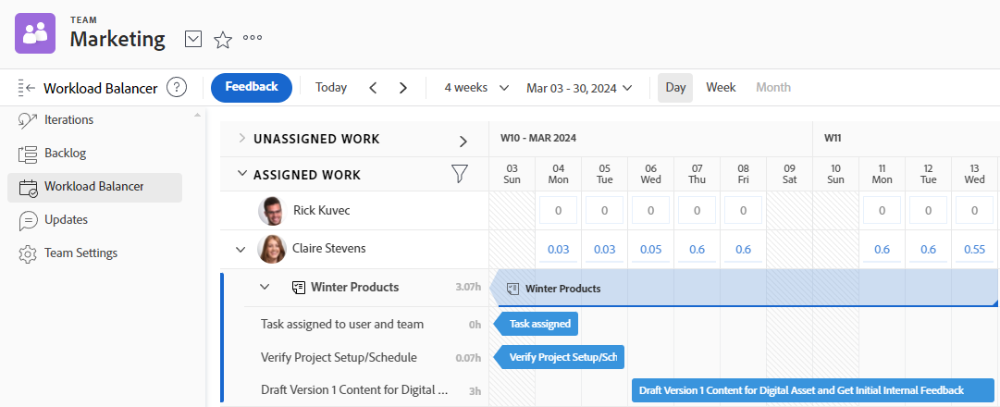

# Administrar en qué está trabajando su equipo

Puede ver una lista de los elementos en los que está trabajando su equipo en la sección [!UICONTROL Solicitudes de equipo] de su equipo.

Puede asignar elementos sin asignar, ajustar las asignaciones actuales, ajustar las asignaciones actuales y mucho más en la sección [!UICONTROL Distribuidor de cargas de trabajo] de su equipo.

Para obtener información detallada sobre cómo administrar el trabajo asignado a su equipo, consulte [[!UICONTROL Distribuidor de cargas de trabajo]](../../resource-mgmt/workload-balancer/assign-work-in-workload-balancer.md).

