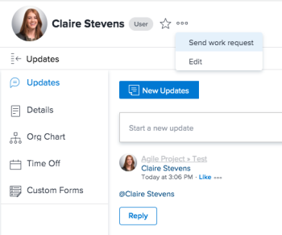

# Reemplazar el botón [!UICONTROL Trabajar en ello] por un botón [!UICONTROL Iniciar]

La configuración predeterminada de [!DNL Adobe Workfront] incluye un botón [!UICONTROL Trabajar en ello] para tareas y problemas que se muestra para elementos a los que se le ha asignado. Al hacer clic en [!UICONTROL Trabajar en ello] en los elementos que tiene asignados, indica a otros usuarios que ha recibido el trabajo y reconoce que trabajará en él. Sin embargo, el botón [!DNL Work On It] no actualiza el estado de la tarea o del problema para indicar que el trabajo se ha iniciado.

Puede reemplazar el botón [!DNL Work On It] por un botón [!UICONTROL Iniciar] para un equipo al que pertenezca. En este caso, hace clic en el botón [!UICONTROL Iniciar] en lugar de en [!UICONTROL Trabajar en ello], que actualiza automáticamente el estado y la [!UICONTROL Fecha real de inicio] del elemento de trabajo, lo que indica que ha iniciado el trabajo. Para obtener información sobre la configuración de qué equipo podría afectar a los cambios en el botón [!UICONTROL Trabajar en ello], consulte la sección [Configurar el botón [!UICONTROL Iniciar]](#configure-the-uicontrol-start-button) en este artículo.

>[!IMPORTANT]
>
>Al hacer clic en el botón [!UICONTROL Iniciar] se cambia el estado del elemento y se cambia [!UICONTROL la fecha real de inicio]. Si otra persona ha empezado a trabajar en una tarea o problema (que cambió el estado a [!UICONTROL En curso] y rellenó la [!UICONTROL Fecha de inicio real]), el botón del elemento se mostrará como [!UICONTROL Trabajar en ello] incluso cuando se ha reemplazado el botón por un botón [!UICONTROL Iniciar] en un equipo al que pertenece.

## Requisitos de acceso

+++ Expanda para ver los requisitos de acceso para la funcionalidad en este artículo.

<table style="table-layout:auto"> 
 <col> 
 <col> 
 <tbody> 
  <tr data-mc-conditions=""> 
   <td role="rowheader"> 
paquete de Adobe Workfront
 </td> 
   <td>Cualquiera</td> 
  </tr> 
  <tr> 
   <td role="rowheader">Licencia de Adobe Workfront</td> 
   <td>
   
Estándar

   
Plan
</td>
  </tr> 
 </tbody> 
</table>

Para obtener más información sobre el contenido de esta tabla, consulte [Requisitos de acceso en la documentación de Workfront](/help/quicksilver/administration-and-setup/add-users/access-levels-and-object-permissions/access-level-requirements-in-documentation.md).

+++

## Configurar el botón [!UICONTROL Iniciar]

Si tiene una licencia de [!UICONTROL Plan], puede configurar el botón [!UICONTROL Iniciar] para un equipo en la ventana [!UICONTROL Editar] equipo. A continuación, se muestra cómo funciona el botón después de habilitarlo para un equipo:

* **El equipo está asignado a un elemento de trabajo**: si se asigna un equipo al elemento de trabajo, los miembros de ese equipo verán el botón [!UICONTROL Iniciar] y los estados configurados para ese equipo.
* **El usuario pertenece a un equipo de inicio**: Si no se ha asignado ningún equipo al elemento de trabajo, pero el usuario está asignado a un equipo de inicio en su perfil, el usuario verá el botón [!UICONTROL Iniciar] y los estados configurados para ese equipo. Este es el escenario que recomendamos si desea que los usuarios usen el botón [!UICONTROL Iniciar] con frecuencia.
* **El usuario está asignado a un elemento de trabajo**: si no hay ningún equipo asignado al elemento de trabajo ni hay ningún equipo de inicio asignado al usuario, pero el usuario está asignado al elemento de trabajo, el usuario verá el botón [!UICONTROL Inicio] y los estados combinados configurados para todos los equipos a los que están asignados.
* **El usuario no está asignado a ningún equipo:** Si no hay ningún equipo asignado al elemento de trabajo ni ningún equipo para el usuario, incluido el equipo de inicio, y el elemento está asignado al usuario, el usuario parece tener el botón [!UICONTROL Trabajar en ello].

>[!NOTE]
>
>Esta función no está disponible actualmente en
>
>* La aplicación móvil [!DNL Workfront]
>* [!DNL Workfront for Office 365]
>* [!DNL Workfront] notificaciones por correo electrónico
>

Para configurar el botón Start:

{{step1-to-team}}

1. En el menú desplegable **[!UICONTROL Equipos]**, seleccione un equipo.\
   o\
   Haga clic en **[!UICONTROL Crear nuevo equipo]**.

1. Haga clic en el icono **[!UICONTROL Más]**  y luego haga clic en **[!UICONTROL Editar]**.

1. Busque la sección de botones **[!UICONTROL Trabajar en ello]** cerca de la parte inferior de la página [!UICONTROL Editar equipos].
1. Active la casilla de verificación **[!UICONTROL Cambiar el botón Trabajar en ello por un botón Iniciar para actualizar automáticamente el estado de un elemento]**.
1. Seleccione uno o varios estados para cada tipo de elemento de trabajo. Si selecciona más de un estado, aparecerá un menú desplegable al hacer clic en [!UICONTROL Iniciar], donde podrá elegir el estado que desee.
1. Haga clic en **[!UICONTROL Guardar cambios]**. Los usuarios ahora ven un botón [!UICONTROL Iniciar tarea] o [!UICONTROL Iniciar problema] en lugar del botón [!UICONTROL Trabajar en ello] cuando se les asigna un elemento de trabajo.

   >[!NOTE]
   >
   >Se recomienda configurar el equipo como el equipo de inicio de un usuario para que aparezca el botón de inicio en todos los elementos de trabajo asignados. Consulte [Asociar usuarios con un equipo de inicio](#associate-users-with-a-home-team) a continuación.

## Asociar usuarios a un equipo de inicio

Para asociar usuarios a un equipo de inicio:

{{step-1-to-users}}

1. Seleccione el usuario o usuarios que desea asociar con un equipo de inicio.
1. Haga clic en el menú **[!UICONTROL Más]** y luego seleccione **[!UICONTROL Editar]**.\
   

1. En la sección **[!UICONTROL Organización]**, seleccione el campo **[!UICONTROL Equipo de inicio]**. Empiece a escribir el nombre del equipo cuya configuración desea asociar con los usuarios. Haga clic en el nombre del equipo cuando lo vea en la lista.

1. Haga clic en **[!UICONTROL Guardar cambios]**.\
   Los usuarios que ha seleccionado ahora están asociados a un equipo de inicio.

   Cualquier configuración del equipo, incluidos los estados asociados con el botón [!UICONTROL Listo], ahora es visible para estos usuarios.

