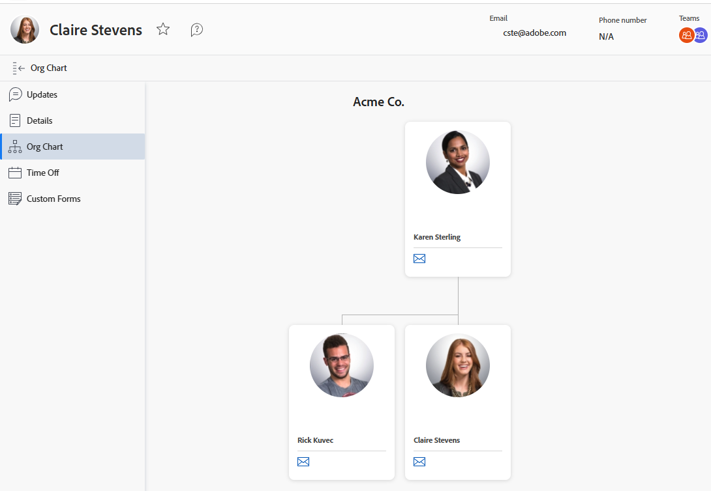

# Ver el organigrama

La característica de organigrama le permite ver el organigrama asociado a un usuario de [!DNL Adobe Workfront] en particular. Los gráficos organizativos son una buena manera de visualizar la estructura de un departamento específico.

## Requisitos de acceso

+++ Expanda para ver los requisitos de acceso para la funcionalidad en este artículo.

<table style="table-layout:auto">
 <col> 
 <col> 
 <tbody> 
  <tr> 
   <td>Paquete de Adobe Workfront</td> 
   <td>
Cualquiera
</td> 
  </tr> 
  <tr> 
   <td>Licencia de Adobe Workfront</td> 
   <td>
   
Ligero o superior

   
Revisión o superior
</td>
  </tr> 
 </tbody> 
</table>

Para obtener más información, consulte [Requisitos de acceso en la documentación de Workfront](/help/quicksilver/administration-and-setup/add-users/access-levels-and-object-permissions/access-level-requirements-in-documentation.md).

+++

## Busque el organigrama de un usuario

{{step1-click-profile-pic}}

1. En el panel izquierdo, haga clic en **[!UICONTROL Organigrama]**.
   

   Aparecerá el organigrama.
