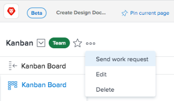

# Administrar solicitudes de trabajo y equipo

Una solicitud representa una asignación de tarea o problema pendiente. Las solicitudes de trabajo se realizan a individuos y las solicitudes de equipo se realizan a equipos.

>[!NOTE]
>
>Los equipos de Agile no tienen solicitudes de equipo.

## Requisitos de acceso

+++ Expanda para ver los requisitos de acceso para la funcionalidad en este artículo.

<table style="table-layout:auto"> 
 <col> 
 <col> 
 <tbody> 
  <tr data-mc-conditions=""> 
   <td role="rowheader">Paquete de Adobe Workfront</td> 
   <td>Cualquiera</td> 
  </tr> 
  <tr> 
   <td role="rowheader">Licencia de Adobe Workfront</td> 
   <td>
   
Para asignar o trabajar en una solicitud:
   
Ligero o superior

  
Revisión o superior

   
Para reasignar una solicitud:
   
Estándar

   
Trabajo o superior
</td>
  </tr> 
 </tbody> 
</table>

Para obtener más información sobre el contenido de esta tabla, consulte [Requisitos de acceso en la documentación de Workfront](/help/quicksilver/administration-and-setup/add-users/access-levels-and-object-permissions/access-level-requirements-in-documentation.md).

+++

## Asignar una solicitud a un equipo {#assign-a-request-to-a-team}

Los gestores de proyecto y los solicitantes de problemas pueden asignar trabajo a los equipos cuando no saben qué recurso es adecuado para realizar el trabajo o cuando no importa quién lo complete.

Las tareas asignadas al equipo permanecen en la pestaña [!UICONTROL Team Requests] hasta que un usuario del equipo se ofrezca voluntario para trabajar en la solicitud.

Cuando se asigna una solicitud a un equipo y a un usuario que no es miembro del equipo, esta se puede ver tanto en la pestaña [!UICONTROL Team Requests] como en el área de solicitudes de trabajo del usuario. Si el usuario que no está en el equipo se ofrece como voluntario para trabajar en la tarea, esta permanecerá en la pestaña [!UICONTROL Team Requests] hasta que un usuario del equipo se ofrezca como voluntario para trabajar en ella.

Los equipos pueden asignarse a tareas y problemas de cualquiera de las siguientes maneras:

* A través del [!UICONTROL Gantt Chart]
* Desde una lista de tareas o problemas (individual o en de forma masiva)
* Cuando se crea o modifica una tarea o un problema
* Mediante reglas de enrutamiento en una solicitud (solo problemas)

Puede asignar manualmente una solicitud a un equipo desde la página de equipos, tal como se describe en esta sección.

Para asignar manualmente una solicitud a un equipo desde la página de equipos:

{{step1-to-team}}

1. Haga clic en el icono **[!UICONTROL Switch team]**  y, a continuación, seleccione un nuevo equipo en el menú desplegable o busque un equipo en la barra de búsqueda.

1. Haga clic en el icono **[!UICONTROL More]**  y, a continuación, seleccione **[!UICONTROL Send work request]**.

   

1. Rellene la información del cuadro que se abre.
1. Haga clic en **[!UICONTROL Send Request]**.\
   Ahora se asigna al equipo una nueva tarea que se muestra en la pestaña Solicitudes de equipo. Esta tarea no está asociada actualmente a un proyecto, pero se puede mover, tal como se describe en [Mover tareas](../../manage-work/tasks/manage-tasks/move-tasks.md).

## Solicitudes de reasignación {#reassign-requests}

Puede reasignar solicitudes que se hayan asignado a su equipo:

{{step1-to-team}}

1. Haga clic en el icono **[!UICONTROL Switch team]**  y, a continuación, seleccione un nuevo equipo en el menú desplegable o busque un equipo en la barra de búsqueda.
1. En el panel de navegación izquierdo, seleccione **[!UICONTROL Team Requests]**.
1. Haga clic en el icono **[!UICONTROL Reassign]**.

1. Empiece a escribir el nombre del usuario, grupo o equipo al que desea reasignar la solicitud y, a continuación, haga clic en **[!UICONTROL Assign]**.\
   Se reasigna la solicitud.
