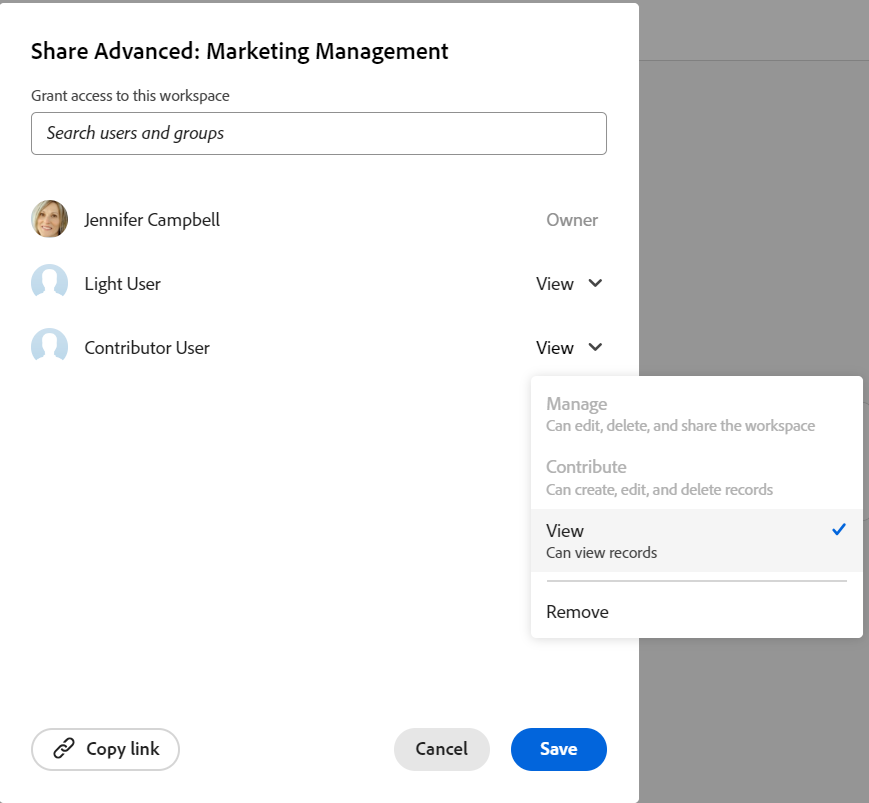
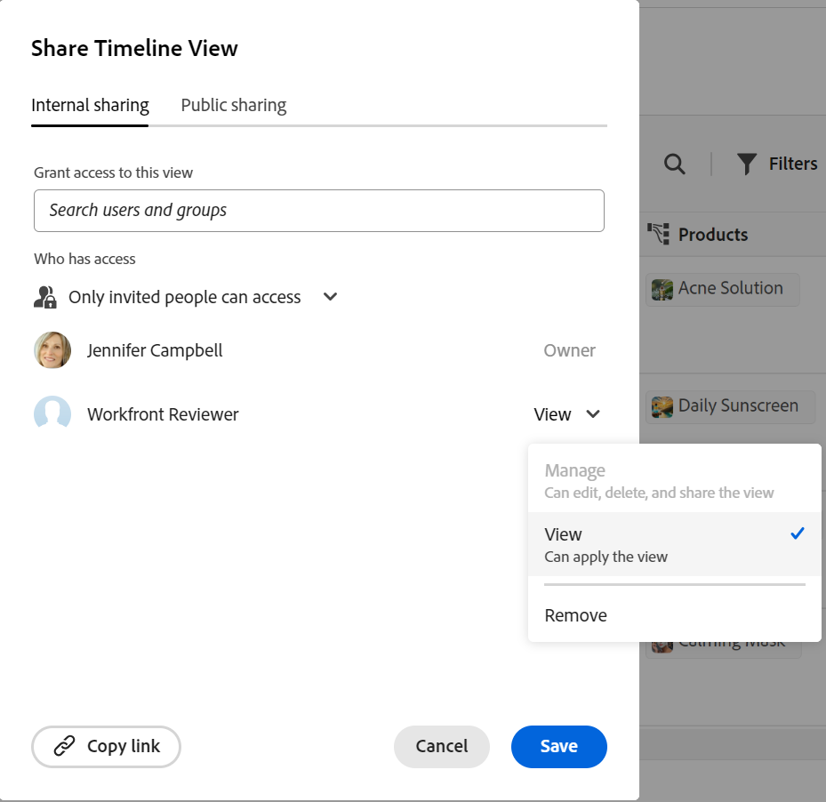
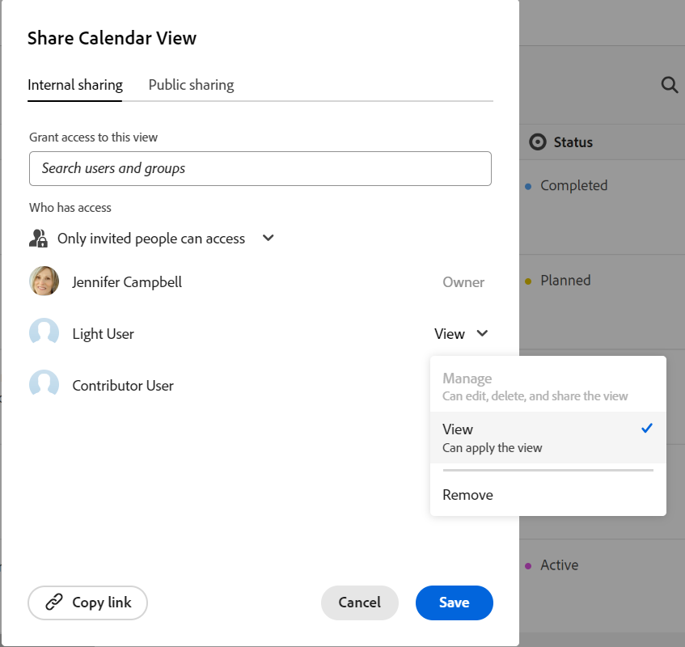

<!--update the metadata with real things when making this public; also update the description with something like this: Not all users in the organization have the same access and permissions to use Adobe Workfront plannint. This article describes the levels of access that users could have to Adobe Workfront Planning. -->
<!--update the title and the metadata title if Workfront Planning is NOT its own product - because the title is too generic for it being a Workfront capability-->

# Información general sobre el tipo de licencia al usar Adobe Workfront Planning

{{planning-important-intro}}

El tipo de licencia de Adobe Workfront funciona junto con los permisos de Adobe Workfront Planning para proporcionar el siguiente acceso:

* Ver, contribuir o administrar espacios de trabajo
* Ver o administrar vistas.

Para obtener información acerca de los permisos de los objetos en Workfront Planning, vea [Información general sobre los permisos de uso compartido en Adobe Workfront Planning](/help/quicksilver/planning/access/sharing-permissions-overview.md).

## La relación entre los tipos de licencia de Workfront y los permisos de Workfront Planning

En la tabla siguiente se describe la relación entre el tipo de licencia de un usuario en Adobe Workfront y el nivel de permisos que puede concederles a los objetos de Adobe Workfront Planning basados en esa licencia.

Al conceder permisos de usuario a un espacio de trabajo, también se les conceden permisos para tipos de registros, registros y campos.

| Tipo de licencia de Adobe Workfront* | Permisos más altos permitidos en Adobe Workfront Planning |
|------------------------------------------------|-------------------------------------------------------------------------------------------------------------------------------------------------------------------------------|
| Nuevo: Estándar   o  Actual: Plan | Los usuarios pueden administrar espacios de trabajo. Pueden crear, editar o eliminar espacios de trabajo, tipos de registros, registros y campos.  : los administradores del sistema tienen permisos de administración en todos los espacios de trabajo, incluidos los que no crearon. |
| Nuevo: Ligero, Colaborador   o  Actual: Trabajo, Solicitante, Revisor | Los usuarios pueden ver los espacios de trabajo compartidos con ellos, así como los tipos de registro, registros y campos de dichos espacios de trabajo.   Los usuarios no pueden crear, editar ni eliminar espacios de trabajo, tipos de registros, registros o campos. |

*Para obtener más información, consulte [Requisitos de acceso en la documentación de Workfront](/help/quicksilver/administration-and-setup/add-users/access-levels-and-object-permissions/access-level-requirements-in-documentation.md).

<!--Replace the table above with the following at GA:

| Adobe Workfront license type*                                   | Highest permissions allowed in Adobe Workfront Planning                                                                                                                                             |
|------------------------------------------------|-------------------------------------------------------------------------------------------------------------------------------------------------------------------------------|
|Standard                     | Users can manage workspaces. They can create, edit, or delete workspaces, record types, records, and fields.   System administrators have Manage permissions to all workspaces, including the ones they did not create.                                                                                                                     |
| Light or Contributor  | Users can view the workspaces shared with them, as well as the record types, records, and fields of those workspaces.   Users cannot create, edit, or delete workspaces, record types, records, or fields.|

*Workfront Planning is not available for legacy Workfront licenses. 
For more information, see [Access requirements in Workfront documentation](/help/quicksilver/administration-and-setup/add-users/access-levels-and-object-permissions/access-level-requirements-in-documentation.md).-->

### Tipos de licencias y permisos de Workspace

Solo los usuarios con una licencia estándar (o de planificación) pueden tener permisos de Contribute o de Administración en los espacios de trabajo. Los usuarios con todos los demás tipos de licencia pueden tener permisos de visualización en los espacios de trabajo compartidos con ellos.

Los administradores del sistema pueden ver todos los espacios de trabajo del sistema, incluso los que no han creado.

>[!INFO]
>
>**EJEMPLO:**
>
>Los solicitantes (o colaboradores, según el nuevo modelo de licencia) no pueden contribuir ni administrar espacios de trabajo y sus objetos.
>
>Hay una indicación en el cuadro de diálogo de uso compartido de que no se pueden conceder permisos a los usuarios para contribuir o administrar un espacio de trabajo cuando tienen una licencia de nivel inferior, ya que estos niveles de permisos están atenuados.
>
>

<!--Replace all the content in the section above with the following at Planning GA

Only users with a Standard license can have Contribute or Manage permissions to workspaces. Users with all other license types can have View permissions to workspaces shared with them. 

System administrators can view all workspaces in the system, even the ones they did not create. 

>[!INFO]
>
>**EXAMPLE:** 
>
>Contributors or Light-license users cannot contribute to or manage workspaces and their objects. 
>
>There is an indication in the sharing box that users cannot be granted permissions to contribute to or manage a workspace when they hold a lower-level license, as these permissions levels are dimmed. 
>
>
-->

### Tipos de licencias y permisos de visualización

Solo los usuarios con una licencia estándar (o de planificación) pueden tener permisos de administración en las vistas. Los usuarios con todos los demás tipos de licencia pueden tener permisos de visualización para las vistas compartidas con ellos.

>[!INFO]
>
>**EJEMPLO:**
>
>Los colaboradores (o solicitantes y revisores) no pueden administrar las vistas. Pueden aplicar filtros, ordenaciones o agrupaciones temporales a las vistas a las que pueden acceder.
>
>Hay una indicación en el cuadro de uso compartido de que no se pueden conceder permisos a los usuarios para administrar una vista cuando tienen una licencia de nivel inferior, ya que estos niveles de permisos están atenuados.
>
>

<!--Replace all of the above in this section with the following at GA:

Only users with a Standard license can have Manage permissions to views. Users with all other license types can have View permissions to views shared with them. 

>[!INFO]
>
>**EXAMPLE:** 
>
>Contributors or Light-license users cannot manage views. They can apply temporary filters, sorts, or groupings to views they can access. 
>
>There is an indication in the sharing box that users cannot be granted permissions to manage a view when they hold a lower-level license, as these permissions levels are dimmed. 
>
>-->

<!--Replace all of the above with this:

The table below describes the relationship between the license type of a user in Adobe Workfront and the level of permissions you can grant to them to Adobe Workfront Planning objects based on that license. 

Granting a user permissions to a workspace also grants them permissions to record types, records, and fields. 

You must grant view permissions separately from workspace permissions. 

| Adobe Workfront license type*                                   | Highest permissions allowed in Adobe Workfront Planning                                                                                                                                             |
|------------------------------------------------|-------------------------------------------------------------------------------------------------------------------------------------------------------------------------------|
|New: Standard   or  Current: Plan                    | <ul><li>Users can contribute to or manage workspaces and they can manage views. They can create, edit, or delete workspaces, record types, records, fields, and views.</li> <li> System administrators have Manage permissions to all workspaces, including the ones they did not create.</li> <li> System administrators can only access views they created.</li></ul>                                                                                                                     |
|New: Light, Contributor   or  Current: Work, Requestor, Reviewer                      | <ul><li>Users can view the workspaces shared with them, as well as the record types, records, and fields of those workspaces.</li> <li>Users can access views shared with them and apply temporary filters, sorts, or groupings, but they cannot modify the views. </li><li> Users cannot create, edit, or delete workspaces, record types, records, fields, or views.</li></ul>|

*For more information, see [Access requirements in Workfront documentation](/help/quicksilver/administration-and-setup/add-users/access-levels-and-object-permissions/access-level-requirements-in-documentation.md). 

-->